.. _cockpitoverview:

Cockpit Overview
################

Pilot Cockpit Layout
********************

.. image:: images/pilot_pit_overview.png

+----+----------------+
| 1. |:ref:`gunsight` |
+----+----------------+
| 2. |:ref:`overaux`  |
+----+----------------+
| 3. |:ref:`mwspanel` | 
+----+----------------+
| 4. |:ref:`flightdg` |
+----+----------------+
| 5. |:ref:`indicator`|
+----+----------------+
| 6. |:ref:`leftsub`  |
+----+----------------+
| 7. |:ref:`leftcons` |
+----+----------------+
| 8. |:ref:`ped`      |
+----+----------------+
| 9. |:ref:`rightsub` |
+----+----------------+
| 10.|:ref:`rightcons`|
+----+----------------+

.. _gunsight:

Gunsight/Radar Repeater Group
=============================

.. image:: images/GunRepeater.png

Reticle Intensity/Scale Knob
----------------------------

.. image:: images/RetIntensity.png

  
+---------+--------------------------------------------------------------+
| RET INT | Controls the brightness of the reticle.                      |
+---------+--------------------------------------------------------------+
| SCALE   | Controls the scale light intensity of the front radar scope. |
+---------+--------------------------------------------------------------+

Sight Shutter Lever
-------------------

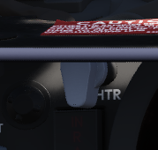

Changes the optical sight light source to prevent damage to the optics from high sunlight. 

Reticle Depression Knob
-----------------------

.. image:: images/RetDepress.png
  

Controls manual depression in 1 mil increments.

Sight Mode Knob
---------------

.. image:: images/SightMode.png
  

Selects the mode of operation for the gunsight.

+-------------------------------------------+--------------------------------------------+
| OFF                                       | Turns the system off.                      |
+-------------------------------------------+--------------------------------------------+
| STBY                                      | Warms up the system.  Reticle remains off. |
+-------------------------------------------+--------------------------------------------+
| CAGE                                      | Reticle is displayed and caged at the      |
|                                           |                                            |
|                                           | radar boresight line (RBL).                |  
+-------------------------------------------+--------------------------------------------+
| A/G                                       | Selects air to ground mode. Manual set     |
|                                           |                                            |
|                                           | depression is referenced from the          |
|                                           |                                            |
|                                           | fuselage reference line (FRL).             |
+-------------------------------------------+--------------------------------------------+
| A/A                                       | Selects air to air lead computing mode.    |
|                                           |                                            |
|                                           | Position is set by the gyro, range,        |
|                                           |                                            |
|                                           | and CADC, and can be caged.                |
+-------------------------------------------+--------------------------------------------+
| BIT 1                                     | System self test mode 1.                   |
+-------------------------------------------+--------------------------------------------+
| BIT 2                                     | System self test mode 2.                   |
+-------------------------------------------+--------------------------------------------+
 
OPR ERS/Contrast Knob     
---------------------

.. image:: images/Contr.png
  
  
Two function (pushbutton inside of knob) control of the front scope display.  
  
+---------+----------------------------------------------------------------------------------------+
| OPR/ERS | Button activates or erases display in aircraft with DVST. No function with DSCG scope. |
+---------+----------------------------------------------------------------------------------------+
| CONTR   | Controls the displayed video/background contrast on the front scope.                   |
+---------+----------------------------------------------------------------------------------------+

Brightness Knob/Horizon Line Knob
---------------------------------

.. image:: images/BrtHrz.png
  
 
Dual knob control of the front scope display settings.

+--------+-----------------------------------------------------------------------+
| BRT    | Controls relative brightness of the front scope display.              |
+--------+-----------------------------------------------------------------------+
| HOR LN | Adjusts relative horizon line shown on radar scopes in both cockpits. |
+--------+-----------------------------------------------------------------------+

INT Tab
-------
  
  
The INT tab rotates around the display to alter the relative darkness of the radar display, permitting the pilot to adjust the scope relative to ambient light.  

Red Tab
-------  
  
The red tab is rotated to provide a red scope display for night flying.

In Range Light
--------------

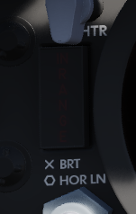
   
  
The IN RANGE light illuminates to alert the pilot that the current locked target is within range parameters.

Hold Altitude Light
-------------------   

.. image:: images/HoldAlt.png
  
  
The HOLD ALT light illuminates as an instruction to the pilot from the fire control system to maintain current altitude to assist in a snap-up intercept situation against a target above the fighter.  The predicates are:

A range greater than the weapon can make,
Altitude in excess than 32,000 feet, and
The locked taret is greater than 8,000 feet above the fighter.

When the HOLD ALT light is on, the fighter should be flown to center the steering dot relative to azimuth of the ASE circle.  When the HOLD ALT light turns off, the fighter should then snap up in pitch to fully center the steering dot in the ASE circle.   

Range Lights
------------

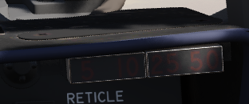
  

The Range Lights illuminate relative to range settings selected by the WSO.  Range is provided on the upper right corner of the DSCG scope. 

Wheels Light
------------

.. image:: images/Wheels.png
  
  
The WHEELS lamp illuminates when the aircraft slows below flaps blow-up speed (roughly 230 knots, dependent on altitude) with the gear still raised.

.. _overaux:

Overhead Auxiliary Indicators
=============================

.. image:: images/OvrhdGroup.png
  
  
  
SHOOT Lights
------------

.. image:: images/LftShoot.png
  

Illuminates when missile firing parameters are met.  Do not illuminate when in VI or A-G modes. 

Air Refueling Lights
--------------------

.. image:: images/AARLights.png
  
  
.. image:: images/AARDisng.png
  

Provide status of the Air Refueling System while in use.

+------------+------------------------------------------------------------------------------+
| READY      | Illuminates when air refuel receptacle is fully extended. Turns off when     |
|            |                                                                              |
|            | boom is locked or receptacle retracted.                                      |
+------------+------------------------------------------------------------------------------+
| DISENGAGED | Illuminates when boom disengages during cycle, and remains lit until         |
|            |                                                                              |
|            | refueling system is reset.                                                   |
+------------+------------------------------------------------------------------------------+
| L.H. FULL  | Indicates left hand external tank is full (also while refueling on ground).  |                                       
+------------+------------------------------------------------------------------------------+
| CTR. FULL  | Indicates centerline external tank is full (also while refueling on ground). |
+------------+------------------------------------------------------------------------------+
| R.H. FULL  | Indicates right hand external tank is full (also while refueling on ground). |
+------------+------------------------------------------------------------------------------+  

Labs Pull Up Light
------------------

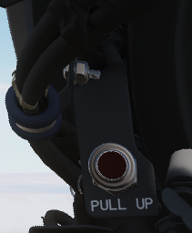
   

Illuminates and disengages during Loft and LABS bombing runs to provide timing sequence information to the pilot. 

Standby Magnetic Compass
------------------------

.. image:: images/StbyMagComp.png
   

A standard magnetic compass for backup navigation assistance should the primary flight director systems fail. 
  
  
Angle of Attack Indexer Lights
------------------------------

.. image:: images/AoA.png
   
    
Provides quick confirmation of current aircraft AoA state based on illuminated position and color.  

.. image:: images/AoA_table.PNG

Range Indicator
---------------

.. image:: images/range_indicator.png

This panel provides the pilot with a readout of the slant range measured by the Pave Spike
Targeting Pod (x100 ft).

When the Test-Button is pressed, the display shows 888, the knob underneath it controls
the brightness of the readout.

The Mode-Knob allows the pilot to select one of two weapon delivery modes available with the pod:

* WRCS - Automatic Delivery
* ROR - Release on Range

In the SET position, the display shows the desired release range used in the ROR mode.
The knob below the readout can be used to adjust this range.

.. _mwspanel:

Multiple Weapons Controls/AWRS/Stores Management
================================================

.. image:: images/MwsGroup.png

Head Up Display Indicators
--------------------------

.. image:: images/HUD.png
  

The Head Up Display indicator panel provides weapon status for the Master Arm control as well as the current selected air to air weapon based on the postion of the Guns/Missile switch on the left throttle handle.

+-------+-----------------------------------------------------------------+
| RADAR | Illuminates when a radar-guided air to air missile is selected. | 
+-------+-----------------------------------------------------------------+
| HEAT  | Illuminaes when an IR-guided air to air missile is selected.    |
+-------+-----------------------------------------------------------------+
| GUN   | Illuminates when the nose gun is selected.                      |
+-------+-----------------------------------------------------------------+
| ARM   | Illuminates when the Master Arm switch is selected to ARM.      |
+-------+-----------------------------------------------------------------+

UHF Remote Channel Indicator
----------------------------

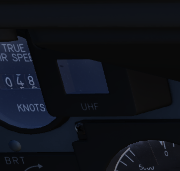
  
  
Provides the current selected channel value when the radio is set to PRESET. 
Otherwise, the indicator displays M if the radio is set to Manual, G when the COMM function is set
as GUARD/ADF, or A when the A-3-2-T switch is in A.

True Airspeed Indicator
-----------------------

.. image:: images/TASInd.png
  
  
Provides the aircraft's true Airspeed in knots, and is calibrated from 150 to 1500 knots; airspeeds below this range are thus not reliable. At high rates of airspeed change, there may be a lag of up to +-10 knots in measurement. 

Flight Instrument Brightness Knob
---------------------------------

.. image:: images/InstruBright.png
  
  
Controls brightness of the flight instrument cluster.

Rotating clockwise will increase brightness of all flight instrument lights,
while at the same time dim the HSI mode and warning and caution lights, except FIRE and OVERHEAT.

Flight instrument lights can additionally be controlled individually
with knobs on the Flight Instrument Lights Intensity Panel, located on the right wall.

Nose/Tail Arming Switch
-----------------------

.. image:: images/NTArm.png
  
  
Controls the arming solenoids of the MER and TER racks, selecting what MER/TER position(s) arming lanyards are pulled from released bomb fuzes upon separation, thus making them live.  This function also controls selective low/high drag capability for retarded bombs.

+-----------+-----------------------------------------------------------------------------------+
| SAFE      | No arming solenoids activate; bombs release without fuzing enabled.               |
+-----------+-----------------------------------------------------------------------------------+
| NOSE      | Forward and center position solenoids activate to hold arming lanyards.           |
+-----------+-----------------------------------------------------------------------------------+
| TAIL      | Aft position solenoids activate to hold arming lanyards.                          |
+-----------+-----------------------------------------------------------------------------------+
| NOSE/TAIL | Forward, center, and aft position solenoids all activate to hold arming lanyards. |
+-----------+-----------------------------------------------------------------------------------+

Station Select Buttons 
----------------------

.. image:: images/SSBs.png
   
  
The Station Select Buttons are used to activate air to ground munition stations and the nose gun.
Upon selection of a station, the upper half denoting the position will illuminate green to confirm the
station is active.
The lower half will illuminate amber once the necessary mode is selected,
the weapon is compatible with the weapon select knob option, the Master Arm is in the ARM position,
and any necessary warm up period for the selected weapon type is completed.
L and R positions are left and right, respectively, with O denoting outboard and I 
denoting inboard stations.
The centerline weapon position is CL, and the nose gun is armed with the GUN station selector button.

A dimmer knob is also provided to raise or lower the lighting of the station select buttons relative
to current cockpit conditions. If the Flight Instrument Brightness Knob above it is set to the full CCW position,
it overrides the dimmer knob and Station Select Buttons are always illuminated at full brightness.

Master Arm Switch
-----------------

.. image:: images/MArm.png
  
  
Provides master arming function for all aircraft weapons.  

Delivery Mode Knob
------------------

.. image:: images/DelMode.png
  
  
The Delivery Mode Knob sets the fire control system to the desired air to ground weapon release type.  Split into two halves, the left side of the dial references ARBCS (Altitude Reference and Bombing Computer Set) delivery modes, while the right side provides automated release functions using the WRCS (Weapon Release Computer Set) with possible tie-in to the navigation computer, depending on mode.  At the 11 and 12 o'clock positions are the OFF position, which is utilized for air to air weapons (including the gun) and DIRECT, which is used for video-directed weapons such as the AGM-65. The full series of positions is as follows, clockwise from the left:

+----------+---------------------------------------+
| INST O/S | Instantaneous Over the Shoulder       |
+----------+---------------------------------------+
| LOFT     | Loft                                  |
+----------+---------------------------------------+
| O/S      | (Timed) Over the Shoulder             |
+----------+---------------------------------------+
| T LAD    | Timed LADD (Low Angle Drogue Delivery |
+----------+---------------------------------------+
| TL       | Timed Level                           |
+----------+---------------------------------------+
| OFF      | Off (Air to Air)                      |
+----------+---------------------------------------+
| DIRECT   | Manual Direct                         |
+----------+---------------------------------------+
| TGT FIND | Target Find (Nav mode only)           |
+----------+---------------------------------------+
| DT       | Dive Toss                             |
+----------+---------------------------------------+
| DL       | Dive Laydown                          |
+----------+---------------------------------------+ 
| L        | Laydown                               |
+----------+---------------------------------------+
| OFF SET  | Offset Bomb                           |
+----------+---------------------------------------+
| AGM-45   | AGM-45                                |
+----------+---------------------------------------+

Weapon Selector Knob
--------------------

.. image:: images/WSK.png
  
  
Selected for the type of weapon currently required, providing release signals to the AWRU (Aircraft Weapons Release Unit). ARM and TV positions inhibit air to air weapon firing unless a CAGE signal is active.  ARM and TV positions do not affect tuning status of radar guided weapons.  Positions are as follows:

+-------------+-----------------------------------------------------------------------------------+
| AGM-12      | Not used.                                                                         |
+-------------+-----------------------------------------------------------------------------------+
| BOMBS       | Bombs (all types).                                                                |
+-------------+-----------------------------------------------------------------------------------+
| RKTS & DISP | Rockets and dispensers.                                                           | 
+-------------+-----------------------------------------------------------------------------------+
| ARM         | Anti-Radiation Missile (AGM-45).                                                  |
+-------------+-----------------------------------------------------------------------------------+
| TV          | Electro-optical weapons (AGM-65).                                                 |
+-------------+-----------------------------------------------------------------------------------+
| C           | Not used; may be utilized as an OFF position.                                     |
+-------------+-----------------------------------------------------------------------------------+
| B           | Like AIR TO AIR switch in rear cockpit, cancels CAGE requirement.                 |
+-------------+-----------------------------------------------------------------------------------+
| A           | Simultaneous release mode for CBU, rockets, or dispensers; bombs do not release.  |
+-------------+-----------------------------------------------------------------------------------+
 
     
Aircraft Weapons Release Unit
-----------------------------   
     
.. image:: images/AWRU.png
  
  

Provides timed interval release scheduling of single or multiple bombs or rockets and dispensed munitions based on the selections made between the interval knob, the QTY (quantity) knob and the INTRVL switch.

The interval knob provides release pulse sequences between 0.05 second and 1 second.  

The INTRVL switch provides the option of a 10x multiplier of the set value of the interval knob.  In the NORM position, the interval knob value is the trigger timer. 
The quantity knob functions as follows:

Selecting "1" places the AWRU into single manual bombing mode; one push of the bomb release button releases one bomb.  

Selecting a value from "2" to "18" sets the AWRU into single ripple mode; in this mode, the AWRU will release bombs according to the programmed interval until the set number of rounds is dropped, or the bomb button is released.  Upon release, the count is reset, and a subsequent press and hold will drop the programmed number of bombs.

Selecting "C" sets the AWRU into single continuous mode; pressing the bomb release button drops rounds according to the programmed interval until the bomb button is released, or all munitions from the selected pylons are expended.

The "P" setting is for pairs manual mode.  With at least two stations selected, each push of the bomb button will release two bombs; like single manual mode, this does not include an interval function.

Lastly, the "S" setting, for salvo, releases bombs in accordance to the chosen interval from all selected stations simultaneously, until the bomb button is released.  Ergo, if four stations are selected with a 2 second interval (0.2 on the interval dial, X10 INTRVL switch setting), four bombs will be released every two seconds the pickle button is held down.

Missile Status Lights
---------------------

.. image:: images/MSL.png
  
  
The Missile Status Light window provides confirmation of currently installed and configured air to air missiles.

The RDR lights illuminate once AIM-7 missiles are properly tuned with the fire control system; any station that does not carry a Sparrow, does not correctly sync up during tuning, or is launched, will turn off.

The HEAT lights illuminate one at a time, rather than all up upon circuit configuration.  The light of the currently selected station will illuminate beginning at the raising of the gear handle, and remain in that position until the weapon is either cycled using the throttle's Gun/Missile Switch reject option, or is launched.

Radar Missile Power Switch
--------------------------

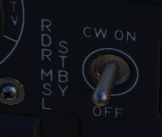
  
  
The Radar Missile Power Switch provides power to the CW tuning drive and monitoring functionality.  

When switched out of the OFF position, power is applied to the circuit 30 seconds after this selection.  

The STBY position maintains warmup power to the missiles and CW tuning drive once the missiles have been tuned.  

The CW ON position allows for constant tuning and missile state monitoring with the radar mode not in TV.  

Tuning can be performed on the ground with the radar in TEST mode to preclude emissions endangering ground crew. 

Centerline Tank Aboard Light
----------------------------

.. image:: images/CTAL.png 
  
  
Illuminates when a stores condition exists that precludes ejection and launch of an AIM-7 missile installed in one of the two forward positions.
  

Interlock Switch
----------------

.. image:: images/Intlk.png
  
A two position switch that determines whether the fire control system launch parameter interlocks can prevent an AIM-7 from being launched when the trigger is pulled.  

+-------------+------------------------------------------------------------------------------------+
| IN          | Interlocks engaged; range limits, ASE limits, or radar not in VI inhibits launch.  |
+-------------+------------------------------------------------------------------------------------+
| OUT         | Interlocks disengaged; AIM-7 will fire when trigger is pulled.                     |
+-------------+------------------------------------------------------------------------------------+

Selective Jettison Control
--------------------------

.. image:: images/SelJet.png
  
The Selective Jettison Control knob provides the pilot direct access to dump stores in an emergency on a position by position basis, or immediate release of all single carried air to ground, MER/TER stored, or LAU-88 launcher-mounted round at once.  

+-------------+-----------------------------------------------------------------------------------+
| OFF         | Safes PUSH TO JETT button on the Selective Jettison Control Panel.                |
+-------------+-----------------------------------------------------------------------------------+
| STORES      | Releases all MER/TER, single carried, or LAU-88 mounted rounds upon PUSH TO JETT. |
+-------------+-----------------------------------------------------------------------------------+
| L/R FWD     | Jettisons AIM-7 from respective position on PUSH TO JETT.  Inhibited if CL TK ON. |
+-------------+-----------------------------------------------------------------------------------+
| L/R AFT     | Jettisons AIM-7 from respective position on PUSH TO JETT.                         | 
+-------------+-----------------------------------------------------------------------------------+
| L/R WING    | In conjunction with TV or ARM, jettisons single AGM-65 from wing on PUSH TO JETT. |
+-------------+-----------------------------------------------------------------------------------+

Recorder Lamp
-------------

.. image:: images/pilot_recorder_lamp.png

This dimmable lamp is lit to indicate operation of the Airborne-Video-Tape-Recorder (AVTR).

The AVTR system is controlled by the WSO and records the intercom sound, as well as the rear radar screen.

.. _flightdg:

Flight Director Group
=====================

.. image:: images/FDG.png

 
Radar Altimeter
---------------

.. image:: images/RadAlt.png
  
  
Terrain relative accurate height information up to 5000 ft, functions to 30 degrees of bank angle or 35 degrees of pitch.  Clockwise rotation of the function control switch on the lower right of the indicator powers the device; continued rotation sets the low altitude warning pointer to the desired height. Below the set altitude, the warning light activates. A self-test, initiated by pressing the function control switch, shows 35 +-15 feet. Above 5000 feet or with unreliable signals, the pointer hides behind a mask, showing the OFF flag. The OFF flag also appears during power loss or shutdown.  
  

Airspeed and Mach Indicator
---------------------------

.. image:: images/MachInd.png
  
The combination airspeed and mach number indicator shows airspeed readings below 200 knots, and include Mach numbers at high speed.  The indicator uses a single pointer over a fixed airspeed scale, marked from 80 to 850 knots, with a moving Mach scale presenting from Mach 0.4 to 2.5. A pair of movable reference markers is available with the knob on the face of the gauge, with speed reference available between 80 and 195 knots, and the Mach index pointer being able to be set between the 225 knot and 850 knot regions relative to the airspeed gauge.  

Note: Moving these reference markers outside of the respective aforementioned regions can damage them.

Angle of Attack Indicator
-------------------------

.. image:: images/AoAInd.png

Drawing relative wind information from the landing-gear adjacent AoA probe, the AoA indicator offers conditional reference for cruise (7.9 units), approach (19.2 units), and stall (30.00).  Because of the AoA probe to the nose gear door and subsequent airflow disturbance when the gear is lowered, actual aircraft AoA is approxiamtely 1 unit higher than indicated, and ON SPEED AoA is roughly 5 knots slower than the given value.

When indicator power is offline due to electrical system configuration or damage, an OFF flag will appear in the window on the face of the gauge.  Function of the indexer lights and stall warning vibrator is driven by switches in the indicator. 

  

Reference System Selector Switch
--------------------------------

.. image:: images/RefSel.png
  
Toggles between the inertial navigation set and AN/AJB-7 displacement gyroscope for attitude information. When set to PRIM, the inertial navigation set provides azimuth and attitude data to the ADI; when on STBY, AN/AJB-7 supplies this information. Azimuth data also feeds into the HSI and BDHI (rear cockpit). Additionally, attitude details are sent to the fire control system.

Note: Inertial information requires the inertial navigator control panel's switch to be on NAV.

When transitioning between STBY and PRIM, immediate attitude information may show unusual gyrations on the attitude director indicator due to initial erection. Rapid turns (above 15° per minute) may temporarily disrupt accurate heading information, requiring straight and level flight for about 20 seconds for manual compass system synchronization (SYNC position)
  

Attitude Director Indicator
---------------------------

.. image:: images/ADI.png

Includes an attitude sphere, turn indicator, steering bars, miniature aircraft, glideslope pointer, flags, and pitch trim knob. It displays pitch, bank, and heading from the selected reference system and allows pitch adjustment via the trim knob. The turn indicator relies on a gyro from the AN/AJB-7 system. The steering bars offer Flight Director guidance for heading interception, navigation, and ILS approaches. The glideslope pointer provides
vertical guidance information during an ILS approach. 
  
  
Horizontal Situation Indicator
------------------------------

.. image:: images/HSI.png
  
Consists of a rotating compass card, single and double bar bearing pointers numbered 1 and 2 respectively, a range indicator, and a range warning flag. Presents a top-down view of the currently programmed navigation.  The Heading Set knob is availble to input desired magnetic heading, and the Course Set knob is used to enter VOR radial or inbound localizer course for accurate deviation display.  

Altimeter
---------

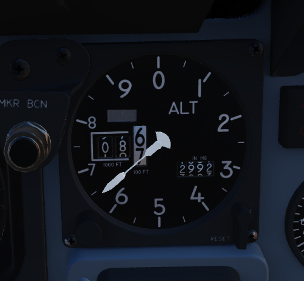
  
  
A counter-pointer style altitmeter, with thousandths in the counter window and 100 foot increments around the face. The altimeter has an absolute range of 80,000 feet. The altimeter includes a barometric scale for setting local pressure with the knob on the indicator.  Works in either electric (normal operation mode) or pneumatic (STBY) mode, switchable via a springloaded three position switch labelled RESET and STBY.   

Vertical Velocity Indicator
---------------------------

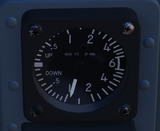
  
  
Provides rate of climb or descent via the static pressure system referenced in thousands of feet per minute. 

  
Standby Attitude Indicator
--------------------------

.. image:: images/StbyAtt.png
  
The SAI functions independent of the Flight Director Group, providing reasonably accurate readings (within six degrees) for 9 minutes if power to the system is lost and the OFF flag is in view.  Pitch markings are indicated every 5 degrees, while roll markings are in gradations of 10 degrees. Roll is illustrated through 360 degrees, while pitch is limited by stops at 92 degrees in climb and 78 degrees in dive to prevent gimbal lock.
  

Navigation Function Selector Panel
----------------------------------

.. image:: images/NavFunct.png
  
Controls display presentation on the ADI and HDI based on the selected values on the two knobs; to the left is the Bearing/Distance Knob, and to the right the Mode Selector Knob.  The Bearing/Distance Knob determines the source of navigation information for the HSI and ADI.  The Mode Selector Knob provides control over the presentation of various displayed information on the HSI and ADI.  The Mode Selector Knob includes an inset switch marked FD, for Flight Director.  This switch engages or deactivates the pitch and bank steering bars on the ADI; the OFF position has the switch aligned vertically.

Bearing/Distance Knob
^^^^^^^^^^^^^^^^^^^^^

+-------------+-----------------------------------------------------------------------------------+
| VOR/TAC     | Magnetic and relative bearing to VOR station and TACAN range displayed on HSI.    |
+-------------+-----------------------------------------------------------------------------------+
| TAC         | Magnetic and relative bearing and range to TACAN station displayed on the HSI.    |
+-------------+-----------------------------------------------------------------------------------+
| ADF/TAC     | Magnetic and relative bearing to ADF station and TACAN range displayed on HSI.    |
+-------------+-----------------------------------------------------------------------------------+
| NAV COMP    | Magnetic and relative bearing and range provided from navigation computer on HSI. | 
+-------------+-----------------------------------------------------------------------------------+

Mode Selector Knob Display Functions
^^^^^^^^^^^^^^^^^^^^^^^^^^^^^^^^^^^^

.. image:: images/ModeSelectorKnobTable.png

.. _indicator:

Right Main Panel
================

.. image:: images/RMP.png

RWR Azimuth Indicator
---------------------

.. image:: images/RWRAz.png

Azimuth-Elevation Indicator
---------------------------

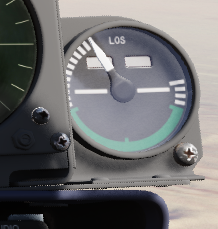

The Azimuth-Elevation Indicator, or also Line-Of-Sight Indicator, is the main instrument for the pilot
to assess the current attitude of the Pave Spike Targeting Pod in order to keep the line of sight
within the operational limits.

The needle shows the pods roll position from -160° (CW) to +110° (CCW).

Three flags indicate the elevation:

- green: -120° to -155°
- yellow: -155° to -160°
- red: -160° or beyond

If the needle is kept within the green labelled range and neither the yellow or red flag are shown,
the view will not be obstructed by the pod or the aircraft.

Master Caution Light
--------------------

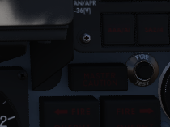
  

The Master Caution light illuminates to provide the pilot warning of a condition requiring attention, directing them to look at the telelight panel for additional information. The Master Caution lamp is reset by correcting the condition, or pressing the Master Caution Reset button on the generator control panel. 

Fire Test Button
----------------

.. image:: images/FTB.png
  
  
When pressed, this button tests for functionality of the FIRE and OVRHT lamps. Under normal conditions, all four
lights should light up as long as the button is pressed down.
If a lamp does not light up, it is likely broken and cannot be trusted on indicating a fire condition anymore.

The button can also be used in conjunction with the Warning Lights Test switch to confirm detection and continuity
performance of the fire and overheat warning systems.

Holding the Warning Lights Test switch in the WARN TEST position, then simultaneously pressing and
releasing the Fire Test Button performs the test. Proper system function is confirmed with the four FIRE
and OVRHT lamps off while the Fire Test Button is pressed, then illuminating when it is released.

Fire/Overheat Warning Lamps
---------------------------

.. image:: images/FOWL.png
   
  
The Fire and Overheat Warning Lamps, one for each engine, are a pair of two-position indicators that illuminate when a fire condition is detected in the engine compartment (FIRE), or an overheat condition is detected in the exhaust nozzle section (OVRHT).  
  
  
Fuel Quantity Indicator
--------------------------------

.. image:: images/JPInd.png
  
  
The Fuel Quantity Indicator provides two different indications of total usable internal fuel to confirm proper transfer function between the seven internal fuel cells, as well as any external loaded tanks.  The upper hemisphere's sector display presents fuel quantity detected in fuselage cells 1 through 6, excluding the aft-most cell 7, as well as the internal wing tanks.  The sector display presents 200 lb increments from 0 to 3000 pounds, and 500 pound increments for the rest of the gauge.  The lower tape counter readout includes all internal fuel, including cell 7 and the internal wing tanks, and is presented in 100 lb increments. 

Fuel Flow Gauges
----------------

.. image:: images/FFI.png
  
  
A pair of fuel flow indicators is provided, one for each engine, presenting pounds per hour rate from 0 to 12, in 1000 lb increments.  Flow indications are for basic, non-afterburning thrust.  In afterburner, the flow rate is roughly four times the displayed flow rate. 

Tachometers
-----------

.. image:: images/Tach.png
  
  
A percentage-noting Tachometer is provided for each engine, including an inset wheel for accurate display of single digits. 
  

Exhaust Gas Temperature Gauges
------------------------------
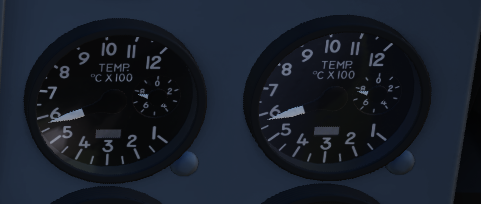
  
  
Exhuast Gas Temperature gauges are provided for each engine.  The gauges have two needles- a large needle providing increments of 0 to 12 in multiples of 100 degrees centigrade, and a smaller needle presenting increments of 0-10 in multiples of 10 degrees centigrade. Temperatures are measured at the exit of the turbine unit.  
  

Dual Exhaust Nozzle Position Indicators
---------------------------------------

.. image:: images/NPI.png
  

A combined Nozzle Position Indicator is provided with two needles, one for each engine on their respective side, to confirm balanced nozzle position and scheduling relative to throttle position.  The gauge provides four zones relative to the nozzles being in their fully open configuration, or their maximum closed configuration at the bottom.  At idle, the indication will be roughly 7/8ths open, and schedules down as throttle is increased.  Position in the afterburner region will moderate to maintain safe EGT levels. 

.. _leftsub:

Left Subpanel
=============

.. image:: images/LeftSub.png

8-Day Clock
-----------

.. image:: images/PClock.png
  
  
A clock is provided for the pilot, including a stopwatch function.

Emergency Canopy Jettison Handle
--------------------------------

.. image:: images/CanJet.png
  

Used for emergency ground extraction, the Emergency Canopy Jettison Handle releases a compressed oxygen cylinder to open both canopies immediately, shearing them off at their pivots.

Landing Gear Handle
-------------------

.. image:: images/GearHandle.png
  
  
Actuates the landing gear; raised for gear up, down for gear down.

Pulling the handle out will actuate the Emergency Mode and release the gear
by using a pair of compressed air bottles.
  

Landing Gear Position Indicators
--------------------------------

.. image:: images/GearPos.png
  
  
The Landing Gear Position Indicators provide visual confirmation of current gear state, displaying UP when retracted, showing a barber pole while in transition, or the illustration of a wheel in the respective window when fully down and locked.

Slats/Flaps Indicators
----------------------

.. image:: images/SltFlpInd.png
  
  
Visual indication of the Slat and Flap systems are provided through two window indicators.  Slats will be displayed as IN (retracted) or OUT (extended).  Flaps will display as UP (retracted) or DN (down), and will show a barber pole while in transition. 

Boost Pump Pressure Indicators
------------------------------

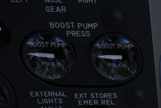
  
  
A pair of indicators provide confirmation of fuel boost pump operation.  Indicators are calibrated 0 to 5, which must be multiplied by 10 to read in current PSI.

Stabilator Trim Indicator
-------------------------

.. image:: images/StabTrimInd.png
  
  
Provides current stabilator trim setting in units (trim switch actuations) of trim. 

Landing/Taxi Lights Switch
--------------------------

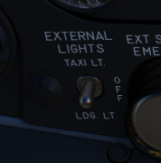
  
  
Control the external Landing and Taxi lamps.  Left main gear must be down and locked for the switch to function. 

External Stores Emergency Release
---------------------------------

.. image:: images/EmerRel.png
  
  
Also called the "panic button", the External Stores Emergency Release will immediately perform separation of all jettisonable stores, without air to air weapons or special weapons.  The actuation of the button will show a yellow ring around the button position, which is the indicator for the pilot that it has been used. 

Aileron Rudder Interconnect (AIR) Circuit Breaker
-------------------------------------------------

.. image:: images/ARIfuse.png
  
  
When pulled in conjunction with the Yaw ARI Stab Aug Switch disengaged, Yaw ARI will be fully removed.  With the Yaw ARI Stab Aug Switch engaged, 5 degrees of ARI authority will be maintained.

Emergency Brake Handle
----------------------

.. image:: images/EBrake.png
  
  
Pulling this handle activates the Emergency Hydraulic Brake System, which dumps the remainder of the hydraulic accumulator into the brake system for a limited number of brake actuations.  Differential braking will work, however the number of available actuations is limited.  

.. _leftcons:

Left Console Area
=================

.. image:: images/LeftCons.png

Left Utility Panel
------------------

.. image:: images/LUtil.png

Anti-Skid
^^^^^^^^^

Canopy/Low Altitude Warning Volume
^^^^^^^^^^^^^^^^^^^^^^^^^^^^^^^^^^

Sets audio level for canopy open and low altitude voice warnings.

This system is not installed on this variant of the F-4E.

Oxygen Control Panel
--------------------

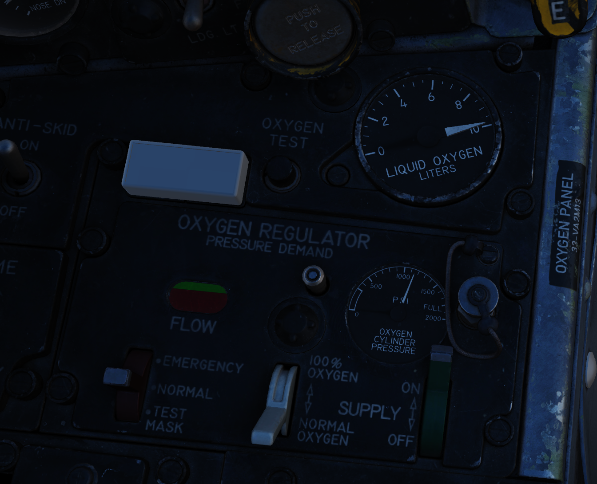

Flow Indicator
^^^^^^^^^^^^^^

Alternates between black and white with each aircrew member breath to indicate oxygen flow.

Emergency Flow Control Switch
^^^^^^^^^^^^^^^^^^^^^^^^^^^^^

Three position switch which selects EMERGENCY pressure (100% flow with positive pressure), NORMAL (stanadard air/oxygen mix), or TEST MASK (positive pressure for mask sealing check). 

Diluter Lever
^^^^^^^^^^^^^

Two position switch that cycles between NORMAL oxygen value or 100% OYXGEN level.  

Oxygen Quantity Test Button
^^^^^^^^^^^^^^^^^^^^^^^^^^^

Tests oxygen low pressure warning system.  Pressing the button cycles the needles from current oxygen level to zero, which triggers OXYGEN LOW telelight panel warning as needle passes through 1 liter.  Releasing the button returns the needle to current system level and clears OXYGEN LOW warning.

Oxygen Pressure Gauge
^^^^^^^^^^^^^^^^^^^^^

Indicates system pressure from 0 to 500 psi.  

Supply Lever
^^^^^^^^^^^^

Two position switch (ON and OFF) activating flow of oxygen to the aircrew member. 

Forward Hand Control
--------------------

.. image:: images/PilAGM.png

Small joystick used to finalize the positioning of a target in the seeker gate of an AGM prior to launch. 

Outboard Engine Control Panel
-----------------------------

.. image:: images/PilOutEng.png

Engine Anti-Icing Switch
^^^^^^^^^^^^^^^^^^^^^^^^

Two position switch (DE-ICE and NORMAL) controlling de-icing function.  When in DE-ICE, the anti-icing air flow is enabled.  In NORMAL, no anti-icing is provided.

Communications Antenna Select Switch
^^^^^^^^^^^^^^^^^^^^^^^^^^^^^^^^^^^^

Two position switch commanding which antenna is being utilized for voice communication- UPR (upper) or LWR (lower). 

LCOSS Switch
^^^^^^^^^^^^

Selects which computer system is installed on this aircraft.

* ARS-107
* ASG-26

The switch is a leftover and not connected.

DVST Switch
^^^^^^^^^^^

Selects which radar system is installed on this aircraft.

* APS-107
* APQ-120

The switch is a leftover and not connected.

Inboard Engine Control Panel
----------------------------

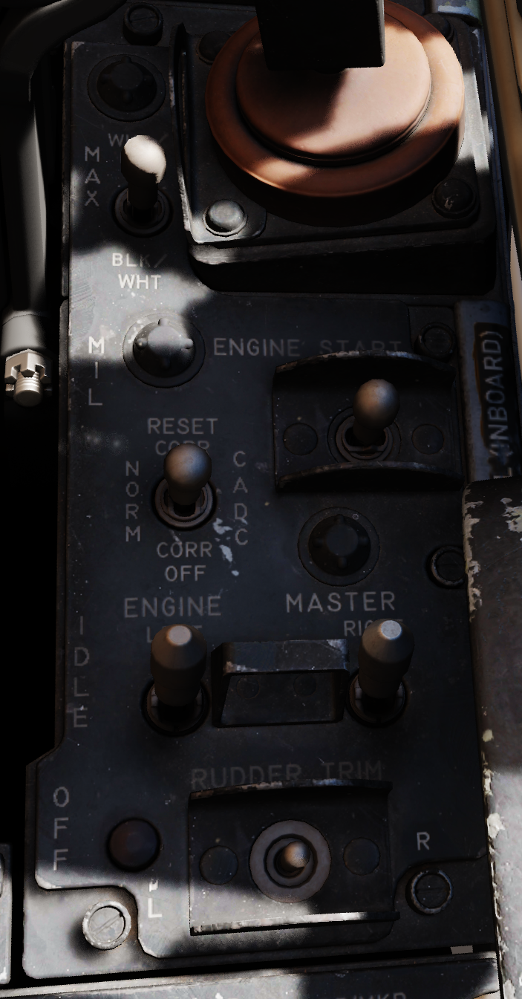

The Inboard Engine Control Panel carries the following controls:

Target Contrast Switch
^^^^^^^^^^^^^^^^^^^^^^

Used to select the appropriate contrast conditions for seeker acquisition with the AGM-65A and B. 

+-------------+-----------------------------------------------------------------------------------+
| WHT/BLK     | Programs the missile seeker to track a light target on a dark background.         |
+-------------+-----------------------------------------------------------------------------------+
| AUTO        | Programs the missile to use its automatic tracking mode.                          |
+-------------+-----------------------------------------------------------------------------------+
| BLK/WHT     | Programs the missile seeker to track a dark target on a light background.         |
+-------------+-----------------------------------------------------------------------------------+

Engine Start Switch
^^^^^^^^^^^^^^^^^^^

Three position switch with automatic return to center used to start the respective engine using the cartridge (if loaded), left or right.

CADC Static Pressure Compensator Correction Switch
^^^^^^^^^^^^^^^^^^^^^^^^^^^^^^^^^^^^^^^^^^^^^^^^^^

Three position switch, momentary in the RESET CORR position, used to correct or disengage the Static Pressure Compensation of the altimeter, thus eliminating, or invoking, altimeter lag from rapid altitude changes.

+-------------+---------------------------------------------------------------------------------------------------+
| RESET CORR  | Actuated after engine startup, then in flight if a SPC warning is caused by transient conditions. |
+-------------+---------------------------------------------------------------------------------------------------+
| NORM        | Regular operating position of switch upon release of RESET CORR or actuation out of CORR OFF.     |
+-------------+---------------------------------------------------------------------------------------------------+
| CORR OFF    | Manually disengages SPC altitude lag compensation.                                                |
+-------------+---------------------------------------------------------------------------------------------------+

Engine Master Switches
^^^^^^^^^^^^^^^^^^^^^^

A pair of two position lever lock switches, separated by a guard to alleviate erroneous command of the wrong switch, connects electrical power to the engine boost and transfer pumps for the respective engine when placed in the ON (forward) position.  The connection to electrical power is external if the aircraft is connected to a ground crew provided generator, or the aircraft's battery if no external power available.  Switching them to OFF (aft) position will engage the fuel shutoff valves so long as the aircraft is not solely running on the internal electrical bus; otherwise, the valves will remain open, unless the engine throttle is placed into the cutoff position.

Rudder Trim Switch
^^^^^^^^^^^^^^^^^^

Used to apply rudder trim adjustment when pressed to the respective side, left or right.

Throttles
---------

SAI Panel
------------------

.. image:: images/sai_panel.png

The panel provides a circuit breaker and a knob to control the
brightness for the Standby Attitude Indicator.

Eject Light/Switch
------------------

.. image:: images/PilEjectLight.png

Pressed by the pilot in an emergency condition requiring ejection from the aircraft,
which illuminates the EJECT lamp in the rear cockpit warning the WSO to prepare for immediate ejection.

Also lights up when the WSO presses their respective Eject Light to warn the Pilot for ejection.

Slats/Flaps Control Panel
-------------------------

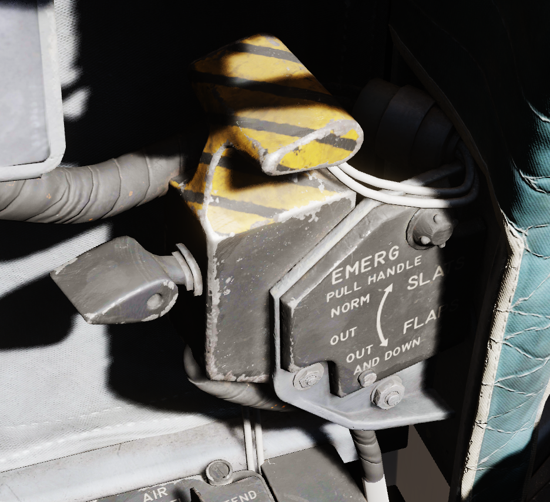

A three position switch (NORM, OUT, OUT AND DOWN) to the rear of the panel provides normal operation functions of the Slats/Flaps System.  These functions are relative to landing gear position, and are noted as follows:

**Nose Gear UP**

+--------------+-----------------------------------------------------------------------------------+
| NORM         | Flaps up, slats operate as function of AOA.                                       |
+--------------+-----------------------------------------------------------------------------------+
| OUT          | Slats extend.                                                                     |
+--------------+-----------------------------------------------------------------------------------+
| OUT AND DOWN | Slats and flaps extend (wheels light flashing until landing gear is down.         |
+--------------+-----------------------------------------------------------------------------------+

**Nose Gear DOWN**

+--------------+-----------------------------------------------------------------------------------+
| NORM         | Flaps up, slats operate as function of AOA.                                       |
+--------------+-----------------------------------------------------------------------------------+
| OUT          | Slats and flaps extend.                                                           |
+--------------+-----------------------------------------------------------------------------------+
| OUT AND DOWN | Slats and flaps extend.                                                           |
+--------------+-----------------------------------------------------------------------------------+

.. image:: images/SlatsRelative.png

Emergency Slats/Flaps Handle
----------------------------

Also included is the Emergency Slats/Flaps Extension handle, marked in yellow and black, at the top of the panel.  This is handle is pulled to force high pressure air into the slats/flaps actuation system, causing them to deploy in event of control system failure.

Canopy Control Switch
---------------------

.. image:: images/PilCanSel.png

Used to open (aft) or close (forward) the pilot canopy. 

Extra Picture Switch
--------------------

.. image:: images/ExtraPic.png

Provision to operate the KB-18 gun camera without the release of weapons, the Extra Picture switch starts the camera at the selected rate.

Gun Camera Switch
-----------------

.. image:: images/GunCamSwtch.png

Activates the gun camera, which will run until the switch is placed to off, or actuation of bomb button or trigger position 2 once the pre-programmed overrun time is completed.

Fuel Control Panel
------------------

.. image:: images/FuelCntl.png

Internal Wing Dump Switch
^^^^^^^^^^^^^^^^^^^^^^^^^

Two position switch which, when placed in DUMP, closes off the wing fuel cells from transfer
into the fuselage fuel cells and dumps fuel from the valves at the wing fold trailing edge.
Placing the switch back to the NORM position closes the dump vales and reconnects the wing
cells for transfer to the fuselage.

The entire fuel is dumped in roughly 15 minutes.

Internal Wing Transfer Switch
^^^^^^^^^^^^^^^^^^^^^^^^^^^^^

A two-position switch which controls flow of wing cell stored fuel to the fuselage fuel tanks;
NORMAL permits transfer, whereas STOP TRANS ceases flow from the wings to the fuselage feed tanks.

Transfer only occurs without weight on wheels and if the internal tanks have reached a certain
fuel level already.

Refueling Select Switch
^^^^^^^^^^^^^^^^^^^^^^^

Determines which tanks will be refuelled during an air to air refueling cycle: internal (INT ONLY) or all tanks (ALL). 

External Transfer Switch
^^^^^^^^^^^^^^^^^^^^^^^^

A three position toggle determining which externally mounted tanks are currently transferring fuel
to the fuselage tanks: CENTER (centerline tank), OFF (none), or OUTBD (outboard wing tanks).

Transfer only occurs without weight on wheels and if the internal tanks have reached a certain
fuel level already.

It is not possible to transfer from the wing tanks and external tanks at the same time. If both are selected,
the external tanks will take priority.

Air Refueling Switch
^^^^^^^^^^^^^^^^^^^^

Two position toggle switch used for extending (EXTEND) and retracting (RETRACT) the air to air refueling door.
Placing the switch into EXTEND illuminates the air to air refueling recepticle lamp to assist the tanker
boom operator.

If, during AAR, the boom disconnects and the DISENGAGED light illuminates, this switch has to be flipped to
RETRACT and back to EXTEND to reset the system and allow the boom to connect again.

Boost Pump Check Switches
^^^^^^^^^^^^^^^^^^^^^^^^^

A pair of two position spring loaded switches are provided to confirm function of the fuel boost pumps.  Can only be checked with the engine master switches OFF.  Holding either switch will energize the respective boost pump, thus showing a positive pressure value on the fuel pressure indicator.  

VOR/ILS Control Panel
---------------------

.. image:: images/VORILSCntl.png

Nav Vol Knob
^^^^^^^^^^^^

Controls the volume of the VOR/ILS audio system that indicates a positive return by
repeating the morse code of the selected station.

Must be moved out of the full CCW position to provide power to the VOR/ILS system.

MB Vol Knob
^^^^^^^^^^^

Controls the volume of the tone played when flying over a marker-beacon transmitter,
for example on the final approach during landing.

Frequency Knobs
^^^^^^^^^^^^^^^

A set of two knobs for tuning the VOR/ILS frequency. The outer knob controls the first three digits,
while the inner knob sets the two decimal digits.

Valid frequencies range from 108.00 to 117.95 MHz.

VOR/MKR Test
^^^^^^^^^^^^

A button to initiate a built-in test of the VOR system.

Drag Chute Handle
-----------------

Applied to reduce landing rollout, or as an aid in spin recovery, the drag chute handle is pulled back to deploy the chute, and, once deployed, a button on the handle is pressed while pulling the handle back further to jettison the chute.  Once jettisoned, the handle is released back into its normal position.

AFCS Control Panel
------------------

.. image:: images/AFCSPan.png

Stability Augmentation Channel Switches (Yaw/Roll/Pitch)
^^^^^^^^^^^^^^^^^^^^^^^^^^^^^^^^^^^^^^^^^^^^^^^^^^^^^^^^

Three two-position swiches enable individual channels of stability augmentation for Yaw, Roll, and Pitch.  ENAGE (forward) sets the respective chanel stability augmentation on. 

AFCS Mode Switch
^^^^^^^^^^^^^^^^

Enables AFCS flight mode, which can maintain and hold maneuvers and attidues at up to +/- 70 degrees of pitch, 70 degrees of bank, and in all 360 degrees of azimuth.  Deactivated by selecting the switch aft, or with a rapid control input.

Altitude Hold Switch
^^^^^^^^^^^^^^^^^^^^

Selecting ENGAGE activates the altitude hold function of the AFCS.  When entered in a pitch and bank level condition, will maintain altitude (ASL) stabilized flight at the current heading.

Boarding Steps Indicator
------------------------

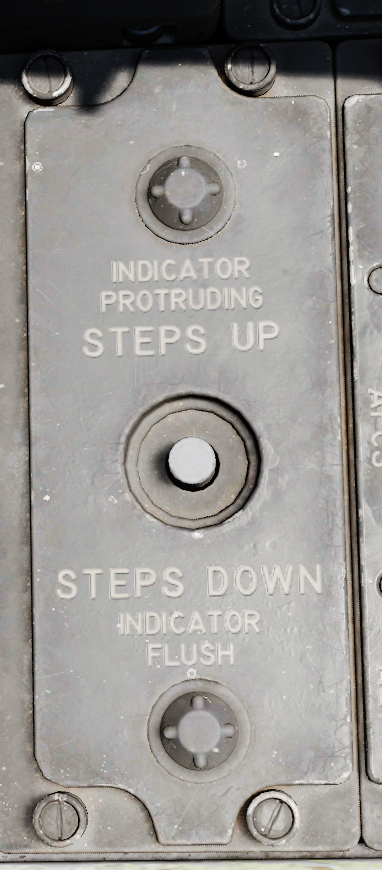

Used to visually confirm the integrated boarding ladder has been stowed.  With the white post extended up, ladder is stowed, whereas ladder is deployed if post is down and flush with panel recess.

Intercom System Control Panel
-----------------------------

.. image:: images/PilIntercom.png

Pilot ICS Volume Control Knob
^^^^^^^^^^^^^^^^^^^^^^^^^^^^^

Turned clockwise to increase audio between cockpits, and counterclockwise to decrease audio between cockpits on the intercom.

Pilot ICS Function Selector Switch
^^^^^^^^^^^^^^^^^^^^^^^^^^^^^^^^^^

+----------------+------------------------------------------------------------------------------------+
| COLD MIC       | Mic switch on throttle must be held to activate intercom.                          |
+----------------+------------------------------------------------------------------------------------+
| HOT MIC        | Voice automatically transmitted on intercom.                                       |
+----------------+------------------------------------------------------------------------------------+
| RADIO OVERRIDE | Intercom overrides incoming radio calls; does not override aircraft warning audio. |
+----------------+------------------------------------------------------------------------------------+

Pilot ICS Amplifier Select Knob
^^^^^^^^^^^^^^^^^^^^^^^^^^^^^^^

Determines current amplifier for intercom function.

+------+-------------------------------------------------------------------------------------+
| B/U  | Backup headset amplifier provides audio.                                            |
+------+-------------------------------------------------------------------------------------+
| NORM | Primary headset amplifier provides audio.                                           |
+------+-------------------------------------------------------------------------------------+
| EMER | The opposite cockpit's audio is heard at its set volume using its amplifier.        |
+------+-------------------------------------------------------------------------------------+

AN/ALE-40 Programmer
--------------------

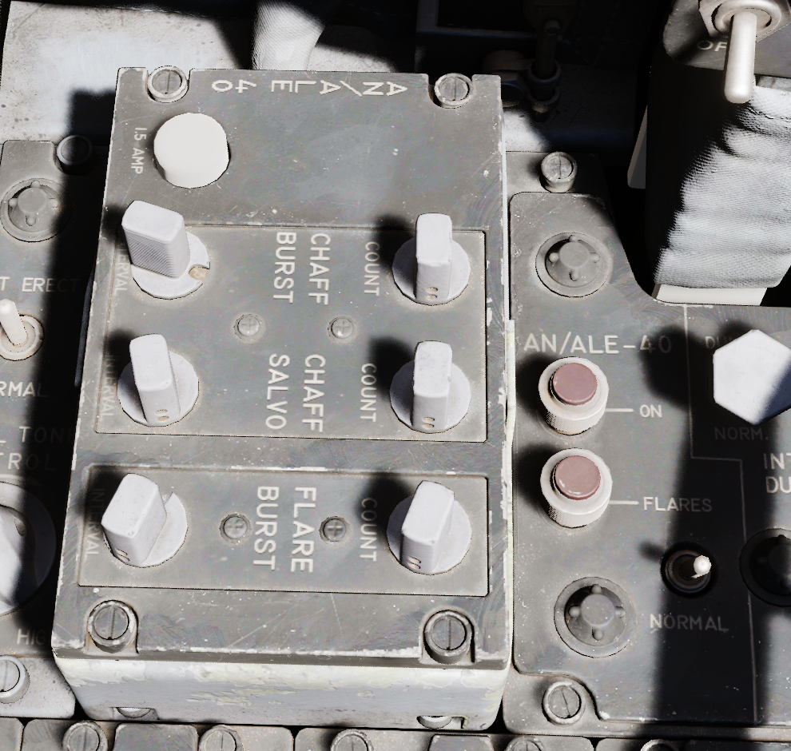

Chaff Burst Count
^^^^^^^^^^^^^^^^^

Selects the number of chaff burst commands per salvo; values of 1, 2, 3, 4, 6, or 8

Chaff Burst Interval
^^^^^^^^^^^^^^^^^^^^

Selects the time interval of .1, .2, .3, or .4 seconds between each chaff burst command.

Chaff Salvo Count
^^^^^^^^^^^^^^^^^

Selects the number of salvos per dispense command, values of 1, 2, 4, 8, or C(ontinuous).

Chaff Salvo Interval
^^^^^^^^^^^^^^^^^^^^

Selects time interval between each salvo.  Values of 1, 2, 3, 4, 5, 8, or a R(andom) number of seconds.

Flare Burst Count
^^^^^^^^^^^^^^^^^

Selects the quantity of flare burst commands per salvo.  Values of 1, 2, 4, 8, or C(ontinuous). 

Flares Select Switch
^^^^^^^^^^^^^^^^^^^^

Selects the time interval between each burst command.  Values of 3, 4, 6, 8, or 10 seconds.

Flares Indicator Light
^^^^^^^^^^^^^^^^^^^^^^

Illuminates when the Flares select switch is in the Flares position and indicates they can be dispensed, if flaps and speed brakes are retracted.

Power On Indicator Light
^^^^^^^^^^^^^^^^^^^^^^^^

Illuminates when the Flares select switch is in the Normal position and either (or both) mode knobs are in any position other than OFF.

Slats Override Switch
---------------------

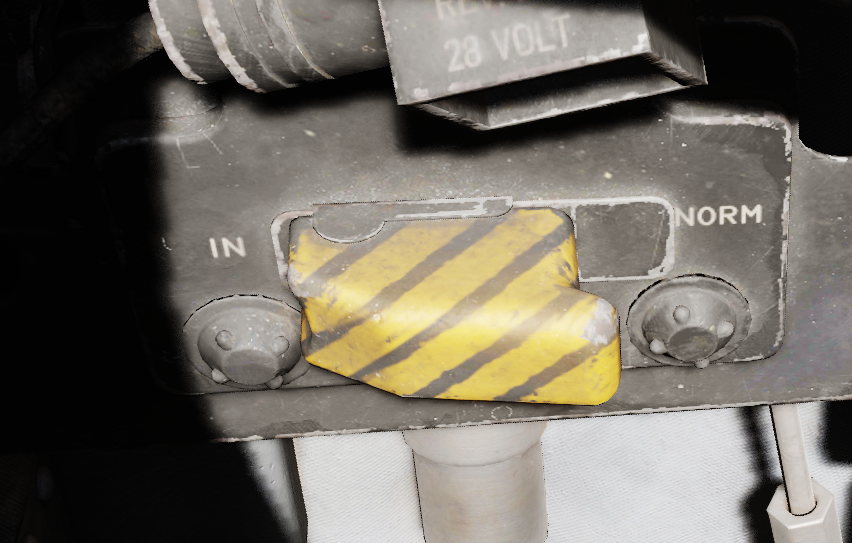

Two-position guarded switch with IN and NORM positions.  In NORM, slats operate normally as a function of the slats flaps switch or AoA.  When IN selected, slats will retract and remain retracted.  Selection of IN illuminates SLATS IN light on telelight panel and Master Caution lamp. 

Armament Safety Override Switch
-------------------------------

.. image:: images/ArmOvrd.png

If pressed and the landing gear handle is placed down, overrides the armanent safety.

This allows for example to fire the gun while on ground.

Anti-G Suit Control Valve
-------------------------

.. _ped:

Pedestal Group
==============

.. image:: images/PedGrp.png

Accelerometer
-------------

.. image:: images/GGauge.png
  
  
Calibrated from negative 4 to positive 10 in units of G, with three pointers- one for current applied load, the other two show maximum positive and negative G applied during the flight.  Pressing the PUSH TO SET button will reset the maximum position indicators to 1 G.  

Engine Oil Pressure Indicators
------------------------------

.. image:: images/OilPress.png
  
A pair of engine oil pressure indicators are provided, one for each engine, calibrated from 0 to 10, multiplied by 10 to read as units of PSI.

Hydraulic pressure Indicators
-----------------------------

.. image:: images/HydPress.png
  
  
Two hydraulic pressure indicators are installed.  One references the Utility Hydraulic System pressure, while the other references the PC-1 and PC-2 Hydraulic Systems; the latter includes two needles, and are marked accordingly. 

Rounds Remaining Indicator
--------------------------

.. image:: images/Rounds.png

Shows the currently available number of nose gun rounds.
The counter must be set manually by the pilot whenever rearming.

Rudder Pedal Adjustment Crank
-----------------------------

.. image:: images/PedAdjust.png
  
  
Used to adjust ergonomic position of the rudder pedals forward or back from the pilot.

Requires 38 full turns to move the pedals across the entire range.

Pneumatic Pressure Indicator
----------------------------

.. image:: images/Pneum.png
  
  
Provides cumulative manifold pressure of the compressed engine bleed air used to drive the aircraft's pneumatic actuated equipment.  

.. _rightsub:

Right Subpanel
==============

.. image:: images/RightSub.png

Generator Indicator Lights
--------------------------

.. image:: images/GenInd.png

Indicating LH GEN OUT (Left), RH GEN OUT (Right), and BUS TIE OPEN, the indicator lights will illuminate when the specified generator is offline, or, in the event of BUS TIE OPEN, when the generators are not functioning in parallel.  Indicators will trigger a Master Caution. In event of dual generator failure, neither will illuminate.

Feed Tank Check Switch
----------------------

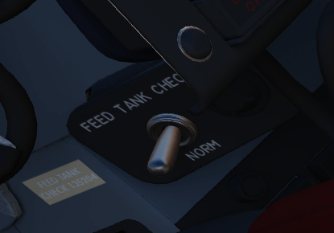

A two-position spring-loaded switch used to confirm nominal quantity in the engine feed tank (Cell 1),
the positions being FEED TANK CHECK and NORM (default).

When FEED TANK CHECK is selected and held, the fuel quantity gauge will indicate solely the current fuel
quantity in the engine feed tank on both the tape and counter. When the feed tank is full, the indicated
value should read 1400 lbs, plus or minus 200 lbs on the counter, and the tape value should be 1400 lbs,
plus or minus 150 lbs.  

Arresting Hook Control Handle
-----------------------------

.. image:: images/HookHandle.png

Pulling the handle down extends the Tail Hook.

The hook is utilized for field emergency arrestment and not for carrier operations.

KY-28 Mode Light Panel
----------------------

.. image:: images/KY28Mode.png

Dependent on mode, the illuminated display shows P for Plain mode, or C for Cipher mode.  Note: UHF communications require the system be in Plain mode, even with system power off, barring usage and monitoring of guard channel. 

Telelight Anunciator Panel
--------------------------

.. image:: images/Telelight.png

Provides the majority of aircraft system warnings that can be rectified by the pilot.  Most warnings on the panel will cause the Master Caution to illuminate; those that do not will be noted.

Light Circuit Breakers
----------------------

.. image:: images/pilot_light_cbs.png

Hidden behind a bundle of cables to the right of the telelight panel are two circuit breakers controlling lights.

The upper one is responsible for powering the primary instrument lights, while the lower circuit breaker powers
all indicator and warning lights.

.. _rightcons:

Right Console Area
==================

.. image:: images/RightConsole.png

Master Caution Reset
--------------------

.. image:: images/MCRst.png

Used to extinguish telelight panel warnings and the Master Caution warning lamp once the necessary action has been taken. In the event a fault has not been effectively corrected, pressing the Master Caution Reset button will not turn the respective warning off.  

TACAN Control Panel
-------------------

.. image:: images/FrontTCN.png

The TACAN Control Panel is used to enter the desired TACAN channel, mode, and audible volume for the monitoring of said channel by the aircrew.  The panel is duplicated in both cockpits, and the panel in command of the TACAN receiver is selected with the NAV CMD button of the Communication Control Panel.

On the control panel there are two Navigation Channel Control knobs, with the left controlling the first two digits of the channel value (hundreds and tens), and the right controls the single unit (ones) values.  The right knob also includes an outer ring which sets the X or Y value for the desired TACAN channel. 

Between these two knobs is the TEST button, which performs the ground testing cycle after warmup, and can also be used to perform an in-flight confidence test of the system's performance.

To the upper right, the VOL knob is available to set the desired audio level for the received TACAN station.  

The TACAN Function Selector Knob determines the presentation and type of information provided on the HSI, ADI, and BDHI, respectively.

+-------------+-----------------------------------------------------------------------------------+
| OFF         | The TACAN receiver is deenergized and offline.                                    |
+-------------+-----------------------------------------------------------------------------------+
| REC         | The TACAN receiver is active, providing bearing information on the HSI, BDHI, and |
|             |                                                                                   | 
|             | ADI.                                                                              |
+-------------+-----------------------------------------------------------------------------------+
| T/R         | Both the receive and transmit functions of the TACAN are active, which provide    |
|             |                                                                                   |
|             | bearing and nautical mile range information for the HSI and BDHI.                 | 
+-------------+-----------------------------------------------------------------------------------+
| A/A REC     | The TACAN reciver decodes bearing information from compliant aircraft for the HSI,|
|             |                                                                                   |
|             | BDHI, and ADI steering display.                                                   |
+-------------+-----------------------------------------------------------------------------------+
| A/A TR      | The TACAN receiver receives both bearing and sland range information in nautical  |
|             |                                                                                   |
|             | miles from the transmitting aircraft, providing this on the HSI and BDHI.         |
+-------------+-----------------------------------------------------------------------------------+

Note: Air to Air TACAN functionality requires the channel to be set 63 channels above or below the cooperating aircraft, but on the same range- X or Y. 

Communication Control Panel
---------------------------

.. image:: images/CCP.png

The Communication Control Panel provides selection and mode of the UHF radio in the aircraft.  The panel is duplicated in both cockpits, and control over the radio is determined through pushing the COMM CMD Button in the respective seat; the button will illuminate green in the seat in priority.  In the same fashion, the NAV CMD button dictates which seat has control of the TACAN settings; its button will also illuminate on the panel of the seat that has command (control) of the system.

Beneath the COMM CMD button is the radio volume for the respective seat.  Close to the NAV CMD button is the Squelch switch, which enables or disables receiver squelch. 

The A-3-2-T Selector knob sets HAVE Quick functionality of the UHF radio (A- auto-jam), the first digit of the manually selected frequency (3 or 2), or enables Time of Day receipt for one minute after selection in a momentary hold position (T).  

The four Frequency Selection Knobs work in concert with the A-3-2-T knob and Preset/Manual switch.  Frequencies are entered beginning with the 3 or 2 selection on the A-3-2-T Selector, and can be entered from 225.00 to 399.975 MHz in increments of 0.025.  With Preset/Manual in the Manual position, the UHF radio is directly set to the displayed channel.  In the Preset position, the set channels can entered into the COMM CHAN memory, with the desired position selected with the Comm Channel Control knob- the smaller knob to the left of the Preset/Manual switch, and displayed in the COMM CHAN window. Channels are stored in the displayed channel preset with the SET pushbutton. Once stored, channels are directly selected using the Comm Channel Control knob with the Preset/Manual switch in the Preset position.  

The Tone Pushbutton is used for transmission of a TOD signal along with a tone to friendly aircraft requiring a Time of Day update for proper HAVE Quick functionality.  It is also used to activate the emergency TOD clock for the radio itself, in conjunction with the T position of the A-3-2-T knob.  Selecting the T position and pushing the Tone button will cause the radio to listen for a TOD signal from another friendly transmitter to synchronize the anti-jam function with the desired network.

Directly underneath the Comm Channel Control Knob is the Aux Channel Knob and Indicator.  This knob is used to access 20 common preset channels that cannot be changed from in the cockpit. 

The Comm Function Selector Knob determines the current configuration of the radio system. 

+------------+-----------------------------------------------------------------------------------+
| OFF        | All UHF Radios off.                                                               |
+------------+-----------------------------------------------------------------------------------+
|| T/R ADF   || Comm receiver - comm reception.                                                  |
||           ||                                                                                  |
||           || Comm transmitter - comm transmission.                                            |
||           ||                                                                                  |
||           || Comm guard receiver - standby.                                                   |
||           ||                                                                                  |
||           || Aux receiver - ADF reception.                                                    |
+------------+-----------------------------------------------------------------------------------+
|| T/R+G ADF || Comm receiver - comm reception.                                                  |
||           ||                                                                                  |
||           || Comm transmitter - comm transmission.                                            |
||           ||                                                                                  |
||           || Comm guard receiver - guard reception.                                           |
||           ||                                                                                  |
||           || Aux receiver - ADF reception.                                                    |
+------------+-----------------------------------------------------------------------------------+
|| ADF+G CMD || Comm receiver - ADF reception.                                                   |
||           ||                                                                                  |
||           || Comm transmitter - comm transmission. ADF interrupted during transmission.       |
||           ||                                                                                  |
||           || Comm guard receiver - guard reception on ADF antenna.                            |
||           ||                                                                                  |
||           || Aux receiver- comm reception.                                                    |
+------------+-----------------------------------------------------------------------------------+
|| ADF+G     || Comm receiver - ADF reception.                                                   |
||           ||                                                                                  |
||           || Comm transmitter - comm transmission. ADF interrupted during transmission.       |
||           ||                                                                                  |
||           || Comm guard receiver - standby.                                                   |
||           ||                                                                                  |
||           || Aux receiver- guard reception.                                                   |
+------------+-----------------------------------------------------------------------------------+
|| Guard ADF || Comm receiver - guard reception.                                                 |
||           ||                                                                                  |
||           || Comm transmitter - guard transmission.                                           |
||           ||                                                                                  |
||           || Comm guard receiver - standby.                                                   |
||           ||                                                                                  |
||           || Aux receiver - ADF reception.                                                    |
+------------+-----------------------------------------------------------------------------------+

The Aux Volume Control knob raises and lowers the volume of the Aux receiver channel. 

Flight Instrument Lights Intensity Panel
----------------------------------------

.. image:: images/InsIntensity.png

The Instrument Lights Intensity Panel has six knobs that allow to independently change illumination
intensity on the following indicators:

+--------------------------------+
| Airspeed/Mach Indicator        |
+--------------------------------+
| Attitude Director Indicator    |
+--------------------------------+
| Angle of Attack Indicator      |
+--------------------------------+
| Vertical Velocity Indicator    |
+--------------------------------+
| Altimeter                      |
+--------------------------------+
| Horizontal Situation Indicator |
+--------------------------------+

The base intensity of all indicators is controlled with the Flight Instrument Light knob on
the Cockpit Light Control Panel.

Formation and Indexer Lights Control Panel
------------------------------------------

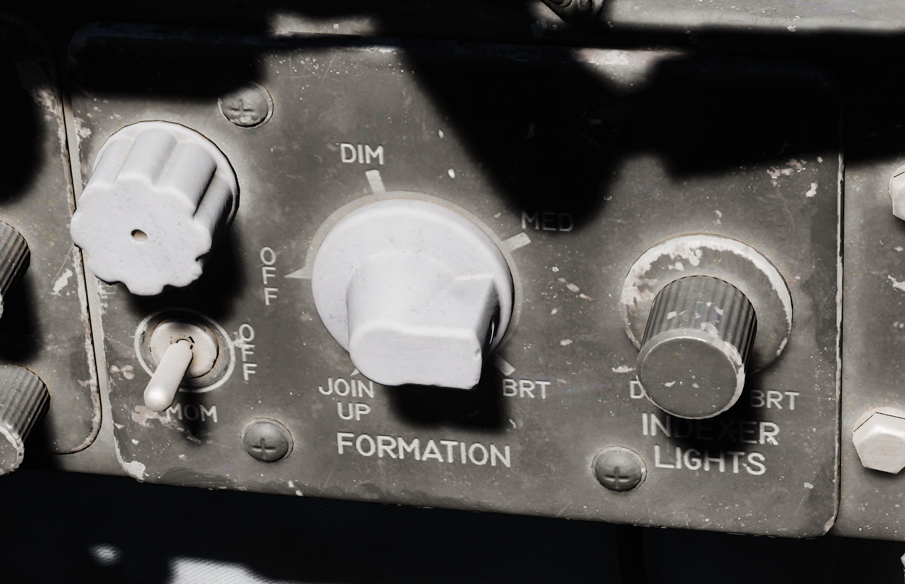

Control of the formation lights, which are found on the wing tips, both sides of the vertical stabilizer, and along the fuselage forward and amidship, is performed using the three position switch and rotary knob on this panel.  The switch has positions for MOM (momentary), OFF, and ON.  The variable control knob provides relative illumination levels at five positions: OFF, DIM, MED (medium), BRT (bright), and JOIN UP. 

Also on this panel is the Indexer Lights brightness knob, which controls relative illumination of the AoA indexers on both sides of the windscreen.  Marked positions are DIM and BRT (bright), with highest level to the right of the knob.

Circuit Breaker Panel
---------------------

.. image:: images/pilot_cb_panel.png

Contains seven circuit breakers responsible for flight control surfaces and other systems
important for safe operation of the aircraft.

+----------------+
| AIL Feel-Trim  |
+----------------+
| STAB Feel-Trim |
+----------------+
| Speed Brake    |
+----------------+
| Landing Gear   |
+----------------+
| Flaps          |
+----------------+
| Trim Controls  |
+----------------+
| Rudder Trim    |
+----------------+

If a circuit breaker is popped, the corresponding system does not receive power and cannot be operated anymore.

Emergency Floodlights Panel
---------------------------

.. image:: images/PilFlood.png

This auxiliary panel has various controls for lights and also audio.

Stall Warning
^^^^^^^^^^^^^

The Stall Warning knob controls the volume of the AoA tones that play when flying at certain angles.

Under certain conditions, the system can override the volume to ensure the cue is always audible in
dangerous situations.

Standby AI
^^^^^^^^^^

This knob used to control the brightness of the Standby Attitude Indicator (SAI) lights, but has been replaced
by the SAI Panel on the left wall.

Instrument Flood
^^^^^^^^^^^^^^^^

The three position switch controls the lamps illuminating the instrument panels in both cockpits simultaneously
in red light.

The bright and dim positions activate lamps powered by different electrical buses to ensure
the emergency light is available even in case of failure.

+--------+----------------------+
| Bright | Essential 28V DC Bus |
+--------+----------------------+
| Dim    | Left Main 14V AC Bus |
+--------+----------------------+

ML Audio
^^^^^^^^

Controls the volume of the Missile Launch System that plays tones to warn the pilot about being under attack.

IFF Control Panel
-----------------

.. image:: images/IFF.png

DCU-94A Stores Control-Monitor Panel
------------------------------------

.. image:: images/DCU94.png

This panel is used to control and test the separate release circuit system for nuclear stores.

Nuclear stores are separated from the regular release system to prevent accidental release.

Compass Control Panel
---------------------

.. image:: images/CompassCtl.png

Exterior Lights Control Panel
-----------------------------

.. image:: images/ExtLights.png

This panel contains controls connected to most of the exterior lighting:

* 3 position lights (green, red, white)
* 2 wingtip join-up lights (green, red)
* 3 fuselage lights (white)
* anti-collision tail light with 2 lamps (red)

Three switches labelled Fuselage, Tail and Wing control brightness of the lights
between BRT (Bright), DIM and OFF.

To ensure lights are available even in case of power failure conditions, the BRT and DIM selections are routed
through different buses:

+------------+-----------------------+
| Bright     | Right Main 28V DC Bus |
+------------+-----------------------+
| Dim        | Left Main 14V AC Bus  |
+------------+-----------------------+
| Anti-Col 1 | Right Main 14V AC Bus |
+------------+-----------------------+
| Anti-Col 2 | Left Main 14V AC Bus  |
+------------+-----------------------+

Fuselage Switch
^^^^^^^^^^^^^^^

Controls the three white fuselage lights.

Additionally, if set to BRT and and the Flasher Switch is set to FLASH, both anti-collision lights
illuminate.

Tail Switch
^^^^^^^^^^^

Controls the position light on the tail.

Wing Switch
^^^^^^^^^^^

Controls two of the three position and the two join-up lights on the wingtips.

Flasher Switch
^^^^^^^^^^^^^^

Can be set to OFF, STEADY or FLASH to additionally control the setting for:

* one of the two anti-collision lamps
* tail position light
* fuselage lights

If set to OFF, the controlled lights are OFF regardless of their respective switches. In the STEADY position,
they light up corresponding to the selected brightness. The FLASH position lets the controlled lights phase
from the set brightness to a low brigthness and back.

Emergency Vent Handle
---------------------

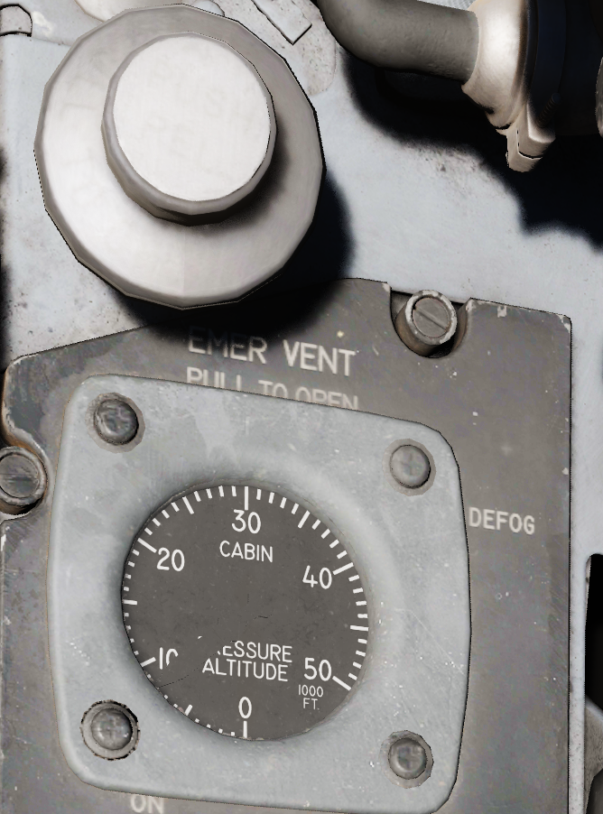

A plug that can be pulled to release cockpit pressure. Putting it back in will seal the cabin again.

Should only be used if the pressurization system is malfunctioning and reads abnormal values.
Descend to safe altitudes before activating.

Utility Panel (Right)
---------------------

.. image:: images/PilUtil.png

Defog/Foot Heat Lever
---------------------

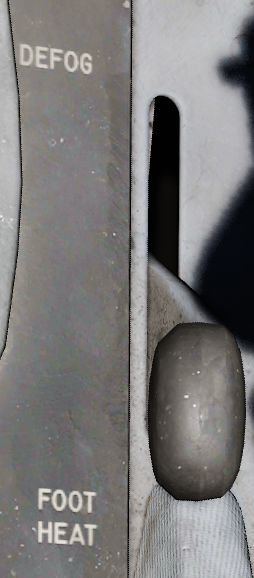

Provides pilot selectable volume of warm air to the windscreen or footwell recesses for comfort or visibility.

Generator Control Switches
--------------------------

.. image:: images/GenCtl.png

Control of each engine's respective electrical generator is provided by an individual switch.

+---------------+------------------------------------------------------------------------------------+
| ON            | Generator is driven by engine accessory power and applied to electrical bus.       |
+---------------+------------------------------------------------------------------------------------+
| OFF           | Generator is offline.                                                              |
+---------------+------------------------------------------------------------------------------------+
| ON (EXTERNAL) | External power is supplied through generator bus connection for pre-startup needs. | 
+---------------+------------------------------------------------------------------------------------+

Temperature Control
-------------------

.. image::  images/PilTemp.png

Used to adjust ECS system for pilot comfort.

Cockpit Lighting Control Panel
------------------------------

.. image:: images/PilCockLights.png

The Cockpit Lighting Control Panel provides control of all panel edge lighting, flight instrument panel
lighting, the console floodlights, the white floodlights found under the canopy sill over each console,
and also includes the Warning Light Test/Standby Compass Light switch.

The White Floodlight switch acts independent of all other controls on the panel, and is either ON or OFF.
It activates a separate emergency floodlight (also called Thunderstorm Light) that illuminates the cockpit
in white. The lamp is energized through the Battery Bus to ensure it is always operational,
even in case of total power loss. Do not forget to turn off the light before parking the aircraft for a
longer time, as it will otherwise drain the battery.

The Flight Instrument Light Knob (marked INSTR PANEL), when moved to the right of the OFF detent,
controls illumination of the following six instrument lights in unison: 

* Airspeed/Mach Indicator
* Attitude Director Indicator
* Angle of Attack Indicator
* Vertical Velocity Indicator
* Altimeter
* Horizontal Situation Indicator

When in the OFF position, these indicators are independently controlled for illumation by the
knobs on the Flight Instrument Lights Intensity Panel.

The Console Light Control Knob, with range from OFF to BRT, controls illumination level for all
panel edge lighting and the console floodlights.

The console floodlights (CONSOLE FLOOD) are triggered independently of the knob when it is
placed to the right of the OFF detent position, and offer three settings- DIM, MED, or BRT.
The floodlights will remain on until the Console Light Control knob is returned to the OFF position,
and the floodlight switch is placed in DIM. All three positions are powered by different buses to
ensure maximal availability:

+--------+-----------------------+
| Bright | Essential 28V DC Bus  |
+--------+-----------------------+
| Medium | Left Main 14V AC Bus  |
+--------+-----------------------+
| Dim    | Left Main 115V AC Bus |
+--------+-----------------------+

The Warning Light Test Switch (Marked WARN LT TEST) is a three-position switch;
in the WARN LT TEST position, confirms function of the various emergency indicators in the cockpit.
In the STBY COMP position, it illuminates the light for the Standby Compass.
Both functions are deactivated when the switch is placed in the OFF position.

Airborne Video Tape Recorder
------------------------------

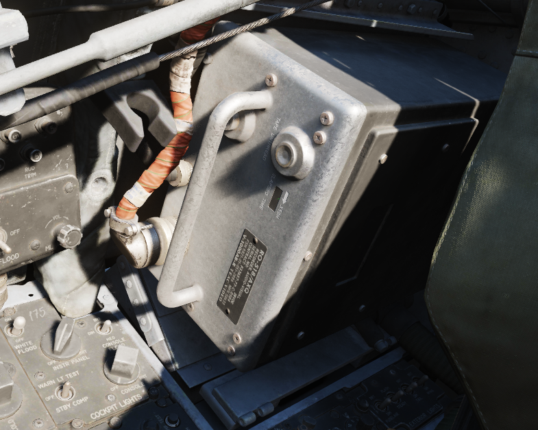

The AVTR system is installed in the rear section to the right of the seat. It is primarily controlled by
the WSO and records the intercom sound, as well as the rear radar screen.

Footage is recorded on a standard u-matic S cassette, which can be removed and replaced using the
EJECT Button on the top right of the box. The UNTHREAD button next to it is used to unthread the tape of the
cassette back to the start, causing it to overwrite previously recorded footage.

The cassette can record up to 20 minutes, indicated on the small display labelled ELAPSED TIME.

In DCS, footage is saved in the users Saved Games folder, for example:

``C:\Users\JohnDoe\Saved Games\DCS.openbeta\F-4E\recorders\avtr``

Seat
------------------------------

Seat Position
^^^^^^^^^^^^^

.. image:: images/pilot_seat_switch.png

The vertical position of the seat can be changed in either direction for about 5cm
using this springloaded switch.

Operation of the motor must be limited to 30 seconds within 10 minutes to prevent it from
overheating and breaking.

WSO Cockpit Layout
******************

.. image:: images/wso_pit_overview.png

+----+----------------+
| 1. |:ref:`upfront`  |
+----+----------------+
| 2. |:ref:`wleftsub` |
+----+----------------+
| 3. |:ref:`wleftcons`|
+----+----------------+
| 4. |:ref:`dscg`     |
+----+----------------+
| 5. |:ref:`wrightsub`|
+----+----------------+
| 6. |:ref:`wrightcon`|
+----+----------------+

.. _upfront:

Upfront Indicators Group
========================

Standby Magnetic Compass
------------------------

.. image:: images/StbyMagComp.png
   

A standard magnetic compass for backup navigation assistance should the primary flight director systems fail. 

Command Ejection Select Handle
------------------------------

Used to select single or dual ejection as commanded by the WSO.  In the vertical position (valve closed), initiation of ejection by the WSO ejects only the rear seat.  With the valve handle in the horizontal (open) position, a WSO initiating ejection will extract both crew members.

Course Indicator
----------------

Displays heading referencing the entered course using the SET Knob, and position relative to the programmed ILS localizer and glide slope entered by the pilot.  Does not function with TACAN or VOR.  Deviations are presented as dots, with one dot in course deviation equal to 1 1/4th degree, and one dot in glide slope deviation as 1/4 degree.  Course and Glide Slope OFF flags are visible if signal from the tuned station is lost.

KY-28 Mode Indicator
--------------------

Two lamp indicator illustrating current KY-28 operating mode- P indicates plain (unencrypted) mode transmission, whereas C indicates cipher (encrypted) mode transmission. 

Master Caution Light
--------------------

A repeater of the front cockpit Master Caution light, provides warning to the WSO that a caution condition exists and the telelight panel needs to be checked for cause to rectify the situation. 

Shoot Light
-----------

.. image:: images/LftShoot.png
  

Illuminates when missile firing parameters are met.  Do not illuminate when in VI or A-G modes. 

AN/APR-36 Control Panel
-----------------------

Angle of Attack Indexer
-----------------------

.. image:: images/AoA.png
   
Provides quick confirmation of current aircraft AoA state based on illuminated position and color.  

+--------------+---------------+ 
| "center low" | Very slow     |
+--------------+---------------+
| "low"        | Slightly slow |
+--------------+---------------+
| "all"        | On speed      |
+--------------+---------------+
| "high"       | Slightly fast |
+--------------+---------------+
| "center high | Very fast     |
+--------------+---------------+

Range (VISIDENT) Indicator
--------------------------

Displays accurage range information inside of 2 miles (12000') and range/rate information inside of 9000', when lockon exists in VI, B NAR, or B WIDE mode.  When AIR-GRD is slected, the indicator is disabled.

8-Day Clock
-----------

.. image:: images/PClock.png
  
A clock is provided for the WSO, including a stopwatch function.

Accelerometer
-------------

.. image:: images/GGauge.png
  
  
Calibrated from negative 4 to positive 10 in units of G, with three pointers- one for current applied load, the other two show maximum positive and negative G applied during the flight.  Pressing the PUSH TO SET button will reset the maximum position indicators to 1 G.  

Ball/Slip and Rate of Turn Indicator
------------------------------------

Navigation Mode Selector Switch
-------------------------------

Selects the respective mode for the two BDHI needles.

+---------+---------------------------------------------------------------------+
| Up      | Needle 1: UHF/Automatic Direction Finding; Needle 2: TACAN station. |
+---------+---------------------------------------------------------------------+
| Center  | Needle 1: VOR Station; 2 TACAN station.                             |
+---------+---------------------------------------------------------------------+
| Down    | Nav Computer mode: Needle 1: Bearing; Needle 2: Track.              |
+---------+---------------------------------------------------------------------+

Ground Speed Indicator
----------------------

Provides the aircraft's ground speed in knots, and is calibrated from 0 to 1999 knots.  Requires INS for accurate presentation.  If INS off, can register a value of up to 150 knots when parked. 

True Airspeed Indicator
-----------------------

.. image:: images/TASInd.png
  
Provides the aircraft's True Airspeed in knots, and is calibrated from 150 to 1500 knots; airspeeds below this range are thus not reliable. At high rates of airspeed change, there may be a lag of up to +-10 knots in measurement. 

UHF Remote Channel Indicator
----------------------------

Provides the current selected channel value when the radio is set to PRESET. 
Otherwise, the indicator displays M if the radio is set to Manual, G when the COMM function is set
as GUARD/ADF, or A when the A-3-2-T switch is in A.

Vertical Velocity Indicator
---------------------------

  
  
Provides rate of climb or descent via the static pressure system referenced in thousands of feet per minute. 

Altimeter
---------

  
  
A counter-pointer style altitmeter, with thousandths in the counter window and 100 foot increments around the face. The altimeter has an absolute range of 80,000 feet. The altimeter includes a barometric scale for setting local pressure with the knob on the indicator.  Works in either electric (normal operation mode) or pneumatic (STBY) mode, switchable via a springloaded three position switch labelled RESET and STBY.   

Standby Attitude Indicator
--------------------------

.. image:: images/StbyAtt.png
  
The SAI functions independent of the Flight Director Group, providing reasonably accurate (within six degrees) for 9 minutes if power to the system is lost and the OFF flag is in view.  Pitch markings are indicated every 5 degrees, while roll markings are in gradations of 10 degrees. Roll is illustrated through 360 degrees, while pitch is limited by stops at 92 degrees in climb and 78 degrees in dive to prevent gimbal lock.

Airspeed and Mach Indicator
---------------------------

.. image:: images/MachInd.png
  
The combination airspeed and mach number indicator shows airspeed readings below 200 knots, and include Mach numbers at high speed.  The indicator uses a single pointer over a fixed airspeed scale, marked from 80 to 850 knots, with a moving Mach scale presenting from Mach 0.4 to 2.5. A pair of movable reference markers is available with the knob on the face of the gauge, with speed reference available between 80 and 195 knots, and the Mach index pointer being able to be set between the 225 knot and 850 knot regions relative to the airspeed gauge.  

Note: Moving these reference markers outside of the respective aforementioned regions can damage them.

Bearing Distance Heading Indicator (BDHI)
-----------------------------------------

The Bearing Distance Heading Indicator, or BDHI, presents navigation information as entered by the WSO, provided with two needles (termed the No 1 and No 2 pointers).

When the upper position is selected by the WSO to TACAN/ADF/UHF, the no. 1 pointer indicates UHF bearing, and the no. 2 pointer indicates the TACAN bearing.  If there is no TACAN signal, both pointers indicate the ADF bearing.  

With the middle position selected- VOR/TAC, the no. 1 pointer indicates the VOR bearing, the no. 2 pointer indicates the TACAN bearing, and the range indicator provides distance to the TACAN station. In the absence of a TACAN signal, both pointers indicate the VOR station.

In the lower position, NAV COMP, the no. 1 pointer indicates bearing to the navigation computer target coordinates, and the no. 2 pointer indicates magnetic ground track.  The range indicator notes distance to the target coordinates. 

Tachometers
-----------

.. image:: images/Tach.png
  
  
A percentage-noting Tachometer is provided for each engine, including an inset wheel for accurate display of single digits. 

Canopy Unlocked Warning Lamp
----------------------------

Illuminates when canopy is unlocked.

Inertial Nav Sys Out Lamp
-------------------------

Illuminates when INS system is in a failure state.

Radar CNI Cool Off Lamp
-----------------------

Illuminates to indicate an overtemperature situation in the avionics cooling system.  

.. _wleftsub:

WSO Left Subpanel
=================

Gun Camera Switch
-----------------

Activates recording of gun camera footage.

Air to Air Light
----------------

Illuminates when CAGE mode activated; pressing the light reverts the radar to the original operating condition prior to CAGE entry.

Video Select Button
-------------------

Push button that alternates between WEAPON and TDS pod (ASQ-153) television video on the radar scope display when in TV mode.

AVTR Control
------------

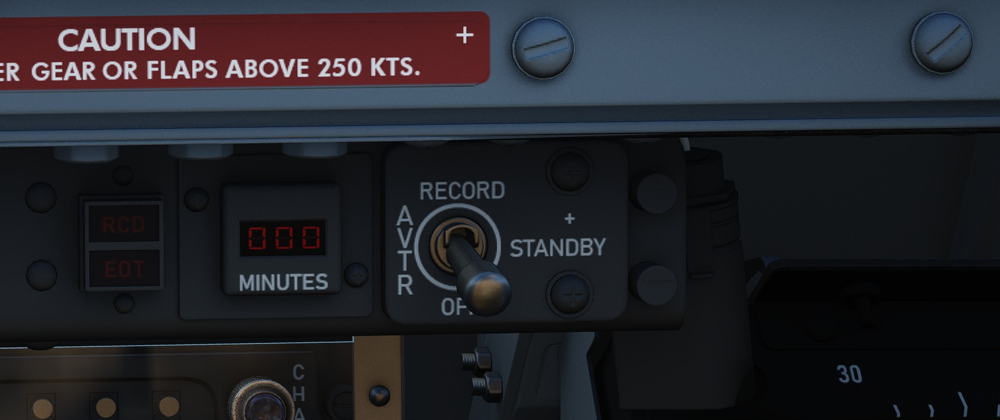

Controls the Airborne Video Tape recorder system which records the intercom sound, as well as the
rear radar screen.

AVTR Switch
^^^^^^^^^^^

With the switch in the RECORD position, footage is recorded on the cassette and the RCD light illuminates.
The STANDBY position pauses recording, while the OFF position will additionally automatically unthread
the tape back to the beginning after 10 seconds.

AVTR Tape Timer
^^^^^^^^^^^^^^^

The cassette can record up to 20 minutes of footage, indicated in the small display labelled MINUTES.

EOT Light
^^^^^^^^^

Once the end of the tape has been reached, the EOT light illuminates and the tape must be unthreaded before
it can record again.

RCD Light
^^^^^^^^^

Lit to indicate the AVTR system currently recording.

WSO Emergency Landing Gear Handle
---------------------------------

Deploys the landing gear using a pair of compressed air bottles; handle cannot retract gear, only deploy in an emergency. 

WSO Emergency Brake Handle
--------------------------

In an emergency, discharges a portion of the brake system hydraulic accumulator to provide emergency braking.  Contains a limited number of applications. 

APX-80 Control Panel
--------------------

.. image:: images/apx_80.png

The AN/APX-80 combines the IFF Interrogater System APX-76 and the Combat-Tree system APX-81A.
It is used to identify whether an aircraft is friendly or hostile.

The glass cover has to be lifted in order to reach most switches and knobs on this panel.

Code Buttons
^^^^^^^^^^^^

The first digit of the code display indicates the current IFF mode, which can be either of:

* Off (white square)
* Mode 1
* Mode 2
* Mode 3
* Mode 4/A
* Mode 4/B

In DCS, only Mode 4 (either A or B) is effective and can be used for interrogation.

The other four digits are used to set the IFF code to interrogate for Modes 1 to 3.

The buttons below and above the display are used to decrement and increment the
corresponding setting respectively.

Challenge Lamp
^^^^^^^^^^^^^^

This dimmable push-to-test lamp illuminates to indicate IFF active interrogation with the APX-76 system.

Test/Challenge Code
^^^^^^^^^^^^^^^^^^^

If set to OFF, the APX-76 interrogation system is powered off. In the CHALLENGE position,
it can be used to interrogate.

TEST is used to test the system. If the lamp above lights up, the test was successful.

Anti-Jam
^^^^^^^^

This switch could be used for anti jammer measurements on some systems, but was never installed and connected
on this variant of the F-4E.

Test/Challenge Lamp
^^^^^^^^^^^^^^^^^^^

This dimmable push-to-test lamp illuminates to indicate active interrogation with the APX-81A Combat-Tree system.

Test Button
^^^^^^^^^^^

Starts the built-in test of the APX-81A Combat-Tree system.

Mode 2
^^^^^^

Used to set Combat-Tree Mode 2 either in ACTIVE, PASSIVE or OFF types.

Mode 3
^^^^^^

Used to set Combat-Tree Mode 3 either in ACTIVE, PASSIVE or OFF types.

Mode 4
^^^^^^

Used to set Combat-Tree Mode 4 into ALARM or OVERRIDE types.

This functionality was never installed and connected on this variant of the F-4E.

WSO Oxygen Regulator Panel
--------------------------

Flow Indicator
^^^^^^^^^^^^^^

Alternates between black and white with each aircrew member breath to indicate oxygen flow.

Emergency Flow Control Switch
^^^^^^^^^^^^^^^^^^^^^^^^^^^^^

Three position switch which selects EMERGENCY pressure (100% flow with positive pressure), NORMAL (stanadard air/oxygen mix), or TEST MASK (positive pressure for mask sealing check). 

Diluter Lever
^^^^^^^^^^^^^

Two position switch that cycles between NORMAL oxygen value or 100% OYXGEN level.  

WSO Oxygen Quantity Test Button
^^^^^^^^^^^^^^^^^^^^^^^^^^^^^^^

Tests oxygen low pressure warning system.  Pressing the button ccles the needles from current oxygen level to zero, which triggers OXYGEN LOW telelight panel warning as needle passes through 1 liter.  Releasing the button returns the needle to current system level and clears OXYGEN LOW warning.

Oxygen Pressure Gauge
^^^^^^^^^^^^^^^^^^^^^

Indicates system pressure from 0 to 500 psi.  

WSO Supply Lever
^^^^^^^^^^^^^^^^

Two position switch (ON and OFF) activating flow of oxygen to the aircrew member. 

Landing Gear/Flap Indicator Panel
---------------------------------

Displays current status of landing gear, flaps, and slat position.

Landing Gear
^^^^^^^^^^^^

Status noted with the word UP (up), a barber pole illustration (in transition), or an icon of a wheel (down) relative to current position.

Slats
^^^^^

Status noted with the word IN and OUT.

Flaps
^^^^^

Status noted with the word UP (flaps up) or (DN) (down).  When transitioning, may show a barber pole illustration.  When transitioning back to the UP position, the indicator does not change until the flaps are fully retracted.

.. _wleftcons:

WSO Left Console
================

Intercom Control Panel
----------------------

WSO ICS Volume Control Knob
^^^^^^^^^^^^^^^^^^^^^^^^^^^

Turned clockwise to increase audio between cockpits, and counterclockwise to decrease audio between cockpits on the intercom.

WSO ICS Function Selector Switch
^^^^^^^^^^^^^^^^^^^^^^^^^^^^^^^^

+----------------+------------------------------------------------------------------------------------+
| COLD MIC       | Mic switch on throttle must be held to activate intercom.                          |
+----------------+------------------------------------------------------------------------------------+
| HOT MIC        | Voice automatically transmitted on intercom.                                       |
+----------------+------------------------------------------------------------------------------------+
| RADIO OVERRIDE | Intercom overrides incoming radio calls; does not override aircraft warning audio. |
+----------------+------------------------------------------------------------------------------------+

WSO ICS Amplifier Select Knob
^^^^^^^^^^^^^^^^^^^^^^^^^^^^^

Determines current amplifier for intercom function.

+------+-------------------------------------------------------------------------------------+
| B/U  | Backup headset amplifier provides audio.                                            |
+------+-------------------------------------------------------------------------------------+
| NORM | Primary headset amplifier provides audio.                                           |
+------+-------------------------------------------------------------------------------------+
| EMER | Uses amplifier from opposite cockpit; only audio received to that cockpit is heard. |
+------+-------------------------------------------------------------------------------------+

Control Monitor Panel
---------------------

Cords Light
^^^^^^^^^^^

Not used by the APQ-120 in the F-4E.

Temp Light
^^^^^^^^^^

Illuminates amber to incidate an overtemperature situation in the nose radar avionics bay.  Under normal circumstances, an overheat condition requires setting the radar power to OFF. If cirucmstances require continued use, the light should be monitored regularly.

Test Knob
^^^^^^^^^

An eleven position rotary knob used with the radar power knob in TEST to perform system BIT checks of the APQ-120 radar.  Basic test function noted below; procedural functionality is found in the appliable BIT test section.

+---------+---------------------------------------------------------------------------------------------+
| 0       | Displays standard B scope presentation to confirm all elements functioning correctly.       |
+---------+---------------------------------------------------------------------------------------------+
| 1       | Confirms break lock timing delay, AIM-7 tuning status, and Range lamp status function.      |
+---------+---------------------------------------------------------------------------------------------+
| 2       | Confirms proper AIM-7 head position aim and SHORT pulse function against two targets.       |
+---------+---------------------------------------------------------------------------------------------+
| 3       | Confirms angle tracking performance against a locked target that rotates inside ASE circle. |
+---------+---------------------------------------------------------------------------------------------+
| 4       | Used while lock achieved in another mode, confirms HOJ and AOJ functionality.               |
+---------+---------------------------------------------------------------------------------------------+
| 5       | Checks range rate, lead angle, CAA, and PLMS function.                                      |
+---------+---------------------------------------------------------------------------------------------+
| 6       | Confirms proper AIM-7 attack display and interlock function.                                |
+---------+---------------------------------------------------------------------------------------------+
| 7       | n/a                                                                                         | 
+---------+---------------------------------------------------------------------------------------------+
| 8       | n/a                                                                                         |
+---------+---------------------------------------------------------------------------------------------+
| 9       | n/a                                                                                         |
+---------+---------------------------------------------------------------------------------------------+
| 10      | n/a                                                                                         |
+---------+---------------------------------------------------------------------------------------------+
| DOT BAL | Confirms AIM dot centering calibration.  Also used for TIRS data transfer.                  |
+---------+---------------------------------------------------------------------------------------------+

Meter Switch
^^^^^^^^^^^^

Determines which set of values are utilized from the Meter Selector Knob for the applicable test sequences; VOLT selects the inner ring of Voltage referencing values, whereas SIGNALS uses the outer rim of SIGNAL reference values.

Meter Selector Knob
^^^^^^^^^^^^^^^^^^^

A sixteen position rotary knob used in conjunction with the Test Knob, with each position having two values- an outer SIGNAL value, and an inner VOLT value.  Selection of which value determined by the Meter Switch.

Monitor Meter
^^^^^^^^^^^^^

Provides voltage, current, and signal indications based on current Meter Switch and Meter Selector Knob settings.

Vc Switch
^^^^^^^^^

Changes the scale factor of the range rate presentation.  DSCG aircraft must leave the switch in 2700, else the Vc presentation will be in error.

Stab Switch
^^^^^^^^^^^

Changes the antenna stabilization mode. 

+------------+------------------------------------------------------------------------------------------+
| NOR        | Normal operation; inputs of pitch and roll are fed to the antenna stabilization circuit. |
+------------+------------------------------------------------------------------------------------------+
| STAB OUT   | Horizon line removed from scopes and stabilation drift servos are zeroed.                |
+------------+------------------------------------------------------------------------------------------+
| DRIFT OUT  | INS drift compensation is removed; antenna uses direct pitch and roll input tracking.    |
+------------+------------------------------------------------------------------------------------------+

Radar Set Control Panel
-----------------------

Power Knob
^^^^^^^^^^

Five position rotary switch controlling power state of the APQ-120

+-------+---------------------------------------------------------------------------------------------+
| OFF   | Powers radar off.                                                                           |
+-------+---------------------------------------------------------------------------------------------+
| TEST  | Applies voltage to control monitor power and provides test functions 1 through 6.           |
+-------+---------------------------------------------------------------------------------------------+
| STBY  | Power applied to radar, remains in a non-transmitting standby state.                        |
+-------+---------------------------------------------------------------------------------------------+
| OPR   | System is fully operational.                                                                |
+-------+---------------------------------------------------------------------------------------------+
| EMER  | Overrides the time delay, pressure, and temperature restrictions to allow radar operation.  |
+-------+---------------------------------------------------------------------------------------------+

Polar Switch
^^^^^^^^^^^^

Controls polarization of transmitted rf energy.  

+-------+----------------------------------------------------------------------------------------+
| LIN   | RF energy is linerally polarized in a vertical orientation.  AIM-7 default mode.       |
+-------+----------------------------------------------------------------------------------------+
| CIR 1 | RF energy is rotated clockwise from the vertical plane.  AIM-7 can be fired.           |
+-------+----------------------------------------------------------------------------------------+
| CIR 2 | RF energy is rotated counterclockwise from the vertical plane.  AIM-7 cannot be fired. |
+-------+----------------------------------------------------------------------------------------+

Radar Range Knob
^^^^^^^^^^^^^^^^

Used to select range sweep of 5, 10, 25, 50, 100, or 200 mile ranges on both radar displays.  First four ranges are air to air intercept positions, final two are ground mapping modes only, and disengage lockon capability.  Selecting a setting illuminates the applicable range lamp, and displays the value on the radar scope upper left corner.

Maneuver Switch
^^^^^^^^^^^^^^^

Controls radar tracking response due to acceleration limits and received countermeasures and clutter.

+-------+------------------------------------------------------------------------------------+
| Low G | Default position.  Limts track response due to countermeasures and clutter.        |
+-------+------------------------------------------------------------------------------------+
| HI G  | Allows track loop to respond to high acceleration. Automatically engaged with CAA. |
+-------+------------------------------------------------------------------------------------+

Bar Scan Switch
^^^^^^^^^^^^^^^

Selects elevation scan pattern. In 2 bar scan, search pattern is separated by 3.75 degrees on each scan.  In boresight or air to ground modes, 1 bar scan is automatically commanded.

Aspect Switch
^^^^^^^^^^^^^

Used to program the AIM-7 with a predetermined simulated Doppler instead of actual received Doppler, so that the WSO can provide an estimated correct speedgate location when range isn't available.  

Receiver Gain Knobs (RCVR GAIN)
^^^^^^^^^^^^^^^^^^^^^^^^^^^^^^^

Coarse (outer ring) and Fine (inner knob) gain control for the radar scope display to increase video output legibility of target returns. 

Track Switch
^^^^^^^^^^^^

Enables manual target tracking in heavy clutter envrionments, or automatic tracking under normal circumstances.

**Manual**

When in the MAN position, the WSO places the acquisition symbol over the intended target and triggers half-action on the HCU.  The range strobe is positioned relative to in-range on a closing target, and the WSO selects full-action.  To solidify the track, the WSO uses the Manual Vc knob to place the range strobe and target return video at the same rate of movement.

**Automatic**

In the AUTO position, the range and closure calculations are performed automatically.  The WSO places the acquisition symbol over the target return and presses full action.  Should the target maneuver in excess of the speed capability of the radar, the Maneuver switch can be set to HI G and the target reacquired.

**AOJ OUT**

The AOJ OUT position is used to override the acquisition on jamming function of the radar.  In the event that the radar acquires a HOJ lock, the position can be selected to place the radar back into a search configuration to initiate a lockon against the jamming target and initiate a standard angle track lock.

Display Knob
^^^^^^^^^^^^

Sets the display type of the radar scope to access specific mode functionality in conjunction with the Mode knob.  The types are as follows:

+-----------+-------------------------------------------------------------------------------------------+
| B WIDE    | Selects 120 degree B-sweep for search.  Half-action places the sweep under manual HCU.    |
+-----------+-------------------------------------------------------------------------------------------+
| B NAR     | Selects a 45 degree B-sweep sector for search, which is manually shifted with the HCU.    |
+-----------+-------------------------------------------------------------------------------------------+
| PPI WIDE  | Selects a 120 degree wide plan position indicator sweep for MAP mode.                     |
+-----------+-------------------------------------------------------------------------------------------+
| PPI NAR   | Selects a 45 degree plan position indicator sweep that can be shifted with the HCU.       |
+-----------+-------------------------------------------------------------------------------------------+
| VI        | Provides pure pursuit guidance to a locked target; a break X will appear at 1000' range.  |
+-----------+-------------------------------------------------------------------------------------------+

Maneuver Vc Knob
^^^^^^^^^^^^^^^^

An 12 position switch used to apply estimated range rate of closure (clockwise, 0-9),  or estimated opening of range (counterclockwise, 0-2) against a target in manual track mode.

Pulse Switch
^^^^^^^^^^^^

Three position switch controlling radar pulse width and pulse repetition frequency in the Air to Air radar searc modes. With the APQ-120 placed in CAGE mode, short pulse operation is automatically selected.  In AIR-GND modes, the pulses are automatically commanded, deactivating the switch.  

+-------+------------------------------------------------------------------------------------------------------+
| AUTO  | Commands long pulse width and low PRF; pulse width handled automatically when target is locked.      |
+-------+------------------------------------------------------------------------------------------------------+
| LONG  | Low PRF and wide pulse width, allowing maximum range detection; no track automatic pulse adjustment. |
+-------+------------------------------------------------------------------------------------------------------+
| SHORT | Narrow pulse width with high PRF for increased close range performance.                              |
+-------+------------------------------------------------------------------------------------------------------+

Mode Knob
^^^^^^^^^

A six position switch that determines the current base mode of operation of the radar.

+---------+-------------------------------------------------------------------------------------------------+
| BST     | Air to Air boresight with antenna aligned to optical sight. Permits CAGE and CAA.               |
+---------+-------------------------------------------------------------------------------------------------+
| RDR     | Air to Air search mode.                                                                         |
+---------+-------------------------------------------------------------------------------------------------+
| MAP     | Radar ground mapping mode.                                                                      |
+---------+-------------------------------------------------------------------------------------------------+
| AIR-GRD | Air to Ground boresight, 20 mile range against targets visually established with optical sight. |
+---------+-------------------------------------------------------------------------------------------------+
| BEACON  | Radar receives and displays signals from ground or airborne beacon transponders for navigation. |
+---------+-------------------------------------------------------------------------------------------------+
| TV      | Not used with DSCG. Deactivates AIM-7 if selected.                                              |
+---------+-------------------------------------------------------------------------------------------------+

Skin Track Light
^^^^^^^^^^^^^^^^

Green lamp that illuminates when a track is attained with range data.  In the event of HOJ or a range memory situation, the light will go off. Accompanied on the rear DSCG radar scope with the T symbol that illuminates under the same circumstances.

TACAN Control Panel
-------------------

.. image:: images/FrontTCN.png

The TACAN Control Panel is used to enter the desired TACAN channel, mode, and audible volume for the monitoring of said channel by the aircrew.  The panel is duplicated in both cockpits, and the panel in command of the TACAN receiver is selected with the NAV CMD button the Communication Control Panel.

On the control panel is found two Navigation Channel Control knobs, with the left controlling the first two digits of the channel value (hundreds and tens), and the right controls the single unit (ones) values.  The right knob also includes an outer ring which sets the X or Y value for the desired TACAN channel. 

Between these two knobs is the TEST button, which performs the ground testing cycle after warmup, and can also be used to perform an in-flight confidence test of the system's performance.

To the upper right, the VOL knob is available to set the desired audio level for the received TACAN station.  

The TACAN Function Selector Knob determines the presentation and type of information provided on the HSI, ADI, and BDHI, respectively.

+-------------+-----------------------------------------------------------------------------------+
| OFF         | The TACAN receiver is deenergized and offline.                                    |
+-------------+-----------------------------------------------------------------------------------+
| REC         | The TACAN receiver is active, providing bearing information on the HSI, BDHI, and |
|             |                                                                                   | 
|             | ADI.                                                                              |
+-------------+-----------------------------------------------------------------------------------+
| T/R         | Both the receive and transmit functions of the TACAN are active, which provide    |
|             |                                                                                   |
|             | bearing and nautical mile range information for the HSI and BDHI.                 | 
+-------------+-----------------------------------------------------------------------------------+
| A/A REC     | The TACAN reciver decodes bearing information from compliant aircraft for the HSI,|
|             |                                                                                   |
|             | BDHI, and ADI steering display.                                                   |
+-------------+-----------------------------------------------------------------------------------+
| A/A TR      | The TACAN receiver receives both bearing and sland range information in nautical  |
|             |                                                                                   |
|             | miles from the transmitting aircraft, providing this on the HSI and BDHI.         |
+-------------+-----------------------------------------------------------------------------------+

Note: Air to Air TACAN functionality requires the channel to be set 63 channels above or below the cooperating aircraft, but on the same range- X or Y. 

Communication Control Panel
---------------------------

.. image:: images/CCP.png

The Communication Control Panel provides selection and mode of the UHF radio in the aircraft.  The panel is duplicated in both cockpits, and control over the radio is determined through pushing the COMM CMD Button in the respective seat; the button will illuminate green in the seat in priority.  In the same fashion, the NAV CMD button dictates which seat has control of the TACAN settings; its button will also illuminate in the seat in command of the system.

Beneath the COMM CMD button is the radio volume for the respective seat.  Adjacent to the NAV CMD button is the Squelch switch, which enables or disables receiver squelch. 

The A-3-2-T Selector knob sets HAVE Quick functionality of the UHF radio (A- auto-jam), the first digit of the manually selected frequency (3 or 2), or enables Time of Day receipt for one minute after selection in a momentary hold position (T).  

The four Frequency Selection Knobs work in concert with the A-3-2-T knob and Preset/Manual switch.  Frequencies are entered beginning with the 3 or 2 selection on the A-3-2-T Selector, and can be entered from 225.00 to 399.975 MHz in increments of 0.025.  With Preset/Manual in the Manual position, the UHF radio is directly set to the displayed channel.  In the Preset position, the set channels can entered into the COMM CHAN memory, with the desired position selected with the Comm Channel Control knob- the smaller knob to the left of the Preset/Manual switch, and displayed in the COMM CHAN window. Channels are stored in the displayed channel preset with the SET pushbutton. Once stored, channels are directly selected using the Comm Channel Control knob with the Preset/Manual switch in the Preset position.  

The Tone Pushbutton is used for transmission of a TOD signal along with a tone to friendly aircraft requiring a Time of Day update for proper HAVE Quick functionality.  It is also used to activate the emergency TOD clock for the radio itself, in conjunction with the T position of the A-3-2-T knob.  Selecting the T position and pushing the Tone button will cause the radio to listen for a TOD signal from another friendly transmitter to synchronize the anti-jam function with the desired network.

Directly underneath the Comm Channel Control Knob is the Aux Channel Knob and Indicator.  This knob is used to access 20 common preset channels that cannot be changed from in the cockpit. 

The Comm Function Selector Knob determines the current configuration of the radio system. 

+-------------+-----------------------------------------------------------------------------------+
| OFF         | All UHF Radios off.                                                               |
+-------------+-----------------------------------------------------------------------------------+
| T/R ADF     | Comm receiver - comm reception.                                                   |
|             |                                                                                   | 
|             | Comm transmitter - comm transmission.                                             |
|             |                                                                                   |
|             | Comm guard receiver - standby.                                                    |
|             |                                                                                   | 
|             | Aux receiver- with antenna select in UPR, comm reception; in LWR, ADF reception.  |
+-------------+-----------------------------------------------------------------------------------+
| T/R+G ADF   | Comm receiver - comm reception.                                                   |
|             |                                                                                   | 
|             | Comm transmitter - comm transmission.                                             |
|             |                                                                                   |
|             | Comm guard receiver - guard reception.                                            |
|             |                                                                                   | 
|             | Aux receiver- with antenna select in UPR, comm reception; in LWR, ADF reception.  |
+-------------+-----------------------------------------------------------------------------------+
| ADF+G CMD   | Comm receiver - ADF reception.                                                    |
|             |                                                                                   | 
|             | Comm transmitter - comm transmission.  ADF interruped during transmission.        |
|             |                                                                                   |
|             | Comm guard receiver - guard reception on ADF antenna.                             |
|             |                                                                                   | 
|             | Aux receiver- comm reception.                                                     |
+-------------+-----------------------------------------------------------------------------------+
| ADF+G       | Comm receiver - ADF reception.                                                    |
|             |                                                                                   | 
|             | Comm transmitter - comm transmission.  ADF interruped during transmission.        |
|             |                                                                                   |
|             | Comm guard receiver - standby.                                                    |
|             |                                                                                   | 
|             | Aux receiver- guard reception.                                                    |
+-------------+-----------------------------------------------------------------------------------+
| Guard ADF   | Comm receiver - guard reception.                                                  |
|             |                                                                                   | 
|             | Comm transmitter - guard transmission.                                            |
|             |                                                                                   |
|             | Comm guard receiver - standby.                                                    |
|             |                                                                                   | 
|             | Aux receiver- with antenna select in UPR, comm reception; in LWR, ADF reception.  |
+-------------+-----------------------------------------------------------------------------------+

The Aux Volume Control knob raises and lowers the volume of the Aux receiver channel. 

AN/ALE-40 Cockpit Control Unit
------------------------------

Ripple Switch
^^^^^^^^^^^^^

When positioned ON, dispenses flares at rate of ten per second until dispensers are empty, so long as flaps and speed brakes are retracted.

Dispense Button
^^^^^^^^^^^^^^^

Initiates chaff/flare dispensing as selected by CCU and ALE-40 programmer with flaps and speed brakes retracted and mode knobs out of OFF.

Counters
^^^^^^^^

Indicate quantity of chaff and flare cartridges remaining, respectively.  If slave dispenser is set to Chaff Double (CD), the chaff counter will display half of the number of cartridges remaining. 

Chaff Mode Knob
^^^^^^^^^^^^^^^

+------+------------------------------------------------------------------------------+
| OFF  | Chaff system inactive.                                                       |
+------+------------------------------------------------------------------------------+
| SGL  | A single burst commanded when dispense button pressed.                       |
+------+------------------------------------------------------------------------------+
| MULT | A salvo commanded according to program when either dispense button pressed.  |
+------+------------------------------------------------------------------------------+

Flare Mode Knob
^^^^^^^^^^^^^^^

+------+------------------------------------------------------------------------------+
| OFF  | Flare system inactive.                                                       |
+------+------------------------------------------------------------------------------+
| SGL  | A single burst commanded when dispense button pressed.                       |
+------+------------------------------------------------------------------------------+
| MULT | A salvo commanded according to program when either dispense button pressed.  |
+------+------------------------------------------------------------------------------+

Indicator Lights
^^^^^^^^^^^^^^^^

Illuminates whenever a mode is selected on the respective countermeasure mode knob.

LABS Panel
----------

.. image:: images/wso_labs_panel.png

Aural Tone Volume
^^^^^^^^^^^^^^^^^

Knob to control the volume for weapon tones, such as the Sidewinder seeker head.

Pull Up Tone
^^^^^^^^^^^^

Switch to toggle the tone played by the Pull-Up system.

Pressure Altitude Indicator
---------------------------

Liquid Oxygen Level Indicator
-----------------------------

Range from 0 to 10 liters, providing confirmation of current liquid oxygen status.  In event power is lost, a "power off" flag will show on the instrument face.

Navigation Volume Control
-------------------------

Controls audio volume of received TACAN/beacon signals through aircrew headsets. 

WSO Emergency Flaps Handle
--------------------------

Used for emergency deployment of the slats and flaps from the rear cockpit, and is activated by pulling the handle aft.  Pneumatic system powering extension of the slats flaps system only functions one time.  Extend regardless of airspeed, however flaps will not fully deploy above 230 knots due to air loads on control surfaces.  Will deploy fully when slower.

.. _dscg:

Digital Scan Converter Group (DSCG) and Pedestal Panel
======================================================

Digital Scan Converter Group (DSCG)
-----------------------------------

Grid Knob
^^^^^^^^^

Controls brightness of the display grid on the visual field of the DSCG display; clockwise increases brightness, counterclockwise decreases.

Scale Knob
^^^^^^^^^^

Controls brightness of the bezel range scales surrounding the DSCG display; clockwise increases brightness, counterclockwise decreases.

H - Home on Jam Lamp
^^^^^^^^^^^^^^^^^^^^

Illuminates when the radar has achieved angle tracking in Home on Jam mode.

T - Track Lamp
^^^^^^^^^^^^^^
Illuminates when a standard radar lock on is achieved.  Will go out in the event the radar falls back to memorized range and rate information should the lock be lost.

Contrast Knob - CONTR
^^^^^^^^^^^^^^^^^^^^^

Controls relative contrast level of DSCG display; clockwise increases contrast, counterclockwise reduces contrast.

Cursor RNG (Range)
^^^^^^^^^^^^^^^^^^

Increases (clockwise) and decreases (counterclockwise) the relative brightness of the hemispherical Along Track range cursor in MAP PPI and Beacon PPI modes on both displays (WSO and Pilot).

Cursor OFS (Offset)
^^^^^^^^^^^^^^^^^^^

Increases (clockwise) and decreases (counterclockwise) the relative brightness of the Cross Track cursor in the MAP PPI and Beacon PPI modes on both displays (WSO and Pilot).

Brightness Knob
^^^^^^^^^^^^^^^

Increases (clockwise) and decreases (counterclockwise) the brightness of the overall scope display.

Mode Knob
^^^^^^^^^

Sets the current mode of the DSCG components. 

+-------------+----------------------------------------------------------------------------------+
| OFF         | Turns off DSCG display and depowers all DSCG components.                         |
+-------------+----------------------------------------------------------------------------------+
| STBY        | Powers DSCG components, DSCG display remains off.                                |
+-------------+----------------------------------------------------------------------------------+
| DSCG TEST   | Displays search display image with 8 shades of grey to confirm normal operation. |
+-------------+----------------------------------------------------------------------------------+
| RDR BIT     | Provides BIT sequence test grids for calibration of radar performance.           |
+-------------+----------------------------------------------------------------------------------+
| RDR         | Used for radar display functionality in all employment modes.                    |
+-------------+----------------------------------------------------------------------------------+
| TV          | Used for TV raster imagery with EO weapons.                                      |
+-------------+----------------------------------------------------------------------------------+

Target Designator Control Set
-----------------------------

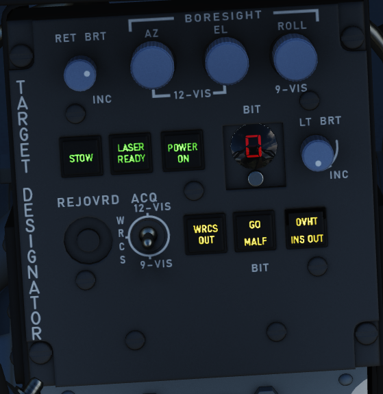

This is the main panel to interact with the Pave Spike Targeting Pod.

Reticle brightness
^^^^^^^^^^^^^^^^^^

Controls contrast of the TV reticle from black (full counter-clockwise) to green (full clockwise).
Should be set to attain maximum contrast in the display window during the designation and attack procedure.

Boresight knobs
^^^^^^^^^^^^^^^

Three knobs to control the boresight position of the pod in azimuth, elevation and roll within 2.5 degrees in either direction.

Azimuth and Elevation can best be calibrated in the 12-VIS mode, while roll is best calibrated in 9-VIS.

Stow Button
^^^^^^^^^^^

Alternating presses unstows and stows the Pave Spike pod head.
The head is stowed when the button is illuminated. 

When unstored, the pod will move accordingly to the selected acquistion mode.

To prevent damage to the system, the pod must be stowed during takeoff, landing and any High-G maneuvers.
Note that the stowed position is held electrically only and without power, the pod swings freely and gets damaged when forcefully bumped into its gimbal limits.

Laser Ready Select Button
^^^^^^^^^^^^^^^^^^^^^^^^^

Enables designator laser firing if illuminated after pressing.

Light remains off if interlocks (nose gear up and all pod functions working) inihibit use. Subsequent press deactivates laser system.

Power On Button
^^^^^^^^^^^^^^^

Applies power to the targeting pod when pressed and released. Selected again to power off targeting pod. Button lamp will turn off once head is stowed.

To prevent damage to the system, whenever equipped, power to the system should be turned on even when not using the pod.

BIT Selector Button
^^^^^^^^^^^^^^^^^^^

Pressed to advance to the desired BIT mode as displayed in the adjacent window.

BIT 1 is the regular mode of the pod and must be selected for normal operations.

Light Brightness Knob
^^^^^^^^^^^^^^^^^^^^^

Controls brightness of all lamps on this panel, except the Overheat lamp.

Reject/Override Button
^^^^^^^^^^^^^^^^^^^^^^

When the pod detects a too huge discrepancy between the laser measured slant range and the INS based computed ranged,
it automatically rejects former and prefers latter.

In this case, the button can be used to force the use of the laser measured slant range instead.

Acquisition Mode Selector Switch
^^^^^^^^^^^^^^^^^^^^^^^^^^^^^^^^

Three position switch determining the pods main operation mode.

+--------+-----------------------------------------------------------------------------------------------------+
| 12-VIS | Slaves LOS parallel to the optical sight pipper.                                                    |
+--------+-----------------------------------------------------------------------------------------------------+
| WRCS   | Slaves LOS to the WRCS cursors unless WRCS integration is deactivated; reverts to 12-VIS otherwise. |
+--------+-----------------------------------------------------------------------------------------------------+
| 9-VIS  | Slaves LOS to 90 degrees below FRL and rolled 90 degrees left.                                      |
+--------+-----------------------------------------------------------------------------------------------------+

WRCS Out
^^^^^^^^

If lit, the WRCS is not integrated into the pod and functionalities requiring its integration are not available.

Can be pressed to manually disengage or engage integration, unless it was disintegrated by other means.

BIT Status Indicator
^^^^^^^^^^^^^^^^^^^^

Illuminates based on completion of the selected BIT process; GO confirms functionality, MALF shows BIT failure for a given test cycle.

Overheat Lamp
^^^^^^^^^^^^^

The OVHT lamp illuminates to indicate an overheat condition in the pod.

To prevent damage, turn off the pod and give it some time to cool before further use.
Ignoring the lamp will cause parts of the pod to melt, damaging it irreparably.

To prolong use of the pod and prevent overheating, limit slow and low-level flight, as well as continuous use of the laser.
As a rule-of-thumb, do not use the laser for longer than 15 minutes without allowing for cooling between uses.
Limit continued slow and low level flight while operating the pod to 30 minutes.
For extreme outside temperatures, adjust the limits accordingly. 

INS Out
^^^^^^^

If lit, the INS is not integrated into the pod and functionalities requiring its integration are not available.

Can be pressed to manually disengage or engage integration, unless it was disintegrated by other means.

Rudder Pedal Adjustment Crank
-----------------------------

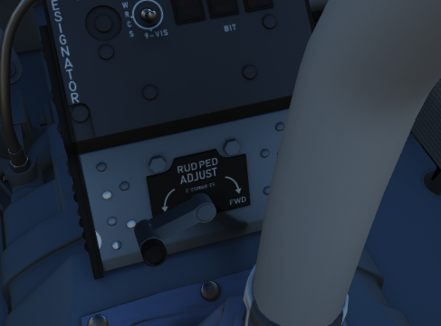
  
  
Used to adjust ergonomic position of the rudder pedals forward or back from the WSO.

Requires 12 full turns to move the pedals across the entire range.

.. _wrightsub:

WSO Right Subpanel
==================

Eject Light/Switch
------------------

.. image:: images/wso_eject_light.png

Pressed by the WSO in an emergency condition requiring ejection from the aircraft,
which illuminates the EJECT lamp in the front cockpit warning the Pilot to prepare for immediate ejection.

Also lights up when the Pilot presses their respective Eject Light to warn the WSO for ejection.

KY-28 Controls
------------------

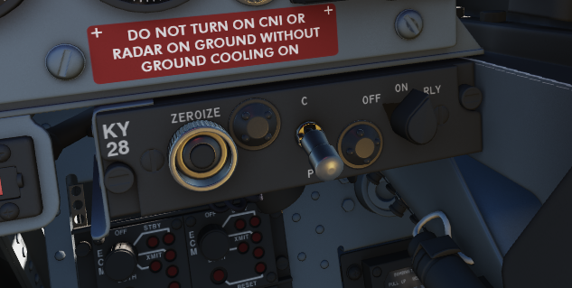

Controls for the KY-28 encryption system.

ECM Controls
------------------

.. image:: images/ecm.png

Controls for the electronic countermeasurement and jamming system.

Bomb Release Angle Computer
---------------------------

Used to enter in the required angle values for ARBCS/LABS bombing modes; the Low Angle control may be set from 0 to 89.9 degrees, and the High Angle control may be set from 70 to 179.9 degrees.

Bombing Timers
--------------

Entry of applicable timing for pullup signal or release are performed with the Bombing Timers.  The Pullup timer may be set from 0 to 60 seconds, and the Release timer may be set from 0 to 30 seconds.  Minimum increment for each timer is 0.1 seconds. 

.. _wrightcon:

WSO Right Console
=================

Laser Coder Control
-------------------

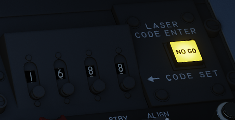

The WSO can set the laser code used by the targeting pod by using the four small push-buttons on this panel.

Code Buttons
^^^^^^^^^^^^

Each press will advance the corresponding digit by one.

Codes directly relate to lasers frequencies, resulting in them having to be between 1111 and 1788 and
not use digits 0 or 9 in order to be valid.

Enter Button
^^^^^^^^^^^^

Once a code has been set, it can be transferred to the Pave Spike by pressing the ENTER button to the right.

When power is applied to the system, it automatically initiates a transfer of the currently set code.

No Go Lamp
^^^^^^^^^^

Validation of an entered code takes about 5 seconds. If the NO-GO lamp is lit, the code is invalid.

Inertial Navigation Control Panel
---------------------------------

The Inertial Navigation Control Panel provides the rear pilot mode selection and system alignment command selection.
Mode selector positions are 

+---------+---------------------------------------------------------------------------+
| OFF     | System off.                                                               |
+---------+---------------------------------------------------------------------------+
| STBY    | Standby- power is applied to the heaters and climate control system,      |   
|         |                                                                           |
|         | and initiates Coarse alignment if GYRO COMP not selected on the toggle.   | 
+---------+---------------------------------------------------------------------------+
| ALIGN   | Performs fine platform and gyro leveling, then, depending on aircrew      |
|         |                                                                           |
|         | selection, performs Rapid or Gyrocompassing (Fine) Alignment.             |
+---------+---------------------------------------------------------------------------+ 
| NAV	  | Activates the INS for navigation function, performance of which is based  |
|         |                                                                           |
|         | on Rapid or Gyrocompass alignment.                                        |
+---------+---------------------------------------------------------------------------+

HEAT Lamp
^^^^^^^^^

The HEAT lamp illuminates when the system is placed into STBY mode, and remains illuminated for 110 seconds after the gyros have reached operating temperature.  The system will not align if switched out of STBY before this lamp has shut off.

ALIGN Lamp
^^^^^^^^^^

The ALIGN lamp provides current INS alignment through illuminating steady (BATH or HDG MEM alignment complete), or flashing at the completion of GYRO COMP alignment.  

Weapon Delivery Panel
---------------------

ACTIVATE Switch
^^^^^^^^^^^^^^^

Only available after the Target Insert button is pressed, placing the switch to ON provides power to the weapon release computer's circuits for a LABS release using the WRCS release range data. 

TGT FIND Switch
^^^^^^^^^^^^^^^

Used to combine the delivery functionalty of the ARBCS/LABS system with the WRCS TGT FIND mode.  NORM is selected for the standard function of the WRCS without LABS delivery capabiliby.  Selecting HOLD and an ARBCS setting from the pilot's Delivery Mode Knob provides WRCS Target Offset search capability, and the attack is completed using the normal ARBCS procedures from the IP. 

RANGE Switch
^^^^^^^^^^^^

Selecting x100 changes the release range multiplier on the WRCS panel to a factor of 100; in NORM, the standard factor of 10 is applied to the release range. 

Weapon Release Computer Set (WRCS) Panel
----------------------------------------

Target Distance Controls
^^^^^^^^^^^^^^^^^^^^^^^^

A pair of four position drum roller windows with matching analog knobs.  The top window references distances in the North-South orientation (with the first roller marked N/S), and the lower window references distances in the East-West orientation (with the first roller marked E/W).  

The rollers reference the distance shown in increments of 100 feet, thus a distance of offset in the East direction for 4000' would be entered as E0040. 

The rollers do function in an analog fashion, thus fractions of 100' can be attained by moderating the last roller accordingly; as an example, a value of 250 feet would be attained with the space between the 2 and 3 value halfway in the window in the last digit position.  

Target/IP Altitude Control
^^^^^^^^^^^^^^^^^^^^^^^^^^

A three position drum roller window with matching analog knob used to enter the altitude of either the RIP or the actual target itself, and is referenced in increments of 100'.  Fractional values can be entered as described previously.  This value can be changed once RIP or VIP is properly defined to increase release system accuracy.

Drag Coefficient Control
^^^^^^^^^^^^^^^^^^^^^^^^

Used to enter the drag coefficient value for the weapon being used from the bombing tables for the intended release mode.  This is not the stores table reference drag number.

Release Advance Control
^^^^^^^^^^^^^^^^^^^^^^^

Used to advance the release signal given from the WRCS to the fire control system relative to the WRCS target point, in any duration from 0 to 999 miliseconds.  Also functions in conjunction with ARBCS/LABS programmed release timing.

Release Range Control
^^^^^^^^^^^^^^^^^^^^^

Used to manually set bomb range in accordance with the weapon's bomb release schedule entry in the bomb tables. 

NO GO/GO Lamps
^^^^^^^^^^^^^^

Provides results of the WRCS BIT tests for the selected WRCS delivery mode.  Illumination of NO GO when not in a BIT test cycle reports an INS system failure. 

WRCS BIT Knob
^^^^^^^^^^^^^

A six position knob utilized to perform BIT checks against the individual WRCS delivery modes.  The BIT check is performed by selecting the desired mode for testing, pressing the knob for five seconds, then pressing the Freeze button on the Cursor Control Panel while keeping the BIT knob held down to confirm function. The result will illuminate in the NO GO/GO placard.

Volume Panel
------------

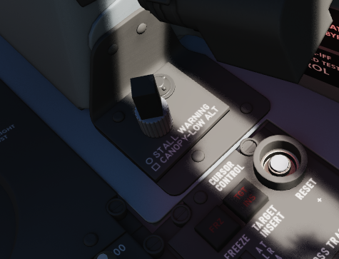

A small panel to the right of the antenna hand control stick contains two combined knobs to control volume.

Canopy/Low Altitude Warning
^^^^^^^^^^^^^^^^^^^^^^^^^^^

Sets audio level for canopy open and low altitude voice warnings.

This system is not installed on this variant of the F-4E.

Stall Warning
^^^^^^^^^^^^^

The Stall Warning knob controls the volume of the AoA tones that play when flying at certain angles.

Under certain conditions, the system can override the volume to ensure the cue is always audible in
dangerous situations.

Cursor Control Panel
--------------------

Used for WRCS radar bombing mode target entry.  Funtions only with MAP-PPI mode selected and applicable bombing mode selected on the Delivery Mode Knob.

Freeze Button
^^^^^^^^^^^^^

Used in air to ground bombing with the WRCS to initiate velocity tracking of the aircraft from the INS, as well as maintain a hold of the target position defined by the Along Track and Cross Track cursor gates, thus defining the RIP (Radar Initial Point).  The button illuminates, and remains lit, until the reset button is pressed, or another delivery mode is selected.

Target Insert Button
^^^^^^^^^^^^^^^^^^^^

Inserts the North-South and East-West offset values entered into the WRCS control panel into the WRCS computer, performing the offset against the RIP defined by the Along Track and Cross Track cursor gates and currently tracked with the Freeze Button.  This offset inclusion performs a shift of the Along Track and Cross Track cursors to define the actual target defined by the WRCS offsets on the radar scope.  This action initiates target steering information from the WRCS to the navigational displays.

Reset Button
^^^^^^^^^^^^

Pressing the Reset Button drops the currently tracked ground target location from WRCS computer memory, returns the Along and Cross Track cursors to their default positions, and resets the velocity tracking system values to zero. 

Along Track Wheel
^^^^^^^^^^^^^^^^^

Used to define relative range of the aircraft to the RIP, using an expanding/contracting hemisphere cursor on the radar display. This hemisphere presents true range to the target via the hemispherical PPI projection, thus allowing the RIP to be detected in an offset approach to the target.  Close approximation of range to the RIP should be prepared first with the Along Track wheel prior to using the Cross Track Wheel for best system accuracy- ie, the cursor should be placed below the intended RIP return on the radar scope, and the Cross Track wheel brought to the return point. 

Cross Track Wheel
^^^^^^^^^^^^^^^^^
Used to define the heading to the RIP on the radar display in PPI mode, presented as a vertical line.  The intersection of the Along Track and Cross Track cursors defines the RIP when the Freeze button is pressed.

Nuclear Stores Consent Switch
-----------------------------

Used to arm nuclear stores. In the SAFE position, release is inhibited. REL allows releasing stores unarmed, while REL/ARM allows dropping nuclear stores armed.

Aft Cockpit Lighting Control Panel
----------------------------------

.. image:: images/wso_cockpit_lighting_panel.png

The Cockpit Lighting Control Panel provides control of all panel edge lighting, flight instrument panel
lighting, the console floodlights, the white floodlights found under the canopy sill over each console,
and also includes the Warning Light Test and Standby Compass Light switch.

The White Floodlight switch acts independent of all other controls on the panel, and is either ON or OFF.
It activates a separate emergency floodlight (also called Thunderstorm Light) that illuminates the cockpit
in white. The lamp is energized through the Battery Bus to ensure it is always operational,
even in case of total power loss. Do not forget to turn off the light before parking the aircraft for a
longer time, as it will otherwise drain the battery.

The Flight Instrument Light Knob (marked INSTR PANEL), when moved to the right of the OFF detent,
controls illumination of the following six instrument lights in unison: 

* Airspeed/Mach Indicator
* Attitude Director Indicator
* Angle of Attack Indicator
* Vertical Velocity Indicator
* Altimeter
* Horizontal Situation Indicator

When in the OFF position, these indicators are independently controlled for illumation by the
knobs on the Flight Instrument Lights Intensity Panel.

The Indexer Lights brightness knob controls relative illumination of the AoA indexers on both sides of the windscreen.
Marked positions are DIM and BRT (bright), with highest level to the right of the knob.

The Console Light Control Knob, with range from OFF to BRT, controls illumination level for all
panel edge lighting and the console floodlights.

The console floodlights (CONSOLE FLOOD) are triggered independently of the knob when it is
placed to the right of the OFF detent position, and offer three settings- DIM, MED, or BRT.
The floodlights will remain on until the Console Light Control knob is returned to the OFF position,
and the floodlight switch is placed in DIM. All three positions are powered by different buses to
ensure maximal availability:

+--------+-----------------------+
| Bright | Essential 28V DC Bus  |
+--------+-----------------------+
| Medium | Left Main 14V AC Bus  |
+--------+-----------------------+
| Dim    | Left Main 115V AC Bus |
+--------+-----------------------+

The Warning Light Test Switch if set to the TEST position, confirms function of the various emergency indicators in the cockpit.

The STBY COMP switch illuminates the light for the Standby Compass.

Right Wall
----------

.. image:: images/wso_right_wall.png

Battery Bypass
^^^^^^^^^^^^^^

Autopilot Ground Test
^^^^^^^^^^^^^^^^^^^^^

Instrument Ground Power
^^^^^^^^^^^^^^^^^^^^^^^

When connected to external ground power, activating this switch allows the ground power to also energize the buses.

Skyspot Mode
^^^^^^^^^^^^

This switch would allow to select the mode of the Combat Skyspot system used for ground-directed bombing.

The system was never installed on this variant of the F-4E.

Seat Position
-------------

.. image:: images/wso_seat_switch.png

The vertical position of the seat can be changed in either direction for about 5cm
using this springloaded switch.

Operation of the motor must be limited to 30 seconds within 10 minutes to prevent it from
overheating and breaking.
