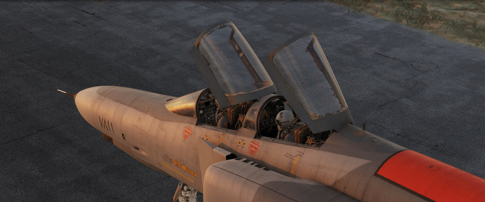

# Cockpit Overview

Greetings, _phabulous_ Crewmen! Get ready for an in-depth look into the cockpit
of the F-4E Phantom II by Heatblur.

The following chapter gives a detailed overview of the pilot's cockpit, as well
as the Weapons Systems Officer (WSO) Pit. Each single switch will be outlined
and explained briefly, while giving context to the functions.

More in-depth details on the various systems and consequences of using a switch
beyond their brief explanation are available in the
[3. Systems Overview Chapter](../systems/overview.md).

_"Step right up there and take a look.
We got all kinds of amenities on these babies."_
