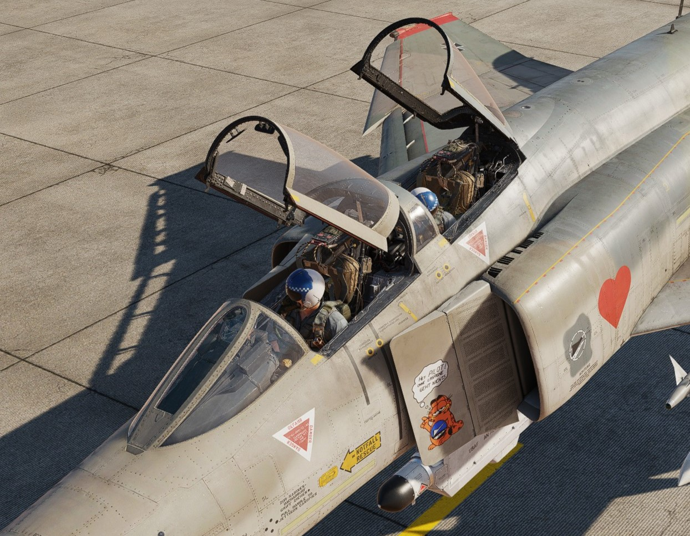

# Cockpit Overview

Greetings, phaboulus Crewman! Get ready for an in-depth look into the cockpit of the F-4E Phantom II
by Heatblur.

In the following chapter you will find a short overview of the Pilots cockpit as well
as the Weapons Systems Officer (WSO) Pit.

A more detailed System Overview is available in
the [Systems Overview Chapter](../systems/overview.md).
