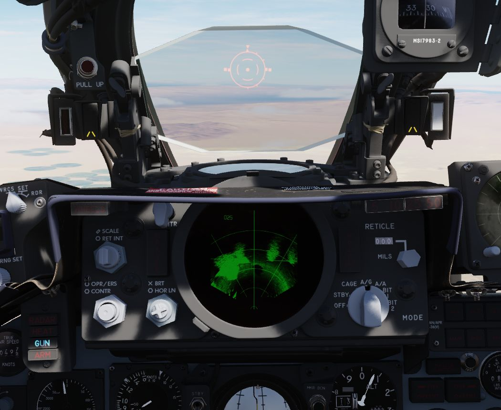
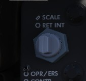
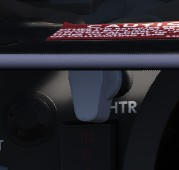
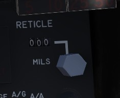
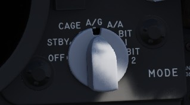
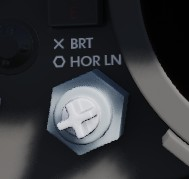

# DSCG Controls

The Digital Scan Converter Group (DSCG) enabled the F-4E the capability to
use [AGM-65 Maverick](../../stores/air_to_ground/missiles/maverick.md)
air-to-ground missile. The DSCG replaced the Direct View Storage Tube radar scopes which could not
interact with the digital interfaces of
the [AGM-65 Maverick](../../stores/air_to_ground/missiles/maverick.md).

## Reticle Intensity/Scale Knob

| Name    | Description                                                  |
|---------|--------------------------------------------------------------|
| RET INT | Controls the brightness of the gun reticle.                  |
| SCALE   | Controls the scale light intensity of the front radar scope. |

## Sight Shutter Lever

Changes the optical sight light source to prevent damage to the optics from high
sunlight. Is used after [landing](../../procedures/landing/checklists.md#after-landing) to prevent damage to
the sight.

## Reticle Depression Knob

Controls manual depression in 1 mil increments from 0 to 245. The manual depression is used for
[direct delivery bombing](../../procedures/bombs/bombs_direct_delivery.md) and delivery of
the [AGM-65 Maverick](../../stores/air_to_ground/missiles/maverick.md).

## Sight Mode Knob

Selects the mode of operation for the gun-sight.

| Name  | Description                                                                                                                                                           |
|-------|-----------------------------------------------------------------------------------------------------------------------------------------------------------------------|
| OFF   | Turns the system off.                                                                                                                                                 |
| STBY  | Warms up the system. Reticle remains off.                                                                                                                             |
| CAGE  | Reticle is displayed and caged at the radar boresight line (RBL). This is used for [takeoff](../../procedures/takeoff/takeoff.md) and [landing](../../procedures/landing/landing.md). |
| A/G   | Selects air to ground mode. Manual set depression is referenced from the fuselage reference line (FRL).                                                               |
| A/A   | Selects air to air lead computing mode. Position is set by the gyro, range, and CADC, and can be caged.                                                               |
| BIT 1 | System self test mode 1.                                                                                                                                              |
| BIT 2 | System self test mode 2.                                                                                                                                              |

## OPR ERS/Contrast Knob

Two function (pushbutton inside of knob) control of the front scope display.

| Name    | Description                                                                            |
|---------|----------------------------------------------------------------------------------------|
| OPR/ERS | Button activates or erases display in aircraft with DVST. No function with DSCG scope. |
| CONTR   | Controls the displayed video/background contrast on the front scope.                   |

## Brightness Knob/Horizon Line Knob

Dual knob control of the front scope display settings.

| Name   | Description                                                           |
|--------|-----------------------------------------------------------------------|
| BRT    | Controls relative brightness of the front scope display.              |
| HOR LN | Adjusts relative horizon line shown on radar scopes in both cockpits. |

## INT Tab

The INT tab rotates around the display to alter the relative darkness of the
radar display, permitting the pilot to adjust the scope relative to ambient
light. With the INT tab a polarization filter is rotated over the scope.

## Red Tab

The red tab is rotated to provide a red scope display for night flying.

## In Range Light

The IN RANGE light illuminates to alert the pilot that the current locked target
is within range parameters.

## Hold Altitude Light

The HOLD ALT light illuminates as an instruction to the pilot from the fire
control system to maintain current altitude to assist in a snap-up intercept
situation against a target above the fighter. The predicates are:

- A range greater than the weapon can make,
- Altitude in excess than 32,000 feet, and
- The locked target is greater than 8,000 feet above the fighter.

When the HOLD ALT light is on, the fighter should be flown to center the
steering dot relative to azimuth of the ASE circle. When the HOLD ALT light
turns off, the fighter should then snap up in pitch to fully center the steering
dot in the ASE circle.

## Wheels Light

The WHEELS lamp illuminates when the aircraft slows below flaps blow-up speed
(roughly 230 knots, dependent on altitude)
with [the gear](../../systems/flight_controls_gear/gear_ground_handling.md) still raised. This
serves as an indicator to
lower [the gear.](../../systems/flight_controls_gear/gear_ground_handling.md)

## Range Lights

The Range Lights illuminate relative to range settings selected by the WSO.
Range is provided in the upper right corner of the DSCG scope.
