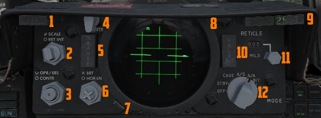
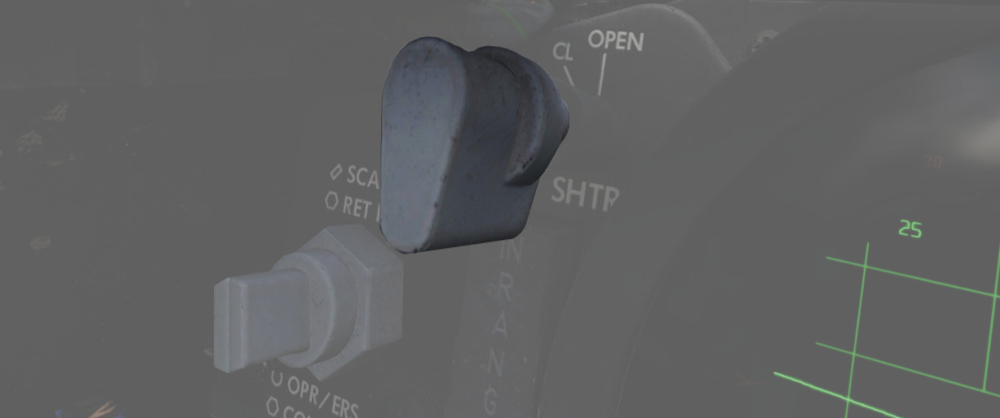
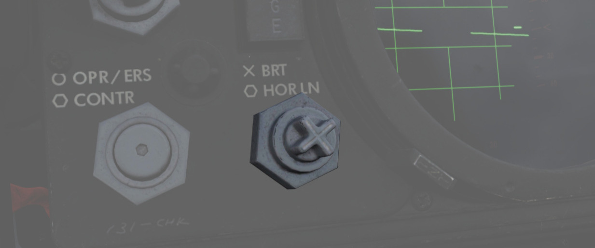
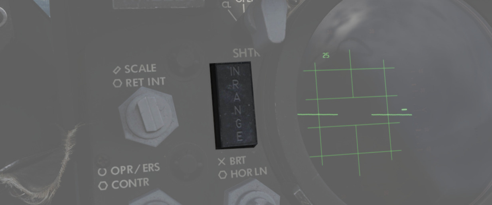

# DSCG 控制开关/按钮

数字扫描转换器组（DSCG）是指用于显示雷达数据和电视武器或瞄准吊舱视频信号的屏幕。
DSCG 取代了无法与数字接口互动的直视存储管雷达屏幕。

## 准星亮度/标度旋钮

| 名称    | 描述                                     |
| ------- | ---------------------------------------- |
| RET INT | 航炮准星亮度的控制旋钮。                 |
| SCALE   | 控制位于前雷达屏幕边缘的距离标度的亮度。 |

## 瞄准具光栅手柄

改变光学瞄准镜的光源，防止强光对光学器件造成损坏。用于在
[着陆后](../../procedures/landing/checklists.md#after-landing) 停放时防止瞄准具
受损。

## 准星下压旋钮

以 1 密位为单位调整手动下压量，调整区间在 0 到 245 密位。手动下压用于在
[直接投放轰炸](../../procedures/bombs/bombs_direct_delivery.md) 以及投放
[AGM-65 “幼畜”](../../stores/air_to_ground/missiles/maverick.md) 时使用。

## 瞄准具模式旋钮

选择航炮瞄准具的工作模式。

| 名称  | 描述                                                                                                                                        |
| ----- | ------------------------------------------------------------------------------------------------------------------------------------------- |
| OFF   | 关闭系统。                                                                                                                                  |
| STBY  | 预热系统，准星保持关闭。                                                                                                                    |
| CAGE  | 显示准许并锁定在雷达瞄准轴（RBL）处。用于 [起飞](../../procedures/takeoff/takeoff.md) 和 [着陆](../../procedures/landing/landing.md) 作业。 |
| A/G   | 选择空对地模式。相对机身基准线手动设置下压。                                                                                                |
| A/A   | 选择空对空计算提前角模式。位置由陀螺仪、距离和 CADC 设置，可以锁定位置。                                                                    |
| BIT 1 | 系统自检 [模式 1](../../procedures/bit_tests/optical_sight.md) 。                                                                           |
| BIT 2 | 系统自检 [模式 2](../../procedures/bit_tests/optical_sight.md) 。                                                                           |

## OPR ERS/对比度旋钮

双功能控制旋钮（旋钮内侧为按钮），用来控制前显显示。

| 名称    | 描述                                                |
| ------- | --------------------------------------------------- |
| OPR/ERS | DVST 机型中按钮激活或擦除显示。 DSCG 机型中无功能。 |
| CONTR   | 控制前显显示视频/背景的对比度。                     |

## 亮度旋钮/地平线旋钮

用来控制前显设置的双旋钮。

| 名称   | 描述                                   |
| ------ | -------------------------------------- |
| BRT    | 控制前显的相对亮度。                   |
| HOR LN | 调整两个驾驶舱中雷达显示的相对地平线。 |

## INT 标签

INT 标签围绕显示屏旋转，以改变雷达显示的相对暗度，使飞行员能够根据环境光线调整显
示。使用 INT 标签来使偏振滤光片在雷达显示上转动。

## 红标签

转动红标签来调整雷达显示红度，用于夜间飞行。

## 射程内灯

IN RANGE 指示灯亮起提示飞行员当前锁定的目标在射程参数内。

## 保持高度灯

HOLD ALT 指示灯亮起用于火控系统指示飞行员保持当前高度来辅助使用“snap-up”方式拦截
上方的目标。前提：

- 距离超出武器射程，
- 高度超过 32000 英尺并且
- 锁定的目标高出本机 8000 英尺。

在 HOLD ALT 指示灯亮起时，战机应当向在 ASE 圆环水平方位上移动的转向小点飞行。
HOLD ALT 熄灭后，应接着快速向上爬升并向转向小点飞行。 详见
[3.10 雷达系统](../../systems/radar/overview.md) 。

## 起落架指示灯

WHEELS 灯在飞机低于襟翼被吹上空速，且
[起落架](../../systems/flight_controls_gear/gear_ground_handling.md) 未放下时亮
起（约 230 节，视高度而定）这种情况下，系统将假设飞行员想要着陆，灯光将亮起表示
建议放下起落架。

## 距离灯

距离灯根据 WSO 的距离设置亮起。距离将在 DSCG 显示的右上角处亮起。
