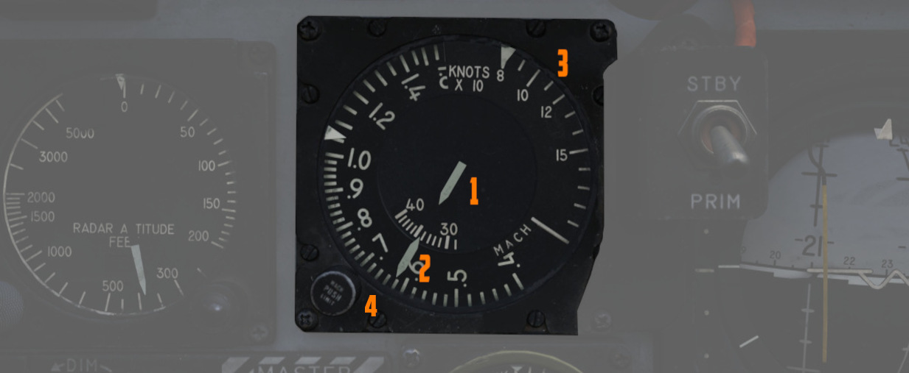
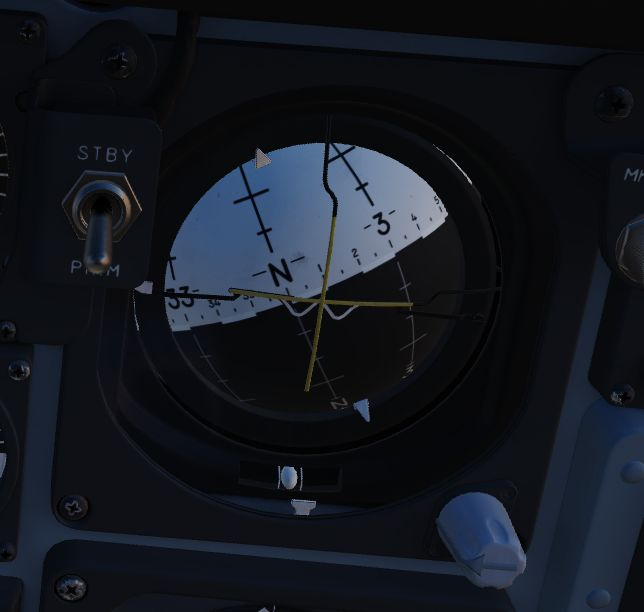

# Flight Director Group

The flight director group provides the pilot with all necessary instruments to fly the aircraft even
in a bad weather situation.

## Radar Altimeter

Terrain relative accurate height information up to 5000 ft, functions to 30
degrees of bank angle or 35 degrees of pitch. Clockwise rotation of the function
control switch on the lower left of the indicator powers the device; continued
rotation sets the low altitude warning pointer to the desired height. Below the
set altitude, the warning light on the lower right activates.
A self-test, initiated by pressing the function control switch, shows 35ft.

## Airspeed and Mach Indicator

The combination airspeed and mach number indicator shows airspeed readings below
200 knots, and include Mach numbers on the outer ring at high speed. The indicator uses a single
pointer over a fixed airspeed scale, marked from 80 to 850 knots, with a moving
Mach scale presenting from Mach 0.4 to 2.5. A pair of movable reference markers
is available with the knob on the face of the gauge, with speed reference
available between 80 and 195 knots, and the Mach index pointer being able to be
set between the 225 knot and 850 knot regions relative to the airspeed gauge. The 1 needle and the
inner ring refers to the airspeed in knots. The 2 needle and the respective outer ring refers to the
Mach scale. Both move along dynamically according to the Airspeed. The 3 area refers to the airspeed
scale before the mach scale starts.

## Angle of Attack Indicator

Drawing relative wind information from the landing-gear
adjacent [AoA](../../systems/flight_controls_gear/flight_controls.md#angle-of-attack-system) probe,
the
[AoA](../../systems/flight_controls_gear/flight_controls.md#angle-of-attack-system) indicator offers
conditional reference for cruise (7.9 units), approach
(19.2 units), and stall (30 units). Because of
the [AoA](../../systems/flight_controls_gear/flight_controls.md#angle-of-attack-system) probe to the
nose gear door
and subsequent airflow disturbance when the gear is lowered, actual
aircraft [AoA](../../systems/flight_controls_gear/flight_controls.md#angle-of-attack-system)
is approximately 1 unit higher than indicated, and ON
SPEED [AoA](../../systems/flight_controls_gear/flight_controls.md#angle-of-attack-system) is roughly
5
knots slower than the given value.

When indicator power is offline due to electrical system configuration or
damage, an OFF flag will appear in the window on the face of the gauge. The AoA indicator contais
switches that light the indexer lights and actuate the stall warning vibrator.

## Reference System Selector Switch

Toggles between the [inertial navigation set](../../systems/nav_com/ins.md)
and [AN/AJB-7](../../systems/weapon_systems/arbcs.md) displacement gyroscope
for attitude information. When set to PRIM, the inertial navigation set provides
azimuth and attitude data to the ADI; when on
STBY, [AN/AJB-7](../../systems/weapon_systems/arbcs.md) supplies this
information. Azimuth data also feeds into the HSI
and [BDHI](../wso/upfront_indicators.md#bearing-distance-heading-indicator-bdhi) (rear cockpit).
Additionally, attitude details are sent to the fire control system.

> 💡 Inertial information requires the inertial navigator control panel's
> switch to be on NAV.

When transitioning between STBY and PRIM, immediate attitude information may
show unusual gyrations on the attitude director indicator due to initial
erection. Rapid turns (above 15° per minute) may temporarily disrupt accurate
heading information, requiring straight and level flight for about 20 seconds
for manual compass system synchronization (SYNC position)

## Attitude Director Indicator

Includes an attitude sphere, turn indicator, steering bars, miniature aircraft,
glide-slope pointer, flags, and pitch trim knob. It displays pitch, bank, and
heading from the selected reference system and allows pitch adjustment via the
trim knob. The turn indicator relies on a gyro from
the [AN/AJB-7 system.](../../systems/weapon_systems/arbcs.md) The
steering bars offer Flight Director guidance for heading interception,
navigation, and [ILS](../../systems/nav_com/vor_ils.md) approaches. The glide-slope pointer provides
vertical guidance information during an [ILS](../../systems/nav_com/vor_ils.md) approach.

## Marker Beacon Lamp

This lamp illuminates whenever flying over a marker beacon station,
provided the [VOR/ILS](../../systems/nav_com/vor_ils.md) system has been activated. Additionally,
an audio cue is played through the [intercom system.](../../systems/nav_com/intercom.md)

The lamp can be rotated to dim and pushed to test.

## Horizontal Situation Indicator

Presents a horizontal view of the navigation situation relative to the aircraft,
indicated by an aircraft symbol and a lubber line showing the current aircraft heading.
The movable elements of the instrument include:

- Compass Card: A rotating element, dependent on the AJB-7 heading input, displays a compass rose.
  It provides a reference for the aircraft's heading relative to magnetic north.
- Bearing Pointer: Indicates the magnetic bearing to a selected navigation aid (Nav Comp, VOR,
  TACAN, or ADF).
- Course Arrow and Deviation Indicator: The direction towards which the arrow points can be
  manually selected by the Course Knob in VOR/ILS and TAC modes (as seen on course rollers).
  In HDG mode, it indicates the aircraft's magnetic heading, and in NAV COMP mode, it points
  to the aircraft's magnetic ground track. The Deviation Indicator provides visual feedback
  on the aircraft's deviation from the selected course: it shows deviation from a TACAN course
  in TAC mode or deviation from a [VOR](../../systems/nav_com/vor_ils.md) radial in VOR/ILS mode
  when VOR is tuned, and deviation from an ILS localizer signal in VOR/ILS mode when ILS is tuned.
- To-From Indicator: Reveals whether the current course will lead towards or away from the tuned
  station, functioning with TACAN and VOR inputs.
- Heading Marker: It can be manually set to the desired heading to provide the Flight Director
  with steering signals in all modes except NAV COMP. In NAV COMP mode, it displays command
  steering towards the selected target, taking wind drift into account.
- Range Indicator: Shows the distance to the selected TACAN station or NAV COMP destination.
- Mode Indicator Lights: Indicate the active navigation mode:
    VOR: Indicates that the VOR/ILS mode is selected and a VOR frequency selected.
    ILS: Indicates that the VOR/ILS mode is selected and an ILS frequency selected.
    TAC: Shows that TACAN mode is active.
    NAV: Illuminates when the Navigation Computer mode is in use.
    MAN: Indicates that the Heading Mode is selected.
    UHF: Signifies that the ADF mode is active.
    TGT: Illuminates during specific radar offset bombing operations.

Consists of a rotating compass card, single and double bar bearing pointers
numbered 1 and 2 respectively, a range indicator, and a range warning flag.
Presents a top-down view of the currently programmed navigation. The Heading Set
knob (lower left) is available to input desired magnetic heading, and the
Course Set knob (lower right) is
used to enter [VOR](../../systems/nav_com/vor_ils.md) radial or inbound localizer course for
accurate deviation display.

## Altimeter

A counter-pointer style altimeter, with thousandths in the counter window and
100 foot increments around the face. The altimeter has an absolute range of
80,000 feet. The altimeter includes a barometric scale for setting local
pressure with the knob on the indicator. Works in either electric (normal
operation mode) or pneumatic (STBY) mode, switchable via a spring-loaded three
position switch labelled RESET and STBY. When held in RESET for more than 3 seconds the system will
be reset and moved out of STBY.

## Vertical Velocity Indicator

Provides rate of climb or descent via the static pressure system referenced in
thousands of feet per minute.

## Standby Attitude Indicator

The SAI functions independent of the Flight Director Group, providing reasonably
accurate readings (within six degrees) for 9 minutes if power to the system is
lost and the OFF flag is in view. Pitch markings are indicated every 5 degrees,
while roll markings are in gradations of 10 degrees. Roll is illustrated through
360 degrees, while pitch is limited by stops at 92 degrees in climb and 78
degrees in dive to prevent gimbal lock. The SAI can be unlocked by pressing the knob and trimmed
by turning it.

## Navigation Function Selector Panel

Controls display presentation on the ADI and HDI based on the selected values on
the two knobs; to the left is the Bearing/Distance Knob, and to the right the
Mode Selector Knob. The Bearing/Distance Knob determines the source of
navigation information for the HSI and ADI. The Mode Selector Knob provides
control over the presentation of various displayed information on the HSI and
ADI. The Mode Selector Knob includes an inset switch marked FD, for Flight
Director. This switch engages or deactivates the pitch and bank steering bars on
the ADI; the OFF position has the switch aligned vertically.

### Bearing/Distance Knob

| Name                                                                          | Description                                                                                                                                          |
|-------------------------------------------------------------------------------|------------------------------------------------------------------------------------------------------------------------------------------------------|
| [VOR](../../systems/nav_com/vor_ils.md)/[TAC](../../systems/nav_com/tacan.md) | Magnetic and relative bearing to [VOR](../../systems/nav_com/vor_ils.md) station and [TACAN](../../systems/nav_com/tacan.md) range displayed on HSI. |
| [TAC](../../systems/nav_com/tacan.md)                                         | Magnetic and relative bearing and range to [TACAN](../../systems/nav_com/tacan.md) station displayed on the HSI.                                     |
| ADF/[TAC](../../systems/nav_com/tacan.md)                                     | Magnetic and relative bearing to ADF station and [TACAN](../../systems/nav_com/tacan.md) range displayed on HSI.                                     |
| NAV COMP                                                                      | Magnetic and relative bearing and range provided from navigation computer (i.e. waypoints) on HSI.                                                   |

### Mode Selector Knob Display Functions

## VOR Lamp

Illuminates to indicate that the [VOR](../../systems/nav_com/vor_ils.md) system is ready and
receiving.

That is, a valid [VOR](../../systems/nav_com/vor_ils.md) frequency has been selected, a signal is
received and the navigation knobs have been turned to [VOR](../../systems/nav_com/vor_ils.md)
navigation.
