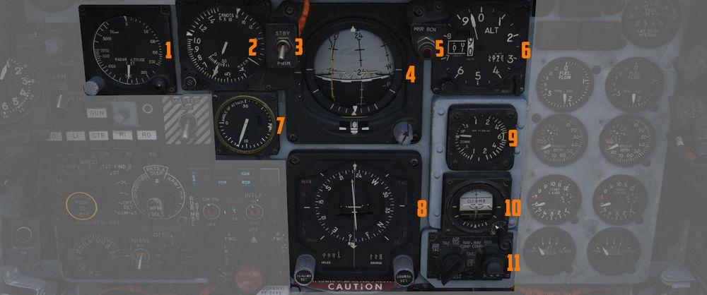
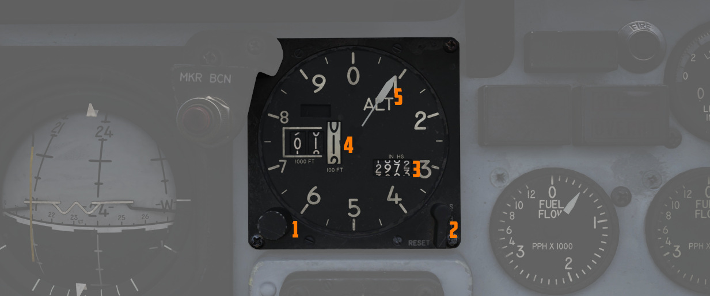
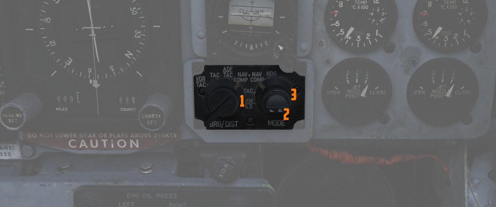

# 飞行指引指示器组

飞行指引指示器组可在全天候气象条件下为飞行员提供必要的仪表进行飞行。

## 雷达高度表

相对地形的精确高度信息最高可达 5000 英尺，功能区间在 30 度坡度或 35 度俯仰角。顺时针旋转仪表左下方
的功能控制开关可为设备通电；继续旋转可将低高度告警指针设置到所需高度。低于设定高度时，右下方的告警
灯会亮起。按下功能控制开关启动自检，仪表将显示 35 英尺。

## 空速马赫数表

空速马赫数表组合可显示 200 节以下的空速读数，并在高速飞行时在外圈显示马赫数。仪表在固定的空速刻度上
使用一个指针，刻度区间为 80 至 850 节，移动的马赫刻度区间为 0.4 至 2.5 马赫。仪表表面的旋钮上有一对
可移动的参考标记，空速参考区间为 80 至 195 节，马赫游标指针可在 225 节和 850 节之间进行设置。1 号指
针和内圈指的是以节为单位的空速。2 号指针和相应的外圈指的是马赫标度。两者均根据空速动态移动。3 区域
指的是马赫刻度开始显示之前的空速刻度。

## 迎角指示器

根据起落架旁 [迎角](../../systems/flight_controls_gear/flight_controls.md#angle-of-attack-system)
探头提供的相对风速信息
，[迎角](../../systems/flight_controls_gear/flight_controls.md#angle-of-attack-system) 指示器可为飞
行员提供巡航（7.9 个单位）、进近（19.2 个单位）和失速（30 个单位）条件参考。由
于[迎角](../../systems/flight_controls_gear/flight_controls.md#angle-of-attack-system) 探头位于前起
落架舱门上，起落架放下时气流会受到干扰，因此在给定值下，飞机的实际
[迎角](../../systems/flight_controls_gear/flight_controls.md#angle-of-attack-system) 比指示值高出约
1 个单位，最佳进近迎角比正常慢 5 节。 knots slower than the given value.

当指示器电源因电气系统配置或损坏而断开时，指示器表面的窗口中将显示 OFF 旗。迎角指示器包含开启分度器
灯和启动失速警告振动器的开关。

## 基准系统选择开关

在 [惯导套件](../../systems/nav_com/ins.md) 和 [AN/AJB-7](../../systems/weapon_systems/arbcs.md) 位
移陀螺之间切换选择姿态信息。设置到 PRIM 时，惯导套件为 ADI 提供方位和姿态数据。设置到 STBY 时，替换
为 [AN/AJB-7](../../systems/weapon_systems/arbcs.md) 提供信息。方位信息还将传输至 HSI 和
[BDHI](../wso/upfront_indicators.md#bearing-distance-heading-indicator-bdhi)（WSO 驾驶舱）。此外，
姿态详情将发送给火控系统。

> 💡 惯性信息需要将惯性导航控制面板的开关设置到 NAV 档位。

在 STBY 和 PRIM 档位之间转换时，由于起始起竖，姿态指引指示器上的即时姿态信息可能会显示不正常的回旋
。快速转弯（超过每分钟 15°）可能会精确航向信息暂时中断，需要直线和水平飞行约 20 秒，以手动同步罗盘
系统（SYNC 档位）。

## 姿态指引指示器

包括姿态球、转弯指示器、转向杆、微型飞机、下滑道指针、旗和俯仰调平旋钮。它可显示所选基准系统的俯仰
、坡度和航向，并可通过调平旋钮调整俯仰。转向指示器依赖
于[AN/AJB-7 系统](../../systems/weapon_systems/arbcs.md) 的陀螺仪。转向杆为飞行指引仪提供航向拦截、
导航和 [ILS] (../../systems/nav_com/vor_ils.md)进近引导。下滑道指针可在
[ILS](../../systems/nav_com/vor_ils.md) 进近时提供垂直引导信息。

## 标记信标灯

如果 [VOR/ILS](../../systems/nav_com/vor_ils.md) 系统已激活，则在飞越标记信标台时亮起。此外
，[内话系统](../../systems/nav_com/intercom.md) 还会播放音频提示

飞行员可转动旋钮来调光或按下按钮进行测试。

## 水平状态显示器

显示水平视角下飞机的导航状态，由飞机符号和显示当前飞机航向的准线指示。

### 旋钮

左下方的旋钮用于输入所需的磁航向，右下方的航线设置旋钮用于输入
[VOR](../../systems/nav_com/vor_ils.md) 径向或向台航向信标的航线，以便准确显示偏差。

### 罗盘卡片

转动元素，取决于 AJB-7 的航向输入，显示方位圈。

罗盘卡片用于显示飞机相对磁北的航向。

### 方位指针

指示到选定导航设备（导航部件、VOR、TACAN 或 ADF）的磁方位。

### 航线箭头和偏差指示器

在 VOR/ILS 和 TAC 模式下，可通过航线旋钮手动选择箭头指向的方向（如航线滚轮所示）。

在 HDG 模式下，箭头指示飞机的磁航向；在 NAV COMP 模式下，箭头指向飞机的磁地面航迹。

偏差指示器可向飞行员视觉反馈飞机是否偏离选定航向。在 TAC 模式下，指示器显示 TACAN 航线的偏差情况；
在 VOR/ILS 模式下，当调谐至 VOR 时，它显示 [VOR](../../systems/nav_com/vor_ils.md) 径向的偏差情况；
在 VOR/ILS 模式下，当调谐至 ILS 时，显示偏离 ILS 航向信标信号的情况。

### 向-背台指示器

显示当前航向是朝向或背离调谐台，与 TACAN 和 VOR 输入一起使用。

### 航向标记器

航向标记器可用来手动设置所需的航向，来在除 NAV COMP 模式外的其它所有模式下为飞行指引仪提供转向信号
。

在 NAV COMP 模式下，航向标记器将显示指向选定目标的转向指令，并将风漂考虑在内。

### 距离指示器

显示到所选 TACAN 台或 NAV COMP 目标的距离。

### 模式指示灯

指示当前激活的导航模式的灯光：

- VOR: 指示选定 VOR/ILS 模式并且已选定 VOR 频率。
- ILS: 指示选定 VOR/ILS 模式并且已选定 ILS 频率。
- TAC: 显示已激活 TACAN 模式。
- NAV: 在使用导航计算机模式时亮起。
- MAN: 指示选定航向模式。
- UHF: 表示已激活 ADF 模式。
- TGT: 在特殊雷达偏置轰炸工作时亮起。

## 高度表

计数器-指针式高度表，计数器窗口以千英尺以及 100 英尺单位显示高度。高度表的绝对测量上限为 80000 英尺
。高度表包括一个气压刻度，可通过仪表上的旋钮设置当地气压。高度表可在电动（正常工作模式）或气动
（STBY）模式下工作，飞行员可通过标有 RESET 和 STBY 的弹簧归中三档开关进行切换。将开关保持在 RESET（
复位） 3 秒以上，系统将被复位并从移出 STBY 状态。

## 垂直速度表

通过静压系统提供爬升或下降速度，单位为千英尺/分钟。

## 备用姿态仪

SAI 独立于飞行指引指示器组工作，在系统断电且看到 OFF 旗的情况下，可在 9 分钟内提供相当准确的读数（6
度以内）。俯仰标记每 5 度一个，而横滚标记则每 10 度一个。仪表可在 360 度内提供姿态指示，而俯仰则受
限于 92 度爬升和 78 度俯冲，以防止环架锁定。按下旋钮可解锁 SAI，旋转旋钮可对其进行微调。

## 导航功能选择面板

根据两个旋钮上的选定值控制 ADI 和 HSI 上显示的内容；左边是方位/距离旋钮，右边是模式选择旋钮。方位/
距离旋钮决定 HSI 和 ADI 的导航信息源。模式选择钮可控制 HSI 和 ADI 上显示的各种信息。模式选择旋钮中
含有一个标记为 FD 的嵌入式开关，该开关可接通或断开 ADI 上的俯仰和坡度转向杆；开关转至垂直时将处在
OFF 档位。

### 方位/距离旋钮

| 名称                                                                          | 描述                                                                                                              |
| ----------------------------------------------------------------------------- | ----------------------------------------------------------------------------------------------------------------- |
| [VOR](../../systems/nav_com/vor_ils.md)/[TAC](../../systems/nav_com/tacan.md) | HSI 显示[VOR](../../systems/nav_com/vor_ils.md) 台的及磁方位和 [TACAN](../../systems/nav_com/tacan.md) 台的距离。 |
| [TAC](../../systems/nav_com/tacan.md)                                         | HSI 显示[TACAN](../../systems/nav_com/tacan.md) 台的距离及磁方位。                                                |
| ADF/[TAC](../../systems/nav_com/tacan.md)                                     | HSI 显示 ADF 台的及磁方位以及[TACAN](../../systems/nav_com/tacan.md) 台的距离。                                   |
| NAV COMP                                                                      | HSI 显示由导航计算机提供的（例如航路点）方位和距离。                                                              |

### 模式选择旋钮显示功能

## VOR 灯

亮起时表示 [VOR](../../systems/nav_com/vor_ils.md) 系统准备完毕并正在接收信号。

这就是说，飞行员选定了有效的 [VOR](../../systems/nav_com/vor_ils.md) 频率、接收到信号并且导航旋钮转
动至了[VOR](../../systems/nav_com/vor_ils.md) 导航。
