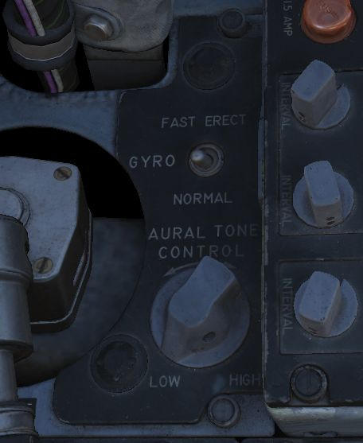

# Aft Section

The aft section of the left console has the [intercom](../../../systems/nav_com/intercom.md)
and [countermeasure](../../../systems/defensive_systems/countermeasures.md) controls.

## Boarding Steps Indicator

Used to visually confirm the state of the integrated boarding steps. With
the white post up, steps are stowed, whereas steps are deployed if post
is down and flush with the panel recess. The boarding steps and ladder are moved
by the [crew chief](../../../crew_chief/overview.md).

## Intercom System Control Panel

### Volume Control Knob

The volume control knob (<num>1</num>) is turned clockwise to increase audio between cockpits, and
counterclockwise to decrease the audio between the cockpits on
the [Intercom](../../../systems/nav_com/intercom.md).

### Amplifier Select Knob

The amplifier select knob (<num>2</num>) determines current amplifier
for [intercom](../../../systems/nav_com/intercom.md) function.

| Name | Description                                                                                                     |
|------|-----------------------------------------------------------------------------------------------------------------|
| B/U  | Backup headset amplifier provides audio.                                                                        |
| NORM | Primary headset amplifier provides audio.                                                                       |
| EMER | Uses the amplifier from opposite cockpit; all and only audio including radio received to that cockpit is heard. |

### Function Selector Switch

The function selector switch (<num>3</num>) has three positions:

| Name           | Description                                                                                                       |
|----------------|-------------------------------------------------------------------------------------------------------------------|
| COLD MIC       | Mic switch on throttle must be held to activate intercom.                                                         |
| HOT MIC        | Voice automatically transmitted on intercom.                                                                      |
| RADIO OVERRIDE | Voice automatically transmitted on intercom. All volumes but Shrike tone and Stall Warning are reduced in volume. |

## AN/ALE-40 Programmer

The panel features 6 knobs to
control [chaff and flare](../../../systems/defensive_systems/countermeasures.md#anale-40-countermeasures-system)
dispensing, as well as two lamps and a switch.

### Knobs

There are two important definitions to know when setting up the countermeasures:

* BURST - single dispense signal
* SALVO - group of bursts

Using the six knobs placed on the programmer you can adjust following parameters:

| Category    | Knob                    | Values                       | Description                      |
|-------------|-------------------------|------------------------------|----------------------------------|
| CHAFF BURST | COUNT (<num>4</num>)    | 1, 2, 3, 4, 6, 8             | quantity of bursts (per salvo)   |
|             | INTERVAL (<num>1</num>) | 0.1, 0.2, 0.3, 0.4           | time interval between each burst |
| CHAFF SALVO | COUNT   (<num>5</num>)  | 1, 2, 4, 8, C (continuous)   | number of salvos                 |
|             | INTERVAL (<num>2</num>) | 1, 2, 3, 4, 5, 8, R (random) | time interval between each salvo |
| FLARE BURST | COUNT (<num>6</num>)    | 1, 2, 4, 8, C (continuous)   | quantity of bursts               |
|             | INTERVAL (<num>3</num>) | 3, 4, 6, 8, 10               | time interval between each burst |

> 💡 All intervals are expressed in seconds.

### Flares Select Switch

The flares select switch (<num>9</num>) controls how countermeasures will be released when the
pilot presses the dispense button.

In the NORMAL setting, countermeasures are released according to the combined settings of the
[CCU](../../wso/left_console/center_section.md#anale-40-cockpit-control-unit-ccu) and the Programmer.

FLARES position allows the pilot to dispense a single flare with each dispense button press
regardless of CCU and Programmer settings.

### Power On Indicator Light

The power on indicator light (<num>7</num>) illuminates when either the Chaff or Flare mode knobs on
the [CCU](../../wso/left_console/center_section.md#anale-40-cockpit-control-unit-ccu)
is in any position other than OFF.

### Flares Indicator Light

The flares indicator light (<num>8</num>) illuminates when the [_Flares
Select_](../../../systems/defensive_systems/countermeasures.md#flares-select-switch) switch is in
the FLARES position.

## Gyro Fast Erect Switch

Selects gyro operation. FAST ERECT can be used momentarily to correct gyro deviations.

See [3.11.4. ARBCS](../../../systems/weapon_systems/arbcs.md#gyro-fast-erect) for details.

## Aural Tone Control

Knob to control the volume for weapon tones, such as the Sidewinder seeker head.

## Anti-G Suit Control Valve

The anti-G system delivers low-pressure auxiliary air to the anti-G suits, with air passing through
the anti-G suit control valve before reaching the suit. The suit remains deflated up to
approximately 1.5 G, and as G forces reach or exceed this level, air flows into the suit
proportionally. The suit stays inflated in relation to constant G forces and begins to deflate as G
forces decrease.

A manual inflation button in the anti-G suit control valve enables the crew to manually inflate
the suit for system checks or fatigue relief. A pressure relief valve within the system activates at
approximately 11 psi, serving as a safety backup in case of malfunction. The system operates
automatically whenever an engine is running, ensuring continuous support for the wearer during
varying G-force conditions.
