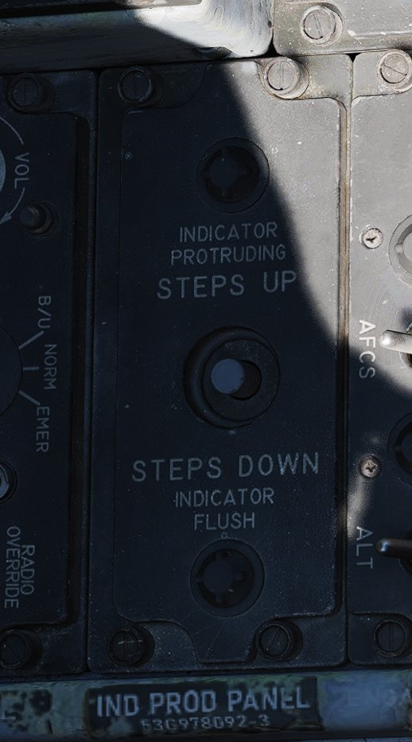

# Aft Section

## Boarding Steps Indicator

Used to visually confirm the integrated boarding steps state. With
the white post up, steps are stowed, whereas steps are deployed if post
is down and flush with panel recess. The boarding steps and ladder is moved by the ground crew menu.

## Intercom System Control Panel

### Pilot ICS Volume Control Knob

Turned clockwise to increase audio between cockpits, and counterclockwise to
decrease audio between cockpits on the intercom.

### Pilot ICS Function Selector Switch

| Name           | Description                                                                        |
|----------------|------------------------------------------------------------------------------------|
| COLD MIC       | Mic switch on throttle must be held to activate intercom.                          |
| HOT MIC        | Voice automatically transmitted on intercom.                                       |
| RADIO OVERRIDE | Intercom overrides incoming radio calls; does not override aircraft warning audio. |

### Pilot ICS Amplifier Select Knob

Determines current amplifier for intercom function.

| Name | Description                                                                  |
|------|------------------------------------------------------------------------------|
| B/U  | Backup headset amplifier provides audio.                                     |
| NORM | Primary headset amplifier provides audio.                                    |
| EMER | The opposite cockpit's audio is heard at its set volume using its amplifier. |

## AN/ALE-40 Programmer

### Chaff Burst Count

Selects the number of chaff burst commands per salvo; values of 1, 2, 3, 4, 6,
or 8 from left to right.

### Chaff Burst Interval

Selects the time interval of .1, .2, .3, or .4 seconds between each chaff burst
command.

### Chaff Salvo Count

Selects the number of salvos per dispense command, values of 1, 2, 4, 8, or
C (Continuous).

### Chaff Salvo Interval

Selects time interval between each salvo. Values of 1, 2, 3, 4, 5, 8, or a
R (Random) number of seconds.

### Flare Burst Count

Selects the quantity of flare burst commands per salvo. Values of 1, 2, 4, 8, or
C (Continuous).

### Flares Select Switch

Selects the time interval between each burst command. Values of 3, 4, 6, 8, or
10 seconds.

### Flares Indicator Light

Illuminates when the Flares select switch is in the Flares position and
indicates they can be dispensed, if flaps and speed brakes are retracted.

### Power On Indicator Light

Illuminates when the Flares select switch is in the Normal position and either
(or both) mode knobs are in any position other than OFF.

## Anti-G Suit Control Valve

The anti-G system delivers low-pressure auxiliary air to the anti-G suits, with air passing through
the anti-G suit control valve before reaching the suit. The suit remains deflated up to
approximately 1.5 G, and as G forces reach or exceed this level, air flows into the suit
proportionally. The suit stays inflated in relation to constant G forces and begins to deflate as G
forces decrease.

A manual inflation button in the anti-G suit control valve enables the crewman to manually inflate
the suit for system checks or fatigue relief. A pressure relief valve within the system activates at
approximately 11 psi, serving as a safety backup in case of malfunction. The system operates
automatically whenever an engine is running, ensuring continuous support for the wearer during
varying G-force conditions.
