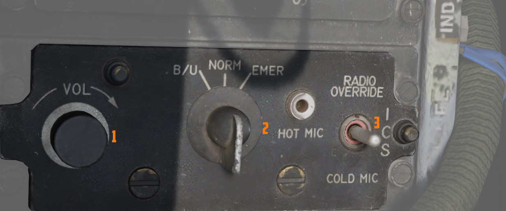

# 后部

左侧控制台后部包括 [内话](../../../systems/nav_com/intercom.md) 和
[对抗措施](../../../systems/defensive_systems/countermeasures.md) 的控制开关/按钮。

## 登机梯指示器

用于目视确认机载登机踏板的状态。白色柱子升起时，踏板处于收起状态，而如果柱子降低并与面板凹槽齐平，
则踏板处于放下状态。登机梯和踏板由 [机工长](../../../crew_chief/overview.md) 移动。

## 内话系统控制面板

### 音量控制旋钮

控制 [内话](../../../systems/nav_com/intercom.md) 系统的音量，顺时针转动来增加音量，逆时针转动来降
低音量。

### 功能选择开关

| 名称           | 描述                                                                       |
| -------------- | -------------------------------------------------------------------------- |
| COLD MIC       | 必须按住传声开关来激活内话。                                               |
| HOT MIC        | 自动在内话系统中传输话音。                                                 |
| RADIO OVERRIDE | 自动在内话系统中传输话音。除“百舌鸟”单音和失速警告音外的所有音量都将降低。 |

### 放大器选择旋钮

决定 [内话](../../../systems/nav_com/intercom.md) 系统所使用的放大器。

| 名称 | 描述                                                                           |
| ---- | ------------------------------------------------------------------------------ |
| B/U  | 备用头戴放大器来提供音频。                                                     |
| NORM | 主头戴放大器来提供音频。                                                       |
| EMER | 使用另一驾驶舱中的放大器；能够且只能听到另一驾驶舱收到的所有音频，包括无线电。 |

## AN/ALE-40 编程器

面板中有 6 枚旋钮用来控制
[箔条和红外干扰弹编程](../../../systems/defensive_systems/countermeasures.md#anale-40-programmer)
以及在其底下有两个灯光和一个用来布撒红外干扰弹的开关。

飞行员可通过编程来设置以齐射和连投布撒箔条。一次齐射由多次连投组成，一次连投将布撒多枚箔条。

### 箔条连投

**计数旋钮** 用来选择一次连投中箔条布撒的数量；从左到右数值分别为 1、2、3、4、6 或 8。

**间隔旋钮** 用来选择在两次连投之间的时间间隔，设置值为 .1、.2、.3 或 .4 秒。

### 箔条齐射

**计数旋钮** 选择齐射中存在几次连投，数值为 1、2、4、8 或 C（连续）。

在连续设置中，只要按住布撒按钮，程序就会重复执行。

**间隔旋钮** 用来选择在两次连投之间的时间间隔。设置值为 1、2、3、4、5、8 或 R（随机）值。

### 红外干扰弹连投

**计数旋钮** 用来选择一次连投中红外干扰弹布撒的数量；设置数值为 1、2、4、8 或 C（连续）。

在 C 档位时，只要按住布撒按钮，程序就会重复执行。

**间隔旋钮** 用来选择布撒两枚红外干扰弹之间的时间间隔，设置值为 3、4、6、8 或 10 秒。

### 红外干扰弹选择开关

控制飞行员按下布撒按钮时布撒的对抗措施。

在 NORMAL 档位下，将根据 WSO 在面板中的设置进行布撒。

FLARES 档位下，无论 WSO 所选对抗措施， 都允许飞行员布撒干扰弹。例如，这可用于对威胁做出快速反应。

### 红外干扰弹指示灯

当[_红外干扰弹选择_](../../../systems/defensive_systems/countermeasures.md#flares-select-switch) 开
关位于 Flares 档位时亮起，且如果
[襟翼和减速板](../../../systems/flight_controls_gear/flight_controls.md) 收起，则指示可以布撒红外干
扰弹。

### 通电指示灯

当 [_红外干扰弹选择_](../../../systems/defensive_systems/countermeasures.md#flares-select-switch)
开关位于 Normal 档位时，且 [WSO 驾驶舱](../../wso/overview.md) 中的任一（或两个）模式旋钮处在 OFF
外的任何档位时亮起。

## 抗荷服控制阀

抗荷系统向抗荷服提供低压辅助空气，空气在进入抗荷服之前将先通过抗荷服控制阀。当过载值达到或超过大约
1.5 G 水平时，空气会按比例流入抗荷服。在恒定 G 值的情况下，抗荷服保持充气状态，而当 G 值减小时，抗
荷服开始放气。

抗荷服控制阀上有一个手动充气按钮，机组可以手动为抗荷服充气，以便进行系统检查或缓解疲劳。作为出现故
障时的安全备份，抗荷服系统内的泄压阀在大约 11 psi 压力下启动。只要发动机运转，系统就会自动运行，确
保在不同的 G 值条件下为穿戴者持续提供支持。
