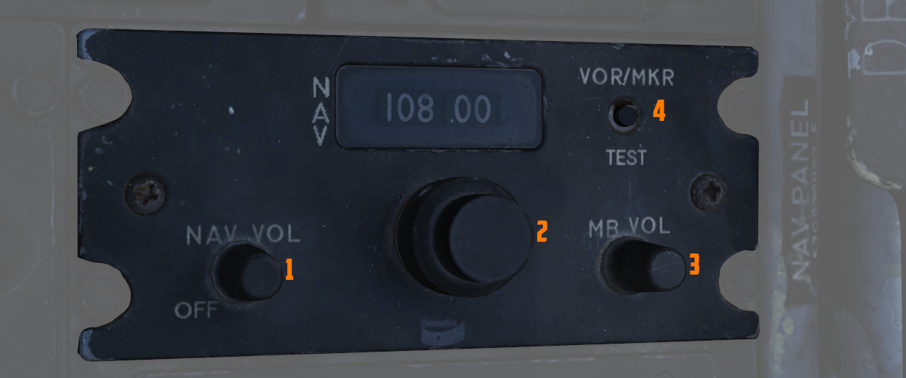
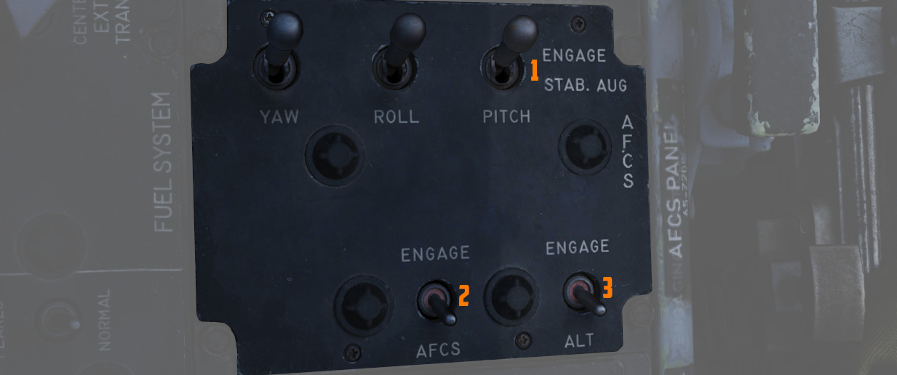

# Center Section

The center section of the left console
controls [fuel](../../../systems/engines_and_fuel_systems/fuel_system.md)
and [navigation](../../../systems/nav_com/overview.md) related settings.

## Fuel Control Panel

### Internal Wing Dump Switch

Two-position switch (<num>1</num>) which, when placed in DUMP, closes off the wing fuel cells
from transfer into the fuselage fuel cells and dumps fuel from the valves at the
wing fold trailing edge. Placing the switch back to the NORM position closes the
dump valves and reconnects the wing cells for transfer to the fuselage.

The entire fuel is dumped in roughly 15 minutes.

### Internal Wing Transfer Switch

A two-position switch (<num>2</num>) which controls the flow of wing cell stored fuel to the
fuselage fuel tanks; NORMAL permits transfer, whereas STOP TRANS ceases flow
from the wings to the fuselage feed tanks.

Transfer only occurs without weight on wheels, and if the internal tanks have
reached a certain fuel level already.

### Refueling Select Switch

This covered switch (<num>3</num>) determines which tanks will be refuelled during an air-to-air
refueling
cycle:
internal (INT ONLY) or all tanks (ALL).

### Air Refueling Switch

Two-position toggle switch (<num>4</num>) used for extending (EXTEND) and retracting (RETRACT)
the air-to-air refueling door. Placing the switch into EXTEND also illuminates the
air-to-air refueling receptacle lamp to assist the tanker boom operator.

If, during AAR, the boom disconnects and the DISENGAGED light illuminates, this
switch has to be flipped to RETRACT and back to EXTEND to reset the system and
allow the boom to connect again.

### External Transfer Switch

A three position toggle switch (<num>5</num>) determining which externally mounted tanks are
currently
transferring fuel to the fuselage tanks: CENTER (centerline tank), OFF (none),
or OUTBD (outboard wing tanks).

Transfer only occurs without weight on wheels, and if the internal tanks have
reached a certain fuel level already.

It is not possible to transfer from the wing tanks and external tanks at the
same time. If both are selected, the external tanks will take priority.

### Boost Pump Check Switches

A pair of two-position spring-loaded switches (<num>6</num>) is provided to confirm the function
of the fuel boost pumps. Can only be checked with the engine master switches
OFF. Holding either switch will energize the respective boost pump, thus showing
a positive pressure value on the fuel pressure indicator.

## VOR/ILS Control Panel

### Nav Vol Knob

The nav vol knob (<num>1</num>) controls the volume
of [the VOR/ILS audio system](../../../systems/nav_com/vor_ils.md) that indicates being tuned to the
desired frequency by repeating the Morse code identifier of the selected station.

Must be moved out of the full CCW position to provide power to [the VOR/ILS
system](../../../systems/nav_com/vor_ils.md).

### MB Vol Knob

The MB vol knob (<num>3</num>) controls the volume of the tone played when flying over
a [marker-beacon
transmitter](../../../systems/nav_com/vor_ils.md), for example on the final approach during landing.

### Frequency Knobs

A set of two knobs (<num>2</num>) for tuning the [VOR/ILS](../../../systems/nav_com/vor_ils.md)
frequency. The
outer knob controls the first three digits, while the inner knob sets the two decimal digits.

Valid frequencies range from 108.00 to 117.95 MHz.

### VOR/MKR Test

A button (<num>4</num>) to initiate a built-in test of the VOR system.
See [VOR/ILS Test](../../../procedures/bit_tests/navigation_tests.md#vorils-test) for details.

## AFCS Control Panel

### Stability Augmentation Channel Switches (Yaw/Roll/Pitch)

Three two-position switches (<num>1</num>) enable individual channels
of [stability augmentation](../../../systems/flight_controls_gear/flight_controls.md#automatic-flight-control-system-afcs---anasa-32)
for Yaw, Roll, and Pitch. ENGAGE (forward) sets the respective channel stability
augmentation on.

See [3.1.2 Flight Controls & AFCS](../../../systems/flight_controls_gear/flight_controls.md) for
further information.

### AFCS Mode Switch

The two position switch (<num>2</num>)
enables [AFCS](../../../systems/flight_controls_gear/flight_controls.md#auotmatic-flight-control-system-afcs)
mode, which can maintain and hold maneuvers and attitudes at up to ±70 degrees of pitch, 70
degrees of bank, and in all 360 degrees of azimuth. If engaged when the airplane is less than ± 5°
from wings level, then the airplane will maintain a **wings level attitude**,
and will hold the engaged **heading**. Deactivated by selecting the switch aft, or with
a rapid control input.

### Altitude Hold Switch

The two position switch (<num>3</num>) activates the altitude hold function of
the [AFCS](../../../systems/flight_controls_gear/flight_controls.md#auotmatic-flight-control-system-afcs)
which will maintain the current barometric altitude.
