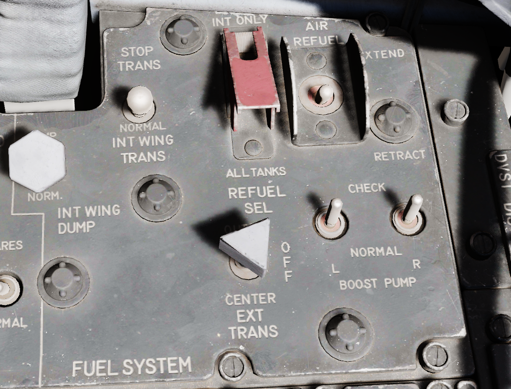
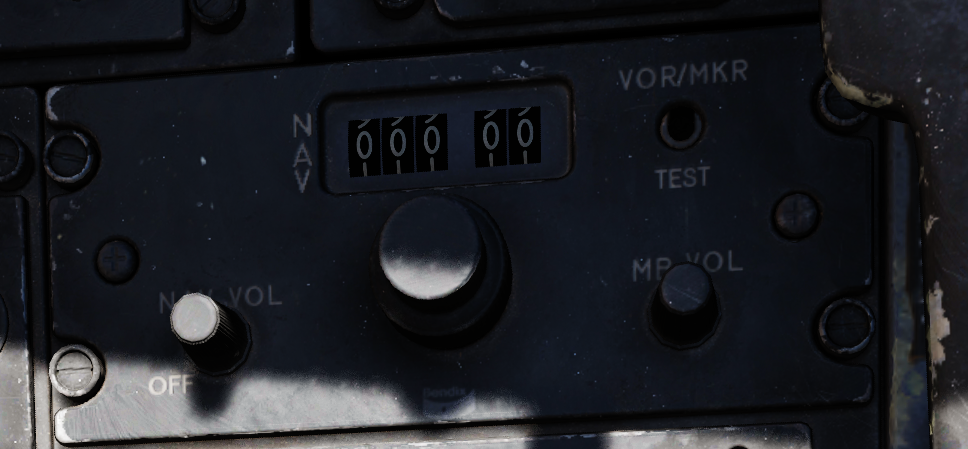
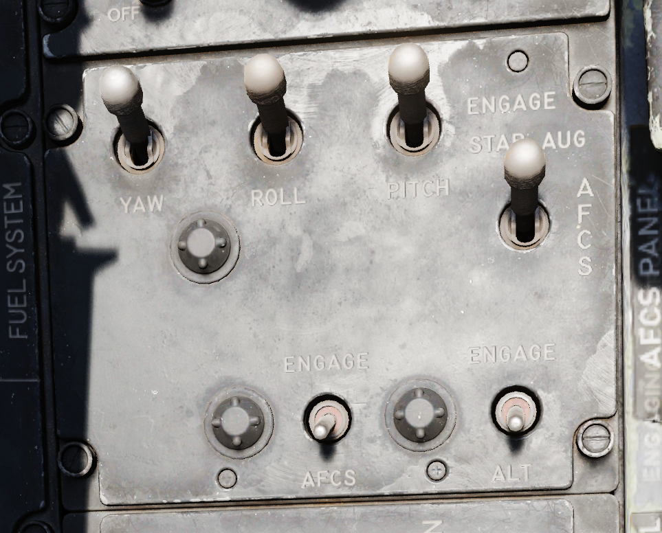

# Center Section

## Fuel Control Panel

### Internal Wing Dump Switch

Two position switch which, when placed in DUMP, closes off the wing fuel cells
from transfer into the fuselage fuel cells and dumps fuel from the valves at the
wing fold trailing edge. Placing the switch back to the NORM position closes the
dump vales and reconnects the wing cells for transfer to the fuselage.

The entire fuel is dumped in roughly 15 minutes.

### Internal Wing Transfer Switch

A two-position switch which controls flow of wing cell stored fuel to the
fuselage fuel tanks; NORMAL permits transfer, whereas STOP TRANS ceases flow
from the wings to the fuselage feed tanks.

Transfer only occurs without weight on wheels and if the internal tanks have
reached a certain fuel level already.

### Refueling Select Switch

Determines which tanks will be refuelled during an air to air refueling cycle:
internal (INT ONLY) or all tanks (ALL).

### External Transfer Switch

A three position toggle determining which externally mounted tanks are currently
transferring fuel to the fuselage tanks: CENTER (centerline tank), OFF (none),
or OUTBD (outboard wing tanks).

Transfer only occurs without weight on wheels and if the internal tanks have
reached a certain fuel level already.

It is not possible to transfer from the wing tanks and external tanks at the
same time. If both are selected, the external tanks will take priority.

### Air Refueling Switch

Two position toggle switch used for extending (EXTEND) and retracting (RETRACT)
the air to air refueling door. Placing the switch into EXTEND illuminates the
air to air refueling recepticle lamp to assist the tanker boom operator.

If, during AAR, the boom disconnects and the DISENGAGED light illuminates, this
switch has to be flipped to RETRACT and back to EXTEND to reset the system and
allow the boom to connect again.

### Boost Pump Check Switches

A pair of two position spring loaded switches are provided to confirm function
of the fuel boost pumps. Can only be checked with the engine master switches
OFF. Holding either switch will energize the respective boost pump, thus showing
a positive pressure value on the fuel pressure indicator.

## VOR/ILS Control Panel

### Nav Vol Knob

Controls the volume of the VOR/ILS audio system that indicates a positive return
by repeating the morse code of the selected station.

Must be moved out of the full CCW position to provide power to the VOR/ILS
system.

### MB Vol Knob

Controls the volume of the tone played when flying over a marker-beacon
transmitter, for example on the final approach during landing.

### Frequency Knobs

A set of two knobs for tuning the VOR/ILS frequency. The outer knob controls the
first three digits, while the inner knob sets the two decimal digits.

Valid frequencies range from 108.00 to 117.95 MHz.

### VOR/MKR Test

A button to initiate a built-in test of the VOR system.

## Drag Chute Handle

Applied to reduce landing rollout, or as an aid in spin recovery, the drag chute
handle is pulled back to deploy the chute, and, once deployed, a button on the
handle is pressed while pulling the handle back further to jettison the chute.
Once jettisoned, the handle is released back into its normal position.

## AFCS Control Panel

### Stability Augmentation Channel Switches (Yaw/Roll/Pitch)

Three two-position swiches enable individual channels of stability augmentation
for Yaw, Roll, and Pitch. ENAGE (forward) sets the respective chanel stability
augmentation on.

### AFCS Mode Switch

Enables AFCS flight mode, which can maintain and hold maneuvers and attidues at
up to ±70 degrees of pitch, 70 degrees of bank, and in all 360 degrees of
azimuth. Deactivated by selecting the switch aft, or with a rapid control input.

### Altitude Hold Switch

Selecting ENGAGE activates the altitude hold function of the AFCS. When entered
in a pitch and bank level condition, will maintain altitude (ASL) stabilized
flight at the current heading.
