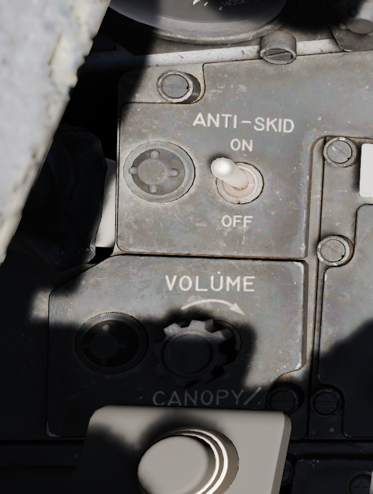
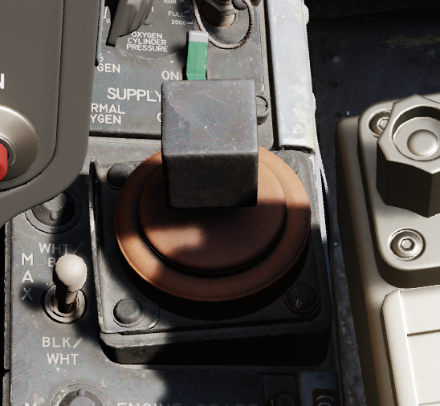
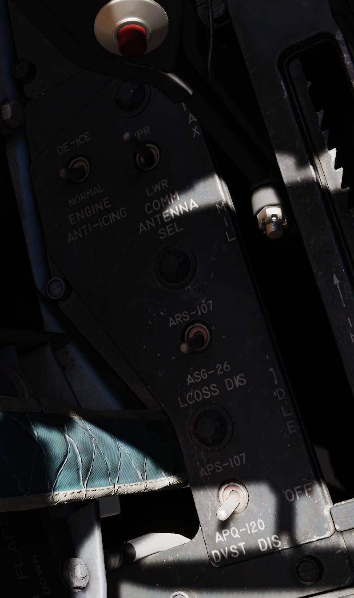
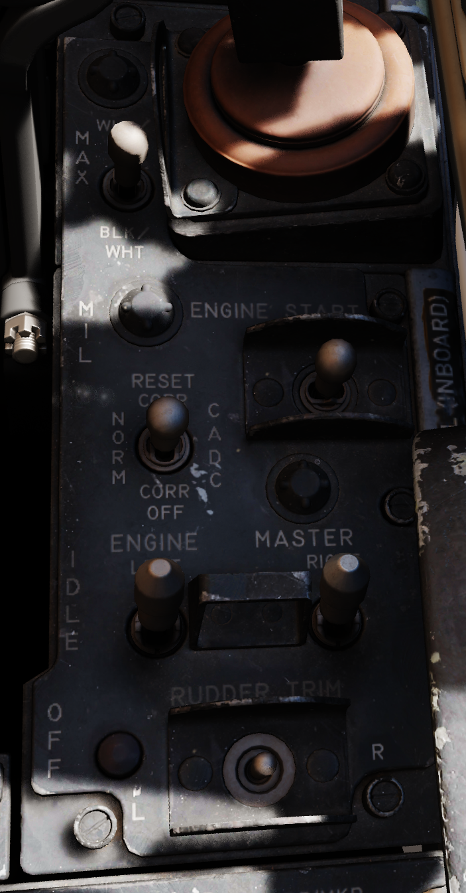

# Front Section

## Left Utility Panel

### Anti-Skid

### Canopy/Low Altitude Warning Volume

Sets audio level for canopy open and low altitude voice warnings.

This system is not installed on this variant of the F-4E.

## Oxygen Control Panel

### Flow Indicator

Alternates between black and white with each aircrew member breath to indicate
oxygen flow.

### Emergency Flow Control Switch

Three position switch which selects EMERGENCY pressure (100% flow with positive
pressure), NORMAL (standard air/oxygen mix), or TEST MASK (positive pressure
for mask sealing check).

### Diluter Lever

Two position switch that cycles between NORMAL oxygen value or 100% OXYGEN
level.

### Oxygen Quantity Test Button

Tests oxygen low pressure warning system. Pressing the button cycles the needles
from current oxygen level to zero, which triggers OXYGEN LOW telelight panel
warning as needle passes through 1 liter. Releasing the button returns the
needle to current system level and clears OXYGEN LOW warning.

### Oxygen Pressure Gauge

Indicates system pressure from 0 to 500 psi.

### Supply Lever

Two position switch (ON and OFF) activating flow of oxygen to the aircrew
member.

## Forward Hand Control

Small joystick used to finalize the positioning of a target in the seeker gate
of an AGM prior to launch.

## Outboard Engine Control Panel

### Engine Anti-Icing Switch

Two position switch (DE-ICE and NORMAL) controlling de-icing function. When in
DE-ICE, the anti-icing air flow is enabled. In NORMAL, no anti-icing is
provided.

### Communications Antenna Select Switch

Two position switch commanding which antenna is being utilized for voice
communication- UPR (upper) or LWR (lower).

### LCOSS Switch

Selects which computer system is installed on this aircraft.

- ARS-107
- ASG-26

The switch is a leftover and not connected.

### DVST Switch

Selects which radar system is installed on this aircraft.

- APS-107
- APQ-120

The switch is a leftover and not connected.

## Inboard Engine Control Panel

The Inboard Engine Control Panel carries the following controls:

### Target Contrast Switch

Used to select the appropriate contrast conditions for seeker acquisition with
the AGM-65A and B.

| Name    | Description                                                               |
| ------- | ------------------------------------------------------------------------- |
| WHT/BLK | Programs the missile seeker to track a light target on a dark background. |
| AUTO    | Programs the missile to use its automatic tracking mode.                  |
| BLK/WHT | Programs the missile seeker to track a dark target on a light background. |

### Engine Start Switch

Three position switch with automatic return to center used to start the
respective engine using the cartridge (if loaded), left or right.

### CADC Static Pressure Compensator Correction Switch

Three position switch, momentary in the RESET CORR position, used to correct or
disengage the Static Pressure Compensation of the altimeter, thus eliminating,
or invoking, altimeter lag from rapid altitude changes.

| Name       | Description                                                                                       |
| ---------- | ------------------------------------------------------------------------------------------------- |
| RESET CORR | Actuated after engine startup, then in flight if a SPC warning is caused by transient conditions. |
| NORM       | Regular operating position of switch upon release of RESET CORR or actuation out of CORR OFF.     |
| CORR OFF   | Manually disengages SPC altitude lag compensation.                                                |

### Engine Master Switches

A pair of two position lever lock switches, separated by a guard to alleviate
erroneous command of the wrong switch, connects electrical power to the engine
boost and transfer pumps for the respective engine when placed in the ON
(forward) position. The connection to electrical power is external if the
aircraft is connected to a ground crew provided generator, or the aircraft's
battery if no external power available. Switching them to OFF (aft) position
will engage the fuel shutoff valves so long as the aircraft is not solely
running on the internal electrical bus; otherwise, the valves will remain open,
unless the engine throttle is placed into the cutoff position.

### Rudder Trim Switch

Used to apply rudder trim adjustment when pressed to the respective side, left
or right.

## Throttles

TODO
