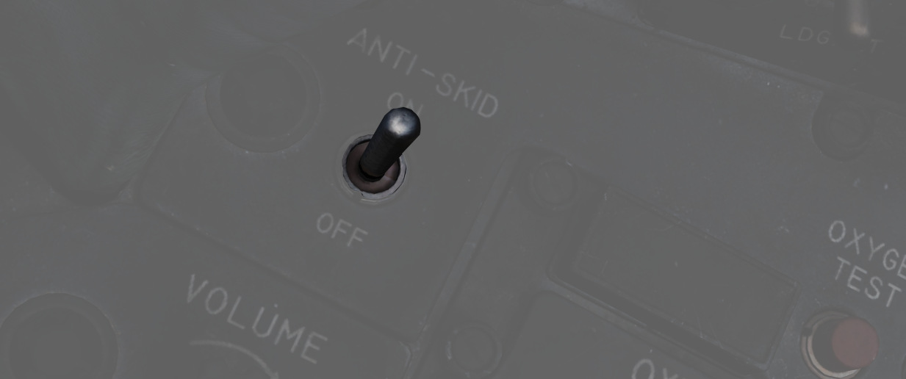
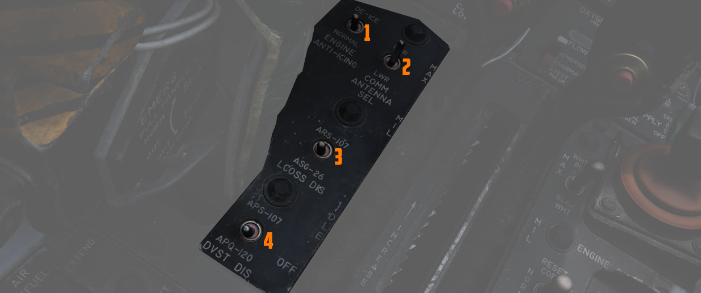
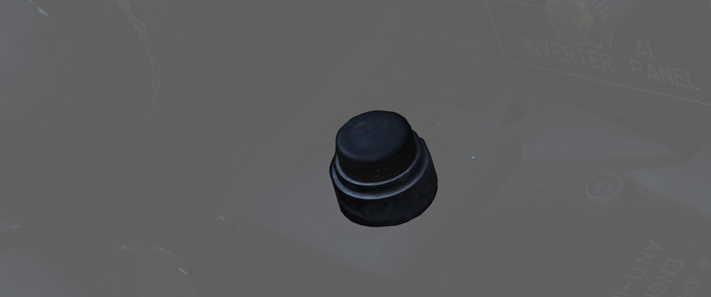

# Front Section

The front section of the left console houses the oxygen panel,
throttle and engine related controls.

## Left Utility Panel

### Anti-Skid Switch

Controls
the [anti-skid system](../../../systems/flight_controls_gear/gear_ground_handling.md#anti-skid-system)
which provides an electronically controlled skid protection at wheel speeds over 30 knots.

## Anti-Skid Inoperative Light

Illuminates when the Anti-Skid Switch is set to OFF, the Emergency Quick Release Lever is pressed,
or there is an issue with
the [Anti-Skid System.](../../../systems/flight_controls_gear/gear_ground_handling.md#anti-skid-system)

### Canopy/Low Altitude Warning Volume

Sets audio level for canopy open and low altitude voice warnings.

This system is not installed on this variant of the F-4E.

## Oxygen Regulator and Oxygen Quantity Gauge

### Supply Lever

Two position switch (ON and OFF) activating flow of oxygen to the mask.
For further information see
[3.7 Utility chapter, Oxygen section](../../../systems/utility.md#oxygen-system).

### Diluter Lever

A two-position diluter lever, in the center of the regulator
panel, controls the mixture of air and oxygen.

For a proportional amount of air to oxygen, the NORMAL
OXYGEN position should be selected.

For pure oxygen, the
100% OXYGEN position should be selected. This setting is preferable
if fire, toxic smoke or fumes occur in the cockpit.

### Emergency Lever

Three position switch which permits selection of NORMAL (standard supply),
EMERGENCY pressure (100% oxygen with continuous positive pressure) or
TEST MASK (positive pressure to test the face mask for leaks).

The lever should remain in the center (NORMAL) position at all times,
unless an unscheduled pressure increase is required.

### Flow Indicator

Alternates between black and white with each aircrew member breath to indicate
oxygen flow (white indicates inhalation).

### Oxygen Pressure Gauge

Indicates oxygen supply pressure from 0 to 500 psi.

For further information see [3.7 Utility chapter, Oxygen section](../../../systems/utility.md#oxygen-system).

### Oxygen Quantity Gauge

It has a range from
0 to 10 liters. Loss of electrical power
is indicated by appearance of a power off flag on the
instrument face.

### Oxygen Quantity Test Button

The button is used to test operation of the front
and rear cockpit gauges along with operation of the low-oxygen
warning system.

With the button pressed, both gauge
needles should move to an indication of zero.

As the needle in the front cockpit passes through the 1 liter indication, the
OXYGEN LOW warning light on the
front [telelight panel](../right_sub_panel.md#telelight-annunciator-panel)
should illuminate, and remain illuminated until the button is released and
the needle moves above 1 liter again.

## Forward Hand Control

Small joystick enabling the Pilot to control and steer
guided Weapons such as Mavericks or Bullpups.

## Outboard Engine Control Panel

### Engine Anti-Icing Switch

Two position switch (DE-ICE and NORMAL)
controlling [de-icing function.](../../../systems/engines_and_fuel_systems/engines.md#engine-anti-icing-system)
When in DE-ICE, the anti-icing air flow is enabled. In NORMAL, no anti-icing is provided.

The system should only be used below high-mach numbers.
At high-mach speeds the compressor inlet temperature is
enough to prevent ice from building up.

### Communications Antenna Select Switch

Two position switch commanding which antenna is being utilized for voice
communication- UPR (upper) or LWR (lower).

The Upper position should be used for take-off and
landing since the lower antenna could interfere with the anti-skid wheel speed sensor and thus
create a malfunction in the anti-skid system. The lower antenna could also interfere with the nose
gear steering whilst transmitting.

### LCOSS Switch

Selects which computer system is installed on this aircraft.

- ARS-107
- ASG-26

The switch is a leftover and not connected.

### DVST Switch

Selects which radar system is installed on this aircraft.

- APS-107
- APQ-120

The switch is a leftover and not connected.

## Inboard Engine Control Panel

The Inboard Engine Control Panel carries the following controls:

### Target Contrast Switch

Used to select the appropriate contrast conditions for seeker acquisition with
the [AGM-65A Maverick and AGM-65B Maverick](../../../stores/air_to_ground/missiles/maverick.md).

| Name    | Description                                                               |
|---------|---------------------------------------------------------------------------|
| WHT/BLK | Programs the missile seeker to track a light target on a dark background. |
| AUTO    | Programs the missile to use its automatic tracking mode.                  |
| BLK/WHT | Programs the missile seeker to track a dark target on a light background. |

> 💡 This does not change the polarity of the video but the coding of the seeker itself.

### Engine Start Switch

Three position switch with automatic return to center used to start the
respective engine using the cartridge (if loaded), left or right.
See [engine system chapter](../../../systems/engines_and_fuel_systems/engines.md#cartridge-mode-starting)
for further detail on when to use the cartridge start.

### CADC Static Pressure Compensator Correction Switch

Three position switch, momentary in the RESET CORR position, used to correct or
disengage the Static Pressure Compensation of the altimeter, thus eliminating,
or invoking, altimeter lag from rapid altitude changes.

| Name       | Description                                                                                       |
|------------|---------------------------------------------------------------------------------------------------|
| RESET CORR | Actuated after engine startup, then in flight if a SPC warning is caused by transient conditions. |
| NORM       | Regular operating position of switch upon release of RESET CORR or actuation out of CORR OFF.     |
| CORR OFF   | Manually disengages SPC altitude lag compensation.                                                |

### Engine Master Switches

A pair of two position lever lock switches, separated by a guard to alleviate
erroneous command of the wrong switch, connects electrical power to the engine
boost and transfer pumps for the respective engine when placed in the ON
(forward) position. The connection to electrical power is external if the
aircraft is connected to a ground crew provided generator, or the aircraft's
battery if no external power available. Switching them to OFF (aft) position
will engage the fuel shutoff valves so long as the aircraft is not solely
running on the internal electrical bus; otherwise, the valves will remain open,
unless the engine throttle is placed into the cutoff position. For further Information see
[3.2.1 engines chapter](../../../systems/engines_and_fuel_systems/engines.md).

### Rudder Trim Switch

Used to apply rudder trim adjustment when pressed to the respective side, left
or right.

## Throttles

The throttle arrangement for each engine in the F-4E Phantom II is located on the front and rear
cockpit left console. Mechanical linkage transmits throttle movement to the engine fuel control. A
friction adjusting lever allows customization of throttle friction. Afterburner initiation occurs by
shifting the throttles outboard and moving forward from the MIL position. The Afterburner gate can
be adjusted in the special options of the module.

Throttle movement is smooth and continuous, with afterburner modulation possible throughout the
range. Moving throttles from IDLE to OFF closes the fuel shutoff valve, stopping fuel flow. To
transition from OFF to IDLE or MIL, advance the throttles straight forward. Shifting throttles
outboard allows movement from MIL to MAX, enabling forward motion in the afterburner range. For
further information
see [3.1.2 Engines chapter](../../../systems/engines_and_fuel_systems/engines.md#throttles).

### Fingerlifts

Front cockpit throttles feature finger lifts for quick chops to IDLE, preventing inadvertent
shutoff. The lifts must be raised before retarding throttles to OFF. Rear cockpit throttles are
linked to the front cockpit, allowing only the pilot to start engines or move throttles into
afterburner range. Rear cockpit throttles can be moved from OFF without front seat assistance.

### Ignition Buttons

Engine ignition for startup is performed using a pair of spark plugs on each
engine, activated by pressing the red Ignition Button found on the rear of both
throttle levers. The button is depressed as part of the starting sequence to
ignite the spark plugs, initiating combustion in chambers four and five of the
engines.

### Cage Button

In the event that
an [AIM-7](../../../stores/air_to_air/aim_7.md), [AIM-9](../../../stores/air_to_air/aim_9.md),
or [M61A1](../../../stores/guns.md) must be employed
against an airborne target with
the [sight](../../../cockpit/pilot/dscg_controls.md#sight-mode-knob)
in A/G mode (for example, the flight is bounced by
opposing aircraft),
the [optical sight](../../../cockpit/pilot/dscg_controls.md#sight-mode-knob)
reticle can immediately be slewed to the
Radar Boresight Line using the Cage Button, found on the inboard (right)
throttle handle. Cage mode commands [the radar](../../../systems/radar/overview.md)
into [BST mode](../../../systems/radar/interface.md#bst-boresight-position) with a five mile
range, and short pulse, and sets the firing circuit for the currently selected
air-to-air weapon relative to the Pinky Switch. For
the [optical sight](../../../cockpit/pilot/dscg_controls.md#sight-mode-knob),
the command activates the respective elevation and azimuth tracking, roll mark, and
range functions of the reticle for the chosen weapon, without the pilot having
to remove a hand from throttle or stick to swap the sight mode or weapon control
panel functions.

### Dispense Button

When pressing the dispense button chaff/flare dispensing is initiated as set on
[the CCU](../../../systems/defensive_systems/countermeasures.md#anale-40-cockpit-control-unit-ccu)
and [AN/ALE-40 programmer](../../../systems/defensive_systems/countermeasures.md#anale-40-programmer)
if the flaps and speed brakes are retracted and the flares select switch is set to NORMAL.
Additionally single unit flare
dispensing can be initiated by a single button press if the flares select switch
is set to FLARES.

### Speed Brake

The Speed Brakes are actuated by a three position switch found on the inboard
throttle in both cockpits. Either switch will actuate the brakes. The positions
are Out, Stop, and In; the Out position is momentary and reverts back to Stop when released.
For further information see
[3.1.2 Flight Control Surfaces chapter](../../../systems/flight_controls_gear/flight_controls.md#speed-brakes).

### Mic Switch

The microphone switch for the [Intercom System](../../../systems/nav_com/intercom.md) is the aft
position on the inboard throttle grip in both cockpits. When using the intercom, all audio sans the
pull-up tone, stall warning, and ECM are reduced (same as RADIO OVERRIDE).
