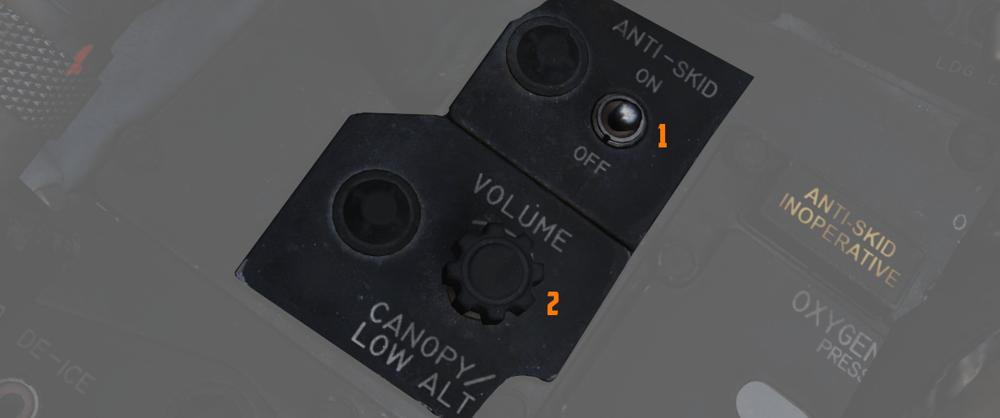
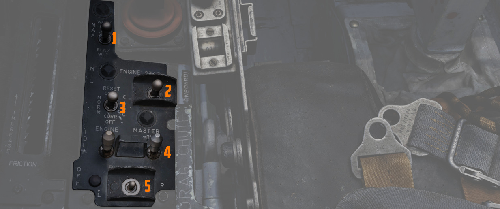
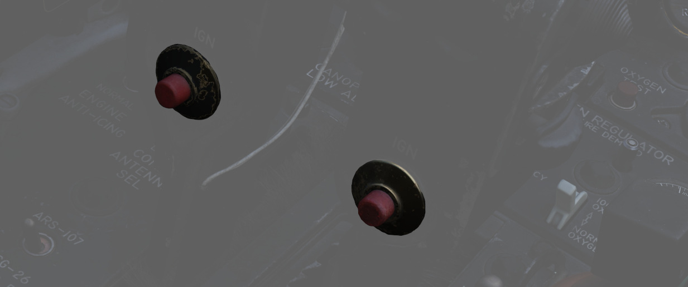
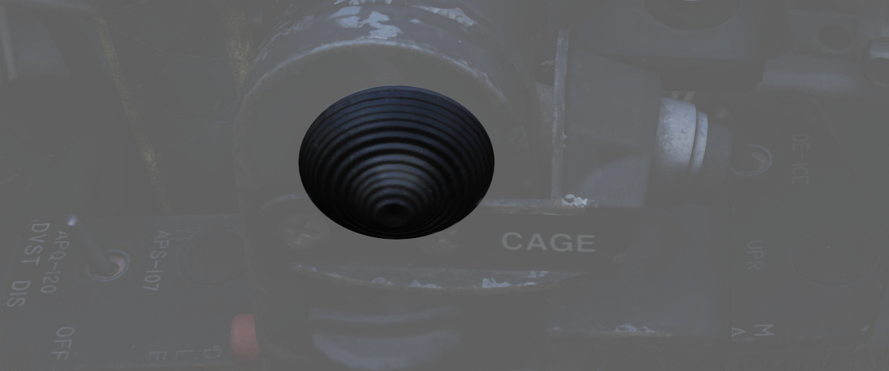

# 前部

左侧控制台的前部包括氧气面板、油门和发动机相关的控制开关/按钮。

## 左侧公用面板

### 防滑开关

用来控制 [防滑系统](../../../systems/flight_controls_gear/gear_ground_handling.md#anti-skid-system)
在地速超过 30 节时提供电控打滑保护。

## 防滑故障灯

当防滑开关设置到 OFF 档位，按下应急快速释放杆或
[防滑系统](../../../systems/flight_controls_gear/gear_ground_handling.md#anti-skid-system) 中出现故
障时亮起。

### 座舱盖/低高度警告音

设置座舱盖和低高度警告音的音量。

这一版本的 F-4E 中未安装该系统。

## 氧气调节杆和液氧储量表

### 供氧杆

用于激活面罩氧气流量的二档位开关（ON 和 OFF）。详见
[3.7 公用章节，氧气部分](../../../systems/utility.md#oxygen-system)。

### 稀释杆

二档位稀释杆，位于调节面板的中部，用来控制氧气和空气混合。

若要使空气与氧气成比例混合，则应选择 NORMAL OXYGEN 档位。

纯氧呼吸时，应该选择 100% OXYGEN 档位。如果驾驶舱内发生火灾、出现有毒烟雾或烟尘，最好使用该档位。

### 应急杆

应急杆总共有三个档位可供选择，分别是，NORMAL（正常供养）、 EMERGENCY 压力（纯氧以及持续正压）或
TEST MASK（正压来测试面罩气密性）。

控制杆应始终保持在中立（NORMAL）档位，除非需要特意增加压力。

### 流量指示器

机组进行呼吸时，黑白交替显示来指示氧气流量（白色表示吸入）。

### 氧气压力表

显示供养压力，显示区间为 0 到 500 psi。

详见 [3.7 公用章节，氧气部分](../../../systems/utility.md#oxygen-system)。

### 氧气储量表

显示区间为 0 到 10 升。仪表断电时仪表表面将出现断电旗。

### 氧气储量测试按钮

该按钮用于测试前后驾驶舱仪表以及氧气储量告警系统的工作情况。

按下按钮后，两个仪表中的指针都应移动到零位。

当飞行员驾驶舱内的指针穿过 1 升刻度时，
前[远传信号灯](../right_sub_panel.md#telelight-annunciator-panel) 中的 “OXYGEN LOW” 告警灯应亮起，
并一直保持到松开按钮且指针再次超过 1 升为止。

## 前手控

小型操纵杆，使飞行员能够控制和调整制导武器，如“幼畜”或“小斗犬”。

## 外侧发动机控制面板

### 发动机防冰开关

用于控制 [除冰功能](../../../systems/engines_and_fuel_systems/engines.md#engine-anti-icing-system)
的二档位开关（DE-ICE 和 NORMAL）。开关拨至 DE-ICE 档位时，启用除冰气流，NORMAL 档位禁用系统。

飞行员应当仅在低空速时使用系统。在高马赫数时，压气机进口温度足以防止结冰。

### 通信天线选择开关

二档位选择开关用来指令话音通信所使用的天线—— UPR（上部）或 LWR（下部）。

起降时应使用上部档位，因为下部天线可能会干扰防滑轮速度传感器，从而导致防滑系统故障。在发射信号时，
下部天线还可能干扰前轮转向。

### LCOSS 开关

选择安装在飞机上的计算机系统。

- ARS-107 - ASG-26

开关是一个遗留物，没有接线。

### DVST 开关

选择安装在飞机上的雷达系统。

- APS-107 - APQ-120

开关是一个遗留物，没有接线。

## 内侧发动机控制面板

内侧发动机控制面板包含以下控制开关/按钮：

### 目标对比度开关

用来选择合适的对比条件来使用
[AGM-65A 和 AGM-65B “幼畜”](../../../stores/air_to_ground/missiles/maverick.md) 导引头捕获目标。

| 名称    | 描述                               |
| ------- | ---------------------------------- |
| WHT/BLK | 导引头设置为跟踪暗背景中的亮目标。 |
| AUTO    | 设置导弹使用自动跟踪模式。         |
| BLK/WHT | 导引头设置为跟踪亮背景中的暗目标。 |

> 💡 开关不会改变视频极性而是改变导引头编码。

### 发动机起动开关

带有自动归中的三档位开关，用于使用药柱（如果已装载）起动相应的左右发。详情查看
[发动机系统章节](../../../systems/engines_and_fuel_systems/engines.md#cartridge-mode-starting) 来了
解何时使用药柱起动。

### CADC 静压补偿器修正开关

三档位开关，RESET CORR 档位为自复位开关，用于修正或断开高度表的静压补偿，从而消除或引入高度快速变化
造成的高度表滞后。

| 名称       | 描述                                                              |
| ---------- | ----------------------------------------------------------------- |
| RESET CORR | 在发动机起动后作动，如果由暂态条件引发 SPC 告警，则在飞行时动作。 |
| NORM       | 在 RESET CORR 档位松开或拨出 CORR OFF 时的正常工作档位。          |
| CORR OFF   | 手动断开 SPC 高度滞后补偿。                                       |

### 发动机主开关

一对两档位的限位开关，两个开关由一个防护罩隔开，以防止执行错误的开关指令，当置于 ON（向前）档位时，
将为相应发动机的升压油泵和输油泵通电。如果飞机连接了地勤人员提供的发电机，则使用地面电源；如果没有
地面电源，则使用机载电池。只要飞机不是完全依靠内部电力总线运行，将其切换到 OFF（向后）档位将接通燃
油关断阀；否则，除非将油门推进关断档位，阀门将保持打开。

### 方向舵配平开关

向左或向右按下时，在对应方向应用方向舵配平。

## 油门握把

F-4E “鬼怪” II 每台发动机的油门握把布置在前后驾驶舱的左侧控制台上。握把通过机械传动机构将动作传递到
发动机燃油控制。机组可通过阻尼调节杆自由调整握把的阻尼。从军推档位向外移动握把并向前推动，即可点燃
加力燃烧室。加力门限可在模组的特殊选项中进行调整。

飞行员可以平稳而连续地移动油门握把，在整个加力区间内都可以进行加力进行调整。将油门握把从 IDLE 移动
到 OFF 档位会关闭燃油关断阀，停止燃油流动。如需从 OFF 过渡到 IDLE 或 MIL，直接向前推油门。将油门握
把向外移，可以从 MIL 移动到最大推力，从而在加力区间内向前移动。详见
[3.1.2 发动机章节](../../../systems/engines_and_fuel_systems/engines.md#throttles) 。

### 指抬装置

飞行员驾驶舱地油门握把上装有一个指抬装置，可快速进入 IDLE 档位，并防止意外关闭。在将油门收至 OFF 之
前，必须先抬起指抬。WSO 驾驶舱油门与飞行员驾驶舱的油门握把相连，使得机组中只有飞行员可以起动发动机
或将油门推至加力区间。WSO 驾驶舱油门可以在没有前座协助的情况下移出 OFF 档位。

### 点火按钮

每个发动机上都有一对火花塞，按下位于两个油门握把后部的红色点火按钮即可起动发动机。作为起动程序的一
部分，按下按钮可点燃火花塞，开始第四和第五燃烧室中的燃烧。

### 锁定按钮

如果 [AIM-7](../../../stores/air_to_air/aim_7.md) 、[AIM-9](../../../stores/air_to_air/aim_9.md) 或
[M61A1](../../../stores/guns.md) 必须在
[瞄准具](../../../cockpit/pilot/dscg_controls.md#sight-mode-knob) 处在 A/G 模式的情况下向空中目标发
射（例如，飞行被敌机干扰开来），则可使用内侧油门握把（右侧）的锁定按钮立即将
[光学瞄准具](../../../cockpit/pilot/dscg_controls.md#sight-mode-knob) 的准星移动到雷达瞄准线上。锁
定模式将指令 [雷达](../../../systems/radar/overview.md) 进入
[BST 模式](../../../systems/radar/interface.md#bst-boresight-position)，距离 5 海里、短脉冲并为小指
开关当前选择的空对空武器设置发射电路。锁定指令将激活选定武器在
[光学瞄准具](../../../cockpit/pilot/dscg_controls.md#sight-mode-knob) 中的仰角和方位角跟踪、横滚标
记和准星的距离功能，飞行员无需将手从油门或驾驶杆上移开，即可切换瞄准具模式或武器控制面板功能。

### 布撒按钮

在襟翼和减速板收起，且红外干扰弹选择开关设置到 NORMAL 的情况下，按下布撒按钮来按照
[CCU](../../../systems/defensive_systems/countermeasures.md#anale-40-cockpit-control-unit-ccu) 和
[AN/ALE-40 编程器](../../../systems/defensive_systems/countermeasures.md#anale-40-programmer) 中设
定的程序布撒箔条/红外干扰弹。此外，如果红外干扰弹选择开关设置到 FLARES，那么按下一次按钮将布撒单发
红外干扰弹。

### 减速板

机组可以在两个驾驶舱中的内侧油门握把上找到三档位开关来控制减速板。两个开关都可控制减速板。减速板开
关的档位为展开、停止和收起；展开档位为自复位并在松开时复位至停止档位。详见
[3.1.2 飞行操纵面](../../../systems/flight_controls_gear/flight_controls.md#speed-brakes)。

### 传声开关

[内话系统](../../../systems/nav_com/intercom.md) 的传声可通过向后拨动两个驾驶舱中内侧油门握把上的传
声开关来实现。使用内话时，除拉起单音、失速警告和 ECM 外，所有音频音量都会降低（与 RADIO OVERRIDE 相
同）。在向前拨动开关将启用无线电传输。

### 小指开关

航炮/导弹（小指开关）是一个四档位开关，功能分别为选择航炮（后）、雷达（前）、红外制导弹（中立）和执
行红外制导弹挂点选择功能（上）。向上（UP）档位带弹簧归中。
