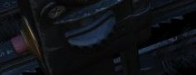

# Front Section

## Left Utility Panel

### Anti-Skid

The [anti-skid system](../../../systems/flight_controls/gear_ground_handling.md#anti-skid-control-switch)
provides an electronically controlled skid protection at wheel speeds over 30 knots. This is done
by detecting the start of a skid and then releasing the brake pressure.

### Canopy/Low Altitude Warning Volume

Sets audio level for canopy open and low altitude voice warnings.

This system is not installed on this variant of the F-4E.

## Oxygen Control Panel

### Flow Indicator

Alternates between black and white with each aircrew member breath to indicate
oxygen flow.

### Emergency Flow Control Switch

Three position switch which selects EMERGENCY pressure (100% flow with positive
pressure), NORMAL (standard air/oxygen mix), or TEST MASK (positive pressure
for mask sealing check).

### Diluter Lever

Two position switch that cycles between NORMAL oxygen value or 100% OXYGEN
level.

### Oxygen Quantity Test Button

Tests oxygen low pressure warning system. Pressing the button cycles the needles
from current oxygen level to zero, which triggers OXYGEN LOW telelight panel
warning as needle passes through 1 liter. Releasing the button returns the
needle to current system level and clears OXYGEN LOW warning.

### Oxygen Pressure Gauge

Indicates system pressure from 0 to 500 psi. The Oxygen lasts up to 24.3 Hours with a full 10 litres
at about 35,000 feet. At 10,000 feet 10 litres last about 23.4 hours.

### Supply Lever

Two position switch (ON and OFF) activating flow of oxygen to the aircrew
member.

## Forward Hand Control

Small joystick used to finalize the positioning of a target in the seeker gate
of a guided Weapon prior to launch.

## Outboard Engine Control Panel

### Engine Anti-Icing Switch

Two position switch (DE-ICE and NORMAL) controlling de-icing function. When in
DE-ICE, the anti-icing air flow is enabled. In NORMAL, no anti-icing is
provided. The system should only be used below high-mach numbers. At high-mach speeds the compressor
inlet temperature is enough to prevent ice from building up.

### Communications Antenna Select Switch

Two position switch commanding which antenna is being utilized for voice
communication- UPR (upper) or LWR (lower). The Upper position should be used for take-off and
landing since anti-skid could interfere with the lower antenna.

### LCOSS Switch

Selects which computer system is installed on this aircraft.

- ARS-107
- ASG-26

The switch is a leftover and not connected.

### DVST Switch

Selects which radar system is installed on this aircraft.

- APS-107
- APQ-120

The switch is a leftover and not connected.

## Inboard Engine Control Panel

The Inboard Engine Control Panel carries the following controls:

### Target Contrast Switch

Used to select the appropriate contrast conditions for seeker acquisition with
the [AGM-65A Maverick and AGM-65B Maverick](../../../stores/air_to_ground/missiles/maverick.md).

| Name    | Description                                                               |
|---------|---------------------------------------------------------------------------|
| WHT/BLK | Programs the missile seeker to track a light target on a dark background. |
| AUTO    | Programs the missile to use its automatic tracking mode.                  |
| BLK/WHT | Programs the missile seeker to track a dark target on a light background. |

This doesn't change the polarity of the video but the coding of the seeker itself.

### Engine Start Switch

Three position switch with automatic return to center used to start the
respective engine using the cartridge (if loaded), left or right.
See [engine system chapter](../../../systems/flight_controls/engines.md#cartridge-mode-starting) for
further detail on when to use the cartridge start.

### CADC Static Pressure Compensator Correction Switch

Three position switch, momentary in the RESET CORR position, used to correct or
disengage the Static Pressure Compensation of the altimeter, thus eliminating,
or invoking, altimeter lag from rapid altitude changes.

| Name       | Description                                                                                       |
|------------|---------------------------------------------------------------------------------------------------|
| RESET CORR | Actuated after engine startup, then in flight if a SPC warning is caused by transient conditions. |
| NORM       | Regular operating position of switch upon release of RESET CORR or actuation out of CORR OFF.     |
| CORR OFF   | Manually disengages SPC altitude lag compensation.                                                |

### Engine Master Switches

A pair of two position lever lock switches, separated by a guard to alleviate
erroneous command of the wrong switch, connects electrical power to the engine
boost and transfer pumps for the respective engine when placed in the ON
(forward) position. The connection to electrical power is external if the
aircraft is connected to a ground crew provided generator, or the aircraft's
battery if no external power available. Switching them to OFF (aft) position
will engage the fuel shutoff valves so long as the aircraft is not solely
running on the internal electrical bus; otherwise, the valves will remain open,
unless the engine throttle is placed into the cutoff position.

### Rudder Trim Switch

Used to apply rudder trim adjustment when pressed to the respective side, left
or right.

## Throttles

The throttle arrangement for each engine in the F-4E Phantom II is located on the front and rear
cockpit left console. Mechanical linkage transmits throttle movement to the engine fuel control. A
friction adjusting lever allows customization of throttle friction. Afterburner initiation occurs by
shifting the throttles outboard and moving forward from the MIL position. The Afterburner gate can
be adjusted in the special options of the module.

Throttle movement is smooth and continuous, with afterburner modulation possible throughout the
range. Moving throttles from IDLE to OFF closes the fuel shutoff valve, stopping fuel flow. To
transition from OFF to IDLE or MIL, advance the throttles straight forward. Shifting throttles
outboard allows movement from MIL to MAX, enabling forward motion in the afterburner range.

Front cockpit throttles feature finger lifts for quick chops to IDLE, preventing inadvertent
shutoff. The lifts must be raised before retarding throttles to OFF. Rear cockpit throttles are
linked to the front cockpit, allowing only the pilot to start engines or move throttles into
afterburner range. Rear cockpit throttles can be moved from OFF without front seat assistance.

### Ignition Buttons

Engine ignition for startup is performed using a pair of spark plugs on each
engine, activated by pressing the red Ignition Button found on the rear of both
throttle levers. The button is depressed as part of the starting sequence to
ignite the spark plugs, initiating combustion in chambers four and five of the
engines.

### Cage Button

In the event that
an [AIM-7](../../../stores/air_to_air/aim_7.md), [AIM-9](../../../stores/air_to_air/aim_9.md),
or [M61A1](../../../stores/guns.md) must be employed
against an airborne target with
the [sight](../../../cockpit/pilot/dcsg_controls.md#sight-mode-knob)
in A/G mode (for example, the flight is bounced by
opposing aircraft),
the [optical sight](../../../cockpit/pilot/dcsg_controls.md#sight-mode-knob)
reticle can immediately be slewed to the
Radar Boresight Line using the Cage Button, found on the inboard (right)
throttle handle. Cage mode commands the radar into BST mode with a five mile
range, and short pulse, and sets the firing circuit for the currently selected
air to air weapon relative to the Pinky Switch. For
the [optical sight](../../../cockpit/pilot/dcsg_controls.md#sight-mode-knob),
the command activates the respective elevation and azimuth tracking, roll mark, and
range functions of the reticle for the chosen weapon, without the pilot having
to remove a hand from throttle or stick to swap the sight mode or weapon control
panel functions.

### Speed Brake

The Speed Brakes are actuated by a three position switch found on the inboard
throttle in both cockpits. Either switch will actuate the brakes. The positions
are Out, Stop, and In; the first and last positions are momentary (reverting to
Stop upon being released).

### Dispense Button

When pressing the dispense button chaff/flare dispensing is initiated as set on
the CCU and AN/ALE-40 programmer if the flaps and speed brakes are retracted and
the flares select switch is set to NORMAL. Additionally single unit flare
dispensing can be initiated by a single button press if the flares select switch
is set to FLARES.

### Mic Switch

The microphone switch for the Intercom System is the aft position on the inboard
throttle grip in both cockpits. When using the intercom, all audio sans the
pull-up tone, stall warning, and ECM are reduced (same as RADIO OVERRIDE).
