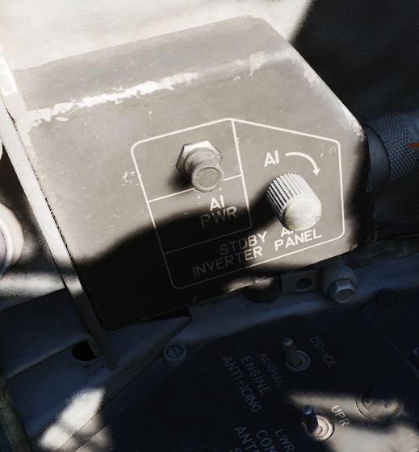
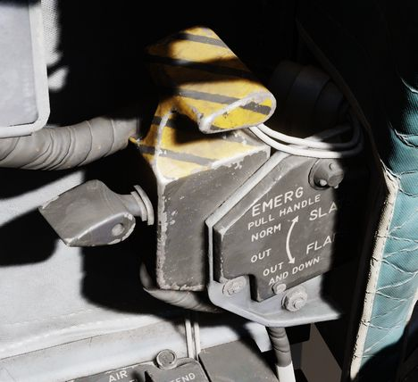
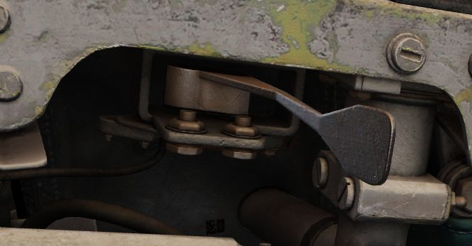
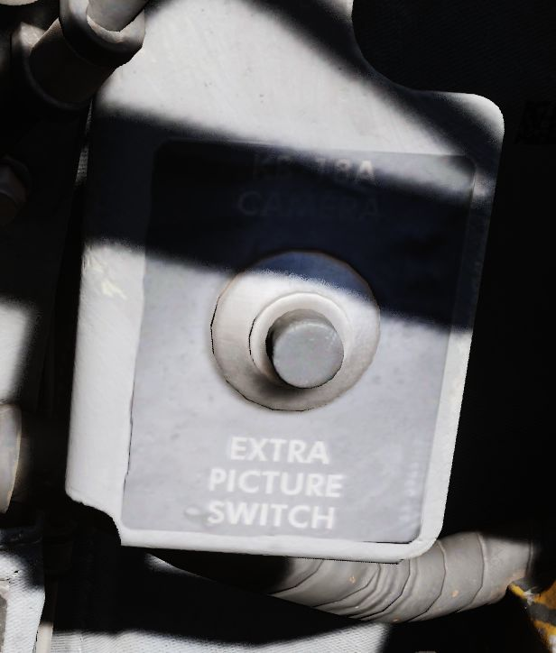
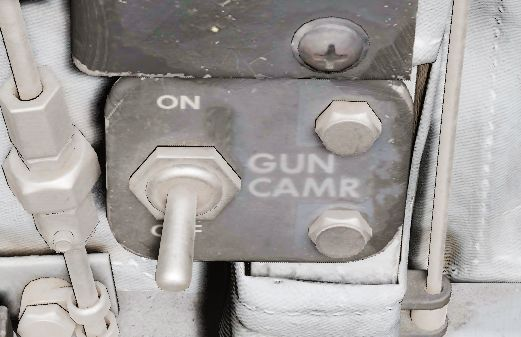
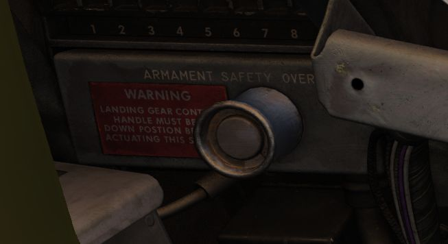

# Left Wall

## SAI Panel

The panel provides a circuit breaker and a knob to control the brightness for
the Standby Attitude Indicator.

## Eject Light/Switch

Pressed by the pilot in an emergency condition requiring ejection from the
aircraft, which illuminates the EJECT lamp in the rear cockpit warning the WSO
to prepare for immediate ejection.

Also lights up when the WSO presses their respective Eject Light to warn the
Pilot for ejection.

## Slats/Flaps Control Panel

A three position switch (NORM, OUT, OUT AND DOWN) to the rear of the panel
provides normal operation functions of the Slats/Flaps System. These functions
are relative to landing gear position, and are noted as follows:

- Nose Gear UP

| Name         | Description                                                               |
| ------------ | ------------------------------------------------------------------------- |
| NORM         | Flaps up, slats operate as function of AOA.                               |
| OUT          | Slats extend.                                                             |
| OUT AND DOWN | Slats and flaps extend (wheels light flashing until landing gear is down. |

- Nose Gear DOWN

| Name         | Description                                 |
| ------------ | ------------------------------------------- |
| NORM         | Flaps up, slats operate as function of AOA. |
| OUT          | Slats and flaps extend.                     |
| OUT AND DOWN | Slats and flaps extend.                     |

## Emergency Slats/Flaps Handle

Also included is the Emergency Slats/Flaps Extension handle, marked in yellow
and black, at the top of the box. This handle is pulled to force high
pressure air into the slats/flaps actuation system, causing them to deploy in
event of control system failure.

## Canopy Control Switch

Used to open (aft) or close (forward) the pilot canopy.

## Extra Picture Switch

Provision to operate the KB-18 gun camera without the release of weapons, the
Extra Picture switch starts the camera at the selected rate.

## Gun Camera Switch

Activates the gun camera, which will run until the switch is placed to off, or
actuation of bomb button or the second trigger detent once the pre-programmed overrun
time is completed.

## Slats Override Switch

Two-position guarded switch with IN and NORM positions. In NORM, slats operate
normally as a function of the slats flaps switch or AoA. When IN selected, slats
will retract and remain retracted. Selection of IN illuminates SLATS IN light on
telelight panel and Master Caution lamp.

## Armament Safety Override Switch

If pressed and the landing gear handle is placed down, overrides the armament
safety.

This allows for example to fire the gun while on ground.
