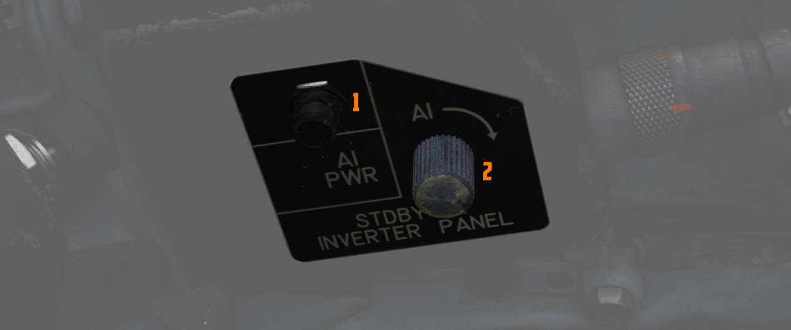
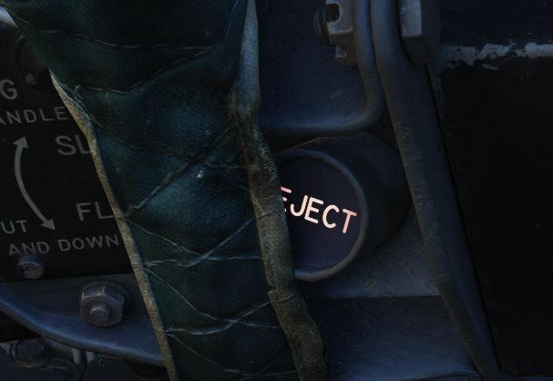
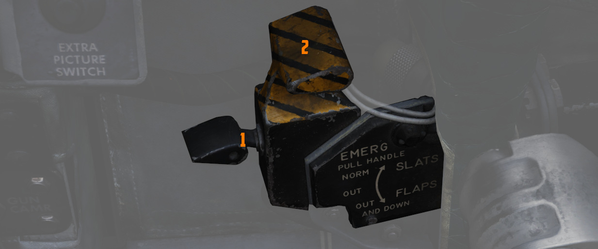
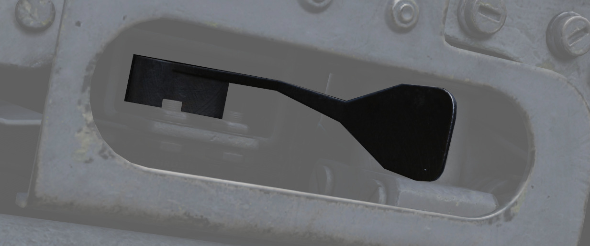
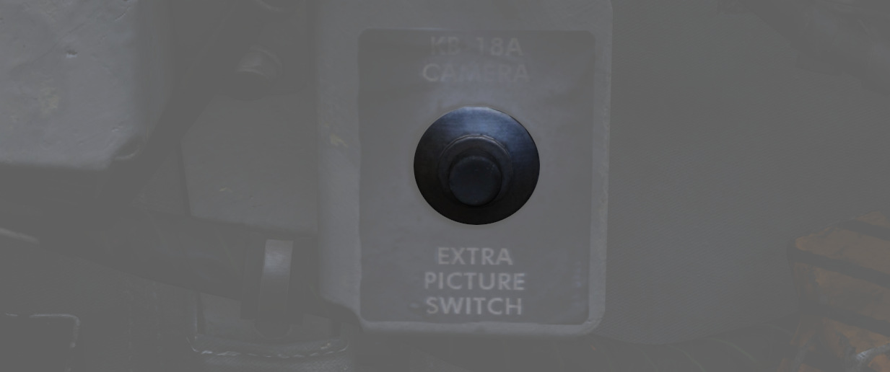
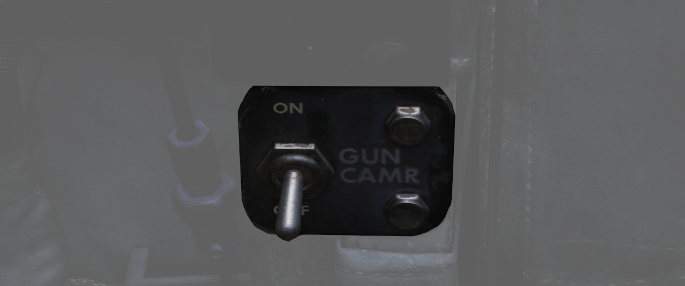
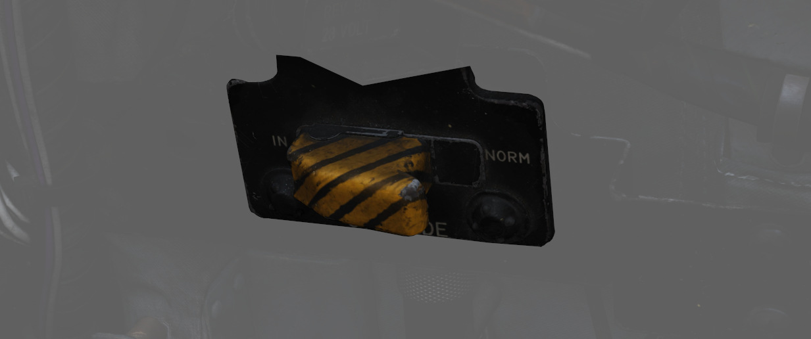
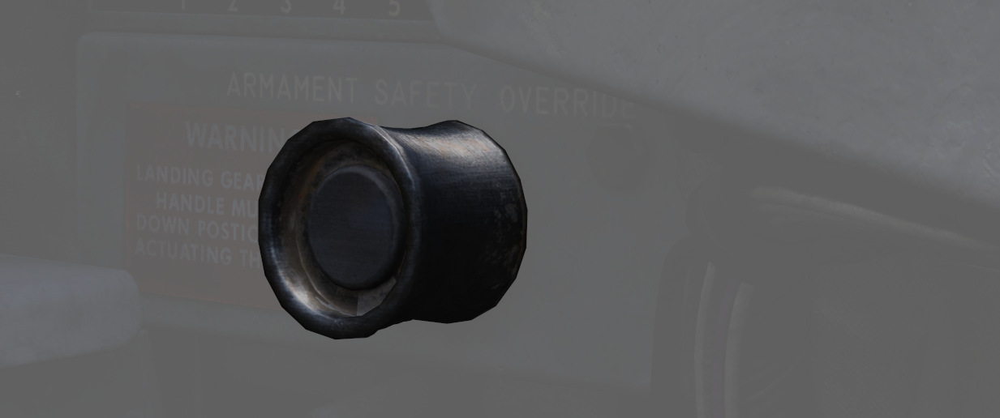

# Left Wall

## SAI Panel

The panel provides a circuit breaker (1) and a knob (2) to control the brightness for
the [Standby Attitude Indicator.](../../pilot/flight_director_group.md#standby-attitude-indicator)

## Eject Light/Switch

Pressed by the pilot in an emergency condition requiring ejection from the
aircraft, which illuminates the [EJECT lamp](../../../systems/emergency.md#eject-light) in the rear
cockpit warning the WSO to prepare for immediate ejection.

Also lights up when the WSO presses their
respective [Eject Light](../../../systems/emergency.md#eject-light) to warn the Pilot for ejection.

## Slats/Flaps Control Panel

A three position switch (1) (NORM, OUT, OUT AND DOWN) to the rear of the panel
provides normal operation functions of
the [Slats/Flaps System.](../../../systems/flight_controls_gear/flight_controls.md#slats-flap-system)
These functions are relative
to [landing gear position,](../../../systems/flight_controls_gear/gear_ground_handling.md) and are
noted as follows:

### Nose Gear UP

| Name         | Description                                                                                                                    |
|--------------|--------------------------------------------------------------------------------------------------------------------------------|
| NORM         | Flaps up, slats operate as function of [AoA.](../../../systems/flight_controls_gear/flight_controls.md#angle-of-attack-system) |
| OUT          | Slats extend.                                                                                                                  |
| OUT AND DOWN | Slats and flaps extend (wheels light flashing until landing gear is down.                                                      |

### Nose Gear DOWN

| Name         | Description                                                                                                                    |
|--------------|--------------------------------------------------------------------------------------------------------------------------------|
| NORM         | Flaps up, slats operate as function of [AoA.](../../../systems/flight_controls_gear/flight_controls.md#angle-of-attack-system) |
| OUT          | Slats and flaps extend.                                                                                                        |
| OUT AND DOWN | Slats and flaps extend.                                                                                                        |

### Emergency Slats/Flaps Handle

Also included is
the [Emergency Slats/Flaps Extension handle (2), ](../../../systems/flight_controls_gear/flight_controls.md#slats-flap-system)
marked in yellow and black, at the top of the box. This handle is pulled to force high
pressure air into the slats/flaps actuation system, causing them to deploy in
event of control system failure.

## Canopy Control Switch

Used to open (aft) or close (forward) the pilot canopy.

## Extra Picture Switch

Provision to operate the KB-18 gun camera without the release of weapons, the
Extra Picture switch starts the camera at the selected rate.

## Gun Camera Switch

Activates the gun camera, which will run until the switch is placed to off, or
actuation of bomb button or the second trigger detent once the pre-programmed overrun
time is completed.

## Slats Override Switch

Two-position guarded switch with IN and NORM positions. In NORM, slats operate
normally as a function of the slats flaps switch
or [AoA.](../../../systems/flight_controls_gear/flight_controls.md#angle-of-attack-system) When IN
selected, slats
will retract and remain retracted. Selection of IN illuminates SLATS IN light on
[telelight panel](../../../systems/emergency.md#telelight-panel)
and [Master Caution lamp.](../../../systems/emergency.md#master-caution)

## Armament Safety Override Switch

If pressed and
the [landing gear handle](../../../systems/flight_controls_gear/gear_ground_handling.md#landing-gear-control-handle)
is placed down, overrides the armament safety.

This allows for example to fire [the gun](../../../stores/guns.md) while on ground.
