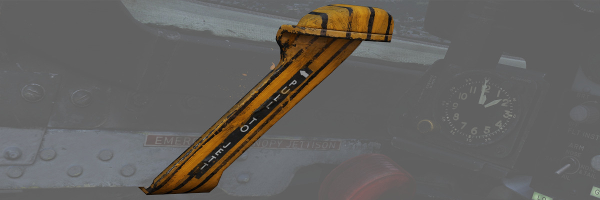

# Left Wall

## SAI Panel

The panel provides a circuit breaker (<num>1</num>) and a knob (<num>2</num>) to control the
brightness for
the [Standby Attitude Indicator.](../../pilot/flight_director_group.md#standby-attitude-indicator)

## Eject Light/Switch

Pressed by the pilot in an emergency condition requiring ejection from the
aircraft, which illuminates the [EJECT lamp](../../../systems/emergency.md#eject-light) in the rear
cockpit, warning the WSO to prepare for immediate ejection.

## Slats/Flaps Control Panel

A three-position switch (<num>1</num>) (NORM, OUT, OUT AND DOWN) to the rear of the panel
provides normal operation functions of
the [Slats/Flaps System.](../../../systems/flight_controls_gear/flight_controls.md#slats-flap-system)
These functions are relative
to [landing gear position,](../../../systems/flight_controls_gear/gear_ground_handling.md) and are
noted as follows:

### Nose Gear UP

| Name         | Description                                                                                                                    |
|--------------|--------------------------------------------------------------------------------------------------------------------------------|
| NORM         | Flaps up, slats operate as function of [AoA.](../../../systems/flight_controls_gear/flight_controls.md#angle-of-attack-system) |
| OUT          | Slats extend.                                                                                                                  |
| OUT AND DOWN | Slats and flaps extend (wheels light flashing until the landing gear is down.                                                  |

### Nose Gear DOWN

| Name         | Description                                                                                                                    |
|--------------|--------------------------------------------------------------------------------------------------------------------------------|
| NORM         | Flaps up, slats operate as function of [AoA.](../../../systems/flight_controls_gear/flight_controls.md#angle-of-attack-system) |
| OUT          | Slats and flaps extend.                                                                                                        |
| OUT AND DOWN | Slats and flaps extend.                                                                                                        |

### Emergency Slats/Flaps Handle

Also included is
the [Emergency Slats/Flaps Extension handle (<num>2</num>),](../../../systems/flight_controls_gear/flight_controls.md#slats-flap-system)
marked in yellow and black, at the top of the box. This handle is pulled to force high
pressure air into the slats/flaps actuation system, causing them to deploy in
event of control system failure.

## Emergency Canopy Jettison Handle

Used for emergency ground extraction, the Emergency Canopy Jettison Handle
releases a compressed oxygen cylinder to open the respective canopy immediately,
shearing it off at its pivots.

## Canopy Control Switch

Used to open (aft) or close (forward) the pilot canopy.

## Extra Picture Switch

Provision to operate the KB-18 gun camera without the release of weapons, the
Extra Picture switch starts the camera at the selected rate.

## Gun Camera Switch

Activates the gun camera, which will run until the switch is placed to off, or
actuation of the bomb button or the second trigger detent once the pre-programmed overrun
time is completed.

## Slats Override Switch

Two-position guarded switch with IN and NORM positions. In NORM, slats operate
normally as a function of the slats flaps switch
or [AoA.](../../../systems/flight_controls_gear/flight_controls.md#angle-of-attack-system) When IN
is selected, slats
will retract and remain retracted. Selection of IN illuminates SLATS IN light on
[telelight panel](../../../systems/emergency.md#telelight-panel)
and [Master Caution lamp.](../../../systems/emergency.md#master-caution)

## Armament Safety Override Switch

If pressed and
the [landing gear handle](../../../systems/flight_controls_gear/gear_ground_handling.md#landing-gear-control-handle)
is placed down, it overrides the armament safety.

This allows, for example, to fire [the gun](../../../stores/guns.md) while on the ground.
