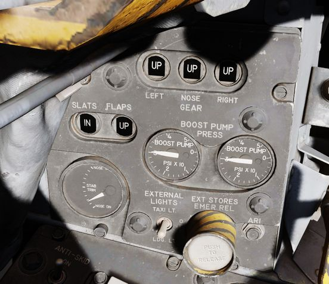
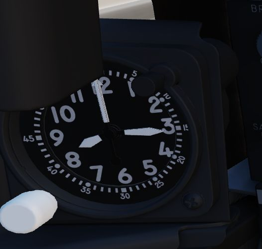
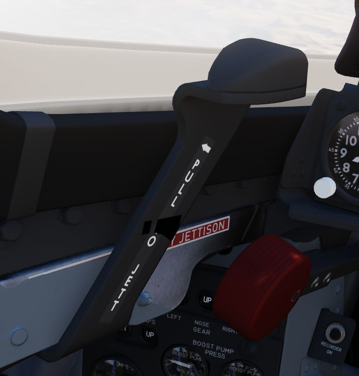
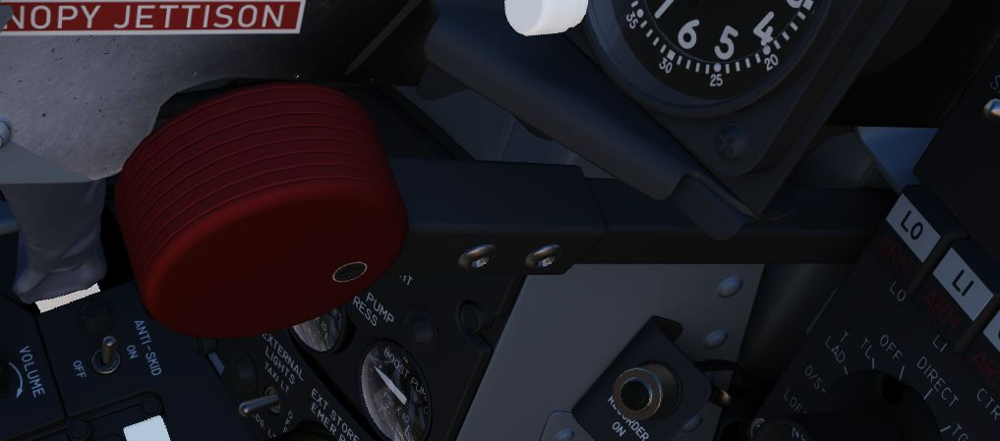
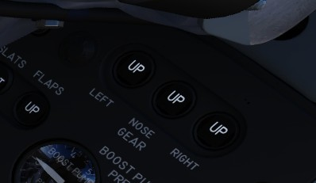
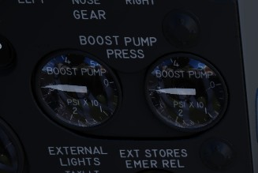
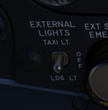
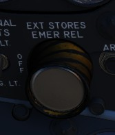
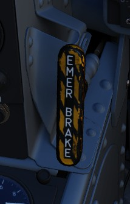

# Left Sub-Panel

## 8-Day Clock

A clock is provided for the pilot, including a stopwatch function.

## Emergency Canopy Jettison Handle

Used for emergency ground extraction, the Emergency Canopy Jettison Handle
releases a compressed oxygen cylinder to open both canopies immediately,
shearing them off at their pivots.

## Landing Gear Handle

Actuates the landing gear; raised for gear up, down for gear down.

Pulling the handle out will actuate the Emergency Mode and release the gear by
using a pair of compressed air bottles.

## Landing Gear Position Indicators

The Landing Gear Position Indicators provide visual confirmation of current gear
state, displaying UP when retracted, showing a barber pole while in transition,
or the illustration of a wheel in the respective window when fully down and
locked.

## Slats/Flaps Indicators

Visual indication of the Slat and Flap systems are provided through two window
indicators. Slats will be displayed as IN (retracted) or OUT (extended). Flaps
will display as UP (retracted) or DN (down), and will show a barber pole while
in transition.

## Boost Pump Pressure Indicators

A pair of indicators provide confirmation of fuel boost pump operation.
Indicators are calibrated 0 to 5, which must be multiplied by 10 to read in
current PSI.

## Stabilator Trim Indicator

Provides current stabilator trim setting in units (trim switch actuation) of
trim.

## Landing/Taxi Lights Switch

Control the external Landing and Taxi lamps. Left main gear must be down and
locked for the switch to function.

## External Stores Emergency Release

Also called the "panic button", the External Stores Emergency Release will
immediately perform separation of all jettison-able stores, without air to air
weapons or special weapons. The actuation of the button will show a yellow ring
around the button position, which is the indicator for the pilot that it has
been used.

## Aileron Rudder Interconnect (AIR) Circuit Breaker

When pulled in conjunction with the Yaw ARI Stab Aug Switch disengaged, Yaw ARI
will be fully removed. With the Yaw ARI Stab Aug Switch engaged, 5 degrees of
ARI authority will be maintained.

## Emergency Brake Handle

Pulling this handle activates the Emergency Hydraulic Brake System, which dumps
the remainder of the hydraulic accumulator into the brake system for a limited
number of brake actuation. Differential braking will work, however the number
of available actuation is limited.
