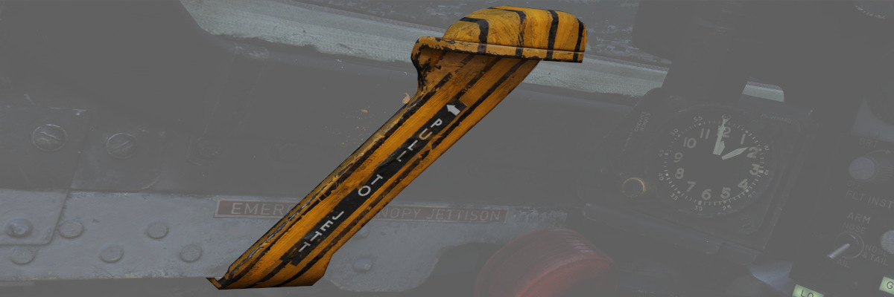

# 左侧子面板

多数 [飞行操纵设备](../../systems/flight_controls_gear/gear_ground_handling.md) 指示以及升压油泵表
位于左侧子面板中。此外，水平安定面配平表以及挂载应急抛弃也在该面板中。

## 8 日时钟

面板中含有一枚带秒表国内的时钟。转动位于左下角的旋钮可以设置时间。按下位于右上角的按钮即可使用秒表
功能。再次按下右上角的按钮即可复位。

## 应急座舱盖抛弃手柄

在地面应急撤离时使用，应急座舱盖抛弃手柄会释放压缩氧气瓶，立即打开相应的座舱盖，并剪断座舱盖支点。

## 起落架手柄

作动 [起落架](../../systems/flight_controls_gear/gear_ground_handling.md); 抬起手柄来收起起落架，放
下则为放下起落架。

抽出手柄将进入应急模式，并使用一堆压缩气瓶来放下起落架。

> 💡 起落架无法在地面收起。

## 起落架位置指示器

[起落架](../../systems/flight_controls_gear/gear_ground_handling.md) 位置指示器可让飞行员视觉确认当
前起落架的状态，收起时显示“UP”，过渡时显示“条状图”，完全放下并锁定时在相应窗口中显示“轮子”。

## 缝翼/襟翼指示器

通过两个窗口指示器来为飞行员提供
[缝翼和襟翼系统](../../systems/flight_controls_gear/flight_controls.md#slats-flap-system) 的视觉指
示。缝翼将显示 IN（收起）或 OUT（伸出）。襟翼将显示 UP（收上）或 DN（放下），并在过渡时显示“条状图
”。

## 升压油泵指示器

面板中有一对指示器可用于确认升压油泵的工作状况。指示器的标定值为 0 至 5，乘以 10 来读出当前的 PSI
值。

## 安定面配平指示器

以配平单位（不等于度）显示当前安定面的配平设定。起飞配平应设置在 1-3 个单位压机头配平。

## 着陆/滑行灯开关

用来控制 [机外着陆和滑行灯。](../../systems/lighting.md) 在左侧主起落架放下并锁定后开关才能控制灯光

> 💡 收起起落架后灯光将自动关闭。

## 挂载应急抛弃

挂载应急抛弃也称为 “_恐慌按钮_”，将立刻将抛弃所有除 [空空武器](../../stores/air_to_air/overview.md)
或特殊武器外的挂载。

## 副翼-方向舵交联（ARI）断路器

配合偏航 ARI 增稳开关断开时一并抽出，偏航 ARI 将被完全断开。当接通偏航 ARI 增稳开关时，将保持 5 度
的 ARI 权限。

详见
[3.1.2 飞行操纵设备 & AFCS](../../systems/flight_controls_gear/flight_controls.md#aileron-rudder-interconnect-ari)
部分。

## 应急刹车手柄

拉动手柄可激活应急液压刹车系统，将液压蓄压器的剩余压力释放到刹车系统中，以进行有限次数的制动操作。
请注意，差动刹车将正常工作，但也会更快地耗尽蓄压器中的压力。
