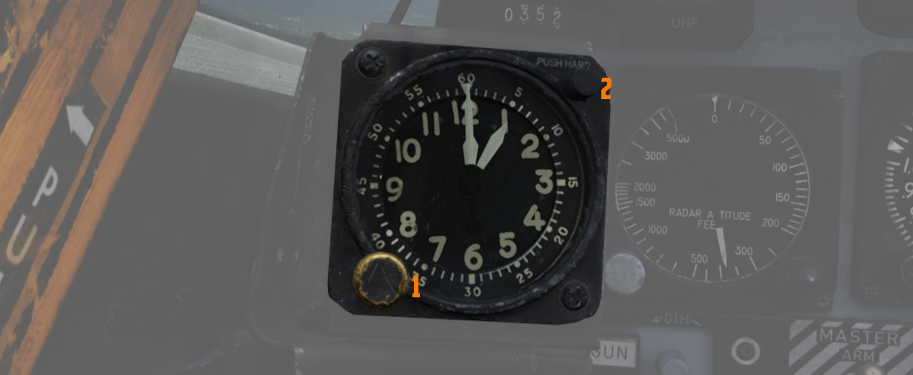

# Left Sub-Panel

The left sub-panel features most
of [the gear](../../systems/flight_controls_gear/gear_ground_handling.md) indicators (
1), [Slats and Flaps](../../systems/flight_controls_gear/flight_controls.md#slats-flap-system)
indicators (<num>2</num>), the external lights switch (<num>6</num>), the Aileron-Rudder
Interconnect fuse (<num>8</num>), a recorder
lamp (<num>3</num>), the landing gear lever (<num>9</num>) as well as the fuel boost pump
gauges (<num>4</num>). Also found on it is
the stabilator trim gauge (<num>5</num>) and the emergency release of the external stores
(<num>7</num>).

## 8-Day Clock

A clock is provided for the pilot, including a stopwatch function. The watch features a hour and
minute hand, and can be set by turning
the knob (<num>1</num>) on the left lower corner. The stopwatch function is activated by pressing
the top
right button (<num>2</num>), it features a minute and second hand.
The stopwatch needles are reset by pressing the top right button again.

## Landing Gear Handle

Actuates [the landing gear](../../systems/flight_controls_gear/gear_ground_handling.md); raised for
gear up, down for gear down.

Pulling the handle out will actuate the Emergency Mode and release the gear by
using a pair of compressed air bottles.

> 💡 The gear can not be retracted on ground.

## Landing Gear Position Indicators

[The Landing Gear](../../systems/flight_controls_gear/gear_ground_handling.md) Position Indicators
provide visual confirmation of current gear state, displaying UP when retracted, showing a barber
pole while in transition, or the illustration of a wheel in the respective window when fully down
and locked.

## Slats/Flaps Indicators

Visual indication
of [the Slat and Flap systems](../../systems/flight_controls_gear/flight_controls.md#slats-flap-system)
are provided through two window indicators. Slats will be displayed as IN (retracted) or OUT (
extended). Flaps will display as UP (retracted) or DN (down), and will show a barber pole while
in transition.

## Boost Pump Pressure Indicators

A pair of indicators provide confirmation of fuel boost pump operation.
Indicators are calibrated 0 to 5, which must be multiplied by 10 to read in
current PSI.

## Stabilator Trim Indicator

Provides current stabilator trim setting in units of trim (not equal to degrees). For Takeoff the
trim should be between 1-3 units nose down.

## Landing/Taxi Lights Switch

Control the [external Landing and Taxi lamps.](../../systems/lighting.md) Left main gear must be
down and locked for the switch to function

> 💡 Lights are turned off automatically when the gear is retracted.

## External Stores Emergency Release

Also called the "_panic button_", the External Stores Emergency Release will
immediately perform separation of all stores, without [air-to-air
weapons](../../stores/air_to_air/overview.md) or special weapons.

## Aileron Rudder Interconnect (ARI) Circuit Breaker

When pulled in conjunction with the Yaw ARI Stab Aug Switch disengaged, Yaw ARI
will be fully removed. With the Yaw ARI Stab Aug Switch engaged, 5 degrees of
ARI authority will be maintained.

See [3.1.2 Flight controls & AFCS](../../systems/flight_controls_gear/flight_controls.md#aileron-rudder-interconnect-ari)
for further information.

## Emergency Brake Handle

Pulling this handle activates the Emergency Hydraulic Brake System, dumping the remaining pressure
of the hydraulic accumulator in to the brake system for a limited number of brake applications. Note
that differential braking will work as normal, but will also serve to exhaust hydraulic pressure
more quickly.
