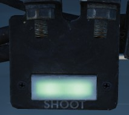
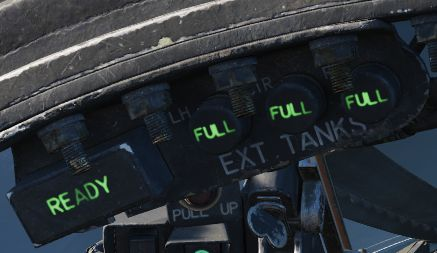
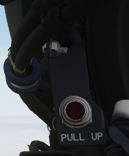

# Overhead Indicators

## SHOOT Lights

Illuminates when missile firing parameters are met. Do not illuminate when in visual intercept
or Air-to-Ground modes.

## Air Refueling Lights

Provide status of the [Air Refueling System](../../systems/utility.md#air-refueling-system) while
in use.

| Name       | Description                                                                                                      |
|------------|------------------------------------------------------------------------------------------------------------------|
| READY      | Illuminates when air refuel receptacle is fully extended. Turns off when boom is locked or receptacle retracted. |
| DISENGAGED | Illuminates when boom disengages during cycle, and remains lit until refueling system is reset.                  |
| L.H. FULL  | Indicates left hand external tank is full (also while refueling on ground).                                      |
| CTR. FULL  | Indicates centerline external tank is full (also while refueling on ground).                                     |
| R.H. FULL  | Indicates right hand external tank is full (also while refueling on ground).                                     |

## Labs Pull Up Light

Illuminates and disengages during [Loft](../../systems/weapon_systems/arbcs.md)
and [LABS](../../systems/weapon_systems/arbcs.md) bombing runs to provide timing
sequence information to the pilot.

## Standby Magnetic Compass

A standard magnetic compass for backup navigation assistance should the primary
flight director systems fail.

## Angle of Attack Indexer Lights

Provides quick confirmation of current aircraft AoA state based on illuminated
position and color.

## Range Indicator

This panel provides the pilot with a readout of the slant range measured by the
[Pave Spike](../../systems/weapon_systems/pave_spike/overview.md) Targeting Pod (x100 ft).

When the Test-Button is pressed, the display shows 888, the knob underneath it
controls the brightness of the readout.

The Mode-Knob allows the pilot to select one of two weapon delivery modes
available with the pod:

- WRCS - Automatic Delivery
- ROR - Release on Range

In the SET position, the display shows the desired release range used in the ROR
mode. The knob below the readout can be used to adjust this range.
