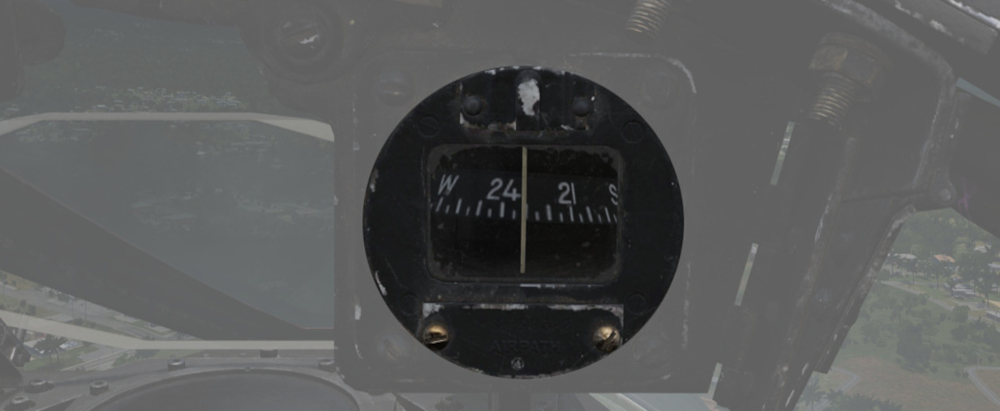
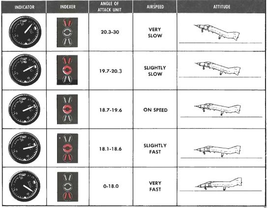

# Overhead Indicators

The overhead indicators offer information directly in the pilots view and aid in
situations where the pilot is focused and looking outside, such as during combat,
landing or refueling with a tanker.

## SHOOT Lights

A group of 5 lights arranged around the canopy bow, illuminating when missile
firing parameters are met. These lights do not illuminate when in visual intercept (VI)
or Air-to-Ground modes.

## Air Refueling Lights

Provide status of the [Air Refueling System](../../systems/utility.md#air-refueling-system) while
in use.

| Name       | Description                                                                                                      |
|------------|------------------------------------------------------------------------------------------------------------------|
| READY      | Illuminates when air refuel receptacle is fully extended. Turns off when boom is locked or receptacle retracted. |
| DISENGAGED | Illuminates when boom disengages during cycle, and remains lit until refueling system is reset.                  |
| L.H. FULL  | Indicates left hand external tank is full (also while refueling on ground).                                      |
| CTR. FULL  | Indicates centerline external tank is full (also while refueling on ground).                                     |
| R.H. FULL  | Indicates right hand external tank is full (also while refueling on ground).                                     |

## Labs Pull Up Light

Illuminates and disengages during [Loft](../../systems/weapon_systems/arbcs.md)
and [LABS](../../systems/weapon_systems/arbcs.md) bombing runs to provide timing
sequence information to the pilot.

## Standby Magnetic Compass

A standard magnetic compass for backup navigation assistance should the primary
flight director systems fail. The compass should only be used in level flight. Compass deviation
cards are found above the right canopy sill on each cockpit.

## Angle of Attack Indexer Lights

A pair of indicators to the left and right of the HUD that provide quick
confirmation of current aircraft AoA state based on illuminated
position and color.

Can also indicate weapon steering cues and an aural tone system backs
up the indication with audible cues.
See [3.1.2 Flight Controls, Angle of Attack System section](../../systems/flight_controls_gear/flight_controls.md#angle-of-attack-system)
for details.
