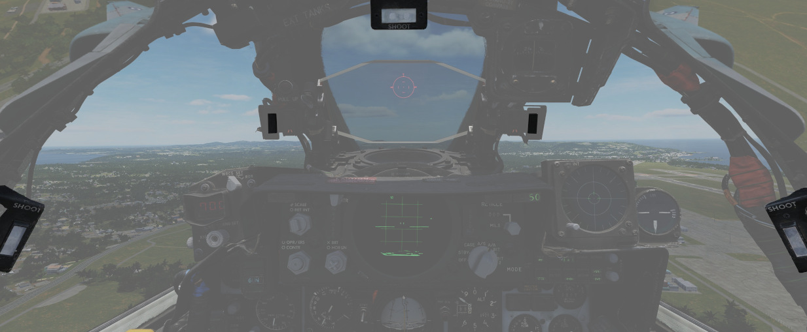

# 抬头指示器

头顶指示灯可直接在飞行员视野中为飞行员提供信息，并在如在战斗、着陆或与加油机进行空加，飞行员集中精力观察外部情况时提供帮助。

## SHOOT 灯

由 5 盏灯组成，布置在座舱盖框架周围，在满足导弹发射参数时亮起。在目视拦截（VI）或空对地模式下，指示灯保持熄灭。

## 空加指示灯

提供 [空加系统](../../systems/utility.md#air-refueling-system) 的状态指示。

| 名称       | 描述                                                       |
| ---------- | ---------------------------------------------------------- |
| READY      | 在受油口完全展开时亮起。当供油硬管锁定或收起受油口时熄灭。 |
| DISENGAGED | 作业时供油硬管断开后亮起，并在空加复位前保持亮起。         |
| L.H. FULL  | 指示左手副油箱已满（在地面加油时一样）。                   |
| CTR. FULL  | 指示中线副油箱已满（在地面加油时一样）。                   |
| R.H. FULL  | 指示右手副油箱已满（在地面加油时一样）。                   |

## 低空轰炸系统拉起灯

在 [上仰](../../systems/weapon_systems/arbcs.md) 和 [LABS](../../systems/weapon_systems/arbcs.md) 轰炸作业时亮起或熄灭来为飞行员提供时机序列信息。

## 备用罗盘

标准磁罗盘，用于在主飞行指引系统出现故障时提供备用导航辅助。罗盘只能在平飞时使用。罗盘偏差卡位于每个驾驶舱右侧座舱盖下边框上方。

## 迎角分度器指示灯

HUD 左右两侧有一对指示器，可根据发光位置和颜色快速确认飞机当前的 AoA 状态。

分度器还可以指示武器转向提示，以及一个用作备份音频提示的音调提示系统。
详见 [3.1.2 飞行控制设备，迎角系统部分](../../systems/flight_controls_gear/flight_controls.md#angle-of-attack-system) 。
