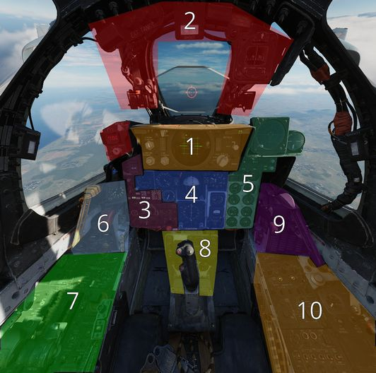

# Pilot Cockpit Overview

The pilot cockpit is divided into a front section, containing all instruments
and weapon controls, as well as the radar screen; the left console area with
engine, control surfaces and navigation related settings; the pedestal group
holding auxiliary information; and the right console area with communication and
lighting controls.

## Layout

| Section | Name                                              |
| ------: | ------------------------------------------------- |
|      1. | [DSCG Controls](dcsg_controls.md)                 |
|      2. | [Overhead Indicators](overhead_indicators.md)     |
|      3. | [Weapon Management](weapon_management.md)         |
|      4. | [Flight Director Group](flight_director_group.md) |
|      5. | [Right Main Panel](right_main_panel.md)           |
|      6. | [Left Sub-Panel](left_sub_panel.md)               |
|      7. | [Left Console](left_console/overview.md)          |
|      8. | [Pedestal Group](pedestal_group.md)               |
|      9. | [Right Sub-Panel](right_sub_panel.md)             |
|     10. | [Right Console](right_console/overview.md)        |
|     11. | [Stick and Seat](stick_seat.md)                   |
