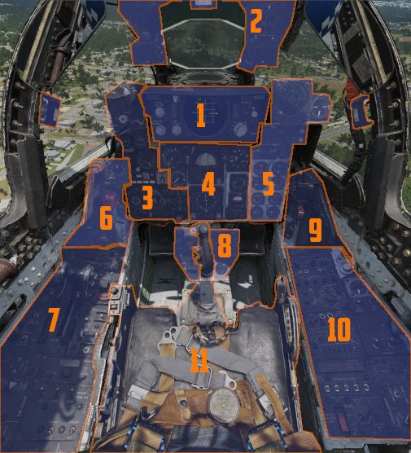

# 飞行员驾驶舱总览

驾驶员座舱分为前部（包含所有仪表和武器控制开关/按钮以及雷达屏幕）、左侧控制台区域（包含发动机、操纵面和导航相关设置）、底座组（包含辅助信息）和右侧控制台区域（包含通信和照明控制开关/按钮）。

## 布局

| 部分   | 名称                                              |
| ------: |---------------------------------------------------|
|      1. | [DSCG 开关/按钮](dscg_controls.md)                 |
|      2. | [抬头指示器](overhead_indicators.md)     |
|      3. | [武器管理](weapon_management.md)         |
|      4. | [飞行指引指示器组](flight_director_group.md) |
|      5. | [右侧主面板](right_main_panel.md)           |
|      6. | [左侧子面板](left_sub_panel.md)               |
|      7. | [左侧控制台](left_console/overview.md)          |
|      8. | [底座组](pedestal_group.md)               |
|      9. | [右侧子面板](right_sub_panel.md)             |
|     10. | [右侧控制台](right_console/overview.md)        |
|     11. | [驾驶杆和座椅](stick_seat.md)                   |
