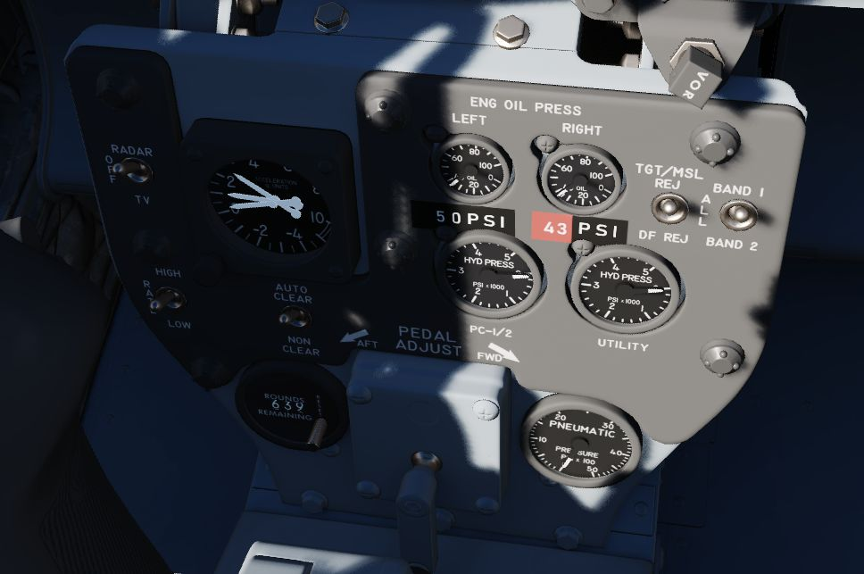
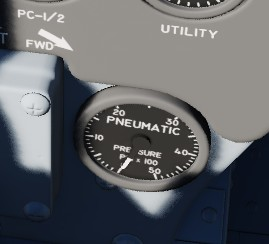
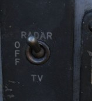
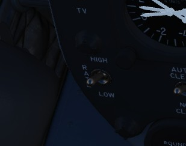
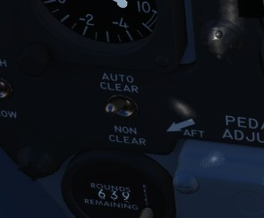
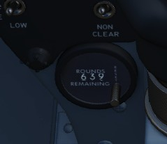
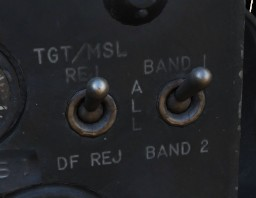
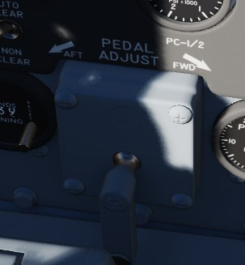

# Pedestal Group

This panel behind the stick offers mostly auxiliary information and controls.

## Accelerometer

Calibrated from negative 4 to positive 10 in units of G, with three pointers -
one for current applied load, the other two show maximum positive and negative G
applied during the flight. Pressing the PUSH TO SET button will reset the
maximum position indicators to 1 G.

## Engine Oil Pressure Indicators

A pair of engine oil pressure indicators are provided, one for each engine,
calibrated from 0 to 10, multiplied by 10 to read as units of PSI. Normal values are 15 psi while
the engines are running.

## Hydraulic pressure Indicators

Two hydraulic pressure indicators are installed. One references the Utility
Hydraulic System pressure, while the other references the PC-1 and PC-2
Hydraulic Systems; the latter includes two needles, and are marked accordingly. For further
information see the [hydraulics system chapter](../../systems/hydraulics.md).

## Pneumatic Pressure Indicator

Provides cumulative manifold pressure of the compressed engine bleed air used to
drive the aircraft's pneumatic actuated equipment. For further information see the [pneumatic system
chapter](../../systems/pneumatics.md).

## Screen Source Switch

Controls which video source is displayed on the DSCG screen.
This is independent of the WSO, allowing the pilot to view a source different to the WSO.

In the Radar position, the radar will be displayed on the screen. TV will either
display weapon feeds, such as Maverick, or the targeting pod camera;
depending on the [Video Select Button](../wso/left_sub_panel.md#video-select-button)
in the WSO cockpit.

The Off-position turns the screen off.

## Rate of fire Switch

Used to switch the gun rate of fire between a HIGH setting (6000 rounds per minute) and a LOW
setting (4000 rounds per minute).

## Auto clear switch

The cannon will fire approximately between 5 and 11 rounds from the point the pilot has released the
trigger to clear all bolt actions in the cannon. This spin-down takes approximately one second
during which the gun cannot be fired again during this operation. This only applies to externally
carried gun pods and not to the main gun. The auto clear option should be used everytime a gun
pod is used.

## Rounds Remaining Indicator

Shows the currently available number of nose gun rounds. The counter must be set
manually by the pilot whenever rearming.

## Shrike Controls

Two switches to control [AGM-45 Shrikes](../../stores/air_to_ground/missiles/shrike.md)
settings.

### TGT/MLS Reject Switch

Selects which target source to use and select, either TGT/MSL REJ, ALL or DF REJ.

### Band Switch

Selects the bands to pickup by the weapon.

## Rudder Pedal Adjustment Crank

Used to adjust ergonomic position of the rudder pedals forward or back from the
pilot.

Requires 38 full turns to move the pedals across the entire range.
