# Pedestal Group

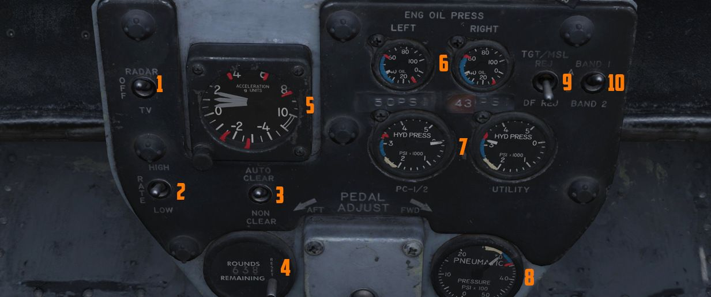

The pedestal group features the screen source switch (<num>1</num>), the rate of
fire switch (<num>2</num>), the auto clear switch (<num>3</num>), a rounds
counter (<num>4</num>), an accelerometer (<num>5</num>), engine oil pressure
gauges (<num>6</num>), hydraulic pressure gauges (<num>7</num>), the TGT/MSL
switch (<num>9</num>), a band selector switch (<num>10</num>) and a pneumatic
pressure gauge (<num>8</num>).

## Accelerometer

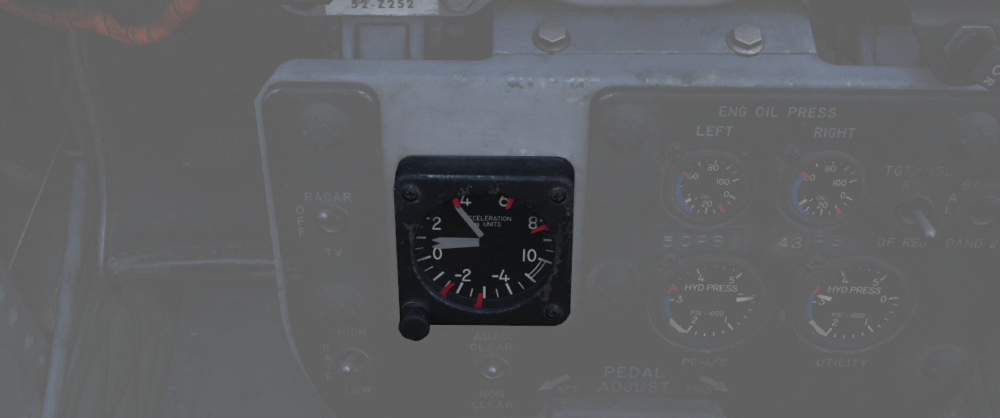

Calibrated from negative 4 to positive 10 in units of G, with three pointers -
one for the current applied load, the other two show maximum positive and
negative G applied during the flight. Pressing the PUSH TO SET button will reset
the maximum position indicators to 1 G.

## Engine Oil Pressure Indicators

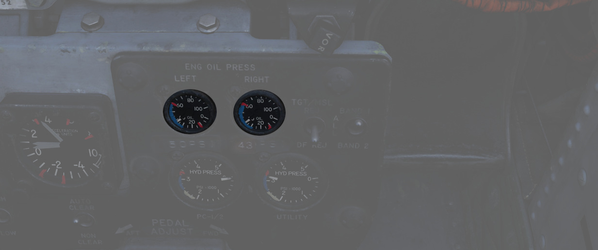

A pair of engine oil pressure indicators is provided, one for each engine,
calibrated from 0 to 100 PSI. Engine oil is used for lubrication, variable
nozzle positioning, and a constant speed drive unit operation. Important values
are:

- 12 PSI - Minimum at idle RPM
- 30-60 PSI - In-flight military
- 35 PSI - Static minimum at military thrust
- 60 PSI - Maximum

For further information, see
[3.2.1 Engines chapter](../../systems/engines_and_fuel_systems/engines.md).

## Hydraulic Pressure Indicators

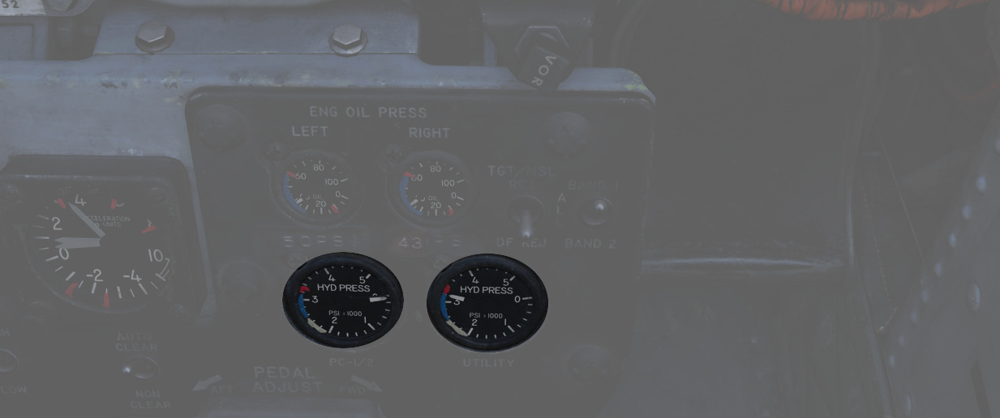

Two hydraulic pressure indicators are installed. The one on the right references
the Utility Hydraulic System pressure, while the left one references the PC-1
and PC-2 Hydraulic Systems. The latter includes two needles, which are marked
accordingly. Pressure transmitters, one for each system, convert pressure
impulses to electrical impulses, which, in turn, are supplied to the indicators.
Nominal operating pressure for all three systems is 3000 ±250 PSI. Other
important values are:

- 2000-2750 - Normal with rapid control movement
- 2750-3250 - Normal
- 3250-3400 - If pressure exceeds 3250 steady state, and entry must be logged on
  form 781
- 3400 - Maximum

For further information, see
[3.5 Hydraulics chapter](../../systems/hydraulics.md).

## Pneumatic Pressure Indicator

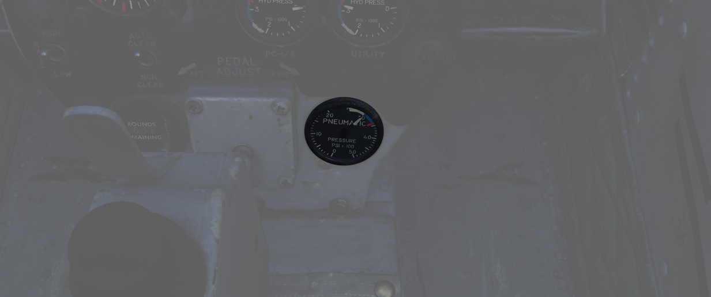

Shows the manifold pressure of the pneumatic system measured by the pressure
transmitter, which supplies electrical inputs to the indicator. Keep in mind
that it doesn't show individual emergency pneumatic bottle pressures. Normal
system pressure range is from 2650 to 3300 psi due to pressure transmitter and
pressure gauge tolerances.

Other important values are:

- 3300-3500 - Caution area
- 3500 - Maximum

For further information, see the
[3.6 Pneumatics chapter](../../systems/pneumatics.md).

## Screen Source Switch

Controls which video source is displayed on the DSCG screen. This is independent
of the WSO, allowing the pilot to view a source different to the WSO.

In the Radar position, the radar will be displayed on the screen. TV will either
display weapon feeds, such as Maverick, or the targeting pod camera; depending
on the [Video Select Button](../wso/left_sub_panel.md#video-select-button) in
the WSO cockpit.

The Off-position turns the screen off.

## Rate of fire Switch

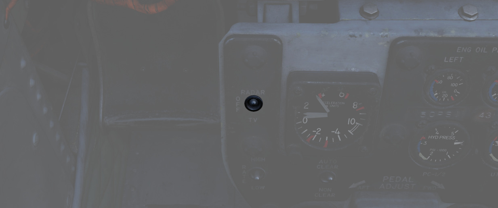

Used to switch the gun rate of fire between a HIGH setting (6000 rounds per
minute) and a LOW setting (4000 rounds per minute).

## Auto clear switch

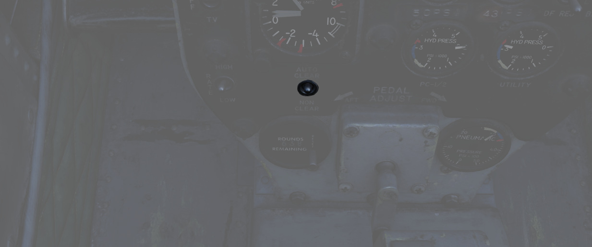

The cannon will fire approximately between 5 and 11 rounds from the point the
pilot has released the trigger to clear all bolt actions in the cannon. This
spin-down takes approximately one second, during which the gun cannot be fired
again during this operation. This only applies to externally carried gun pods
and not to the main gun.

The AUTO CLEAR option should be used whenever a gun pod is used.

## Rounds Remaining Indicator

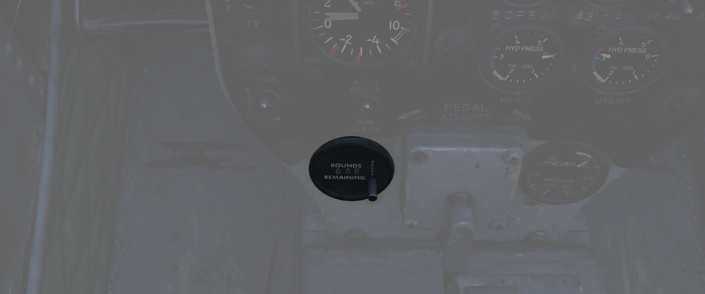

Shows the currently available number of nose gun rounds. The counter must be set
manually by the pilot whenever rearming.

## Shrike Controls

Two switches to control
[AGM-45 Shrikes](../../stores/air_to_ground/missiles/shrike.md) settings.

### TGT/MSL Reject Switch

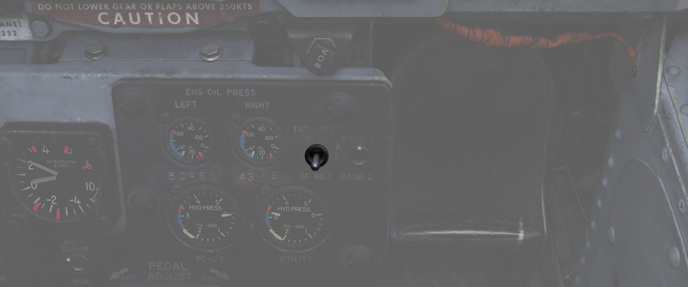

Dual purpose switch to control
[Mavericks](../../stores/air_to_ground/missiles/maverick.md) and
[Shrikes](../../stores/air_to_ground/missiles/shrike.md).

For Mavericks, the spring-loaded TGT/MSL REJ position cycles through the
available Mavericks that are currently selected and armed. If six Mavericks are
equipped, the station with the uncaged and active Maverick is cycled. To cycle
to the other station, simply de-arm the active station and select the other. The
DF REJ position has no function.

For Shrikes, TGT/MSL REJ turns off the weapon seeker entirely until released.
The DF REJ position selects the WRCS mode for receiving a solution, while the
center position uses the weapon's own, less accurate seeker system instead.

### Band Switch

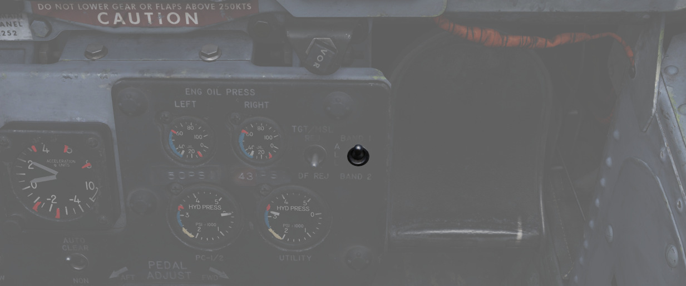

Allows to select the band range picked up by
[Shrikes](../../stores/air_to_ground/missiles/shrike.md).

> 💡 Not all variants support band switching.

## Rudder Pedal Adjustment Crank

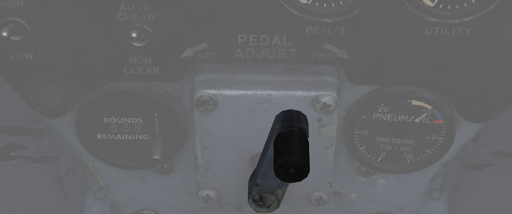

Used to adjust the ergonomic position of the rudder pedals forward or back from
the pilot.

Requires 38 full turns to move the pedals across the entire range.
