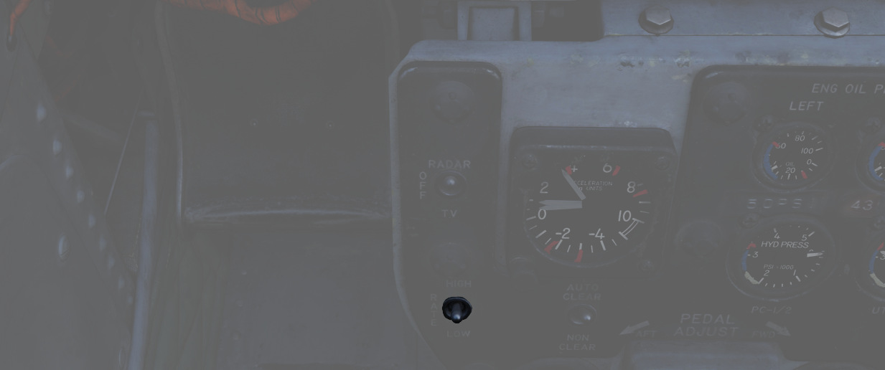

# 底座组

位于驾驶杆后方的面板，包括许多辅助信息以及控制开关/按钮。

## 加速度表

有效显示区间为负 4 到 正 10 个 G，仪表内有三枚指针——一个指示当前过载，另外两枚显示历史最大正负过载
。按下 PUSH TO SET 按钮了复位最大过载指示到 1 G。

## 发动机滑油压力表

面板中有一对发动机滑油压力表，两枚仪表各对应一台发动机，有效显示区间为 0 到 100 PSI。发动机滑油系统
用于润滑、可变喷口定位以及恒速驱动装置工作。重要数值分别是：

- 12 PSI - 慢车 RPM 最低值
- 30-60 PSI - 飞行中军推数值水平
- 35 PSI - 静态军推最低值
- 60 PSI - 最大值

详见 [3.2.1 发动机章节](../../systems/engines_and_fuel_systems/engines.md)。

## 液压压力表

面板中安装了两枚液压压力表。右侧的仪表显示公用液压系统的压力，左侧仪表显示 PC-1 和 PC-2 液压系统的
压力；后者包括两根针，针上有相应的标记。压力变送器（每个系统一个）将压力脉冲转换为电脉冲，然后将电
脉冲提供给仪表。所有三个系统的额定工作压力均为 3000 ±250 PSI。其他重要数值包括：

- 2000-2750 - 快速移动操纵设备下的正常压力值
- 2750-3250 - 正常压力值
- 3250-3400 - 如果稳定超出 3250，必须在表格 781 记录
- 3400 - 最大值

详见 [3.5 液压章节](../../systems/hydraulics.md)。

## 气压压力表

显示由压力变送器测量的气动系统集合管压力，变送器为仪表提供电信号输入。请注意，仪表不显示独立的应急
气动瓶的压力。由于压力变送器和压力表的容差，正常系统压力区间为 2650 至 3300 psi。

其他重要数值包括：

- 3300-3500 - 注意区
- 3500 - 最大

详见 [3.6 气动章节](../../systems/pneumatics.md)。

## 屏幕显示源开关

开关控制在 DSCG 屏幕上显示的视频源。屏幕显示源开关独立于 WSO，允许飞行员查看与 WSO 不同的视频源。

在雷达档位，屏幕上将显示雷达。TV 将根据 WSO 驾驶舱内的
[视频选择按钮](../wso/left_sub_panel.md#video-select-button) ，显示“幼畜”等武器画面或瞄准吊舱画面。

OFF 档位将关闭屏幕。

## 射速开关

用于在 HIGH 设置（每分钟 6000 发）和 LOW 设置（每分钟 4000 发）之间切换航炮射速。

## 自动清膛开关

从飞行员松开扳机开始，航炮将发射大约 5 至 11 发子弹，来使航炮完成清膛动作。这一减速过程大约需要 1
秒钟，在此期间，航炮无法再次开火。清膛仅适用于外挂的航炮吊舱，不适用于机载航炮。

只要使用航炮吊舱，就应该将开关拨至 AUTO CLEAR 档位。

## 航炮弹药计数器

显示当前可用的机头航炮炮弹数。重新填装时必须由飞行员手动设置计数器。

## 百舌鸟控制开关

用于控制 [AGM-45 “百舌鸟”](../../stores/air_to_ground/missiles/shrike.md) 设置的两个开关。

### TGT/MLS 断开开关

用于控制 [“幼畜”](../../stores/air_to_ground/missiles/maverick.md) 和
[“百舌鸟”](../../stores/air_to_ground/missiles/shrike.md) 的两用开关。

对于“幼畜”，弹簧归中的 TGT/MSL REJ 档位可在当前已选择和解除保险的可用“幼畜”中循环切换。DF REJ 档位
无功能。

对于 “百舌鸟”，TGT/MSL REJ 档位可到投放前完全关闭武器导引头。DF REJ 档位选择 WRCS 模式接收解算，而
中间档位则使用武器自身精度较低的导引头系统。

### 波段开关

开关用来选择 [“百舌鸟”](../../stores/air_to_ground/missiles/shrike.md) 截获的波段。

> 💡 并非所有型号支持波段切换。

## 方向舵脚蹬调整曲柄

用于向前或向后调整方向舵脚蹬到人体工学位置。

两个最大行程之间需要转动 38 圈。
