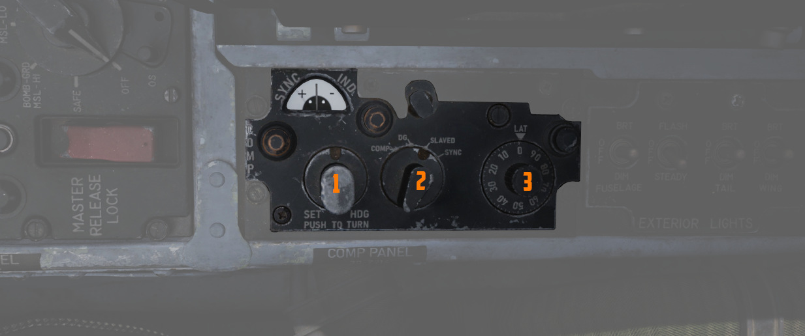
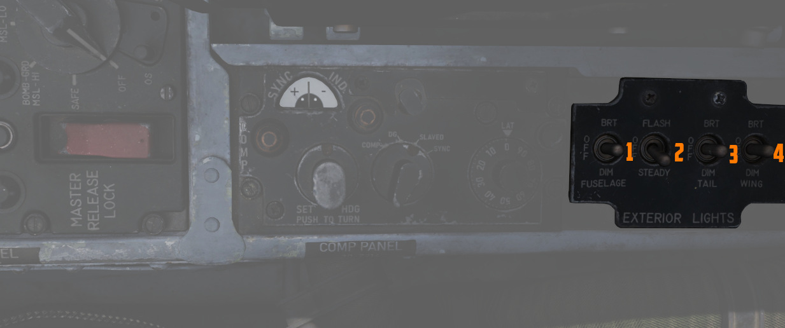
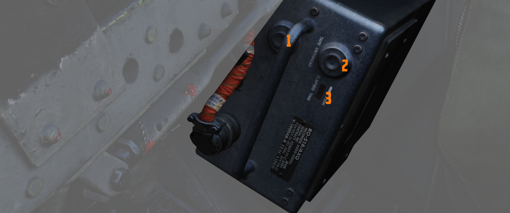

# Aft Section

The aft section of the right console has navigation equipment and controls for
exterior lighting.

## Compass Control Panel

Manages essential controls for the proper operation of the AJB-7 azimuth system.
Essential for accurate azimuth output to instruments like
[ADI,](../../pilot/flight_director_group.md#attitude-director-indicator)
[HSI,](../../pilot/flight_director_group.md#horizontal-situation-indicator)
[BDHI,](../../wso/upfront_indicators.md#bearing-distance-heading-indicator-bdhi)
but also to the rear seat
[attitude indicator,](../../wso/upfront_indicators.md#attitude-indicator)
[autopilot,](../../../systems/flight_controls_gear/flight_controls.md#auotmatic-flight-control-system-afcs)
and [bombing computer.](../../../systems/weapon_systems/wrcs.md)

### Mode Selector Knob

Switches (<num>2</num>) between different operating modes — Compass, DG
(directional gyro), and Slaved. It also has a spring-loaded SYNC position for
fast synchronization of the azimuth system based on the compass flux valve
signal. The flux valve is an electronic sensor in the aircraft's left wing that
detects magnetic fields to provide the primary reference for magnetic heading.
However, it is very sensitive to changes in the aircraft's attitude and even
minor accelerations.

| Name                  | Description                                                                                                                                                                                                                  |
| --------------------- | ---------------------------------------------------------------------------------------------------------------------------------------------------------------------------------------------------------------------------- |
| COMP (Compass)        | Used in emergencies when the reference systems fail. Supplies magnetic heading directly from the flux valve                                                                                                                  |
| DG (Directional Gyro) | Used in extreme latitudes and regions with magnetic distortion, the initial magnetic heading needs manual adjustment. If the reference system is set to STBY, the aircraft's latitude must be adjusted on the latitude knob. |
| Slaved                | Primary operational mode under typical conditions, it depends on signals from the flux valve for a gradual synchronization of the system.                                                                                    |
| SYNC                  | Spring-loaded to return to SLAVED, facilitates fast synchronization between the compass flux valve and azimuth reference.                                                                                                    |

### Hemisphere Switch and Latitude Control Knob

Adjusted to set the aircraft's hemisphere and latitude in the DG Compass System
mode, when operating with the STBY reference system. The hemisphere is
determined by rotating the screw (<num>6</num>) above the latitude knob. When
the PRIM reference system mode is active, setting a latitude other than zero
will cause errors by doubling drift compensation due to INS corrections.

### Set Heading Control Knob

Push-to-turn knob (<num>1</num>), spring-loaded to return to the center, permits
the manual adjustment of the azimuth, crucial when operating in the DG mode.

### Sync Indicator

Displays (<num>4</num>) the azimuth deviation between the flux valve signal and
the internal reference system.

## Exterior Lights Control Panel

This panel contains controls connected to most of the exterior lighting:

- 3 position lights (green, red, white)
- 2 wingtip join-up lights (green, red)
- 3 fuselage lights (white)
- anti-collision tail light with 2 lamps (red)

Three switches labelled Fuselage, Tail and Wing control the brightness of the lights
between BRT (Bright), DIM and OFF.

To ensure lights are available even in case of power failure conditions, the BRT
and DIM selections are routed through different buses:

| Lamp       | Bus                   |
| ---------- | --------------------- |
| Bright     | Right Main 28V DC Bus |
| Dim        | Left Main 14V AC Bus  |
| Anti-Col 1 | Right Main 14V AC Bus |
| Anti-Col 2 | Left Main 14V AC Bus  |

For further information about the lighting, see the
[3.9 lighting chapter.](../../../systems/lighting.md#exterior-lighting)

### Fuselage Switch

The three position switch (<num>1</num>) controls the three white fuselage
lights.

Additionally, if set to BRT and the Flasher Switch is set to FLASH, both
anti-collision lights illuminate.

### Tail Switch

The three position switch (<num>3</num>) controls the position light on the
tail.

### Wing Switch

The three position switch (<num>4</num>) controls two of the three position and
the two join-up lights on the wingtips.

### Flasher Switch

A three-position switch (<num>2</num>) that can be set to OFF, STEADY or FLASH
to additionally control the setting for:

- one of the two anti-collision lamps
- tail position light
- fuselage lights

If set to OFF, the controlled lights are OFF regardless of their respective
switches. In the STEADY position, they light up corresponding to the selected
brightness. The FLASH position lets the controlled lights phase from the set
brightness to a low brightness and back.

## Airborne Video Tape Recorder

The AVTR system is installed in the rear section to the right of the seat. It is
primarily controlled by the WSO and records the intercom sound, as well as the
rear radar screen.

Footage is recorded on a standard U-matic S cassette, which can be removed and
replaced using the EJECT Button (<num>1</num>) on the top left of the box. The
UNTHREAD button (<num>2</num>) next to it is used to unthread the tape of the
cassette back to the start, causing it to overwrite previously recorded footage.

The cassette can record up to 20 minutes, as indicated on the small display
labelled ELAPSED TIME (<num>3</num>).

See [9.6 DCS Recorders](../../../dcs/recorders.md) for details on how to access
the footage.

> 💡 Our simulation of the AVTR also doubles as a music player, see
> [Tape Player](../../../dcs/tape_player.md) for details.

<iframe width="560" height="315" src="https://www.youtube.com/embed/rXz41sNfD9U?si=GoQNcYvQuaP-qNcM"
title="DCS F-4E Phantom: AVTR Recorder Tutorial video for Debriefing / Recon" frameborder="0"
allow="accelerometer; autoplay; clipboard-write; encrypted-media; gyroscope; picture-in-picture; web-share"
referrerpolicy="strict-origin-when-cross-origin" allowfullscreen></iframe>
