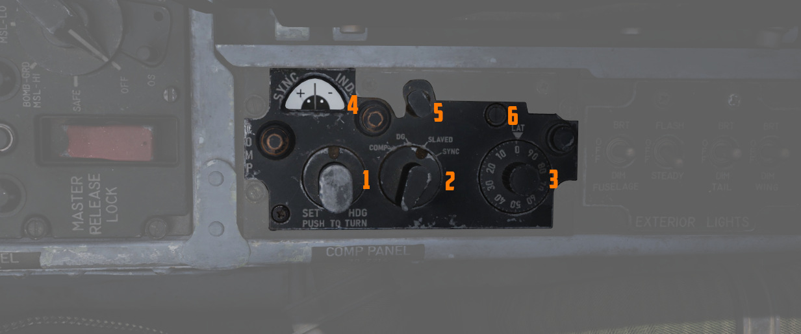

# 后部

右侧控制台的后部装有导航设备和机外照明控制开关/按钮。

## 罗盘控制面板

管理 AJB-7 方位角系统正常运行所必要的控制开关/按钮。不仅要
向[ADI、](../../pilot/flight_director_group.md#attitude-director-indicator)
[HSI](../../pilot/flight_director_group.md#horizontal-situation-indicator) 和
[BDHI](../../wso/upfront_indicators.md#bearing-distance-heading-indicator-bdhi) 等仪表输出精确的方
位角，还要向后座的 [姿态仪、](../../wso/upfront_indicators.md#attitude-indicator)
[自动驾驶](../../../systems/flight_controls_gear/flight_controls.md#auotmatic-flight-control-system-afcs)
和 [轰炸计算机](../../../systems/weapon_systems/wrcs.md) 输出准确的方位

### 模式选择旋钮

可在罗盘、DG（航向陀螺）和隶属等不同操作模式之间切换。旋钮还有一个弹簧复位 SYNC 档位，用于根据罗盘
磁通传感器信号快速同步方位系统。磁通传感器是一个位于飞机左翼的电子传感器，用于探测磁场，为磁航向提供主要基
准航向。然而，它对飞机姿态的变化甚至轻微的加速度都非常敏感。

| 名称          | 描述                                                                                                              |
| ------------- | ----------------------------------------------------------------------------------------------------------------- |
| COMP (罗盘)   | 当基准系统发生故障时，可在应急情况下使用。直接从磁通传感器提供磁航向                                                  |
| DG (航向陀螺) | 在高纬度和磁场畸变地区时使用，初始磁航向需要手动调整。如果基准系统设置为 STBY，则必须通过纬度旋钮调整飞机的纬度。 |
| Slaved        | 在常规条件下的主要工作模式，隶属模式依靠磁通传感器的信号来逐步对系统进行同步。                                        |
| SYNC          | 弹簧复位至 SLAVED 档位，方便罗盘磁通传感器和方位基准之间进行快速同步。                                                |

### 半球开关与纬度控制旋钮

开关用于当使用 STBY 基准系统进行操作时，在 DG 罗盘系统模式下设置飞机的半球和纬度。半球通过转动位于
纬度旋钮上方的螺钉确定。当使用 PRIM 基准系统模式时，如果将纬度设置为非零值，那么会因 INS 修正导致漂
移补偿加倍从而产生误差。

### 航向设置控制旋钮

按下转动旋钮，弹簧复位至中立位，可使用旋钮手动调整方位，在 DG 工作模式下调整方位至关重要。

### 同步指示器

显示磁通传感器信号和机内基准系统之间的方位偏差。

## 机外照明控制面板

面板包括多数连接到机外照明灯光的控制开关/按钮：

- 3 航行灯（绿、红、白） - 2 翼尖会合灯（绿、红） - 3 机身灯（白） - 2 盏垂尾防撞灯（红）

三个开关分别标有机身、垂尾和机翼，分别在 BRT（亮）、DIM 和 OFF 之间控制灯光亮度。

为确保灯光及时在断电情况下也能使用，选择 BRT 和 DIM 档位将接入不同的总线：

| 灯         | 总线             |
| ---------- | ---------------- |
| Bright     | 右主 28V DC 总线 |
| Dim        | 左主 14V AC 总线 |
| Anti-Col 1 | 右主 14V AC 总线 |
| Anti-Col 2 | 左主 14V AC 总线 |

关于照明的详细信息请阅读 [3.9 照明章节。](../../../systems/lighting.md#exterior-lighting)

### 机身开关

控制三个白色机身灯。

此外，如果将开关设置的 BRT 且闪光器开关设置到 FLASH 档位，那么防撞灯将同时亮起。

### 垂尾灯开关

控制位于垂直安定面上的航行灯。

### 机翼灯开关

控制位于翼尖上的两个航行灯以及两个会合灯。

### 闪光器开关

可将开关设置到 OFF、STEADY 或设置到 FLASH 来额外控制以下灯光：

- 两枚中的一枚防撞灯泡 - 垂尾航行灯 - 机身灯

如果将开关设置到 OFF 档位，那么受控的灯光将不论对应开关的设置，都将会熄灭。在 STEADY 档位，开关可控
制的灯光将根据选定亮度来进行照明。FLASH 档位将使受控灯光从设定亮度到低亮度再回到设定亮度。

## 机载录像机

AVTR 系统安装在弹射座椅右侧的后部。AVTR 系统主要由 WSO 控制，可记录内话声音以及后座雷达屏幕。

录像记录在标准的 u-matic S 格式磁带上，飞行员可以使用控制盒左上方的 EJECT 按钮弹出并更换磁带。旁边
的 UNTHREAD 按钮用于将磁带拉回到起点，从而覆写之前录制的镜头。

> 💡 弹出磁带当前尚未模拟。

磁带可录制时间最长可达 20 分钟，剩余录制时间在标有 ELAPSED TIME 的小窗口中指示。

查看录像的详细步骤请阅读 [9.6 DCS 录像机](../../../dcs/recorders.md) 章节。
