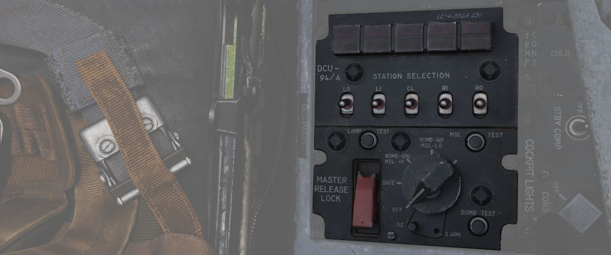
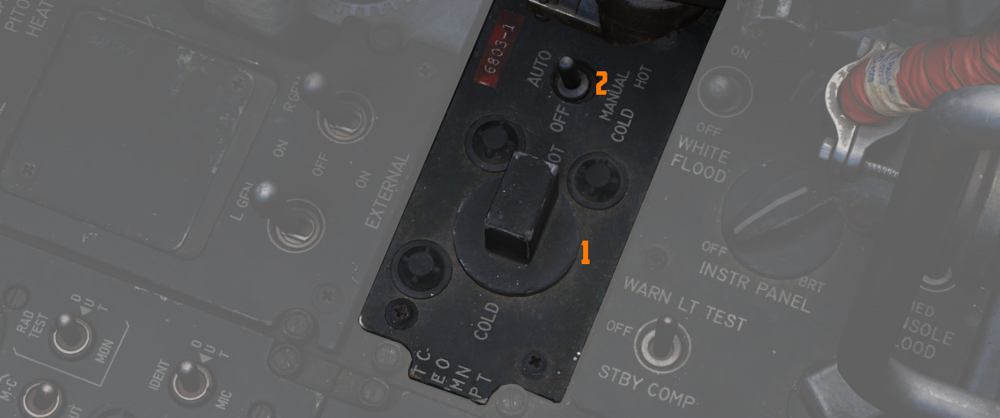

# Center Section

The center area of the right console contains IFF and lighting controls.

## IFF Control Panel

As opposed to the Interrogator panel in the WSO cockpit, this panel provides
the pilot with the ability to adjust the IFF transponder of the own aircraft.
Which would then be picked up by interrogators in other aircraft.

> 💡 Due to engine limitations, the settings on the panel have no effect for DCS.
> However, they are exposed to external tools, such as SRS.

For further explanation see
the [IFF System controls chapter](../../../systems/identification_systems.md#iff-controls-and-indicators).

### Master switch

The master switch is a five position rotary with following controls:

| Position | Operation                                                                                                                                                                                                                                       |
|----------|-------------------------------------------------------------------------------------------------------------------------------------------------------------------------------------------------------------------------------------------------|
| Off      | Identification system de-energized.                                                                                                                                                                                                              |
| STBY     | Full Power supplied to the system but with interrogations blocked.                                                                                                                                                                              |
| LOW      | System operates with reduced sensitivity.                                                                                                                                                                                                       |
| NORM     | System operates at full sensitivity.                                                                                                                                                                                                            |
| EMER     | Allows the system to respond to interrogations in Modes 1, 2 and 3/A. The reply for Modes 1 and 2 is a special emergency signal of the codes selected on the applicable dials, while Mode 3/A replies are special emergency signals of code 7700. |

### Mode 1 Selector Switch

The three position Mode 1 Selector switch controls the mode 1 operation:

| Position | Operation                        |
|----------|----------------------------------|
| M-1      | Self test position (Inoperative) |
| ON       | Enables Mode 1 for operation.    |
| Out      | Disables Mode 1                  |

### Mode 2 Selector Switch

The three position Mode 2 Selector switch controls the mode 2 operation:

| Position | Operation                                                            |
|----------|----------------------------------------------------------------------|
| M-2      | Self test position. Light illuminates if mode is operating properly. |
| ON       | Enables Mode 2 for operation.                                        |
| Out      | Disables Mode 2                                                      |

### Mode 3/A Selector Switch

The three position Mode 3/A Selector switch controls the mode 3/A operation:

| Position | Operation                                                            |
|----------|----------------------------------------------------------------------|
| M-3/A    | Self test position. Light illuminates if mode is operating properly. |
| ON       | Enables Mode 3/A for operation.                                      |
| Out      | Disables Mode 3/A                                                    |

### Mode C Selector Switch

The three position Mode C Selector switch controls the mode C operation:

| Position | Operation                        |
|----------|----------------------------------|
| M-C      | Self test position (Inoperative) |
| ON       | Enables Mode C for operation.    |
| Out      | Disables Mode C                  |

### Mode 1 and Mode 3/A Code selectors

The Mode 1 code selector is used to select Mode 1 codes from 00 to 73. The Mode 3/A code selector
is used to select Mode 3/A codes from 0000 to 7777.

### Mode 4 Selector Switch

The two position Mode 4 Selector switch controls the mode 4 operation:

| Position | Operation                                                                                                                                                         |
|----------|-------------------------------------------------------------------------------------------------------------------------------------------------------------------|
| ON       | Enables Mode 4 for Operation.                                                                                                                                     |
| Out      | Inhibits Mode 4 from replying. If Mode 4 code is inserted, an interrogation will cause the IFF warning light and the MASTER CAUTION light to come on momentarily. |

### Mode 4 Indication Switch

The Mode 4 indication switch features positions for AUDIO, OUT, and LIGHT.

In the AUDIO position, an
audio signal indicates reception of Mode 4 interrogations, and the Mode 4 REPLY light illuminates
during transmissions. In the LIGHT position, the Mode 4 REPLY light illuminates when Mode 4 replies
are transmitted, and audio is not present. In the OUT position, both light and audio indications are
inactive.

To test the press-to-test Mode 4 reply indicator light, the indication switch must be in
the AUDIO or LIGHT position.

### Mode 4 Function Switch

The Mode 4 function switch has positions of ZERO, B, A, and HOLD.

In the A position, the transponder
responds to Mode 4 interrogations with the same setting as set into the A position, and in the B
position, it responds to interrogations with the same code setting as set into the B position. If
the switch is in the wrong position for the code being interrogated (e.g., in A with B
interrogation), the IFF warning light and MASTER CAUTION light will not activate.

> 💡 Code settings for
> A and B positions are inserted before flight and can be zeroed by placing the switch to ZERO.

The
HOLD position is not used in flight but retains the code setting if another flight is anticipated
during the code period. Momentarily positioning the switch to HOLD after landing, waiting 15
seconds, and then turning off the IFF master switch and radar power knob retains the code with the
power off.

Illumination of the IFF warning light and MASTER CAUTION light can be caused by internal
component failure, failure to respond to a valid interrogation, or a zeroized code.

### Monitor-Radiation Test Switch

This switch has three positions, RAD TEST, MON and OUT. It is intended for tests by
the ground crew and should be set to OUT and not used during flight.

### Identification of Position Switch

The Identification switch is a three position toggle switch used to provide momentary identification
of position.

| Position | Operation                                                                                                                                                                                     |
| -------- | --------------------------------------------------------------------------------------------------------------------------------------------------------------------------------------------- |
| IDENT    | Allows the system to respond with identification of position replies in all modes that are being used. The response is continued for a 15 to 30 second duration after the switch is released. |
| OUT      | Disables identification of position capability.                                                                                                                                               |
| MIC      | Same as positioning the switch to IDENT, except that the UHF microphone button must be used to trigger the identification.                                                                    |

## DCU-94A Stores Control-Monitor Panel

This panel is used to control and test the separate release circuit system for
nuclear stores.

Nuclear stores are separated from the regular release system to prevent
accidental release.

> 💡 This is not simulated in-game.

## Temperature Control

The knob can be used with the switch in the AUTO position and
allows the pilot to set the temperature inside both cockpits
from COLD to HOT for crew comfort.

Should the AUTO system fail, the switch can be placed in either
a manual mode.

The center position of the switch turns the system off.

## Cockpit Lighting Control Panel

The Cockpit Lighting Control Panel provides control of all panel edge lighting,
flight instrument panel lighting, the console floodlights, the white floodlights
found under the canopy sill over each console, and also includes the Warning
Light Test/Standby Compass Light switch.

For further information about lighting see
the [lighting chapter](../../../systems/lighting.md#interior-lighting).

### White Floodlight

The White Floodlight switch acts independent of all other controls on the panel,
and is either ON or OFF. It activates a separate emergency floodlight (also
called Thunderstorm Light) that illuminates the cockpit in white.

### Instrument Panel Knob

This knob controls the background illumination of the instrument panel,
as well as edge lighting for most of its gauges.

> 💡 The main flight instruments are controlled via the
> [Flight Instrument Brightness Knob](../weapon_management.md#flight-instrument-brightness-knob)
> instead.

### Console Knob

The Console Light Control Knob, with range from OFF to BRT, controls the
illumination level for the left and right console.

### Console Floodlight

This switch controls the lighting level of red floodlights
providing general lighting for the consoles. Three settings are available: DIM, MED and BRT.

> 💡 To turn them off, place the switch in DIM
> and the Console Knob in OFF.

> 💡 Floodlights for the Instrument Panel are found on the [right wall](wall.md#instrument-flood).

### Warning Light Test Switch

The Warning Light Test Switch (Marked WARN LT TEST) is a three-position switch;
in the WARN LT TEST position, confirms function of the various emergency
indicators in the cockpit.

In the STBY COMP position, it illuminates the light
for the [Standby Compass](../../pilot/overhead_indicators.md#standby-magnetic-compass).

Both functions are deactivated when the switch is placed in the OFF position.
