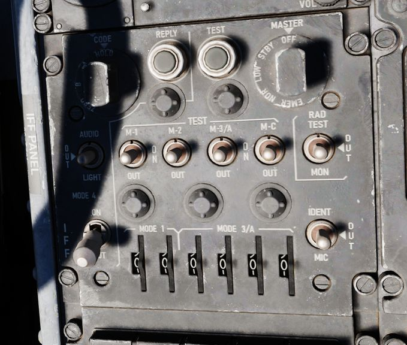
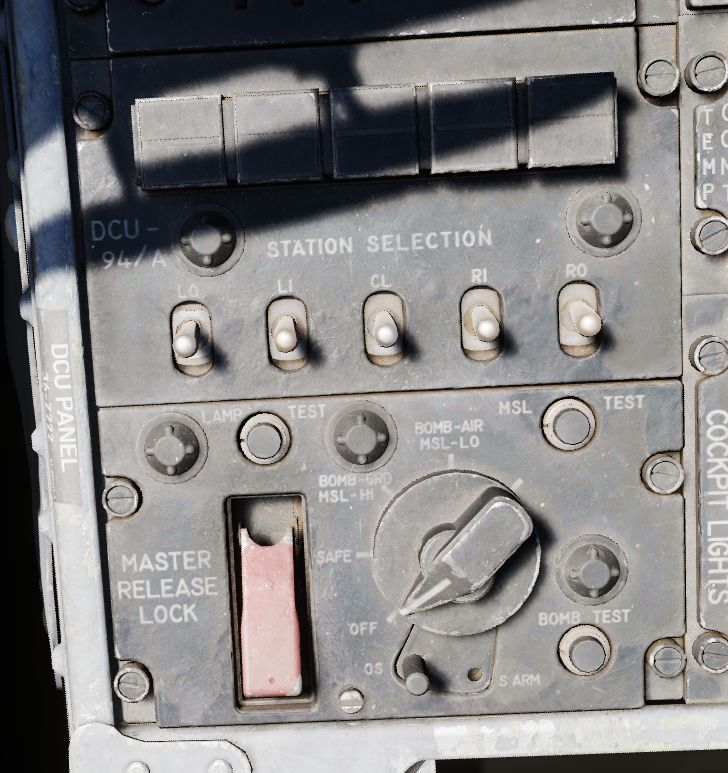
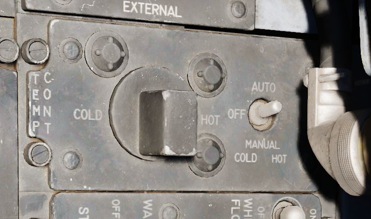
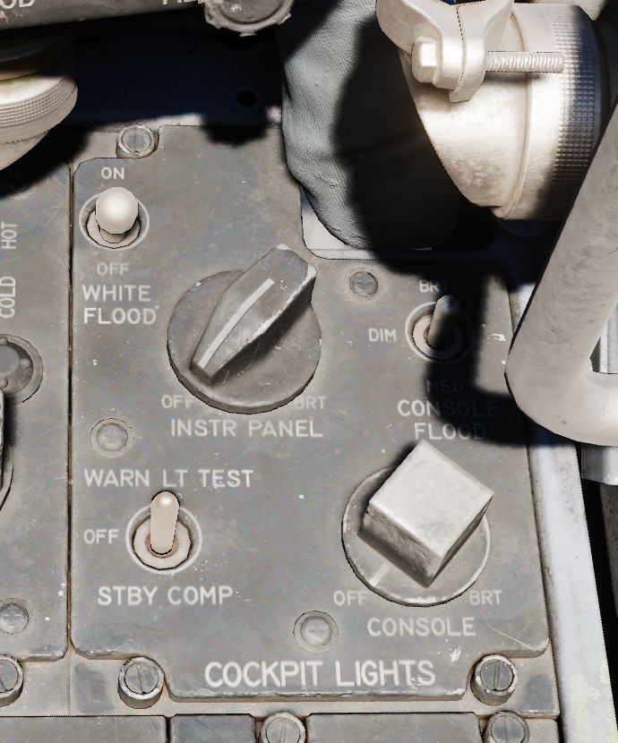

# Center Section

## IFF Control Panel

The IFF panel provides the pilot with the ability to adjust the IFF system. For further explanation
see the [IFF System controls chapter.](../../../systems/identification_systems.md#iff-controls-and-indicators)

## DCU-94A Stores Control-Monitor Panel

This panel is used to control and test the separate release circuit system for
nuclear stores.

Nuclear stores are separated from the regular release system to prevent
accidental release. This is not simulated in game.

## Temperature Control

Used to adjust ECS system for pilot comfort.

## Cockpit Lighting Control Panel

The Cockpit Lighting Control Panel provides control of all panel edge lighting,
flight instrument panel lighting, the console floodlights, the white floodlights
found under the canopy sill over each console, and also includes the Warning
Light Test/Standby Compass Light switch.

The White Floodlight switch acts independent of all other controls on the panel,
and is either ON or OFF. It activates a separate emergency floodlight (also
called Thunderstorm Light) that illuminates the cockpit in white. The lamp is
energized through the Battery Bus to ensure it is always operational, even in
case of total power loss. Do not forget to turn off the light before parking the
aircraft for a longer time, as it will otherwise drain the battery.

The Flight Instrument Light Knob (marked INSTR PANEL), when moved to the right
of the OFF detent, controls illumination of the following six instrument lights
in unison:

- Airspeed/Mach Indicator
- Attitude Director Indicator
- Angle of Attack Indicator
- Vertical Velocity Indicator
- Altimeter
- Horizontal Situation Indicator

When in the OFF position, these indicators are independently controlled for
illumination by the knobs on the Flight Instrument Lights Intensity Panel.

The Console Light Control Knob, with range from OFF to BRT, controls
illumination level for all panel edge lighting and the console floodlights.

The console floodlights (CONSOLE FLOOD) are triggered independently of the knob
when it is placed to the right of the OFF detent position, and offer three
settings- DIM, MED, or BRT. The floodlights will remain on until the Console
Light Control knob is returned to the OFF position, and the floodlight switch is
placed in DIM. All three positions are powered by different buses to ensure
maximal availability:

| Lamp   | Bus                   |
| ------ | --------------------- |
| Bright | Essential 28V DC Bus  |
| Medium | Left Main 14V AC Bus  |
| Dim    | Left Main 115V AC Bus |

The Warning Light Test Switch (Marked WARN LT TEST) is a three-position switch;
in the WARN LT TEST position, confirms function of the various emergency
indicators in the cockpit. In the STBY COMP position, it illuminates the light
for the Standby Compass. Both functions are deactivated when the switch is
placed in the OFF position.
