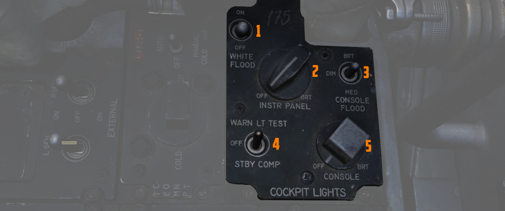

# 中部

右侧控制台的中间区域包括 IFF 和灯光控制开关/按钮。

## IFF 控制面板

与 WSO 驾驶舱中的问询器面板不同，该面板可让飞行员调整本机的 IFF 应答机。然后，其它飞机上的问询器就
会收到应答信息。

> 💡 由于模拟器的限制，在 DCS 中该面板的设置无功能。> 不过，设置会影响外部工具，例如 SRS。

更多介绍请参加
[IFF 系统控制开关/按钮章节](../../../systems/identification_systems.md#iff-controls-and-indicators)。

### 主开关

主开关是一个五档位旋钮，具有以下控制功能：

| 档位 | 操作                                                                                                                                         |
| ---- | -------------------------------------------------------------------------------------------------------------------------------------------- |
| Off  | 识别系统断电。                                                                                                                               |
| STBY | 系统完整通电但屏蔽问询。                                                                                                                     |
| LOW  | 系统以低灵敏度工作。                                                                                                                         |
| NORM | 系统以完整灵敏度工作。                                                                                                                       |
| EMER | 允许系统响应模式 1、2 和 3/A 的问询。模式 1 和 2 的应答是使用相应拨轮上所选编码的特殊应急信号，而模式 3/A 的应答是编码 7700 的特殊应急信号。 |

### 模式 1 选择开关

三档位模式 1 选择开关控制模式 1 的工作模式：

| 档位 | 操作             |
| ---- | ---------------- |
| M-1  | 自检档位（无效） |
| ON   | 启用模式 1。     |
| Out  | 禁用模式 1       |

### 模式 2 选择开关

三档位模式 2 选择开关控制模式 2 的工作模式：

| 档位 | 操作                                     |
| ---- | ---------------------------------------- |
| M-2  | 自检档位。如果模式正常工作，指示灯亮起。 |
| ON   | 启用模式 2。                             |
| Out  | 禁用模式 2                               |

### 模式 3/A 选择开关

三档位模式 3/A 选择开关控制模式 3/A 的工作模式：

| 档位  | 操作                                     |
| ----- | ---------------------------------------- |
| M-3/A | 自检档位。如果模式正常工作，指示灯亮起。 |
| ON    | 启用模式 3/A。                           |
| Out   | 禁用模式 3/A                             |

### 模式 C 选择开关

三档位模式 C 选择开关控制模式 C 的工作模式：

| 档位 | 操作             |
| ---- | ---------------- |
| M-C  | 自检档位（无效） |
| ON   | 启用模式 C。     |
| Out  | 禁用模式 C       |

### 模式 1 和模式 3/A 编码选择拨轮

模式 1 编码选择拨轮用于在 00 至 73 之间选择模式 1 编码。模式 3/A 编码选择拨轮用于在 0000 至 7777 之
间设置模式 3/A 编码。

### 模式 4 选择开关

二档位模式 4 选择开关控制模式 4 的工作模式：

| 档位 | 操作                                                                                            |
| ---- | ----------------------------------------------------------------------------------------------- |
| ON   | 启用模式 4。                                                                                    |
| Out  | 禁止模式 4 应答。如果插入了模式 4 编码，收到问询将导致 IFF 告警灯和 MASTER CAUTION 灯短暂亮起。 |

### 模式 4 指示开关

模式 4 指示开关有 AUDIO、OUT 和 LIGHT 三个档位。

在 AUDIO 档位，播放音频信号表示接收到模式 4 问询，模式 4 REPLY 指示灯在传输过程中亮起。在 LIGHT 档
位，，模式 4 REPLY 灯在传输模式 4 应答时亮起，但不播放音频。在 OUT 档位，指示灯和音频指示均被停用。

如需测试按下测试模式 4 应答指示灯，必须将指示开关拨至 AUDIO 或 LIGHT 档位。

### 模式 4 功能开关

模式 4 功能开关有 ZERO、B、A 和 HOLD 档位。

在 A 档位时，应答机将响应同样设置在 A 档位的问询器问询；在 B 档位，应答机将响应同样设置在 B 档位编
码的问询器问询。如果开关的档位与被问询的编码不符（例如，在 A 档位被 B 档位问询器问询），那么接收
IFF 告警灯和 MASTER CAUTION 灯不会亮起。

> 💡 > A 和 B 档位的编码设置需要在飞行前插入，飞行员可将开关转动至 ZERO 来擦除编码。

飞行中不使用 HOLD 档位，但如果预计在编码周期内有另一次飞行任务，可用 HOLD 档位保留编码设置。着陆后
将开关短暂转至 HOLD 档位，等待 15 秒，然后关闭 IFF 主开关和雷达电源旋钮，以此在断电的情况下保留编码
。

IFF 告警灯和 MASTER CAUTION 灯亮起的原因可能是内部部件故障、未能对有效问询做出响应或编码擦除。

### 监控-辐射测试开关

开关有三个档位：RAD TEST、MON 和 OUT。开关用于地勤人员进行测试，机组应将开关设置到 OUT 档位，飞行期
间不得使用。

### 位置识别开关

识别开关是一个三档位切换开关，用于提供短时位置识别。

| 档位  | 操作                                                                               |
| ----- | ---------------------------------------------------------------------------------- |
| IDENT | 允许系统在所有正在使用的模式下执行位置识别回复。松开开关后，响应持续 15 至 30 秒。 |
| OUT   | 禁用位置识别功能。                                                                 |
| MIC   | 与将开关拨至到 IDENT 档位功能相同，但必须使用 UHF 传声按钮来触发识别。             |

## DCU-94A 挂载控制-监控面板

该面板用于控制和测试核挂载的独立投放电路系统。

核挂载与常规投放系统隔离，以防止意外投放核武。

> 💡 游戏中未模拟。

## 温度控制

旋钮可在开关处于 AUTO 档位时使用，飞行员可从 COLD 到 HOT 设置两个驾驶舱内的温度，以保证机组人员的舒
适性。

如果自动系统故障，开关可以拨至手动模式。

开关拨至中立档位将关闭系统。

## 驾驶舱照明控制面板

驾驶舱照明控制面板中包括控制所有面板边缘照明、飞行仪表板照明、控制台泛光灯、每个位于控制台上方的白
色泛光灯以及告警灯测试/备用罗盘灯的开关。

关于照明的详细信息请阅读 [照明章节。](../../../systems/lighting.md#interior-lighting)

### 白色泛光灯

白色泛光灯开关独立于面板上的所有其它控制开关/旋钮进行工作，可以拨至 ON 或 OFF 档位。开关将打开一个
单独的应急泛光灯（也称为灯），以白光照亮驾驶舱。

### 仪表板旋钮

仪表板旋钮可控制仪表板的背光以及大部分仪表的边缘照明。

> 💡 主要飞行仪表通过 >
> [飞行仪表亮度旋钮](../weapon_management.md#flight-instrument-brightness-knob) > 进行控制。

### 控制台旋钮

控制台照明控制旋钮的可从 OFF 转动到 BRT，用于控制左右控制台的照明亮度。

### 控制台泛光灯

控制台泛光灯开关用来控制控制台整体照明红色泛光灯的亮度。有三个档位可供选择，分别是： DIM、MED 和
BRT。

> 💡 如需关闭红色泛光灯，将开关拨至 DIM > 并将控制台旋钮转至 OFF。

> 💡 仪表板泛光灯照明控制位于 [右侧墙板中](wall.md#instrument-flood)。

### 告警灯测试开关

告警灯测试开关（标为 WARN LT TEST）是一个三档位开关；在 WARN LT TEST 档位，可确认驾驶舱内各种应急指
示灯是否正常工作。

在 STBY COMP 档位，系统将打开
[备用罗盘](../../pilot/overhead_indicators.md#standby-magnetic-compass) 灯光。

当开关拨至 OFF 档位时，上述两项功能都将被停用。
