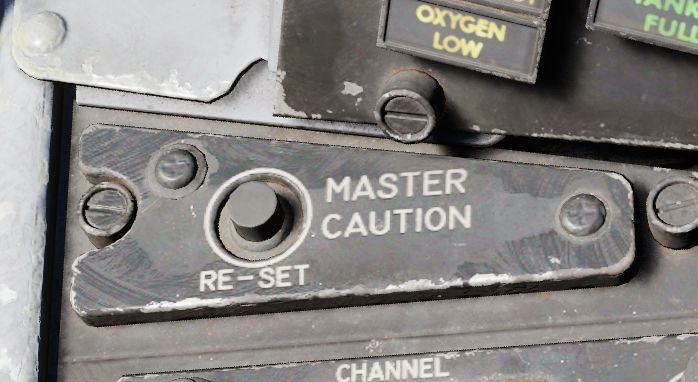
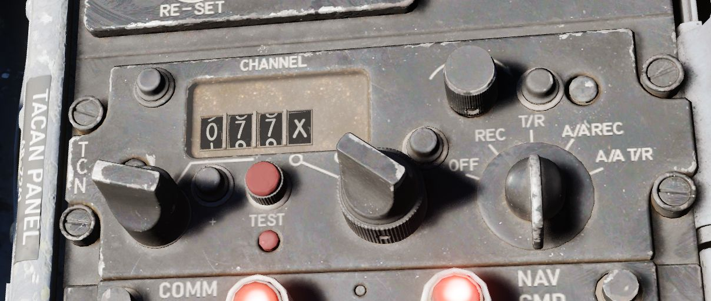
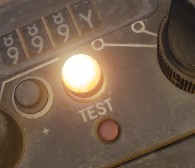
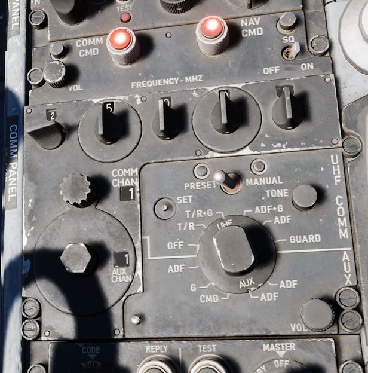
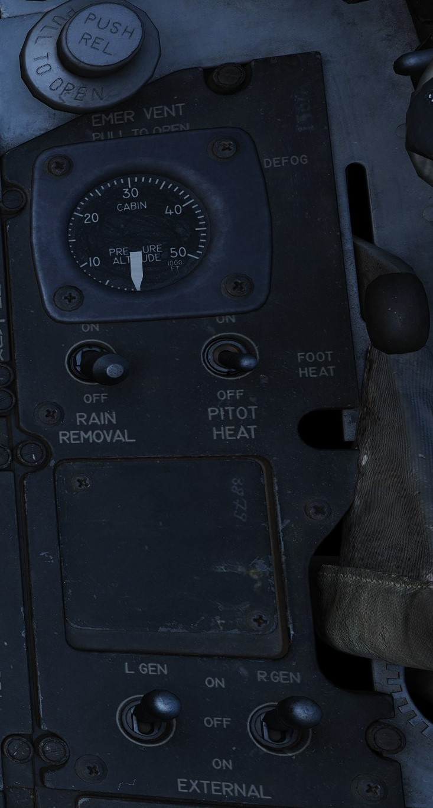
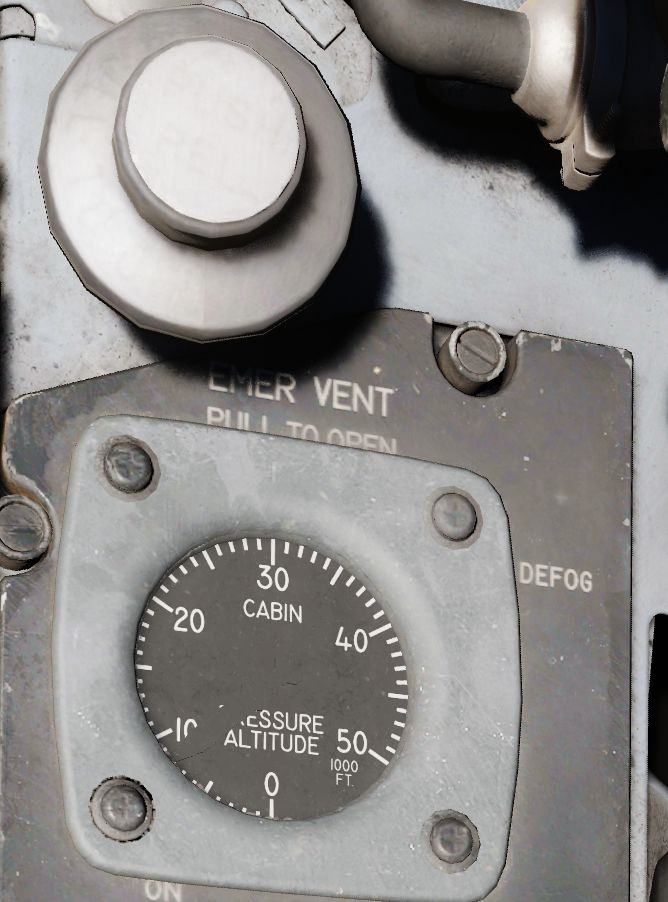
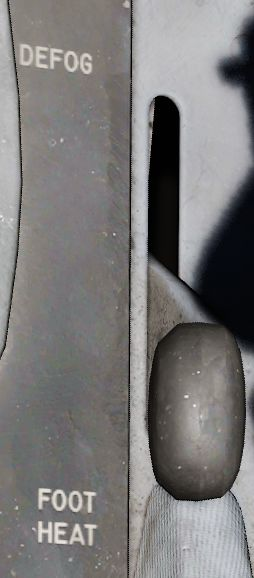
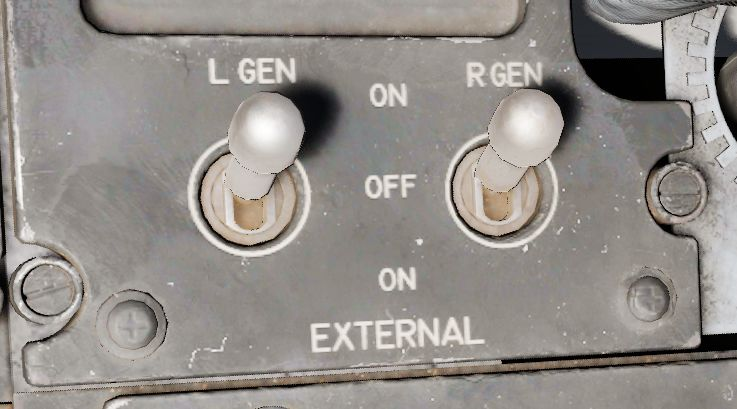

# Front Section

The front section of the right console is dominated by
communication and navigation controls.

## Master Caution Reset

Used to extinguish telelight panel warnings and the Master Caution warning lamp
once the necessary action has been taken. In the event a fault has not been
effectively corrected, pressing the Master Caution Reset button will not turn
the respective warning off.

## TACAN Control Panel

The TACAN Control Panel is used to enter the desired TACAN channel, mode, and
audible volume for the monitoring of said channel by the aircrew. The panel is
duplicated in both cockpits, and the panel in command of the TACAN receiver is
selected with the NAV CMD button of the Communication Control Panel.

### Channel Knobs

On the control panel there are two Navigation Channel Control knobs, with the
left controlling the first two digits of the channel value (hundreds and tens),
and the right controls the single unit (ones) values. The right knob also
includes an outer ring which sets the X or Y value for the desired TACAN
channel.

### Test Button and Lamp

Between these two knobs is the TEST button, which performs the ground testing
cycle after warmup, and can also be used to perform an in-flight confidence test
of the system's performance.

The lamp above the button illuminates to indicate test status.

### Volume Knob

To the upper right, the VOL knob is available to set the desired audio level for
the received TACAN station.

### Function Selector

The TACAN Function Selector Knob determines the presentation and type of
information provided on the HSI, ADI, and BDHI, respectively.

| Name    | Description                                                                                                                                                |
|---------|------------------------------------------------------------------------------------------------------------------------------------------------------------|
| OFF     | The TACAN receiver is de-energized and offline.                                                                                                            |
| REC     | The TACAN receiver is active, providing bearing information on the HSI, BDHI, and ADI.                                                                     |
| T/R     | Both the receive and transmit functions of the TACAN are active, which provide bearing and nautical mile range information for the HSI and BDHI.           |
| A/A REC | The TACAN receiver decodes bearing information from compliant aircraft for the HSI, BDHI, and ADI steering display.                                        |
| A/A TR  | The TACAN receiver receives both bearing and slant range information in nautical miles from the transmitting aircraft, providing this on the HSI and BDHI. |

Note: Air to Air TACAN functionality requires the channel to be set 63 channels
above or below the cooperating aircraft, but on the same range- X or Y. So a tanker on 123Y should
be set to 60Y in the F-4.

## Communication Control Panel

The Communication Control Panel provides selection and mode of the UHF radio in
the aircraft.

### Command Buttons

The panel is duplicated in both cockpits, and control over the
radio is determined through pushing the COMM CMD Button in the respective seat;
the button will illuminate green in the seat in priority. In the same fashion,
the NAV CMD button dictates which seat has control of the TACAN settings; its
button will also illuminate on the panel of the seat that has command (control)
of the system.

### Radio Volume

Beneath the COMM CMD button is the radio volume for the respective seat.

### Squelch Switch

Close to the NAV CMD button is the Squelch switch, which enables or disables receiver
squelch.

### Frequency and Channels

The A-3-2-T Selector knob sets HAVE Quick functionality of the UHF radio (A-
auto-jam), the first digit of the manually selected frequency (3 or 2), or
enables Time of Day receipt for one minute after selection in a momentary hold
position (T). The HAVE Quick system provides a resistance against jamming.

The four Frequency Selection Knobs work in concert with the A-3-2-T knob and
Preset/Manual switch. Frequencies are entered beginning with the 3 or 2
selection on the A-3-2-T Selector, and can be entered from 225.00 to 399.975 MHz
in increments of 0.025. With Preset/Manual in the Manual position, the UHF radio
is directly set to the displayed channel. In the Preset position, the set
channels can entered into the COMM CHAN memory, with the desired position
selected with the Comm Channel Control knob - the smaller knob to the left of the
Preset/Manual switch, and displayed in the COMM CHAN window. Channels are stored
in the displayed channel preset with the SET pushbutton. Once stored, channels
are directly selected using the Comm Channel Control knob with the Preset/Manual
switch in the Preset position.

Directly underneath the Comm Channel Control Knob is the Aux Channel Knob and
Indicator. This knob is used to access 20 common preset channels that cannot be
changed from in the cockpit.

The Aux Volume Control knob on the lower right of the panel
raises and lowers the volume of the Aux receiver channel.

### Tone Button

The Tone Pushbutton is used for transmission of a TOD signal along with a tone
to friendly aircraft requiring a Time of Day update for proper HAVE Quick
functionality. It is also used to activate the emergency TOD clock for the radio
itself, in conjunction with the T position of the A-3-2-T knob. Selecting the T
position and pushing the Tone button will cause the radio to listen for a TOD
signal from another friendly transmitter to synchronize the anti-jam function
with the desired network.

### Comm Function Selector

The Comm Function Selector Knob determines the current configuration of the
radio system.

| Name      | Description                                                                |
|-----------|----------------------------------------------------------------------------|
| OFF       | All UHF Radios off.                                                        |
| T/R ADF   | Comm receiver - comm reception.                                            |
|           | Comm transmitter - comm transmission.                                      |
|           | Comm guard receiver - standby.                                             |
|           | Aux receiver - ADF reception.                                              |
| T/R+G ADF | Comm receiver - comm reception.                                            |
|           | Comm transmitter - comm transmission.                                      |
|           | Comm guard receiver - guard reception.                                     |
|           | Aux receiver - ADF reception.                                              |
| ADF+G CMD | Comm receiver - ADF reception.                                             |
|           | Comm transmitter - comm transmission. ADF interrupted during transmission. |
|           | Comm guard receiver - guard reception on ADF antenna.                      |
|           | Aux receiver- comm reception.                                              |
| ADF+G     | Comm receiver - ADF reception.                                             |
|           | Comm transmitter - comm transmission. ADF interrupted during transmission. |
|           | Comm guard receiver - standby.                                             |
|           | Aux receiver- guard reception.                                             |
| Guard ADF | Comm receiver - guard reception.                                           |
|           | Comm transmitter - guard transmission.                                     |
|           | Comm guard receiver - standby.                                             |
|           | Aux receiver - ADF reception.                                              |

## Utility Panel (Right)

The utility panel features an emergency vent handle for releasing over pressure in the cockpit.
Furthermore, it features the Defog/Foot Heat Lever as well as the Generator control switches.

## Cockpit Pressure

### Cockpit Altitude Gauge

Displays the current pressure inside the cockpit as a means of equivalent effective
cabin altitude above mean sea level in 1000 of feet.

That is, if the gauge reads 5, the pressure inside the cabin is equivalent to an altitude
of 5000 ft altitude MSL.

To prevent sickness and hypoxia, the pressure should be observed and oxygen
supply adjusted accordingly:

| Pressure Range      | Description                                  |
| ------------------- | -------------------------------------------- |
| below 13000 ft      | Breath regular air                           |
| 13000 ft - 40000 ft | Breath Oxygen through mask                   |
| 40000 ft - 62000 ft | Breath pressurized Oxygen through mask       |
| above 62000 ft      | Need to wear a pressure suit (not available) |

### Emergency Vent Handle

A plug that can be pulled to release cockpit pressure. Putting it back in will
seal the cabin again.

Without pressurization, the effective cabin altitude will be identical to the
current altitude.

Should only be used if the pressurization system is malfunctioning and reads
abnormal values, or to eliminate smoke and fumes from the cockpit. Descend to safe altitudes before
activating.

## Defog/Foot Heat Lever

Provides pilot selectable volume of warm air to the windshield for de-icing purposes or footwell
recesses for comfort or visibility.

## Rain Removal Switch

If activated, bleed air from the engine is rerouted around the canopy
to blow away any rain drops.

The system should not be used during dry conditions, as the hot air will
heat up the windshield. If the glass reaches critical temperatures,
the _WINDSHIELD TEMP HI_ warning on the telelight panel will illuminate.
In this case, the switch should be turned OFF immediately.

## Pitot Heat Switch

Heats the pitot tube on the nose of the aircraft to prevent icing and thus
erroneous sensor readings for all major flight instruments.

For normal operations, this should always be activated prior to takeoff.
But not left ON while on the ground for longer than one minute to prevent
damage due to overheating.

See [Pitot-Static System](../../../systems/flight_controls_gear/primary_flight_instruments.md#pitot-static-system)
for details.

## Generator Control Switches

Control of each engine's respective electrical generator is provided by an
individual switch.

| Name          | Description                                                                        |
|---------------|------------------------------------------------------------------------------------|
| ON            | Generator is driven by engine accessory power and applied to electrical bus.       |
| OFF           | Generator is offline.                                                              |
| ON (EXTERNAL) | External power is supplied through generator bus connection for pre-startup needs. |
