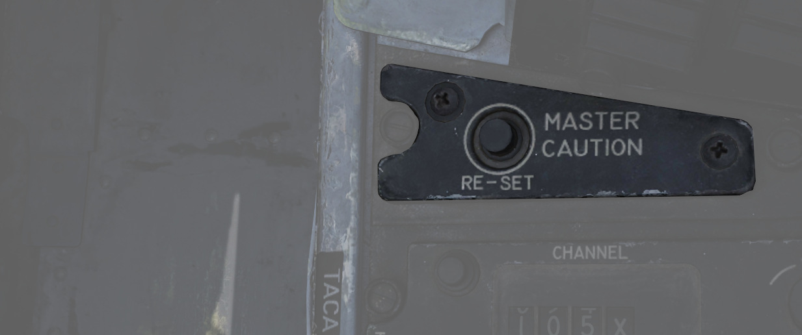
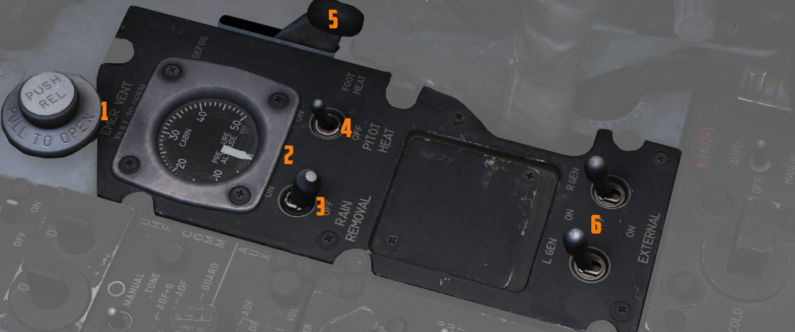

# Front Section

The front section of the right console is dominated by
communication and navigation controls.

## Master Caution Reset

Used to extinguish [telelight panel](../../../systems/emergency.md#telelight-panel) warnings and
the [Master Caution warning](../../../systems/emergency.md#master-caution) lamp
once the necessary action has been taken. In the event a fault has not been
effectively corrected, pressing the Master Caution Reset button will not turn
the respective warning off.

## TACAN Control Panel

The [TACAN](../../../systems/nav_com/tacan.md) Control Panel is used to enter the
desired [TACAN](../../../systems/nav_com/tacan.md) channel, mode, and
audible volume for the monitoring of said channel by the aircrew. The panel is
duplicated in both cockpits, and the panel in command of
the [TACAN](../../../systems/nav_com/tacan.md) receiver is
selected with the NAV CMD button of the Communication Control Panel.

### Channel Knobs

On the control panel there are two Navigation Channel Control knobs (7,4 and 3), with the
left (<num>7</num>) controlling the first two digits of the channel value (hundreds and tens),
and the right (4 and 3) controls the single unit (ones) values. The right knob also
includes an outer ring (<num>3</num>) which sets the X or Y value for the
desired [TACAN](../../../systems/nav_com/tacan.md)
channel.

### Test Button and Lamp

Between these two knobs is the TEST button (<num>6</num>), which performs the ground testing
cycle after warmup, and can also be used to perform an in-flight confidence test
of the system's performance.

The lamp above the button illuminates to indicate test status.

See [7.19.4 Navigation test chapter](../../../procedures/bit_tests/navigation_tests.md#tacan-test)
for further information.

### Volume Knob

To the upper right, the VOL knob (<num>2</num>) is available to set the desired audio level for
the received [TACAN](../../../systems/nav_com/tacan.md) station.

### Function Selector

The [TACAN](../../../systems/nav_com/tacan.md) Function Selector Knob (<num>1</num>) determines the
presentation
and type of
information provided on
the [HSI,](../../pilot/flight_director_group.md#horizontal-situation-indicator) [ADI](../../pilot/flight_director_group.md#attitude-director-indicator),
and [BDHI,](../../wso/upfront_indicators.md#bearing-distance-heading-indicator-bdhi)
respectively.

| Name    | Description                                                                                                                                                                                                                                                                                                                                                                    |
|---------|--------------------------------------------------------------------------------------------------------------------------------------------------------------------------------------------------------------------------------------------------------------------------------------------------------------------------------------------------------------------------------|
| OFF     | The [TACAN](../../../systems/nav_com/tacan.md) receiver is de-energized and offline.                                                                                                                                                                                                                                                                                           |
| REC     | The [TACAN](../../../systems/nav_com/tacan.md) receiver is active, providing bearing information on the [HSI](../../pilot/flight_director_group.md#horizontal-situation-indicator), [BDHI](../../wso/upfront_indicators.md#bearing-distance-heading-indicator-bdhi), and [ADI](../../pilot/flight_director_group.md#attitude-director-indicator).                              |
| T/R     | Both the receive and transmit functions of the [TACAN](../../../systems/nav_com/tacan.md) are active, which provide bearing and nautical mile range information for the [HSI](../../pilot/flight_director_group.md#horizontal-situation-indicator) and [BDHI](../../wso/upfront_indicators.md#bearing-distance-heading-indicator-bdhi).                                        |
| A/A REC | The [TACAN](../../../systems/nav_com/tacan.md) receiver decodes bearing information from compliant aircraft for the [HSI](../../pilot/flight_director_group.md#horizontal-situation-indicator), [BDHI](../../wso/upfront_indicators.md#bearing-distance-heading-indicator-bdhi), and [ADI](../../pilot/flight_director_group.md#attitude-director-indicator) steering display. |
| A/A TR  | The [TACAN](../../../systems/nav_com/tacan.md) receiver receives both bearing and slant range information in nautical miles from the transmitting aircraft, providing this on the [HSI](../../pilot/flight_director_group.md#horizontal-situation-indicator) and [BDHI](../../wso/upfront_indicators.md#bearing-distance-heading-indicator-bdhi).                              |

> 💡 Air to Air [TACAN](../../../systems/nav_com/tacan.md) functionality requires the channel to be
> set 63 channels above or below the cooperating aircraft, but on the same range- X or Y. So a
> tanker on 123Y should be set to 60Y in the F-4.

## Communication Control Panel

The Communication Control Panel provides selection and mode of
the [UHF radio](../../../systems/nav_com/uhf.md) in the aircraft.

### Command Buttons

The panel is duplicated in both cockpits, and control over the
radio is determined through pushing the COMM CMD Button (<num>10</num>) in the respective seat;
the button will illuminate green (<num>9</num>) in the seat in priority. In the same fashion,
the NAV CMD button (<num>7</num>) dictates which seat has control of
the [TACAN](../../../systems/nav_com/tacan.md) settings; its button will also illuminate (<num>
8</num>) on the
panel of the seat that has command (control) of the system.

### Radio Volume

Beneath the COMM CMD button is the radio volume (<num>11</num>) for the respective seat.

### Squelch Switch

Close to the NAV CMD button is the Squelch switch (<num>6</num>), which enables or disables receiver
squelch.

### Frequency and Channels

The A-3-2-T Selector knob (<num>5</num>) sets the first digit of the manually selected frequency
(3 or 2) of the [UHF radio](../../../systems/nav_com/uhf.md).

> 💡 Due to engine limitations, modes A and T,
> belonging to the HAVE-Quick functionality, are not simulated.

The four Frequency Selection Knobs work in concert with the A-3-2-T knob and
Preset/Manual switch. Frequencies are entered beginning with the 3 or 2
selection on the A-3-2-T Selector, and can be entered from 225.00 to 399.975 MHz
in increments of 0.025. With Preset/Manual in the Manual position, the UHF radio
is directly set to the displayed channel. In the Preset position, the set
channels can be entered into the COMM CHAN memory, with the desired position
selected with the Comm Channel Control knob - the smaller knob to the left of the
Preset/Manual switch, and displayed in the COMM CHAN window. Channels are stored
in the displayed channel preset with the SET pushbutton. Once stored, channels
are directly selected using the Comm Channel Control knob with the Preset/Manual
switch in the Preset position.

Directly underneath the Comm Channel Control Knob is the Aux Channel Knob (<num>4</num>) and
Indicator. This knob is used to access 20 common preset channels that cannot be
changed from in the cockpit.

The Aux Volume Control knob (<num>1</num>) on the lower right of the panel
raises and lowers the volume of the Aux receiver channel (12 and 13).

The Set button (<num>14</num>) can be used to save the channel frequency that is currently selected
by the
Frequency knobs. The frequency will be saved as the currently selected channel.

### Tone Button

The Tone Pushbutton (<num>3</num>) is used for transmission of a Time of Day (TOD) signal along with
a tone
to friendly aircraft requiring a Time of Day update for proper HAVE-Quick functionality.

> 💡 Due to engine limitations, the tone button,
> belonging to the HAVE-Quick functionality, is not simulated.

### Comm Function Selector

The Comm Function Selector Knob (<num>2</num>) determines the current configuration of the
radio system.

| Name      | Description                                                                |
|-----------|----------------------------------------------------------------------------|
| OFF       | All UHF Radios off.                                                        |
| T/R ADF   | Comm receiver - comm reception.                                            |
|           | Comm transmitter - comm transmission.                                      |
|           | Comm guard receiver - standby.                                             |
|           | Aux receiver - ADF reception.                                              |
| T/R+G ADF | Comm receiver - comm reception.                                            |
|           | Comm transmitter - comm transmission.                                      |
|           | Comm guard receiver - guard reception.                                     |
|           | Aux receiver - ADF reception.                                              |
| ADF+G CMD | Comm receiver - ADF reception.                                             |
|           | Comm transmitter - comm transmission. ADF interrupted during transmission. |
|           | Comm guard receiver - guard reception on ADF antenna.                      |
|           | Aux receiver- comm reception.                                              |
| ADF+G     | Comm receiver - ADF reception.                                             |
|           | Comm transmitter - comm transmission. ADF interrupted during transmission. |
|           | Comm guard receiver - standby.                                             |
|           | Aux receiver- guard reception.                                             |
| Guard ADF | Comm receiver - guard reception.                                           |
|           | Comm transmitter - guard transmission.                                     |
|           | Comm guard receiver - standby.                                             |
|           | Aux receiver - ADF reception.                                              |

## Utility Panel (Right)

The utility panel features an emergency vent handle for releasing over pressure in the cockpit.
Furthermore, it features the Defog/Foot Heat Lever as well as the Generator control switches.

## Cockpit Pressure

### Cockpit Altitude Gauge

Displays the current pressure inside the cockpit as a means of equivalent effective
cabin altitude above mean sea level in 1000 of feet.

That is, if the gauge (<num>2</num>) reads 5, the pressure inside the cabin is equivalent to an
altitude
of 5000 ft altitude MSL.

To prevent sickness and hypoxia, the pressure should be observed and oxygen
supply adjusted accordingly:

| Pressure Range      | Description                                  |
|---------------------|----------------------------------------------|
| below 13000 ft      | Breath regular air                           |
| 13000 ft - 40000 ft | Breath Oxygen through mask                   |
| 40000 ft - 62000 ft | Breath pressurized Oxygen through mask       |
| above 62000 ft      | Need to wear a pressure suit (not available) |

See [Oxygen Chapter](../../../systems/utility.md#oxygen-system) for more information.

### Emergency Vent Handle

A plug (<num>1</num>) that can be pulled to release cockpit pressure. Putting it back in will
seal the cabin again.

Without pressurization, the effective cabin altitude will be identical to the
current altitude. Which, if flying at high altitudes, can result in hypoxia.

Should only be used if the pressurization system is malfunctioning and reads
abnormal values, or to eliminate smoke and fumes from the cockpit. Descend to safe altitudes before
activating.

## Defog/Foot Heat Lever

The Defog/Foot Heat lever (<num>5</num>) provides pilot selectable volume of warm air to the
windshield for
de-icing purposes or footwell recesses for comfort or visibility.

It is possible, through selection of cold temperature settings,
particularly on humid days, for the air conditioning system to deliver air at temperatures well
below the dew-point, with resultant cockpit fogging. This fog can be dissipated by selecting a
slightly warmer temperature.

When operating in high humidity conditions, it is recommended that a
warmer than normal temperature be selected, prior to starting the takeoff run, to preclude the
possibility of cockpit fogging as thrust is increased. Should cockpit fogging occur, the quickest
means of eliminating this condition is by activating the emergency vent knob.

During cruise
operations, prior to letdown, place the temperature control knob in the 2 o’clock position and the
Defog/Foot Heat Lever to defog, to increase the defog temperature for windshield and canopy
preheating. For airplanes without slats, if the flaps are lowered for letdown and fogging persists,
retract the flaps or increase power (use speed brakes as necessary to maintain airspeed) to provide
higher defogging air flow.

## Rain Removal Switch

If the two position switch (<num>3</num>) is activated, bleed air from the engine is rerouted around
the canopy
to blow away any rain drops.

The system should not be used during dry conditions, as the hot air will
heat up the windshield. If the glass reaches critical temperatures,
the _WINDSHIELD TEMP HI_ warning on
the [telelight panel](../../../systems/emergency.md#telelight-panel) will illuminate.
In this case, the switch should be turned OFF immediately.

## Pitot Heat Switch

With the pitot heat switch (<num>4</num>) to ON, the pitot tube on the nose of the aircraft will be
heated to
prevent icing and thus erroneous sensor readings for all major flight instruments.

For normal operations, this should always be activated prior to takeoff.
But not left ON while on the ground for longer than one minute to prevent
damage due to overheating.

See [3.1.1 Pitot-Static System](../../../systems/flight_controls_gear/primary_flight_instruments.md#pitot-static-system)
for details.

## Generator Control Switches

The 2 two position switches (<num>6</num>) Control of each engine's respective electrical generator
is provided
by an individual switch.

| Name          | Description                                                                        |
|---------------|------------------------------------------------------------------------------------|
| ON            | Generator is driven by engine accessory power and applied to electrical bus.       |
| OFF           | Generator is offline.                                                              |
| ON (EXTERNAL) | External power is supplied through generator bus connection for pre-startup needs. |

For further information see
the [3.8 Electrics chapter.](../../../systems/electrics.md#generator-control-switches)
