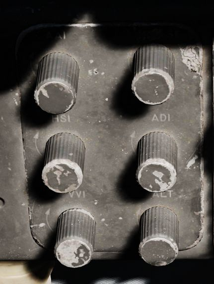
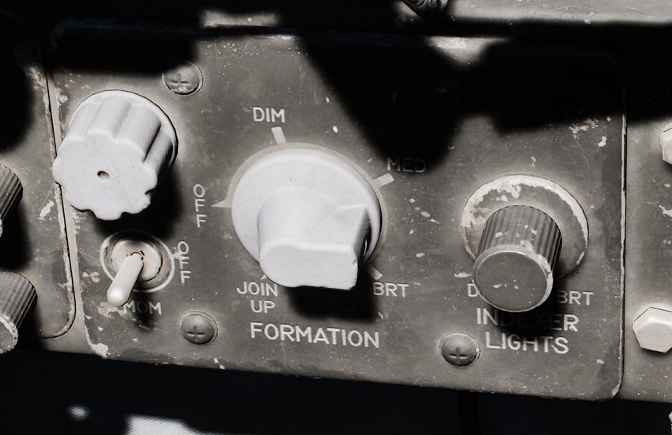
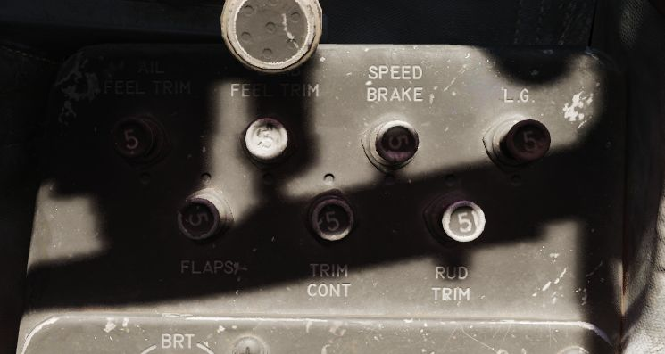
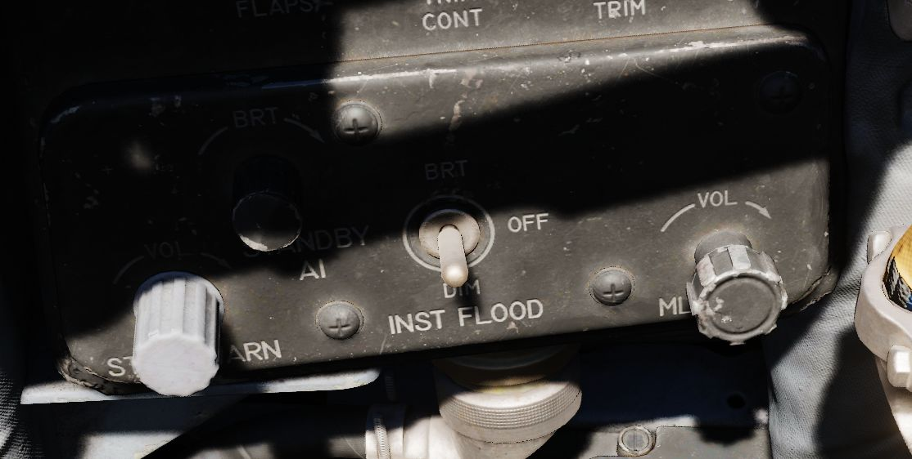

# Right Wall

## Flight Instrument Lights Intensity Panel

The Instrument Lights Intensity Panel has six knobs that allow to independently
change illumination intensity on the following indicators:

- Airspeed/Mach Indicator
- Attitude Director Indicator
- Angle of Attack Indicator
- Vertical Velocity Indicator
- Altimeter
- Horizontal Situation Indicator

The base intensity of all indicators is controlled with the Flight Instrument
Light knob on the Cockpit Light Control Panel.

## Formation and Indexer Lights Control Panel

Control of the formation lights, which are found on the wing tips, both sides of
the vertical stabilizer, and along the fuselage forward and amidship, is
performed using the three position switch and rotary knob on this panel. The
switch has positions for MOM (momentary), OFF, and ON. The variable control knob
provides relative illumination levels at five positions: OFF, DIM, MED (medium),
BRT (bright), and JOIN UP.

Also on this panel is the Indexer Lights brightness knob, which controls
relative illumination of the AoA indexers on both sides of the windscreen.
Marked positions are DIM and BRT (bright), with highest level to the right of
the knob.

## Circuit Breaker Panel

Contains seven circuit breakers responsible for flight control surfaces and
other systems important for safe operation of the aircraft.

- AIL Feel-Trim
- STAB Feel-Trim
- Speed Brake
- Landing Gear
- Flaps
- Trim Controls
- Rudder Trim

If a circuit breaker is popped, the corresponding system does not receive power
and cannot be operated anymore.

## Emergency Floodlights Panel

This auxiliary panel has various controls for lights and also audio.

### Stall Warning

The Stall Warning knob controls the volume of
the [AoA tones](../../../systems/flight_controls_gear/flight_controls.md#stall-warning-vibrator) that
play when flying at certain angles.

Under certain conditions, the system can override the volume to ensure the cue
is always audible in dangerous situations.

### Standby AI

This knob used to control the brightness of the Standby Attitude Indicator (SAI)
lights, but has been replaced by the SAI Panel on the left wall.

### Instrument Flood

The three position switch controls the lamps illuminating the instrument panels
in both cockpits simultaneously in red light.

The bright and dim positions activate lamps powered by different electrical
buses to ensure the emergency light is available even in case of failure.

| Lamp   | Bus                  |
|--------|----------------------|
| Bright | Essential 28V DC Bus |
| Dim    | Left Main 14V AC Bus |

### ML Audio

Controls the volume of the Missile Launch System that plays tones to warn the
pilot about being under attack.
