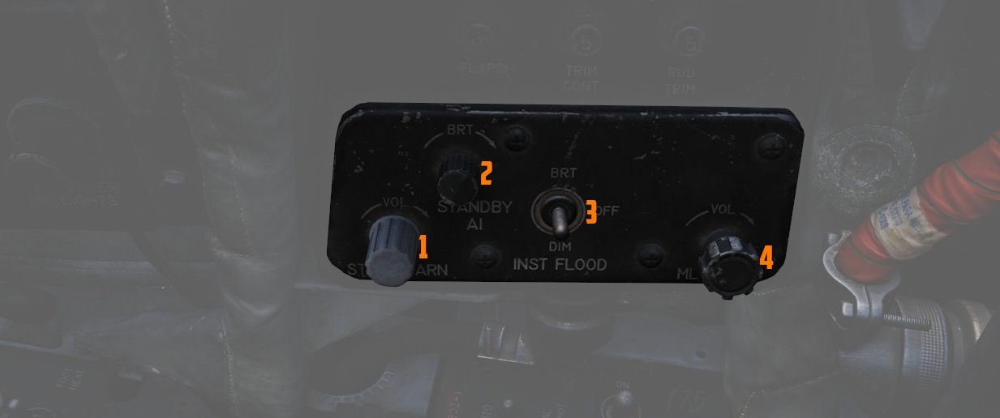

# Right Wall

The right wall features the main circuit breakers and lighting controls.

## Canopy Manual Unlock Handle

The manual unlock
handle is used in the event of [pneumatic system](../../../systems/pneumatics.md) failure.

The handle, when pulled aft,
unlocks the canopy so that it may be pushed open. Before
manual unlocking of the canopy, the normal control lever
must be placed in the OPEN position.

For normal operation,
the handle should be left in the forward position.

If the canopy is not properly locked, the _CANOPY UNLOCKED_
warning light on the telelight panel illuminates.

## Flight Instrument Lights Intensity Panel

The Instrument Lights Intensity Panel has six knobs that allow to independently
change illumination intensity on the following indicators for **both cockpits**:

- [Airspeed/Mach Indicator (<num>2</num>)](../../pilot/flight_director_group.md#airspeed-and-mach-indicator)
- [Attitude Director Indicator (<num>4</num>)](../../pilot/flight_director_group.md#attitude-director-indicator)
- [Angle of Attack Indicator (<num>1</num>)](../../pilot/flight_director_group.md#angle-of-attack-indicator)
- [Vertical Velocity Indicator ((<num>5</num>))](../../pilot/flight_director_group.md#vertical-velocity-indicator)
- [Altimeter (<num>6</num>)](../../pilot/flight_director_group.md#altimeter)
- [Horizontal Situation Indicator (<num>3</num>)](../../pilot/flight_director_group.md#horizontal-situation-indicator)

The base intensity of all indicators is controlled with the
[Flight Instrument Light knob](../weapon_management.md#flight-instrument-brightness-knob).

## Formation and Indexer Lights Control Panel

Control of the formation lights, which are found on the wing tips, both sides of
the vertical stabilizer, and along the fuselage forward and amidship, is
performed using the three position switch (<num>2</num>) and rotary knob (<num>3</num>) on this panel.
The
switch has positions for MOM (momentary), OFF, and ON. The variable control knob
provides relative illumination levels at five positions: OFF, DIM, MED (medium),
BRT (bright), and JOIN UP.

Also on this panel is the Indexer Lights brightness knob (<num>4</num>), which controls
relative illumination of the AoA indexers on both sides of the windscreen.
Marked positions are DIM and BRT (bright), with the highest level to the right of
the knob.

The fuze cap (<num>1</num>) contains the fuze.

For further information on the lighting see
the [3.9 Lighting chapter.](../../../systems/lighting.md)

## Circuit Breaker Panel

Contains seven circuit breakers responsible for flight control surfaces and
other systems important for safe operation of the aircraft.

- AIL Feel-Trim (<num>1</num>)
- STAB Feel-Trim (<num>2</num>)
- Speed Brake (<num>3</num>)
- Landing Gear (<num>4</num>)
- Flaps ((<num>5</num>))
- Trim Controls (<num>6</num>)
- Rudder Trim (<num>7</num>)

If a circuit breaker is popped, the corresponding system does not receive power
and cannot be operated anymore.

## Emergency Floodlights Panel

This auxiliary panel has various controls for lights and also audio.

### Stall Warning

The Stall Warning knob (<num>1</num>) controls the volume of
the [AoA tones](../../../systems/flight_controls_gear/flight_controls.md#stall-warning-vibrator)
that
play when flying at certain angles.

Under certain conditions, the system can override the volume to ensure the cue
is always audible in dangerous situations.

### Standby AI

This knob (<num>2</num>) used to control the brightness of the Standby Attitude Indicator (SAI)
lights, but has been replaced by the [SAI Panel](../left_console/wall.md#sai-panel)
on the left wall.

### Instrument Flood

The three position switch (<num>3</num>) controls the lamps illuminating the instrument panels
in **both cockpits** simultaneously in red light.

For further information on the lighting see
the [3.9 Lighting chapter.](../../../systems/lighting.md)

### ML Audio

This knob (<num>4</num>) controls the volume of the Missile Launch System that plays tones to warn
the
pilot about being under attack.
