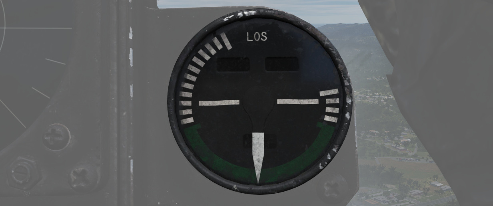

# Right Main Panel

The right main panel offers a good overview of all needed engine data as well as of your defensive
Radar warning receiver (RWR). There is also the fuel gauge (1) and the fire warning lights (4)
located on it. Also found on the right main panel are the master caution light (3), the fire test
switch (2), the fuel flow gauges (5), the engine rpm gauges (6), the exhaust gas temperature
gauges (7) and the nozzle position indicators (8).

## RWR Azimuth Indicator

The [Radar warning receiver](../../systems/defensive_systems/radar_warning_receiver.md) Azimuth
Indicator shows all Radar sources that are visible to the Radar warning receiver.
The knob controls the brightness of the display.

Below is a box with several knobs to operate the system.

For further information and button explanation see the
[Radar Warning Receiver](../../systems/defensive_systems/radar_warning_receiver.md) chapter.

## Azimuth-Elevation Indicator

The Azimuth-Elevation Indicator, or also Line-Of-Sight Indicator, is the main
instrument for the pilot to assess the current attitude of
the [Pave Spike](../../systems/weapon_systems/pave_spike/overview.md)
Targeting Pod in order to keep the line of sight within the operational limits.

The needle shows the pods roll position from -160° (CW) to +110° (CCW).

Three flags indicate the elevation:

- green: -120° to -155°
- yellow: -155° to -160°
- red: -160° or beyond

If the needle is kept within the green labelled range and neither the yellow or
red flag are shown, the view will not be obstructed by the pod or the aircraft.

## Master Caution Light

The Master Caution light illuminates to provide the pilot warning of a condition
requiring attention, directing them to look at the telelight panel for
additional information. The Master Caution lamp is reset by correcting the
condition, or pressing the Master Caution Reset button on the generator control
panel.

## Fire Test Button

When pressed, this button tests for functionality of the FIRE and OVRHT lamps.
Under normal conditions, all four lights should light up as long as the button
is pressed down. If a lamp does not light up, it is likely broken and cannot be
trusted on indicating a fire condition anymore.

The button can also be used in conjunction with the Warning Lights Test switch
to confirm detection and continuity performance of the fire and overheat warning
systems.

Holding the Warning Lights Test switch in the WARN TEST position, then
simultaneously pressing and releasing the Fire Test Button performs the test.
Proper system function is confirmed with the four FIRE and OVRHT lamps off while
the Fire Test Button is pressed, then illuminating when it is released.

## Fire/Overheat Warning Lamps

The Fire and Overheat Warning Lamps, one for each engine, are a pair of
two-position indicators that illuminate when a fire condition is detected in the
engine compartment (FIRE), or an overheat condition is detected in the exhaust
nozzle section (OVRHT).

## Fuel Quantity Indicator

The Fuel Quantity Indicator provides two different indications of total usable
internal fuel to confirm proper transfer function between the seven internal
fuel cells, as well as any external loaded tanks.

The upper hemisphere's sector
display presents fuel quantity detected in fuselage cells 1 through 6, excluding
the aft-most cell 7, as well as the internal wing tanks. The sector display
presents 200 lb increments from 0 to 3000 pounds, and 500 pound increments for
the rest of the gauge.

The lower tape counter readout includes all internal
fuel, including cell 7 and the internal wing tanks, and is presented in 100 lb
increments. Cell 7 is used as a reserve tank.

As a general guidance, Bingo fuel is around 4000 pounds, while Joker fuel is at 6000 lb.

For more detailed information see
[3.2.2 Fuel system chapter](../../systems/engines_and_fuel_systems/fuel_system.md).

## Fuel Flow Gauges

A pair of fuel flow indicators is provided, one for each engine, presenting
pounds per hour rate from 0 to 12, in 1000 lb increments. Flow indications are
for basic, non-afterburning thrust. In afterburner, the flow rate is roughly
four times the displayed flow rate.

## Tachometers

A percentage-noting Tachometer is provided for each engine, including an inset
wheel for accurate display of single digits. Normal values are 65% for idle, 95% in full MIL power
and 105% for full afterburner.

## Exhaust Gas Temperature Gauges

Exhaust Gas Temperature gauges are provided for each engine. The gauges have two
needles - a large needle providing increments of 0 to 12 in multiples of 100
degrees Celsius, and a smaller needle presenting increments of 0-10 in
multiples of 10 degrees Celsius. Temperatures are measured at the exit of the
turbine unit.

## Exhaust Nozzle Position Indicators

A combined Nozzle Position Indicator is provided with two needles, one for each
engine on their respective side, to confirm balanced nozzle position and
scheduling relative to throttle position. The gauge provides four zones relative
to the nozzles being in their fully open configuration (needle fully left), or their maximum closed
configuration (needle fully right). At idle, the indication will be roughly 7/8ths
open, and schedules down as throttle is increased. Position in the afterburner
region will moderate to maintain safe EGT levels.
