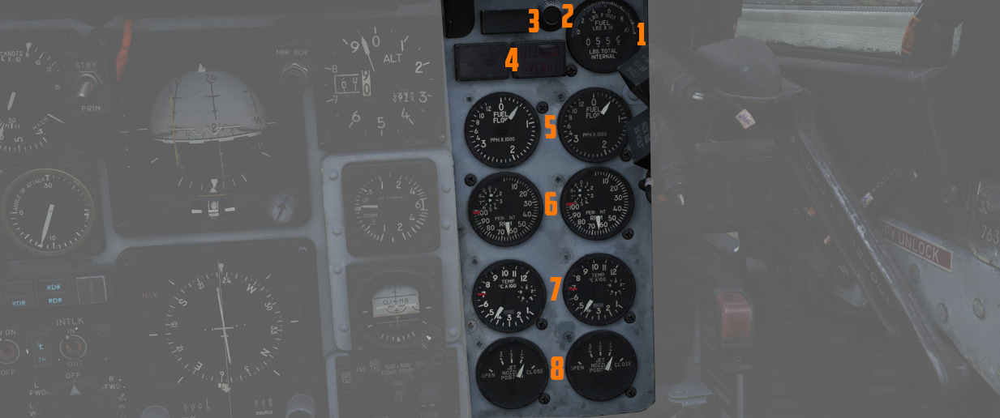
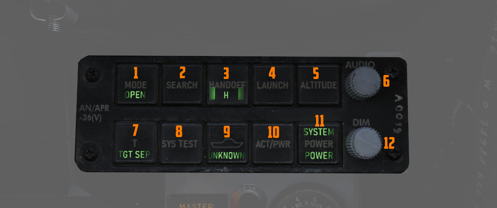
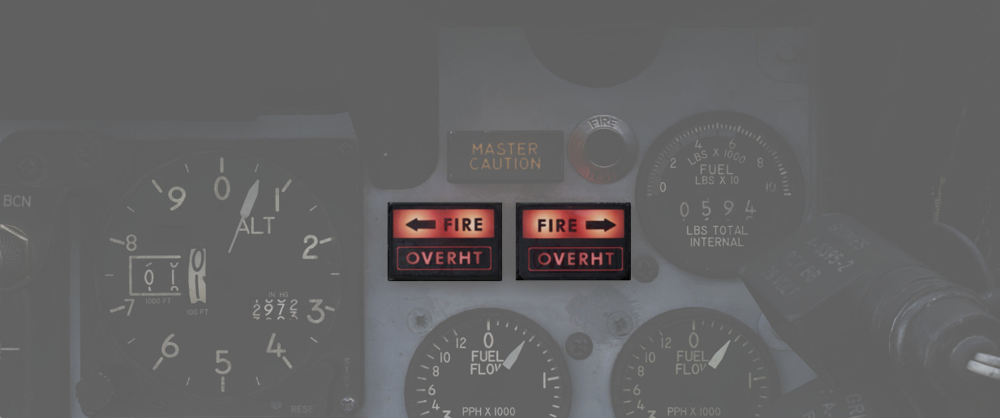
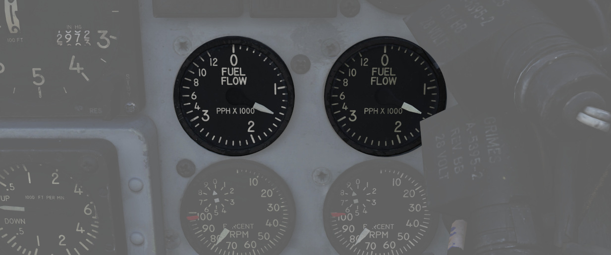

# 右侧主面板

右侧主面板向飞行员展示所有必要的发动机数据以及防御雷达告警接收机（(RWR）。此外，还有油表和火警告警
灯。

## RWR 方位指示器

[雷达告警接收机](../../systems/defensive_systems/radar_warning_receiver.md) 方位指示器显示雷达告警
接收机可见的所有雷达信号源。旋钮用来控制显示屏的亮度。

位于其下方的是数个用于控制系统的旋钮。

详情请见 [雷达告警接收机](../../systems/defensive_systems/radar_warning_receiver.md) 章节。

## 方位-仰角指示器

方位-仰角指示器或称为视线指示器——是飞行员评估
[铺路钉](../../systems/weapon_systems/pave_spike/overview.md) 瞄准吊舱当前姿态的主要仪器，以便将吊
舱视线保持在工作范围内。

指针显示吊舱的横滚角，显示区间从 -160° (顺时针) 到 +110° (逆时针) 。

有三枚旗帜用来指示仰角：

- 绿: -120° 到 -155°
- 黄: -155° 到 -160°
- 红: -160° 或更高

如果指针保持在绿区内，且未显示黄旗或红旗，则镜头未被吊舱本身或飞机遮挡。

## 主注意灯

主警报灯亮起来向飞行员表示出现需要注意的情况，指引飞行员查看远传信号灯面板以获取更多信息。通过纠正
状态或按下位于发电机控制面板上的“主注意复位”按钮来复位主注意灯。

## 失火测试按钮

按下该按钮时，将测试 FIRE 和 OVRHT 灯是否正常工作。在正常情况下，只要按下按钮，所有四枚灯光都会亮起
。如果灯光保持熄灭，则可能是坏了，不能再用它来指示火情。

飞行员还可以结合告警灯开关一起使用以确认失火和过热警报系统的检测和连续性。

将告警灯测试开关保持在 WARN TEST 档位，然后同时按下并松开失火测试按钮，即可进行测试。飞行员可以通过
按下失火测试按钮时，四枚 FIRE 和 OVRHT 灯会熄灭，松开后再次亮起，来确认系统功能正常。

## 失火/过热告警灯

失火和过热告警灯（每台发动机一个）是一对二档位指示灯，当探测到发动机舱失火（FIRE）或探测到喷口部分
过热（OVRHT）时亮起。

## 燃油油量表

油量表提供两种不同的可用内油总量指示来确认七个内部油箱和任何副油箱之间的转输功能正常。

位于上半球的扇形部分显示机身 1 至 6 油箱（不包括最尾部的 7 油箱）以及机翼内油中探测到的燃油量。扇形
部分显示以 200 磅为增量显示 0 到 3000 磅燃油量，其余仪表的增量为 500 磅。

下方的带状计数器读数包括所有内油——包括 7 油箱和机翼油箱，读数以 100 磅为增量进行显示。7 油箱用作储
油箱。

一般来说，返航油量约为 4000 磅，而 Joker 油量为 6000 磅。

详见 [3.2.2 燃油系统章节](../../systems/engines_and_fuel_systems/fuel_system.md)。

## 燃油流量表

面板中包括一对燃油流量表，每台发动机各一个仪表，显示区间从 0 至 12 ，单位为 1000 磅显示每小时的燃油
流量。燃油流量表仅显示非加力推力时的燃油流量。在加力状态下，流量大约是显示的四倍。

## 转速表

每台发动机都有一枚百分比转速表，包括一个嵌入式转轮，用于精确显示个位数百分比。慢车正常值为 65%，军
推为 95%，最大加力推力为 105%。

## 排气温度表

每台发动机都配有排气温度表。排气温度表有两个指针，大指针的指示区间从 0 至 12，以 100 摄氏度为单位，
另一个小指针显示区间从 0 至 10，以 10 摄氏度为单位。EGT 在涡轮装置的出口处测得。

## 喷口位置表

组合式喷口位置表内含两枚指针，左右指针分别对应左右发，以确认喷口位置相平衡以及相对于油门位置进行调
定。仪表可根据喷口处于完全张开（指针左偏到最大）或完全闭合状态（指针右偏到最大）分为四个区域。在慢
车状态下，指针大约在全开的 7/8 处，随着油门前推，指针逐渐向右偏转。加力推力区将会使喷口位置保持适中
，以维持在安全的 EGT 水平。
