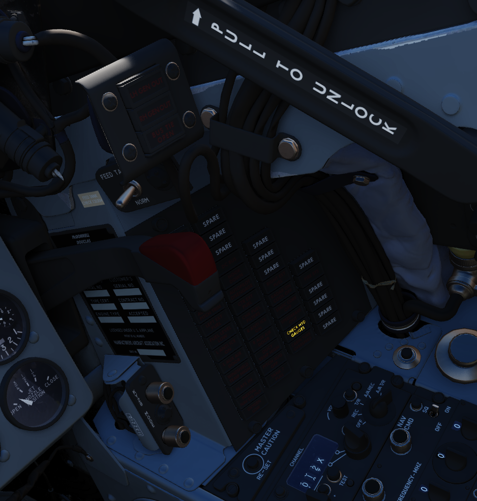
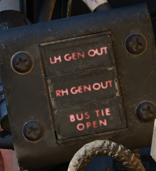
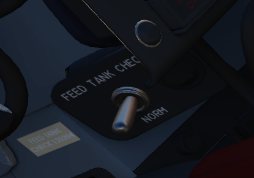
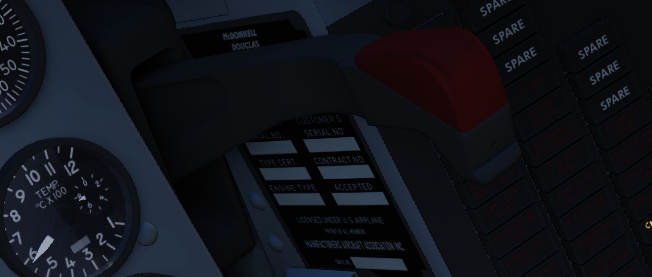
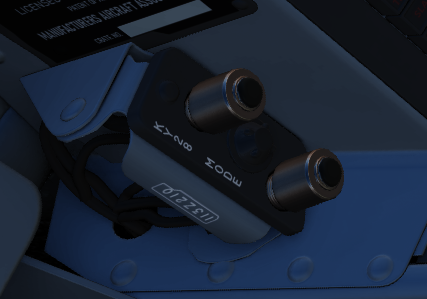
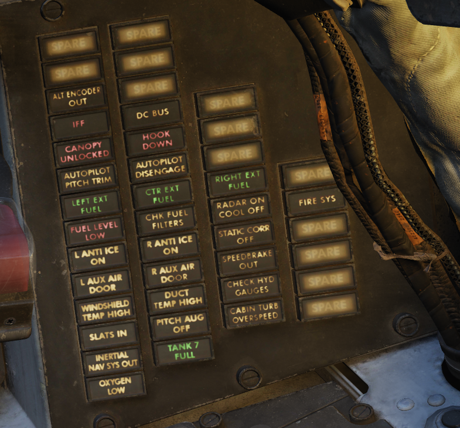
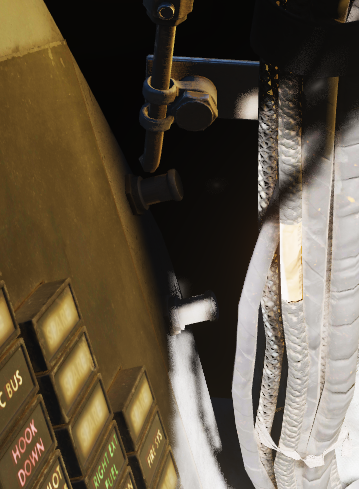

# Right Sub-Panel

## Generator Indicator Lights

Indicating LH GEN OUT (Left), RH GEN OUT (Right), and BUS TIE OPEN, the
indicator lights will illuminate when the specified generator is offline, or, in
the event of BUS TIE OPEN, when the generators are not functioning in parallel.
Indicators will trigger a Master Caution. In event of dual generator failure,
neither will illuminate.

## Feed Tank Check Switch

A two-position spring-loaded switch used to confirm nominal quantity in the
engine feed tank (Cell 1), the positions being FEED TANK CHECK and NORM
(default).

When FEED TANK CHECK is selected and held, the fuel quantity gauge will indicate
solely the current fuel quantity in the engine feed tank on both the tape and
counter. When the feed tank is full, the indicated value should read 1400 lbs,
±200 lbs on the counter, and the tape value should be 1400 lbs, ±150 lbs.

## Arresting Hook Control Handle

Pulling the handle down extends the Tail Hook.

The hook is utilized for field emergency arrestment and not for carrier
operations.

## KY-28 Mode Light Panel

Dependent on mode, the illuminated display shows P for Plain mode, or C for
Cipher mode. Note: UHF communications require the system be in Plain mode, even
with system power off, barring usage and monitoring of guard channel.

## Telelight Anunciator Panel

Provides the majority of aircraft system warnings that can be rectified by the
pilot. Most warnings on the panel will cause the Master Caution to illuminate;
those that do not will be noted.

## Light Circuit Breakers

Hidden behind a bundle of cables to the right of the telelight panel are two
circuit breakers controlling lights.

The upper one is responsible for powering the primary instrument lights, while
the lower circuit breaker powers all indicator and warning lights.
