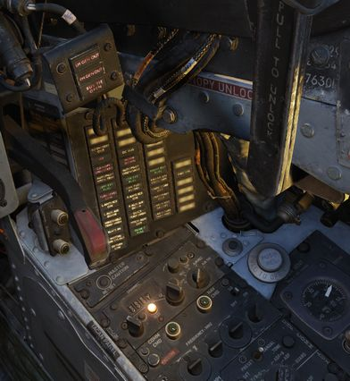
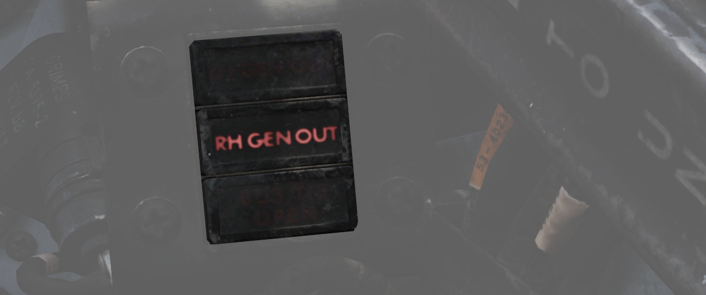
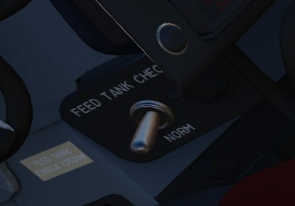
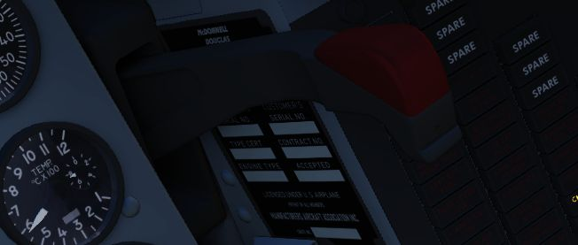
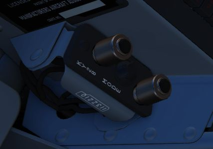
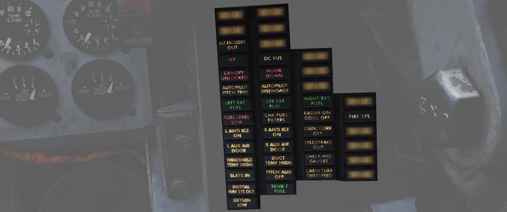
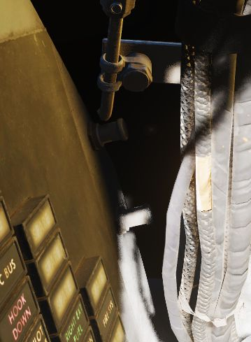
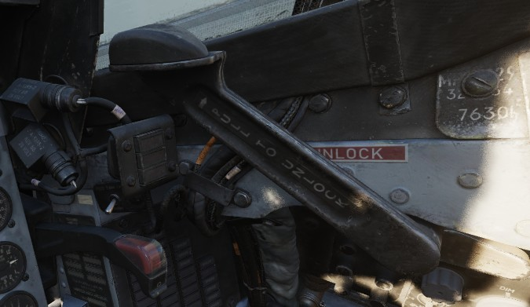

# Right Sub-Panel

The right sub-panel area is dominated by a group of warning lights.

## Generator Indicator Lights

Indicating LH GEN OUT (Left), RH GEN OUT (Right), and BUS TIE OPEN, the
indicator lights will illuminate when the specified generator is offline, or, in
the event of BUS TIE OPEN, when the generators are not functioning in parallel.
Indicators will trigger a Master Caution. In event of dual generator failure,
neither will illuminate.

## Feed Tank Check Switch

A two-position spring-loaded switch used to confirm nominal quantity in the
engine feed tank (Cell 1), the positions being FEED TANK CHECK and NORM
(default).

When FEED TANK CHECK is selected and held, the fuel quantity gauge will indicate
solely the current fuel quantity in the engine feed tank on both the tape and
counter. When the feed tank is full, the indicated value should read 1400 lbs,
±200 lbs on the counter, and the tape value should be 1400 lbs, ±150 lbs.

## Arresting Hook Control Handle

Pulling the handle down extends the Tail Hook.

The hook is utilized for field emergency arrestment and not for carrier
operations.

## KY-28 Mode Light Panel

Dependent on mode, the illuminated display shows P for Plain mode, or C for
Cipher mode. Note: UHF communications require the system be in Plain mode, even
with system power off, barring usage and monitoring of guard channel.

## Telelight Annunciator Panel

Provides the majority of aircraft system warnings that can be rectified by the
pilot. Most warnings on the panel will cause the Master Caution to illuminate;
those that do not will be noted.

| Light                | Explanation                                                                                                                                                                                                     | Light               | Explanation                                                                                                                                  | Light                | Explanation                                                                                                                                             |
|----------------------|-----------------------------------------------------------------------------------------------------------------------------------------------------------------------------------------------------------------|---------------------|----------------------------------------------------------------------------------------------------------------------------------------------|----------------------|---------------------------------------------------------------------------------------------------------------------------------------------------------|
| Alt Encoder out      | The light will illuminate if there is an unreliable signal or no signal from the altitude encoder unit. It also may illuminate momentarily during high-rate climbs, dive maneuvers or during transonic flight   |                     |                                                                                                                                              |                      |                                                                                                                                                         |
| IFF                  | The light will illuminate when the Mode 4 code is zeroed or no code is inserted                                                                                                                                 | DC Bus              | The light will illuminate if both generators fail or if a voltage drop occurs between the main dc bus and essential dc bus.                  |                      |                                                                                                                                                         |
| Canopy Unlocked      | The light will illuminate in the front cockpit if any canopy is not locked and lowered. The rear light will only illuminate when the rear canopy is not fully locked and lowered.                               | Hook down           | The light will illuminate if the arresting hook is not up and locked.                                                                        |                      |                                                                                                                                                         |
| Autopilot Ptich Trim | The light will illuminate when the AFCS is engaged and the automatic pitch trim follow up is inoperative or lagging sufficiently behind the airplane maneuvering.                                               | Autopilot Disengage | The light will illuminate when the autopilot is disengaged after initial engagement of the AFCS.                                             |                      |                                                                                                                                                         |
| Left Ext Fuel        | The light will illuminate if the external fuel tanks are selected.                                                                                                                                              | CTR Ext Fuel        | The light will illuminate if the external fuel tanks are selected.                                                                           | Right Ext Fuel       | The light will illuminate if the external fuel tanks are selected.                                                                                      |
| Fuel Level Low       | The light will illuminate when the Fuel level in cells 1 and 2 has reached a predetermined fuel state of 1650 +- 200 pounds.                                                                                    | CHK Fuel Filters    | The light will illuminate when the fuel filter is clogged. The filter automatically opens to bypass, allowing normal fuel flow to the engine | Radar On Cool Off    |                                                                                                                                                         |
| L Anti Ice On        | The light will illuminate when the anti-ice bleed air system is on.                                                                                                                                             | R Anti Ice On       | The light will illuminate when the anti-ice bleed air system is on.                                                                          | Static Corr Off      | The light will illuminate if the SPC fails or the CADC switch is placed to CORR OFF                                                                     |
| L Aux Air Door       | The light will illuminate when the left auxiliary air door operates out of phase with the landing gear handle.                                                                                                  | R Aux Air Door      | The light will illuminate when the right auxiliary air door operates out of phase with the landing gear handle.                              | Speedbrake out       | The light will illuminate if the speed brake is out or not fully closed.                                                                                |
| Windshield Temp High | The light will illuminate when the windshield approaches a temperature which will cause optical distortion while the windshield rain removal is used. Windshield rain removal should be turned off immediately. | Duct Temp High      | The light will illuminate when the temperature within the engine intake duct is beyond allowable limits.                                     | Check Hyd Gauges     | The light will illuminate if the pressure of any system drops below 1500 +- 100 psi.                                                                    |
| Slats In             | The light will illuminate if the Slats Override Switch is placed to the IN position, forcing the slats to stop moving as a function of the AOA.                                                                 | Pitch Aug Off       | The light will illuminate when power is on the airplane and the pitch stab aug switch is not engaged.                                        | Cabin Turb Overspeed | The light will illuminate if the cabin turbine of the refrigeration unit is subjected to pressures and temperatures in excess of the normal operation.  |
| Inertial Nav Sys Out | The light will illuminate if the Inertial Navigation system is either out or off.                                                                                                                               | Tank 7 Full         |                                                                                                                                              |                      |                                                                                                                                                         |
| Oxygen Low           | The light will illuminate when the oxygen amount is below 1 litre.                                                                                                                                              |                     |                                                                                                                                              | Fire Sys             | The light illuminates when either a fire/overheat detector sensor tube is burned through, a detector wire chafes to ground or the control module fails. |

## Light Circuit Breakers

Hidden behind a bundle of cables to the right of the telelight panel are two
circuit breakers controlling lights.

The upper one is responsible for powering the primary instrument lights, while
the lower circuit breaker powers all indicator and warning lights.

## Canopy Manual Unlock Handle

The manual unlock
handle is used in the event of [pneumatic system](../.../../../../systems/pneumatics.md) failure.

The handle, when pulled aft,
unlocks the canopy so that it may be pushed open. Before
manual unlocking of the canopy, the normal control lever
must be placed in the OPEN position.

For normal operation,
the handle should be left in the forward position.

If the canopy is not properly locked, the _CANOPY UNLOCKED_
warning light on the telelight panel illuminates.
