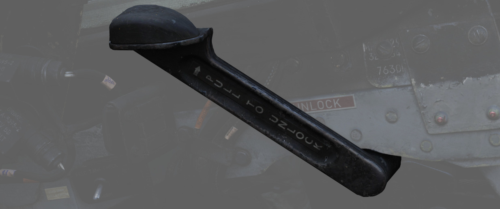

# 右侧子面板

右侧子面板区域主要是一组告警灯。

## 发电机指示灯

指示灯有 LH GEN OUT（左）、RH GEN OUT（右）和 BUS TIE OPEN，当指定的发电机处于脱机状态、或出现 BUS
TIE OPEN 的情况下，当发电机无法并联运行时，指示灯将亮起。指示灯还将触发主注意灯。在两台发电机故障时
，两个指示灯均会熄灭。

详见 [3.8 电气章节](../../systems/electrics.md)

## 供油油箱检查开关

二档位带弹簧复位开关，用来确认发动机供油油箱（1 油箱）的标称油量，档位分别是 FEED TANK CHECK 和
NORM（默认）。

拨动至并保持在 FEED TANK CHECK 档位时，油量表的指示带和计数器将仅显示发动机供油油箱当前的油量。供油
油箱在满油情况下，指示值应当为 1400 lbs，计数器读数 ±200 lbs，指示带应当为 1400 lbs ±150 lbs。

## 拦阻钩控制手柄

下压手柄来放下拦阻钩。

拦阻钩仅在野战机场应急阻拦作业时使用，不能用于舰上作业。

## KY-28 模式灯光面板

取决于模式灯光亮起表示明文或密文模式。

> 💡 UHF 通信要求系统处于明文模式，即使 > 系统电源已关闭，也禁止使用和守听救生波道。

## 远传信号灯面板

提供大多数可由飞行员纠正的飞机系统告警。面板上的大多数告警灯都会联动主注意灯；不会联动主注意灯的将
会标注。

| 灯光                 | 解释                                                                                                                   | 灯光                | 解释                                                             | 灯光                 | 解释                                                                              |
| -------------------- | ---------------------------------------------------------------------------------------------------------------------- | ------------------- | ---------------------------------------------------------------- | -------------------- | --------------------------------------------------------------------------------- |
| Alt Encoder out      | 如果高度编码器装置发出的信号不可靠或无信号，指示灯将亮起。在快速爬升、俯冲机动或跨声速飞行时，指示灯也可能会短暂亮起。 |                     |                                                                  |                      |                                                                                   |
| IFF                  | 当模式 4 编码被擦除或未插入编码时亮起                                                                                  | DC Bus              | 如果两台发动机失效或主直流总线或应急直流总线之间出现压降时亮起。 |                      |                                                                                   |
| Canopy Unlocked      | 如果任意一个座舱盖未放下并锁定，位于飞行员驾驶舱中的灯光将会亮起。后座的灯光仅在后座舱盖未放下并锁定时亮起。           | Hook down           | 拦阻钩未收上并锁定时亮起。                                       |                      |                                                                                   |
| Autopilot Ptich Trim | 当接通 AFCS 并且自动俯仰配平跟随无法工作或大幅滞后飞机机动时亮起。                                                     | Autopilot Disengage | 接通 AFCS 后，断开自动驾驶时灯光亮起。                           |                      |                                                                                   |
| Left Ext Fuel        | 如果选择了副油箱，指示灯将亮起。                                                                                       | CTR Ext Fuel        | 如果选择了副油箱，指示灯将亮起。                                 | Right Ext Fuel       | 如果选择了副油箱，指示灯将亮起。                                                  |
| Fuel Level Low       | 当 1 油箱和 2 油箱中的油量低于预设的 1650 ± 200 磅状态时，灯光亮起。                                                   | CHK Fuel Filters    | 燃油过滤器堵塞时，指示灯亮起。                                   | Radar On Cool Off    |                                                                                   |
| L Anti Ice On        | 当防冰引气系统开启时亮起。                                                                                             | R Anti Ice On       | 当防冰引气系统开启时亮起。                                       | Static Corr Off      | 如果 SPC 故障或 CADC 开关置于 CORR OFF 档位，指示灯亮起                           |
| L Aux Air Door       | 当左侧辅助气门与起落架手柄不同步运行时亮起。                                                                           | R Aux Air Door      | 当右侧辅助气门与起落架手柄不同步运行时亮起。                     | Speedbrake out       | 减速板展开或未完全收起时亮起。                                                    |
| Windshield Temp High | 当使用风挡除水功能时，风挡接近会引起光学畸变的温度时，指示灯会亮起。应立即关闭风挡除水功能。                           | Duct Temp High      | 当压气机进口温度超限时，指示灯亮起。                             | Check Hyd Gauges     | 任意系统压力低于 1500 ± 100 psi 时指示灯将会亮起。                                |
| Slats In             | 缝翼超控开关拨至 IN 档位时，由于 AOA 变化导致缝翼停止移动时亮起。                                                      | Pitch Aug Off       | 当飞机通电并且未接通俯仰增稳开关时指示灯亮起                     | Cabin Turb Overspeed | 如果制冷装置的座舱涡轮受到超出正常工作的压力和温度，指示灯将会亮起。              |
| Inertial Nav Sys Out | 如果惯导系统失效或关闭，指示灯都将亮起。                                                                               | Tank 7 Full         |                                                                  |                      |                                                                                   |
| Oxygen Low           | 液氧储量少于 1 升时指示灯亮起。                                                                                        |                     |                                                                  | Fire Sys             | 当火灾/过热探测器传感器管烧穿、探测器电线磨损至接地或控制模块失效时，指示灯亮起。 |

## 指示灯断路器

在远传信号灯面板右侧的一捆线束后面，隐藏着两个控制灯光的断路器。

位于上方的断路器负责为主要仪表灯供电，而低处的断路器则为所有指示灯和告警灯供电。

## 座舱盖手动解锁手柄

手动解锁手柄用于在 [气动系统](../../systems/pneumatics.md) 失效时使用。

向后拉动手柄解锁座舱盖，从而允许手动推开座舱盖。在手动解锁座舱盖之前，必须将正常控制杆置于 OPEN 档
位。

正常操作时，应将手柄置于向前档位。

如果座舱盖未能正确锁定，远传信号灯面板中的 _CANOPY UNLOCKED_ 告警灯将会亮起。
