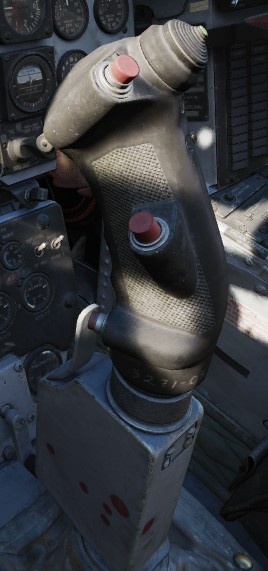
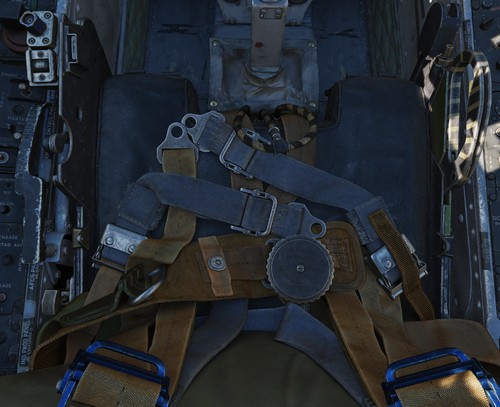
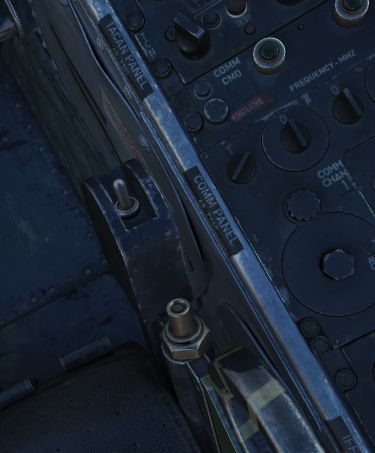

# Stick and Seat

## Stick

A control stick is provided in both cockpits, with near-uniform switchology
between the two.

The stick can be hidden by clicking on its base.

### Trim Hat

A Trim Control is found on both sticks to provide force reduction and minor
flight path correction in the pitch and roll axis.

### Trigger and Bomb Button

Weapons are deliverable through both a 2-stage Trigger (for air-to-air missiles
and the gun) and a Bomb Release Button.

The first stage of the trigger activates the gun camera for recording forward
footage.

### Air Refueling Release Button

Unique to the front cockpit control stick is the Air Refueling Release Button
located on the left side of the stick. It is a dual-role control that performs
the boom disconnect function its name implies, as well as a number of weapon
selection functions.

See [Utility Systems](../../systems/utility.md#air-refueling-release-button) for
details.

### Nose Wheel Steering Button

Both sticks carry a Nose Wheel Steering button that doubles as a radar
auto-acquisition control for the radar in visual range combat, and sensor focus
control for video-directed air to ground weapons.

Holding the button down permits the crew member to steer the aircraft using the
rudder peddals. See
[Nose Gear Steering](../../systems/flight_controls_gear/gear_ground_handling.md#nose-gear-steering)
for details.

### Emergency Quick Release Lever

An Emergency Quick Release lever on each stick is available to immediately
deactivate the anti-skid, ARI, autopilot, and stability augmentation.

See
[Anti-Skid section](../../systems/flight_controls_gear/gear_ground_handling.md#emergency-anti-skid-quick-release-lever)
for details.

## Seat

The seat allows the crew to eject out of the plane by pulling either the cord
between the legs or above the head.

See the [System section](../../systems/emergency.md#ejection-seats) for details
on the seat and ejection mechanism.

### Drag Chute Handle

Additionally, it features a handle on the left side to control the drag chute.

The chute is applied to reduce landing rollout, or as an aid in spin recovery,
the drag chute handle is pulled back to deploy the chute, and, once deployed, a
button on the handle is pressed while pulling the handle back further to
jettison the chute.

Once jettisoned, the handle is released back into its normal position.

See [Drag Chute System](../../systems/flight_controls_gear/gear_ground_handling.md#drag-chute-system)
for details.

### Seat Position

The vertical position of the seat can be changed in either direction for about
5cm using this spring-loaded switch on the right side of the seat.

For landing, it is advisable to put the seat in the most upward position for
better visibility.

Operation of the motor must be limited to 30 seconds within 10 minutes to
prevent it from overheating and breaking.
