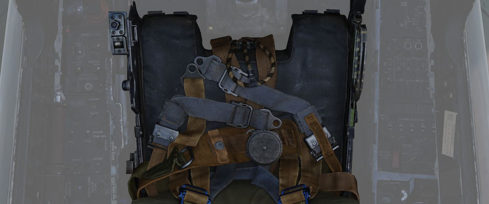

# 驾驶杆和座椅

## 驾驶杆

两个驾驶舱中都有驾驶杆并且开关几乎一致。

点击底座可隐藏驾驶杆。

### 配平苦力帽

两个驾驶舱的驾驶杆中有配平控制来降低向杆施加的力最小化俯仰和横滚轴飞行路径修正。

### 扳机与航弹按钮

机组可通过两段式扳机（空空导弹和航炮）以及航弹投放按钮来投放武器。

按下扳机第一段将激活照相枪录制。

### 空中受油断开按钮

前座驾驶杆所独有的按钮是一个位于驾驶杆左侧的空中受油断开按钮。这是一个具有双功能的控制按钮，可执行
其名称所示的硬管断开功能，以及一些武器选择功能。

详见 [3.7 公用系统](../../systems/utility.md#air-refueling-release-button)

### 前轮转向按钮

两根驾驶杆中包括一个前轮转向（NWS）按钮，可在视距内空战时执行雷达自动截获控制，以及在使用电视制导空
对地武器时，控制传感器焦点。

按住按钮接通前轮转向来使用方向舵脚蹬控制飞机滑行轨迹。详见
[3.1.3 起落架 & 地面操控，前轮转向部分](../../systems/flight_controls_gear/gear_ground_handling.md#nose-gear-steering)
。

### 应急快速释放杆

两个驾驶舱中的应急快速释放杆可立刻停用防滑系统、自动飞行控制系统（AFCS）、增稳（STAB AUG）和副翼-方
向舵交联系统（ARI）。

详见
[3.1.3 起落架 & 地面操控，防滑部分](../../systems/flight_controls_gear/gear_ground_handling.md#emergency-quick-release-lever)。

## 座椅

机组人员可以拉动两腿之间或头部上方的拉环弹射出飞机。

关于弹射座椅和弹射机构的详细介绍请阅读
[3.13 应急系统部分](../../systems/emergency.md#ejection-seats) 。

### 减速伞手柄

在弹射座椅的左侧，有一个用于控制减速伞的手柄。

使用减速伞来缩短着陆滑跑的距离，也用于尾旋改出，将减速伞手柄向后拉来放伞，放伞完成后，按下手柄上的
按钮，同时将手柄进一步向后拉，即可弃伞。

弃伞后，松开手柄将收回至正常位置。

详见
[3.1.3 起落架 & 地面操控，减速伞系统部分](../../systems/flight_controls_gear/gear_ground_handling.md#drag-chute-system)。

### 座椅位置

飞行员可使用座椅右侧的弹簧复位开关来在垂直方向上在 ±5cm 行程内调整调整座椅位置。

在着陆时，建议调整至最高位来取得更好地能见度。

为防止电机过热和断裂，操作座椅调节的时间每 10 分钟内只能操作 30 秒。
