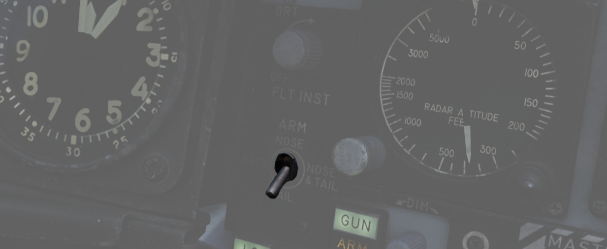
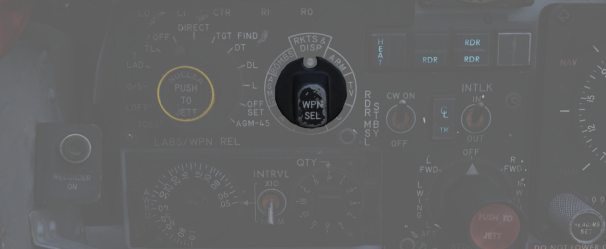
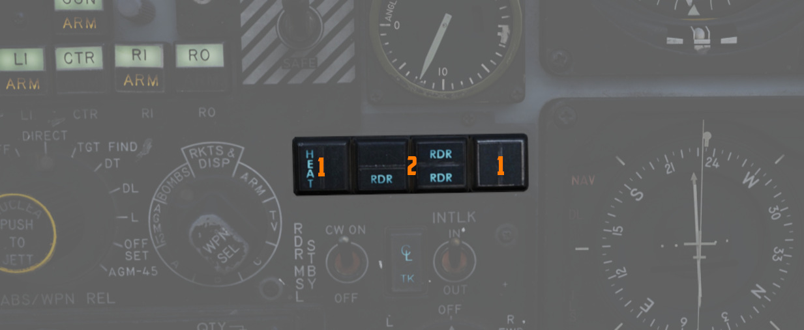

# 武器管理

位于主面板左侧区域的仪表组用来控制所有武器相关的设置，例如导弹解除保险或选择航弹投放模式。

## 距离指示器

面板为飞行员提供由 [pave spike](../../systems/weapon_systems/pave_spike/overview.md) 瞄准吊舱测得的
斜距读数 (x100 英尺)。

按下测试按钮后(3)，屏幕将显示 888。测试按钮下方的旋钮(5)用于控制读数的亮度。

模式旋钮(1)允许飞行员选择其中一个吊舱可用的武器投放模式：

- [WRCS](../../systems/weapon_systems/wrcs.md) - 自动投放
- ROR - 到距离投放

在 SET 档位，屏幕将显示 ROR 模式使用的预计投放距离。在读数下方旋钮(4)可用于调整距离。

## 平视显示指示器

平视显示指示器面板提供为飞行员提供主军械控制的武器状态，以及提供在左侧油门握把上 pinky 开关设置的当
前选定空对空武器。

| 名称  | 描述                            |
| ----- | ------------------------------- |
| RADAR | 选定雷达制导空空导弹时亮起。    |
| HEAT  | 选定红外制导空空导弹时亮起。    |
| GUN   | 选定机头航炮时亮起。            |
| ARM   | 主军械开关选定 ARM 档位时亮起。 |

## UHF 远程波道指示器

当电台设置到 PRESET 模式时提供当前选择的波道。否则，指示器将在电台数值到手动显示 M、COMM 功能设置到
GUARD/ADF 时 G 或 A-3-2-T 开关设置到 A 时显示 A。

## 真空速指示器

节为单位显示飞机真空速，校正区间在 150 到 1500 节；低于校正区间的空速不可靠。

## 飞行仪表亮度旋钮

控制 **两个驾驶舱** 中主飞行仪表的边缘照明亮度。

顺时针转动旋钮将增加亮度，但同时会降低飞机内多数警告和指示灯的亮度。

> 💡 在暗模式下，SHOOT 灯将完全关闭。

飞行仪表灯还可以通过右墙板上的
[飞行仪表灯亮度面板](right_console/wall.md#flight-instrument-lights-intensity-panel) 来单独进行控制
。

详见 [3.9. 机内照明](../../systems/lighting.md#interior-lighting)。

## 头部/尾部解除保险开关

控制 MER 和 TER 的解除保险电磁开关，选择在分离 MER/TER 时从已投放的航弹引信上拉出解除保险短索的位置
，从而使航弹进入解除保险状态。开关同样用来控制高阻航弹的低/高阻功能。

| 名称      | 描述                                         |
| --------- | -------------------------------------------- |
| SAFE      | 不动作电磁开关；禁用引信投放航弹。           |
| NOSE      | 前、中部电磁开关激活来拉住解除保险短索。     |
| TAIL      | 后部电磁开关激活来拉住解除保险短索。         |
| NOSE/TAIL | 前、中和后部电磁开关激活来拉住解除保险短索。 |

## 挂点选择按钮

挂点选择按钮用于激活空对地武器挂点和机头航炮。在选择了一个挂点后，按钮上半部分亮起绿色指示灯来确认
激活挂点。在选择了必要的模式、武器与武器选择旋钮选项兼容、主军械处在 ARM 档位，并且所选武器类型的必
要预热已完成，下半部分将亮起琥珀色灯光。L 和 R 分别表示左侧和右侧，O 表示外侧挂点，I 表示内侧挂点。
中线武器位置为 CL，机头航炮通过 GUN 挂点选择按钮来解除保险。

### 调光旋钮

此外，驾驶舱中还有一个调光旋钮，可根据当前的驾驶舱条件提高或降低挂点选择按钮的照明度。

如果位于其上方的飞行仪表亮度旋钮设置到最大逆时针档位，飞行仪表亮度旋钮将超控调光旋钮以及挂点选择按
钮将始终保持最亮。

💡 调光旋钮能调整的亮度区间有限。

## 主军械开关

为所有机载武器提供解除保险功能。

## 投放模式旋钮

投放模式旋钮用于将火控系统设置到所需的空对地武器投放类型。旋钮分为两半，左侧参考 ARBCS（高度基准和
投弹计算机组）投放模式，而右侧则提供使用 WRCS（武器投放计算机组）的自动投放功能，并可能根据模式与导
航计算机连接。11 点钟和 12 点钟位置分别为 OFF——仅使用空对空武器和 DIRECT 模式——用于视频制导武器，例
如 AGM-65，以及作为直接轰炸模式使用。所有档位，从左起按顺时针方向依次为：

| 名称                                                                                                 | 描述                                                                                     |
| ---------------------------------------------------------------------------------------------------- | ---------------------------------------------------------------------------------------- |
| [INST O/S](../../stores/air_to_ground/bombs/employment.md#instantaneous-over-the-shoulder---inst-os) | 实时越肩                                                                                 |
| [LOFT](../../stores/air_to_ground/bombs/employment.md#loft)                                          | 上仰                                                                                     |
| [O/S](../../stores/air_to_ground/bombs/employment.md#timed-over-the-shoulder---timed-os)             | (计时) 越肩                                                                              |
| [T LAD](../../stores/air_to_ground/bombs/employment.md#timed-low-angle-drogue-delivery---t-ladd)     | 计时 LADD (低角度伞投)                                                                   |
| [TL](../../stores/air_to_ground/bombs/employment.md#timed-level---tl)                                | 计时平投                                                                                 |
| OFF                                                                                                  | 关闭 （空对空）                                                                          |
| [DIRECT](../../stores/air_to_ground/bombs/employment.md#direct)                                      | 手动直接                                                                                 |
| [TGT FIND](../../stores/air_to_ground/bombs/employment.md#target-find---tgt-find)                    | 目标搜寻 (仅限导航模式和[铺路钉](../../systems/weapon_systems/pave_spike/overview.md) ） |
| [DT](../../stores/air_to_ground/bombs/employment.md#dive-toss---dt)                                  | 俯冲改出投弹                                                                             |
| [DL](../../stores/air_to_ground/bombs/employment.md#dive-laydown---dl)                               | 俯冲铺投                                                                                 |
| [L](../../stores/air_to_ground/bombs/employment.md#laydown---l)                                      | 铺投                                                                                     |
| [OFF SET](../../stores/air_to_ground/bombs/employment.md#offset)                                     | 偏置投弹                                                                                 |
| [AGM-45](../../stores/air_to_ground/missiles/shrike.md)                                              | [AGM-45 “百舌鸟”](../../stores/air_to_ground/missiles/shrike.md)                         |

详见 [4.3 空对地武器投放章节。](../../stores/air_to_ground/overview.md)

## 武器选择旋钮

用于选择合适的武器类型，向 AWRU（机载武器投放装置）提供投放信号。ARM 和 TV 档位禁止空对空武器发射，
除非激活 CAGE 信号。ARM 和 TV 档位不影响雷达制导武器的调谐状态。档位如下：

| 名称        | 描述                                                                           |
| ----------- | ------------------------------------------------------------------------------ |
| AGM-12      | [AGM-12 “小斗犬”](../../stores/air_to_ground/missiles/bullpup.md)              |
| BOMBS       | 航弹 (所有类型)。                                                              |
| RKTS & DISP | 航箭和布撒器。                                                                 |
| ARM         | 反辐射导弹 ([AGM-45 “百舌鸟”](../../stores/air_to_ground/missiles/shrike.md)). |
| TV          | 光电武器 ([AGM-65 “幼畜”](../../stores/air_to_ground/missiles/maverick.md)).   |
| C           | 不使用；可当作 OFF 档位使用。                                                  |
| B           | 和 WSO 驾驶舱中的 AIR TO AIR 开关类似，取消 CAGE 需求。                        |
| A           | CBU、航箭或布撒器同时投放模式；不投放航弹。                                    |

## 机载武器投放装置

根据间隔旋钮、QTY（数量）旋钮和间隔开关之间的选择，为单枚或多枚航弹或航箭以及布撒的弹药设置定时间隔
投放制度。

详见 [3.11.2 AWRU（机载武器投放装置）。](../../systems/weapon_systems/awru.md)

### 间隔旋钮

间隔旋钮提供 0.05 秒至 1 秒的投放脉冲序列控制。

### 间隔开关

INTRVL 开关提供间隔旋钮设定值 x10 倍的选择。在 NORM 档位下，间隔旋钮设置的值就是触发定时时间。

### 数量旋钮

控制每次脉冲所投放的挂载数量。

选择 "1" 时，AWRU 进入单发手动投弹模式；按一下航弹投放按钮就能投放一枚炸弹。

选择 "2 "至 "18 "之间的数值可将 AWRU 设置为单次连投模式；在该模式下，AWRU 将根据编程的投弹间隔炸弹
，直至投下设定的数量或松开投弹按钮。松开按钮后，计数将被重置，随后的按住按钮将按设定的数量投弹。

选择 "C" 可将 AWRU 设置为单发连续模式；按下航弹投放按钮可根据程序设定的间隔时间投弹，直至松开航弹投
放按钮或所选挂架上的所有航弹投放完毕。

"P" 设置用于成对手动模式。在至少选择两个挂点的情况下，每按一次航弹投放按钮将投出两枚航弹；与单发手
动模式一样，该模式不包括间隔功能。

最后，"S" 设置表示 "salvo"（齐射），根据所选的间隔时间从所有选定挂点同时投弹，直到松开投弹按钮。因
此，如果以 2 秒的间隔（间隔旋钮 0.2，X10 间隔开关设置）选择了四个挂点，则每按住投弹按钮两秒钟就会投
放四枚航弹。

## 导弹状态灯

导弹状态灯窗口可用于确认当前的装配 [4.2 空对空导弹章节](../../stores/air_to_air/overview.md).

### 雷达灯

在 AIM-7 导弹正确调谐至火控系统后，RDR 灯就会亮起；任何未挂载 “麻雀”、在调谐过程中未正确同步或已发
射的挂点都会熄灭。

位于左边的一对指示灯从上到下分别表示 4 号挂点和 3 号挂点，右边一对指示灯分别连接 6 号挂点和 7 号挂
点。

### 冷却灯

HEAT 灯每次仅一枚亮起，而不是在电路配置时全部亮起。当前选定挂点的指示灯将从收起起落架手柄时开始亮起
，并保持在该位置，直到使用油门的 “航炮/导弹开关” 断开选项循环选择武器或到导弹被发射出去。HEAT 灯排
列和 [AIM-9](../../stores/air_to_air/aim_9.md) 的
[发射序列](../../stores/air_to_air/aim_9.md#launch-sequence) 相对应。

位于左边的一对指示灯从上到下分别表示 2L 和 2R 挂点，右边一对指示灯分别连接 8L 和 8R 挂点。

## 雷达弹电源开关

雷达弹电源开关可控制用于发射机发射制导信号的连续波（CW）速调管的电源。开关也为“麻雀”的调谐驱动器供
电，该驱动器负责将“麻雀”调谐到正确的连续波载波频率，以进行制导。

将开关移出 OFF 档位时，系统将在 30 秒后将向电路供电。

导弹调谐完成后，STBY 档位将保持预热导弹和连续波调谐驱动器。这样可以保持“麻雀”导弹和调谐驱动器的温度
，但不调谐“麻雀”导弹。

CW ON 档位允许雷达模式在除 TV 档位外时进行持续调谐和导弹状态监控。这也会使雷达速调管开始发射连续波
。

调谐可在雷达处于 TEST 模式时在地面上执行，以避免辐射危及地勤。

## 中线副油箱抛弃灯

当出现无法弹射或发射挂载在两个前部挂点中的任意一枚 AIM-7 导弹的挂载条件时亮起。要使用位于前部挂点的
麻雀，必须先将中线挂载抛弃。

## 互锁开关

一个二档位开关，用于决定火控系统发射参数互锁是否能在扣动扳机时阻止发射 AIM-7。

| 名称 | 描述                                                          |
| ---- | ------------------------------------------------------------- |
| IN   | 接通互锁； 距离限制、ASE 限制或雷达未处在目视截击时禁止发射。 |
| OUT  | 超控互锁；不论是否满足发射条件，按下扳机发射 AIM-7。          |

## 选择抛弃控制

选择抛弃控制旋钮可让飞行员直接抛弃单一挂点上的挂载。

飞行员通过转动旋钮到所需位置，然后按下旋钮中的按钮，即可抛弃所选的挂载。

| 名称     | 描述                                                                                                                                                                           |
| -------- | ------------------------------------------------------------------------------------------------------------------------------------------------------------------------------ |
| OFF      | 位于选择抛弃控制面板中的 PUSH TO JETT 按钮不作用。                                                                                                                             |
| STORES   | 按下 PUSH TO JETT 后投放所有 MER/TER、单发挂载、挂载在 LAU-88 或挂点按钮选定的副油箱。                                                                                         |
| L/R FWD  | 将对应 PUSH TO JETT 旋钮档位的[AIM-7](../../stores/air_to_air/aim_7.md) 抛弃。如果 CL TK ON 将禁止抛弃。                                                                       |
| L/R AFT  | 将对应 PUSH TO JETT 旋钮档位的[AIM-7](../../stores/air_to_air/aim_7.md) 抛弃。                                                                                                 |
| L/R WING | 结合 TV 或 ARM 使用，从左/右侧机翼抛弃单枚[AGM-65 “幼畜”](../../stores/air_to_ground/missiles/maverick.md) 或 [AGM-45 “百舌鸟”](../../stores/air_to_ground/missiles/shrike.md) |

示例，如需抛弃左右副油箱，飞行员必须选择 _STORES_ 档位，接着按下挂点选择按钮 _LO_, _RO_ 然后按下抛
弃按钮。

## 录制灯

调光指示灯亮起时表示 [机载录像机 (AVTR)](../../cockpit/wso/left_sub_panel.md#avtr-control) 正在工作
。

AVTR 由 WSO 进行控制并会录制内话音频以及后座雷达屏幕。
