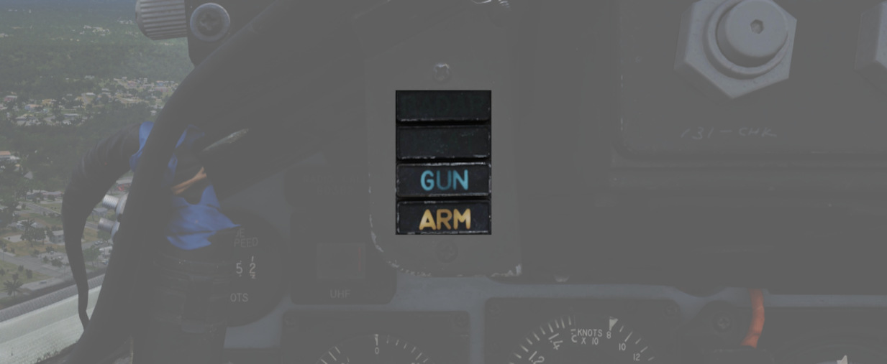

# Weapon Management

This group on the left area of the main panel provides all weapon related
settings, such as arming missiles or selecting the bomb delivery mode. It
features a true airspeed indicator (<num>1</num>), a Head Up Display Indicator
(<num>2</num>), a flight instrument brightness knob (<num>3</num>), the
nose/tail arming switch (<num>4</num>), the station select buttons
(<num>5</num>), the master arm switch (<num>6</num>), the delivery mode knob (<num>7</num>), the
weapon selector knob (<num>8</num>), the missile status lights (<num>9</num>), the
radar missile power switch (<num>10</num>), the centerline tank aboard light
(<num>11</num>), the interlock switch (<num>12</num>), the selective jettison
control (<num>16</num>) and the AWRU controls (<num>13</num>, <num>14</num> and
<num>15</num>).

## Range Indicator

This panel provides the pilot with a readout of the slant range measured by the
[Pave Spike](../../systems/weapon_systems/pave_spike/overview.md) Targeting Pod
(x100 ft).

When the Test-Button (<num>3</num>) is pressed, the display shows 888. The knob
underneath (<num>5</num>) the test button controls the brightness of the readout
(<num>2</num>).

The Mode-Knob (<num>1</num>) allows the pilot to select one of two weapon
delivery modes available with the pod:

- [WRCS](../../systems/weapon_systems/wrcs.md) - Automatic Delivery
- ROR - Release on Range

In the SET position, the display shows the desired release range used in the ROR
mode. The knob below the readout (<num>4</num>) can be used to adjust this
range.

## Head Up Display Indicators

The Head Up Display indicator panel provides weapon status for the Master Arm
control as well as the current selected air-to-air weapon based on the position
of the pinky switch on the left throttle handle.

| Name  | Description                                                     |
|-------|-----------------------------------------------------------------|
| RADAR | Illuminates when a radar-guided air to air missile is selected. |
| HEAT  | Illuminates when an IR-guided air to air missile is selected.   |
| GUN   | Illuminates when the nose gun is selected.                      |
| ARM   | Illuminates when the Master Arm switch is selected to ARM.      |

## UHF Remote Channel Indicator

Provides the current selected channel value when the radio is set to PRESET.
Otherwise, the indicator displays M if the radio is set to Manual, G when the
COMM function is set as GUARD/ADF, or A when the A-3-2-T switch is in A.

## True Airspeed Indicator

Provides the aircraft's true Airspeed in knots, and is calibrated from 150 to
1500 knots; airspeeds below this range are thus not reliable.

## Flight Instrument Brightness Knob

Controls edge lighting of the main flight instruments of **both cockpits**.

Rotating clockwise will increase their brightness, but at the same time also dim
most warning and indication lamps in the aircraft.

> 💡 When dimmed, SHOOT lamps are turned off entirely.

Flight instrument lights can additionally be controlled individually with knobs
on the
[Flight Instrument Lights Intensity Panel](right_console/wall.md#flight-instrument-lights-intensity-panel),
located on the right wall.

See [3.9. Interior Lighting](../../systems/lighting.md#interior-lighting) for
details.

## Nose/Tail Arming Switch

Controls the arming solenoids of the MER and TER racks, selecting what MER/TER
position(s) arming lanyards are pulled from released bomb fuzes upon separation,
thus making them live. This function also controls selective low/high drag
capability for retarded bombs.

| Name      | Description                                                                       |
|-----------|-----------------------------------------------------------------------------------|
| SAFE      | No arming solenoids activate; bombs release without fuzing enabled.               |
| NOSE      | Forward and center position solenoids activate to hold arming lanyards.           |
| TAIL      | Aft position solenoids activate to hold arming lanyards.                          |
| NOSE/TAIL | Forward, center, and aft position solenoids all activate to hold arming lanyards. |

## Station Select Buttons

The Station Select Buttons are used to activate air to ground munition stations
and the nose gun. Upon selection of a station, the upper half denoting the
position will illuminate green to confirm the station is active. The lower half
will illuminate amber once the necessary mode is selected, the weapon is
compatible with the weapon select knob option, the Master Arm is in the ARM
position, and any necessary warm up period for the selected weapon type is
completed. L and R positions are left and right, respectively, with O denoting
outboard and I denoting inboard stations. The centerline weapon position is CL,
and the nose gun is armed with the GUN station selector button.

### Dimmer Knob

A dimmer knob is also provided to raise or lower the lighting of the station
select buttons relative to current cockpit conditions.

If the Flight Instrument Brightness Knob above it is set to the full CCW
position, it overrides the dimmer knob and Station Select Buttons are always
illuminated at full brightness.

> 💡 The dimmer knob can control brightness only within a limited range.

## Master Arm Switch

Provides master arming function for all aircraft weapons.

## Delivery Mode Knob

The Delivery Mode Knob sets the fire control system to the desired air to ground
weapon release type. Split into two halves, the left side of the dial references
ARBCS (Altitude Reference and Bombing Computer Set) delivery modes, while the
right side provides automated release functions using the WRCS (Weapon Release
Computer Set) with possible tie-in to the navigation computer, depending on
mode. At the 11 and 12 o'clock positions are the OFF position, which is utilized
for air-to-air weapons (including the gun). The next mode, DIRECT, is used for
video-directed weapons such as the AGM-65 and as a direct delivery bombing mode.
The full series of positions is as follows, clockwise from the left:

| Name                                                                                             | Description                                                                                       |
|--------------------------------------------------------------------------------------------------|---------------------------------------------------------------------------------------------------|
| [TOSS](../../stores/air_to_ground/bombs/employment.md#instantaneous-over-the-shoulder---inst-os) | Instantaneous Over the Shoulder                                                                   |
| [LOFT](../../stores/air_to_ground/bombs/employment.md#loft)                                      | Loft                                                                                              |
| [O/S](../../stores/air_to_ground/bombs/employment.md#timed-over-the-shoulder---timed-os)         | (Timed) Over the Shoulder                                                                         |
| [T LAD](../../stores/air_to_ground/bombs/employment.md#timed-low-angle-drogue-delivery---t-ladd) | Timed LADD (Low Angle Drogue Delivery)                                                            |
| [TL](../../stores/air_to_ground/bombs/employment.md#timed-level---tl)                            | Timed Level                                                                                       |
| OFF                                                                                              | Off (Air-to-Air)                                                                                  |
| [DIRECT](../../stores/air_to_ground/bombs/employment.md#direct)                                  | Manual Direct                                                                                     |
| [TGT FIND](../../stores/air_to_ground/bombs/employment.md#target-find---tgt-find)                | Target Find (Nav mode and [Pave Spike](../../systems/weapon_systems/pave_spike/overview.md) only) |
| [DT](../../stores/air_to_ground/bombs/employment.md#dive-toss---dt)                              | Dive Toss                                                                                         |
| [DL](../../stores/air_to_ground/bombs/employment.md#dive-laydown---dl)                           | Dive Laydown                                                                                      |
| [L](../../stores/air_to_ground/bombs/employment.md#laydown---l)                                  | Laydown                                                                                           |
| [OFF SET](../../stores/air_to_ground/bombs/employment.md#offset)                                 | Offset Bomb                                                                                       |
| [AGM-45](../../stores/air_to_ground/missiles/shrike.md)                                          | [AGM-45 Shrike](../../stores/air_to_ground/missiles/shrike.md)                                    |

For further information see
[4.3 Air-to-Ground weaponry chapter.](../../stores/air_to_ground/overview.md)

## Weapon Selector Knob

Used to select the appropriate type of weapon, providing release signals to the
AWRU (Aircraft Weapons Release Unit). ARM and TV positions inhibit air-to-air
weapon firing unless a CAGE signal is active. ARM and TV positions do not affect
tuning status of radar guided weapons. Positions are as follows:

| Name        | Description                                                                                   |
|-------------|-----------------------------------------------------------------------------------------------|
| AGM-12      | [AGM-12 Bullpup](../../stores/air_to_ground/missiles/bullpup.md)                              |
| BOMBS       | Bombs (all types).                                                                            |
| RKTS & DISP | Rockets and dispensers.                                                                       |
| ARM         | Anti-Radiation Missile ([AGM-45 Shrike](../../stores/air_to_ground/missiles/shrike.md)).      |
| TV          | Electro-optical weapons ([AGM-65 Maverick](../../stores/air_to_ground/missiles/maverick.md)). |
| C           | Not used; may be utilized as an OFF position.                                                 |
| B           | Like AIR TO AIR switch in rear cockpit, cancels CAGE requirement.                             |
| A           | Simultaneous release mode for CBU, rockets, or dispensers; bombs do not release.              |

## Aircraft Weapons Release Unit

Provides timed interval release scheduling of single or multiple bombs or
rockets and dispensed munitions based on the selections made between the
interval knob, the QTY (quantity) knob and the INTRVL switch.

For further information see
[3.11.2 Aircraft Weapons release unit (AWRU).](../../systems/weapon_systems/awru.md)

### Interval Knob

The interval knob (<num>1</num>) provides release pulse sequences between 0.05
second and 1 second.

### Interval Switch

The INTRVL switch (<num>2</num>) provides the option of a 10x multiplier of the
set value of the interval knob. In the NORM position, the interval knob value is
the trigger timer.

### Quantity Knob

The quantity knob (<num>3</num>) controls how many stores are released per
impulse.

Selecting "1" places the AWRU into single manual bombing mode; one push of the
bomb release button releases one bomb.

Selecting a value from "2" to "18" sets the AWRU into single ripple mode; in
this mode, the AWRU will release bombs according to the programmed interval
until the set number of rounds is dropped, or the bomb button is released. Upon
release, the count is reset, and a subsequent press and hold will drop the
programmed number of bombs.

Selecting "C" sets the AWRU into single continuous mode; pressing the bomb
release button drops rounds according to the programmed interval until the bomb
button is released, or all munitions from the selected pylons are expended.

The "P" setting is for pairs manual mode. With at least two stations selected,
each push of the bomb button will release two bombs; like single manual mode,
this does not include an interval function.

Lastly, the "S" setting, for salvo, releases bombs in accordance to the chosen
interval from all selected stations simultaneously, until the bomb button is
released. Ergo, if four stations are selected with a 2 second interval (0.2 on
the interval dial, X10 INTRVL switch setting), four bombs will be released every
two seconds the bomb button is held down.

## Missile Status Lights

The Missile Status Light window provides confirmation of currently installed and
configured
[4.2 air-to-air missiles chapter](../../stores/air_to_air/overview.md).

### Radar Lights

The RDR lights (<num>2</num>) illuminate once AIM-7 missiles are properly tuned
with the fire control system; any station that does not carry a Sparrow, does
not correctly sync up during tuning, or is launched, will turn off.

The left pair of lights indicates stations 4 and 3 from top to bottom, while the
right pair links to stations 6 and 7 respectively.

### Heat Lights

The HEAT lights (<num>1</num>) illuminate one at a time, rather than all up upon
circuit configuration. The light of the currently selected station will
illuminate beginning at the raising of the gear handle, and remain in that
position until the weapon is either cycled using the throttle's Gun/Missile
Switch reject option, or is launched. The HEAT light arrangement corresponds
with the [launch sequence](../../stores/air_to_air/aim_9.md#launch-sequence) of
the [AIM-9](../../stores/air_to_air/aim_9.md).

The left pair of lights represent station 2L and 2R respectively, while the
right pair is linked to stations 8L and 8R.

## Radar Missile Power Switch

The Radar Missile Power Switch provides power to the klystron continuous wave
(CW) for emitter responsible guidance signals. This also powers the Sparrow
tuning drive which is responsible for tuning the Sparrows to the correct
continuous wave carrier frequency for guidance.

When switched out of the OFF position, power is applied to the circuit 30
seconds after this selection.

The STBY position maintains warmup power to the missiles and continuous wave
tuning drive once the missiles have been tuned. This keeps the Sparrows and
Tuning Drive warm, but the Sparrows not tuned.

The CW ON position allows for constant tuning and missile state monitoring with
the radar mode not in TV. This also causes the radar klystron to begin
continuous wave emission.

Tuning can be performed on the ground with the radar in TEST mode to preclude
emissions endangering ground crew.

## Centerline Tank Aboard Light

Illuminates when a stores condition exists that precludes ejection or launch of
an AIM-7 missile installed in one of the two forward positions. To use the
Sparrows on these stations the centerline store must be first jettisoned.

## Interlock Switch

A two position switch that determines whether the fire control system launch
parameter interlocks can prevent an AIM-7 from being launched when the trigger
is pulled.

| Name | Description                                                                                       |
|------|---------------------------------------------------------------------------------------------------|
| IN   | Interlocks engaged; range limits, ASE limits, or radar not in visual intercept inhibits launch.   |
| OUT  | Interlocks override; AIM-7 will fire when trigger is pulled even when no launch condition is met. |

## Selective Jettison Control

The Selective Jettison Control knob provides the pilot direct access to dump
stores on a position by position basis.

The pilot selects the desired position by rotating the knob and then presses the
button on its front to jettison the selected stores.

| Name     | Description                                                                                                                                                                                                     |
|----------|-----------------------------------------------------------------------------------------------------------------------------------------------------------------------------------------------------------------|
| OFF      | Safes PUSH TO JETT button on the Selective Jettison Control Panel.                                                                                                                                              |
| STORES   | Releases all MER/TER, single carried, LAU-88 mounted rounds, or drop tanks currently selected on the station buttons upon PUSH TO JETT.                                                                         |
| L/R FWD  | Jettisons [AIM-7](../../stores/air_to_air/aim_7.md) from respective position on PUSH TO JETT. Inhibited if CL TK ON.                                                                                            |
| L/R AFT  | Jettisons [AIM-7](../../stores/air_to_air/aim_7.md) from respective position on PUSH TO JETT.                                                                                                                   |
| L/R WING | In conjunction with TV or ARM, jettisons single [AGM-65 Maverick](../../stores/air_to_ground/missiles/maverick.md) or [AGM-45 Shrike](../../stores/air_to_ground/missiles/shrike.md) from wing on PUSH TO JETT. |

As example, to jettison the right and left external fuel tanks, the pilot must
select _STORES_ on the knob, press the corresponding station select buttons
_LO_, _RO_ and then push the jettison button.

## Recorder Lamp

This dimmable lamp is lit to indicate operation of the
[Airborne-Video-Tape-Recorder (AVTR)](../../cockpit/wso/left_sub_panel.md#avtr-control).

The AVTR system is controlled by the WSO and records the intercom sound, as well
as the rear radar screen.
