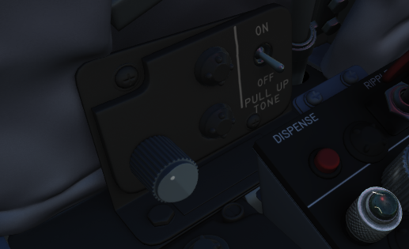
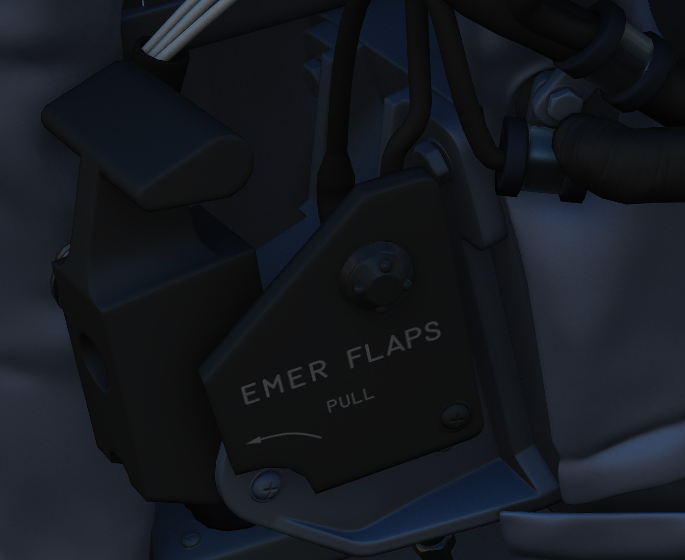

# Left Console

## Intercom Control Panel

### WSO ICS Volume Control Knob

Turned clockwise to increase audio between cockpits, and counterclockwise to
decrease audio between cockpits on the intercom.

### WSO ICS Function Selector Switch

| Name           | Description                                                                  |
| -------------- | ---------------------------------------------------------------------------- |
| COLD MIC       | Mic switch on throttle must be held to activate intercom.                    |
| HOT MIC        | Voice automatically transmitted on intercom.                                 |
| RADIO OVERRIDE | The opposite cockpit’s audio is heard at its set volume using its amplifier. |

### WSO ICS Amplifier Select Knob

Determines current amplifier for intercom function.

| Name | Description                                                                         |
| ---- | ----------------------------------------------------------------------------------- |
| B/U  | Backup headset amplifier provides audio.                                            |
| NORM | Primary headset amplifier provides audio.                                           |
| EMER | Uses amplifier from opposite cockpit; only audio received to that cockpit is heard. |

## Control Monitor Panel

### Cords Light

Not used by the APQ-120 in the F-4E.

### Temp Light

Illuminates amber to indicate an overtemperature situation in the nose radar
avionics bay. Under normal circumstances, an overheat condition requires setting
the radar power to OFF. If circumstances require continued use, the light should
be monitored regularly.

### Test Knob

An eleven position rotary knob used with the radar power knob in TEST to perform
system BIT checks of the APQ-120 radar. Basic test function noted below;
procedural functionality is found in the applicable BIT test section.

| Name    | Description                                                                                 |
| ------- | ------------------------------------------------------------------------------------------- |
| 0       | Displays standard B scope presentation to confirm all elements functioning correctly.       |
| 1       | Confirms break lock timing delay, AIM-7 tuning status, and Range lamp status function.      |
| 2       | Confirms proper AIM-7 head position aim and SHORT pulse function against two targets.       |
| 3       | Confirms angle tracking performance against a locked target that rotates inside ASE circle. |
| 4       | Used while lock achieved in another mode, confirms HOJ and AOJ functionality.               |
| 5       | Checks range rate, lead angle, CAA, and PLMS function.                                      |
| 6       | Confirms proper AIM-7 attack display and interlock function.                                |
| 7       | n/a                                                                                         |
| 8       | n/a                                                                                         |
| 9       | n/a                                                                                         |
| 10      | n/a                                                                                         |
| DOT BAL | Confirms AIM dot centering calibration. Also used for TIRS data transfer.                   |

### Meter Switch

Determines which set of values are utilized from the Meter Selector Knob for the
applicable test sequences; VOLT selects the inner ring of Voltage referencing
values, whereas SIGNALS uses the outer rim of SIGNAL reference values.

### Meter Selector Knob

A sixteen position rotary knob used in conjunction with the Test Knob, with each
position having two values- an outer SIGNAL value, and an inner VOLT value.
Selection of which value determined by the Meter Switch.

### Monitor Meter

Provides voltage, current, and signal indications based on current Meter Switch
and Meter Selector Knob settings.

### Vc Switch

Changes the scale factor of the range rate presentation. DSCG aircraft must
leave the switch in 2700, else the Vc presentation will be in error.

### Stab Switch

Changes the antenna stabilization mode.

| Name      | Description                                                                              |
| --------- | ---------------------------------------------------------------------------------------- |
| NOR       | Normal operation; inputs of pitch and roll are fed to the antenna stabilization circuit. |
| STAB OUT  | Horizon line removed from scopes and stabilation drift servos are zeroed.                |
| DRIFT OUT | INS drift compensation is removed; antenna uses direct pitch and roll input tracking.    |

## Radar Set Control Panel

### Power Knob

Five position rotary switch controlling power state of the APQ-120

| Name | Description                                                                                |
| ---- | ------------------------------------------------------------------------------------------ |
| OFF  | Powers radar off.                                                                          |
| TEST | Applies voltage to control monitor power and provides test functions 1 through 6.          |
| STBY | Power applied to radar, remains in a non-transmitting standby state.                       |
| OPR  | System is fully operational.                                                               |
| EMER | Overrides the time delay, pressure, and temperature restrictions to allow radar operation. |

### Polar Switch

Controls polarization of transmitted rf energy.

| Name  | Description                                                                           |
| ----- | ------------------------------------------------------------------------------------- |
| LIN   | RF energy is linerally polarized in a vertical orientation. AIM-7 default mode.       |
| CIR 1 | RF energy is rotated clockwise from the vertical plane. AIM-7 can be fired.           |
| CIR 2 | RF energy is rotated counterclockwise from the vertical plane. AIM-7 cannot be fired. |

### Radar Range Knob

Used to select range sweep of 5, 10, 25, 50, 100, or 200 mile ranges on both
radar displays. First four ranges are air to air intercept positions, final two
are ground mapping modes only, and disengage lockon capability. Selecting a
setting illuminates the applicable range lamp, and displays the value on the
radar scope upper left corner.

### Maneuver Switch

Controls radar tracking response due to acceleration limits and received
countermeasures and clutter.

| Name  | Description                                                                        |
| ----- | ---------------------------------------------------------------------------------- |
| Low G | Default position. Limts track response due to countermeasures and clutter.         |
| HI G  | Allows track loop to respond to high acceleration. Automatically engaged with CAA. |

### Bar Scan Switch

Selects elevation scan pattern. In 2 bar scan, search pattern is separated by
3.75 degrees on each scan. In boresight or air to ground modes, 1 bar scan is
automatically commanded.

### Aspect Switch

Used to program the AIM-7 with a predetermined simulated Doppler instead of
actual received Doppler, so that the WSO can provide an estimated correct
speedgate location when range isn't available.

### Receiver Gain Knobs (RCVR GAIN)

Coarse (outer ring) and Fine (inner knob) gain control for the radar scope
display to increase video output legibility of target returns.

### Track Switch

Enables manual target tracking in heavy clutter environments, or automatic
tracking under normal circumstances.

#### Manual

When in the MAN position, the WSO places the acquisition symbol over the
intended target and triggers half-action on the HCU. The range strobe is
positioned relative to in-range on a closing target, and the WSO selects
full-action. To solidify the track, the WSO uses the Manual Vc knob to place the
range strobe and target return video at the same rate of movement.

#### Automatic

In the AUTO position, the range and closure calculations are performed
automatically. The WSO places the acquisition symbol over the target return and
presses full action. Should the target maneuver in excess of the speed
capability of the radar, the Maneuver switch can be set to HI G and the target
reacquired.

#### AOJ OUT

The AOJ OUT position is used to override the acquisition on jamming function of
the radar. In the event that the radar acquires a HOJ lock, the position can be
selected to place the radar back into a search configuration to initiate a
lockon against the jamming target and initiate a standard angle track lock.

### Display Knob

Sets the display type of the radar scope to access specific mode functionality
in conjunction with the Mode knob. The types are as follows:

| Name     | Description                                                                              |
| -------- | ---------------------------------------------------------------------------------------- |
| B WIDE   | Selects 120 degree B-sweep for search. Half-action places the sweep under manual HCU.    |
| B NAR    | Selects a 45 degree B-sweep sector for search, which is manually shifted with the HCU.   |
| PPI WIDE | Selects a 120 degree wide plan position indicator sweep for MAP mode.                    |
| PPI NAR  | Selects a 45 degree plan position indicator sweep that can be shifted with the HCU.      |
| VI       | Provides pure pursuit guidance to a locked target; a break X will appear at 1000' range. |

### Maneuver Vc Knob

An 12 position switch used to apply estimated range rate of closure (clockwise,
0-9), or estimated opening of range (counterclockwise, 0-2) against a target in
manual track mode.

### Pulse Switch

Three position switch controlling radar pulse width and pulse repetition
frequency in the Air to Air radar search modes. With the APQ-120 placed in CAGE
mode, short pulse operation is automatically selected. In AIR-GND modes, the
pulses are automatically commanded, deactivating the switch.

| Name  | Description                                                                                          |
| ----- | ---------------------------------------------------------------------------------------------------- |
| AUTO  | Commands long pulse width and low PRF; pulse width handled automatically when target is locked.      |
| LONG  | Low PRF and wide pulse width, allowing maximum range detection; no track automatic pulse adjustment. |
| SHORT | Narrow pulse width with high PRF for increased close range performance.                              |

### Mode Knob

A six position switch that determines the current base mode of operation of the
radar.

| Name    | Description                                                                                     |
| ------- | ----------------------------------------------------------------------------------------------- |
| BST     | Air to Air boresight with antenna aligned to optical sight. Permits CAGE and CAA.               |
| RDR     | Air to Air search mode.                                                                         |
| MAP     | Radar ground mapping mode.                                                                      |
| AIR-GRD | Air to Ground boresight, 20 mile range against targets visually established with optical sight. |
| BEACON  | Radar receives and displays signals from ground or airborne beacon transponders for navigation. |
| TV      | Not used with DSCG. Deactivates AIM-7 if selected.                                              |

### Skin Track Light

Green lamp that illuminates when a track is attained with range data. In the
event of HOJ or a range memory situation, the light will go off. Accompanied on
the rear DSCG radar scope with the T symbol that illuminates under the same
circumstances.

## TACAN Control Panel

The TACAN Control Panel is used to enter the desired TACAN channel, mode, and
audible volume for the monitoring of said channel by the aircrew. The panel is
duplicated in both cockpits, and the panel in command of the TACAN receiver is
selected with the NAV CMD button the Communication Control Panel.

On the control panel is found two Navigation Channel Control knobs, with the
left controlling the first two digits of the channel value (hundreds and tens),
and the right controls the single unit (ones) values. The right knob also
includes an outer ring which sets the X or Y value for the desired TACAN
channel.

Between these two knobs is the TEST button, which performs the ground testing
cycle after warmup, and can also be used to perform an in-flight confidence test
of the system's performance.

To the upper right, the VOL knob is available to set the desired audio level for
the received TACAN station.

The TACAN Function Selector Knob determines the presentation and type of
information provided on the HSI, ADI, and BDHI, respectively.

| Name    | Description                                                                                                                                                |
| ------- | ---------------------------------------------------------------------------------------------------------------------------------------------------------- |
| OFF     | The TACAN receiver is deenergized and offline.                                                                                                             |
| REC     | The TACAN receiver is active, providing bearing information on the HSI, BDHI, and ADI.                                                                     |
| T/R     | Both the receive and transmit functions of the TACAN are active, which provide bearing and nautical mile range information for the HSI and BDHI.           |
| A/A REC | The TACAN receiver decodes bearing information from compliant aircraft for the HSI, BDHI, and ADI steering display.                                        |
| A/A TR  | The TACAN receiver receives both bearing and slant range information in nautical miles from the transmitting aircraft, providing this on the HSI and BDHI. |

Note: Air to Air TACAN functionality requires the channel to be set 63 channels
above or below the cooperating aircraft, but on the same range- X or Y.

## Communication Control Panel

The Communication Control Panel provides selection and mode of the UHF radio in
the aircraft. The panel is duplicated in both cockpits, and control over the
radio is determined through pushing the COMM CMD Button in the respective seat;
the button will illuminate green in the seat in priority. In the same fashion,
the NAV CMD button dictates which seat has control of the TACAN settings; its
button will also illuminate in the seat in command of the system.

Beneath the COMM CMD button is the radio volume for the respective seat.
Adjacent to the NAV CMD button is the Squelch switch, which enables or disables
receiver squelch.

The A-3-2-T Selector knob sets HAVE Quick functionality of the UHF radio (A-
auto-jam), the first digit of the manually selected frequency (3 or 2), or
enables Time of Day receipt for one minute after selection in a momentary hold
position (T).

The four Frequency Selection Knobs work in concert with the A-3-2-T knob and
Preset/Manual switch. Frequencies are entered beginning with the 3 or 2
selection on the A-3-2-T Selector, and can be entered from 225.00 to 399.975 MHz
in increments of 0.025. With Preset/Manual in the Manual position, the UHF radio
is directly set to the displayed channel. In the Preset position, the set
channels can entered into the COMM CHAN memory, with the desired position
selected with the Comm Channel Control knob- the smaller knob to the left of the
Preset/Manual switch, and displayed in the COMM CHAN window. Channels are stored
in the displayed channel preset with the SET pushbutton. Once stored, channels
are directly selected using the Comm Channel Control knob with the Preset/Manual
switch in the Preset position.

The Tone Pushbutton is used for transmission of a TOD signal along with a tone
to friendly aircraft requiring a Time of Day update for proper HAVE Quick
functionality. It is also used to activate the emergency TOD clock for the radio
itself, in conjunction with the T position of the A-3-2-T knob. Selecting the T
position and pushing the Tone button will cause the radio to listen for a TOD
signal from another friendly transmitter to synchronize the anti-jam function
with the desired network.

Directly underneath the Comm Channel Control Knob is the Aux Channel Knob and
Indicator. This knob is used to access 20 common preset channels that cannot be
changed from in the cockpit.

The Comm Function Selector Knob determines the current configuration of the
radio system.

| Name      | Description                                                                |
| --------- | -------------------------------------------------------------------------- |
| OFF       | All UHF Radios off.                                                        |
| T/R ADF   | Comm receiver - comm reception.                                            |
|           | Comm transmitter - comm transmission.                                      |
|           | Comm guard receiver - standby.                                             |
|           | Aux receiver - ADF reception.                                              |
| T/R+G ADF | Comm receiver - comm reception.                                            |
|           | Comm transmitter - comm transmission.                                      |
|           | Comm guard receiver - guard reception.                                     |
|           | Aux receiver - ADF reception.                                              |
| ADF+G CMD | Comm receiver - ADF reception.                                             |
|           | Comm transmitter - comm transmission. ADF interrupted during transmission. |
|           | Comm guard receiver - guard reception on ADF antenna.                      |
|           | Aux receiver- comm reception.                                              |
| ADF+G     | Comm receiver - ADF reception.                                             |
|           | Comm transmitter - comm transmission. ADF interrupted during transmission. |
|           | Comm guard receiver - standby.                                             |
|           | Aux receiver- guard reception.                                             |
| Guard ADF | Comm receiver - guard reception.                                           |
|           | Comm transmitter - guard transmission.                                     |
|           | Comm guard receiver - standby.                                             |
|           | Aux receiver - ADF reception.                                              |

The Aux Volume Control knob raises and lowers the volume of the Aux receiver
channel.

## AN/ALE-40 Cockpit Control Unit

### Ripple Switch

When positioned ON, dispenses flares at rate of ten per second until dispensers
are empty, so long as flaps and speed brakes are retracted.

### Dispense Button

Initiates chaff/flare dispensing as selected by CCU and ALE-40 programmer with
flaps and speed brakes retracted and mode knobs out of OFF.

### Counters

Indicate quantity of chaff and flare cartridges remaining, respectively. If
slave dispenser is set to Chaff Double (CD), the chaff counter will display half
of the number of cartridges remaining.

### Chaff Mode Knob

| Name | Description                                                                 |
| ---- | --------------------------------------------------------------------------- |
| OFF  | Chaff system inactive.                                                      |
| SGL  | A single burst commanded when dispense button pressed.                      |
| MULT | A salvo commanded according to program when either dispense button pressed. |

### Flare Mode Knob

| Name | Description                                                                 |
| ---- | --------------------------------------------------------------------------- |
| OFF  | Flare system inactive.                                                      |
| SGL  | A single burst commanded when dispense button pressed.                      |
| MULT | A salvo commanded according to program when either dispense button pressed. |

### Indicator Lights

Illuminates whenever a mode is selected on the respective countermeasure mode
knob.

## LABS Panel

### Aural Tone Volume

Knob to control the volume for weapon tones, such as the Sidewinder seeker head.

### Pull Up Tone

Switch to toggle the tone played by the Pull-Up system.

## Pressure Altitude Indicator

## Liquid Oxygen Level Indicator

Range from 0 to 10 liters, providing confirmation of current liquid oxygen
status. In event power is lost, a "power off" flag will show on the instrument
face.

## VOR/ILS Volume Control

The volume control consists of two knobs: one square knob adjusts VOR and
localizer audio, while the round knob controls the marker beacon audio.

## WSO Emergency Flaps Handle

Used for emergency deployment of the slats and flaps from the rear cockpit, and
is activated by pulling the handle aft. Pneumatic system powering extension of
the slats flaps system only functions one time. Extend regardless of airspeed,
however flaps will not fully deploy above 230 knots due to air loads on control
surfaces. Will deploy fully when slower.
