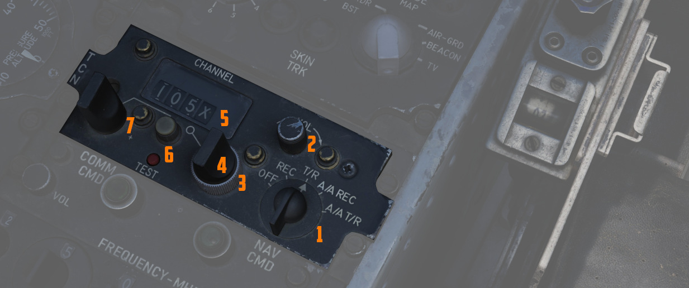
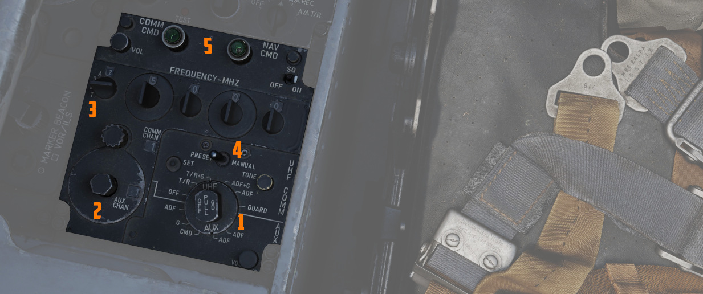
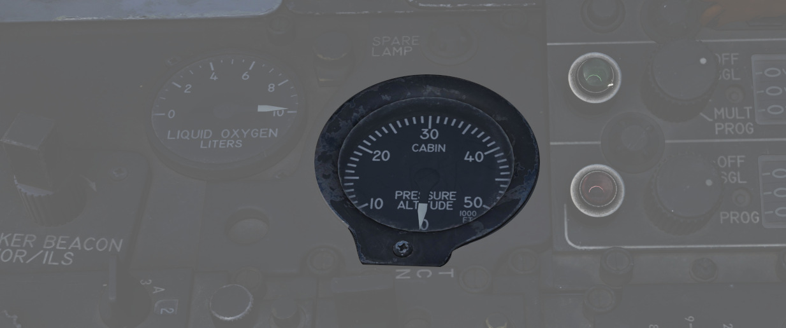
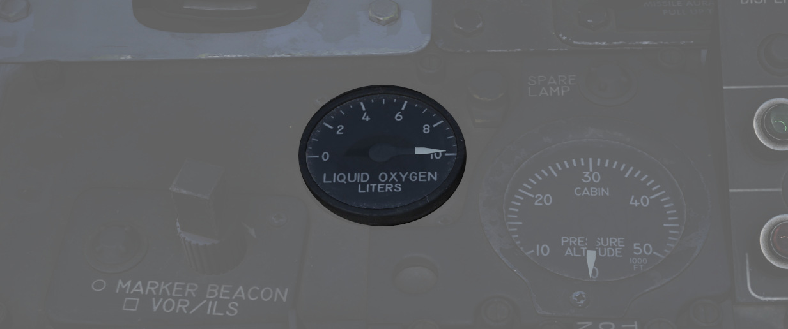
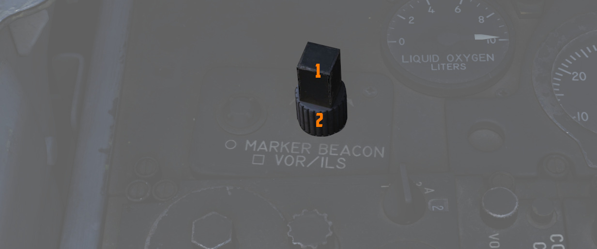

# Aft Section

The aft section of the left console holds communication and navigation controls.

## TACAN Control Panel

The [TACAN](../../../systems/nav_com/tacan.md) Control Panel is used to enter the
desired [TACAN](../../../systems/nav_com/tacan.md) channel, mode, and
audible volume for the monitoring of said channel by the aircrew. The panel is
duplicated in both cockpits, and the panel in command of
the [TACAN](../../../systems/nav_com/tacan.md) receiver is
selected with the NAV CMD button of the Communication Control Panel.

### Channel Knobs

On the control panel there are two Navigation Channel Control knobs, with the
left controlling the first two digits of the channel value (hundreds and tens),
and the right controls the single unit (ones) values. The right knob also
includes an outer ring which sets the X or Y value for the
desired [TACAN](../../../systems/nav_com/tacan.md)
channel.

### Test Button and Lamp

Between these two knobs is the TEST button, which performs the ground testing
cycle after warmup, and can also be used to perform an in-flight confidence test
of the system's performance.

The lamp above the button illuminates to indicate test status.

See [7.19.4 Navigation test procedures chapter](../../../procedures/bit_tests/navigation_tests.md#tacan-test)
for further information.

### Volume Knob

To the upper right, the VOL knob is available to set the desired audio level for
the received [TACAN](../../../systems/nav_com/tacan.md) station.

### Function Selector

The [TACAN](../../../systems/nav_com/tacan.md) Function Selector Knob determines the presentation
and type of
information provided on
the [HSI,](../../pilot/flight_director_group.md#horizontal-situation-indicator) [ADI](../../pilot/flight_director_group.md#attitude-director-indicator),
and [BDHI,](../../wso/upfront_indicators.md#bearing-distance-heading-indicator-bdhi)
respectively.

| Name    | Description                                                                                                                                                                                                                                                                                                                                                                    |
|---------|--------------------------------------------------------------------------------------------------------------------------------------------------------------------------------------------------------------------------------------------------------------------------------------------------------------------------------------------------------------------------------|
| OFF     | The [TACAN](../../../systems/nav_com/tacan.md) receiver is de-energized and offline.                                                                                                                                                                                                                                                                                           |
| REC     | The [TACAN](../../../systems/nav_com/tacan.md) receiver is active, providing bearing information on the [HSI](../../pilot/flight_director_group.md#horizontal-situation-indicator), [BDHI](../../wso/upfront_indicators.md#bearing-distance-heading-indicator-bdhi), and [ADI](../../pilot/flight_director_group.md#attitude-director-indicator).                              |
| T/R     | Both the receive and transmit functions of the [TACAN](../../../systems/nav_com/tacan.md) are active, which provide bearing and nautical mile range information for the [HSI](../../pilot/flight_director_group.md#horizontal-situation-indicator) and [BDHI](../../wso/upfront_indicators.md#bearing-distance-heading-indicator-bdhi).                                        |
| A/A REC | The [TACAN](../../../systems/nav_com/tacan.md) receiver decodes bearing information from compliant aircraft for the [HSI](../../pilot/flight_director_group.md#horizontal-situation-indicator), [BDHI](../../wso/upfront_indicators.md#bearing-distance-heading-indicator-bdhi), and [ADI](../../pilot/flight_director_group.md#attitude-director-indicator) steering display. |
| A/A TR  | The [TACAN](../../../systems/nav_com/tacan.md) receiver receives both bearing and slant range information in nautical miles from the transmitting aircraft, providing this on the [HSI](../../pilot/flight_director_group.md#horizontal-situation-indicator) and [BDHI](../../wso/upfront_indicators.md#bearing-distance-heading-indicator-bdhi).                              |

> 💡 Air to Air [TACAN](../../../systems/nav_com/tacan.md) functionality requires the channel to be
> set 63 channels above or below the cooperating aircraft, but on the same range- X or Y. So a
> tanker on 123Y should be set to 60Y in the F-4.

## Communication Control Panel

The Communication Control Panel provides selection and mode of
the [UHF radio](../../../systems/nav_com/uhf.md) in
the aircraft.

### Command Buttons

The panel is duplicated in both cockpits, and control over the
radio is determined through pushing the COMM CMD Button in the respective seat;
the button will illuminate green in the seat in priority. In the same fashion,
the NAV CMD button dictates which seat has control of the [TACAN](../../../systems/nav_com/tacan.md)
settings; its button will also illuminate on the panel of the seat that has command (control)
of the system.

### Radio Volume

Beneath the COMM CMD button is the radio volume for the respective seat.

### Squelch Switch

Close to the NAV CMD button is the Squelch switch, which enables or disables receiver
squelch.

### Frequency and Channels

The A-3-2-T Selector knob sets the first digit of the manually selected frequency
(3 or 2) of the [UHF radio](../../../systems/nav_com/uhf.md).

> 💡 Due to DCS limits, HAVE Quick functionality (including A and T modes) is not implemented.

The four Frequency Selection Knobs work in concert with the A-3-2-T knob and
Preset/Manual switch. Frequencies are entered beginning with the 3 or 2
selection on the A-3-2-T Selector, and can be entered from 225.00 to 399.975 MHz
in increments of 0.025. With Preset/Manual in the Manual position, the UHF radio
is directly set to the displayed channel. In the Preset position, the set
channels can be entered into the COMM CHAN memory, with the desired position
selected with the Comm Channel Control knob - the smaller knob to the left of the
Preset/Manual switch, and displayed in the COMM CHAN window. Channels are stored
in the displayed channel preset with the SET pushbutton. Once stored, channels
are directly selected using the Comm Channel Control knob with the Preset/Manual
switch in the Preset position.

Directly underneath the Comm Channel Control Knob is the Aux Channel Knob and
Indicator. This knob is used to access 20 common preset channels that cannot be
changed from in the cockpit.

The Aux Volume Control knob on the lower right of the panel
raises and lowers the volume of the Aux receiver channel.

### Tone Button

> 💡 Due to lack of the HAVE Quick functionality, tone button has no functionality in DCS.

### Comm Function Selector

The Comm Function Selector Knob determines the current configuration of the
radio system.

| Name      | Description                                                                |
|-----------|----------------------------------------------------------------------------|
| OFF       | All UHF Radios off.                                                        |
| T/R ADF   | Comm receiver - comm reception.                                            |
|           | Comm transmitter - comm transmission.                                      |
|           | Comm guard receiver - standby.                                             |
|           | Aux receiver - ADF reception.                                              |
| T/R+G ADF | Comm receiver - comm reception.                                            |
|           | Comm transmitter - comm transmission.                                      |
|           | Comm guard receiver - guard reception.                                     |
|           | Aux receiver - ADF reception.                                              |
| ADF+G CMD | Comm receiver - ADF reception.                                             |
|           | Comm transmitter - comm transmission. ADF interrupted during transmission. |
|           | Comm guard receiver - guard reception on ADF antenna.                      |
|           | Aux receiver- comm reception.                                              |
| ADF+G     | Comm receiver - ADF reception.                                             |
|           | Comm transmitter - comm transmission. ADF interrupted during transmission. |
|           | Comm guard receiver - standby.                                             |
|           | Aux receiver- guard reception.                                             |
| Guard ADF | Comm receiver - guard reception.                                           |
|           | Comm transmitter - guard transmission.                                     |
|           | Comm guard receiver - standby.                                             |
|           | Aux receiver - ADF reception.                                              |

### Cockpit Altitude Gauge

Displays the current pressure inside the cockpit as a means of equivalent effective
cabin altitude above mean sea level in 1000 of feet.

That is, if the gauge reads 5, the pressure inside the cabin is equivalent to an altitude
of 5000 ft altitude MSL.

To prevent sickness and hypoxia, the pressure should be observed and oxygen
supply adjusted accordingly:

| Pressure Range      | Description                                  |
|---------------------|----------------------------------------------|
| below 13000 ft      | Breath regular air                           |
| 13000 ft - 40000 ft | Breath Oxygen through mask                   |
| 40000 ft - 62000 ft | Breath pressurized Oxygen through mask       |
| above 62000 ft      | Need to wear a pressure suit (not available) |

See [3.7 Utility chapter, Oxygen section](../../../systems/utility.md#oxygen-system) for further
information.

## Oxygen Quantity Gauge

It has a range from
0 to 10 liters. Loss of electrical power
is indicated by appearance of a power off flag on the
instrument face.

## VOR/ILS Volume Control

The volume control consists of two knobs: one square knob adjusts VOR and
localizer audio, while the round knob controls the marker beacon audio.

See [3.3.4 VOR/ILS Chapter](../../../systems/nav_com/vor_ils.md) for further information.
